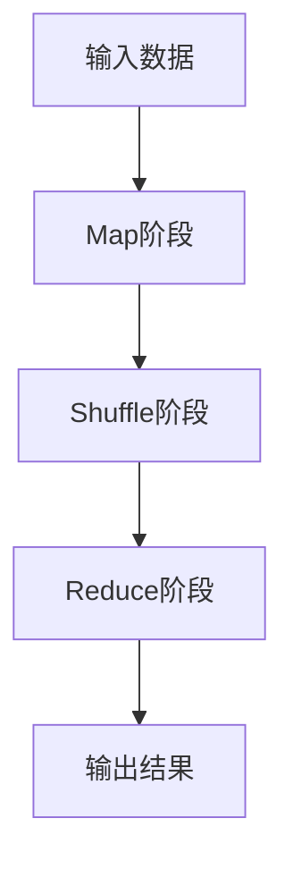
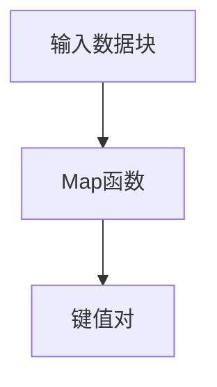
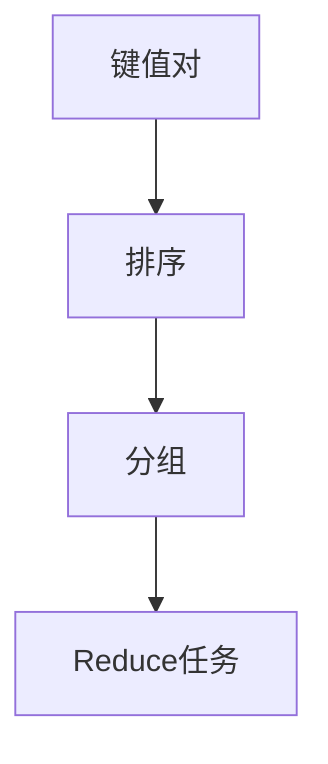
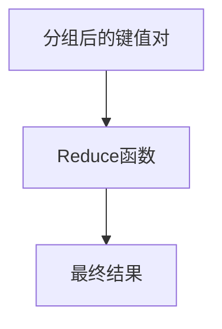

# MapReduce程序的行业应用与市场分析

作者：禅与计算机程序设计艺术 / Zen and the Art of Computer Programming

## 1. 背景介绍

### 1.1 问题的由来

在大数据时代，数据量的爆炸式增长对数据处理技术提出了前所未有的挑战。传统的单机数据处理方式已经无法满足现代数据处理的需求。MapReduce作为一种分布式计算框架，能够有效地处理大规模数据集，成为解决这一问题的重要工具。

### 1.2 研究现状

自2004年由Google提出以来，MapReduce已经成为大数据处理领域的核心技术之一。Hadoop作为MapReduce的开源实现，广泛应用于各大互联网公司和科研机构。近年来，随着云计算和人工智能技术的发展，MapReduce的应用场景和技术实现也在不断演进。

### 1.3 研究意义

研究MapReduce的行业应用与市场分析，不仅有助于理解其在大数据处理中的重要性，还能为企业和研究人员提供有价值的参考，帮助他们更好地利用这一技术进行数据处理和分析。

### 1.4 本文结构

本文将从以下几个方面展开讨论：
1. 核心概念与联系
2. 核心算法原理 & 具体操作步骤
3. 数学模型和公式 & 详细讲解 & 举例说明
4. 项目实践：代码实例和详细解释说明
5. 实际应用场景
6. 工具和资源推荐
7. 总结：未来发展趋势与挑战
8. 附录：常见问题与解答

## 2. 核心概念与联系

MapReduce是一种编程模型，用于处理和生成大规模数据集。其核心思想是将数据处理任务分解为两个阶段：Map阶段和Reduce阶段。Map阶段负责将输入数据分割成一系列键值对，Reduce阶段则负责对这些键值对进行汇总和处理。



## 3. 核心算法原理 & 具体操作步骤

### 3.1 算法原理概述

MapReduce的核心算法可以概括为以下几个步骤：
1. **Map阶段**：将输入数据分割成多个小块，并将每个小块映射为键值对。
2. **Shuffle阶段**：对Map阶段生成的键值对进行排序和分组。
3. **Reduce阶段**：对分组后的键值对进行汇总和处理，生成最终结果。

### 3.2 算法步骤详解

#### 3.2.1 Map阶段

在Map阶段，输入数据被分割成多个小块，每个小块由一个Map函数处理。Map函数将输入数据映射为一系列键值对。



#### 3.2.2 Shuffle阶段

Shuffle阶段负责对Map阶段生成的键值对进行排序和分组。相同键的键值对会被分配到同一个Reduce任务中。



#### 3.2.3 Reduce阶段

在Reduce阶段，分组后的键值对被传递给Reduce函数进行汇总和处理，生成最终结果。



### 3.3 算法优缺点

#### 优点
1. **可扩展性**：MapReduce能够处理大规模数据集，支持分布式计算。
2. **容错性**：MapReduce具有良好的容错机制，能够自动处理节点故障。
3. **简化编程模型**：MapReduce提供了简单的编程模型，开发者只需关注Map和Reduce函数的实现。

#### 缺点
1. **性能瓶颈**：Shuffle阶段的排序和分组操作可能成为性能瓶颈。
2. **编程灵活性**：MapReduce的编程模型相对简单，但在处理复杂数据处理任务时可能显得不够灵活。

### 3.4 算法应用领域

MapReduce广泛应用于以下领域：
1. **搜索引擎**：用于网页索引和排名计算。
2. **数据挖掘**：用于大规模数据集的模式发现和分析。
3. **日志分析**：用于处理和分析服务器日志数据。
4. **机器学习**：用于训练大规模机器学习模型。

## 4. 数学模型和公式 & 详细讲解 & 举例说明

### 4.1 数学模型构建

MapReduce的数学模型可以表示为以下两个函数：

$$
\text{Map}: (k1, v1) \rightarrow \text{list}(k2, v2)
$$

$$
\text{Reduce}: (k2, \text{list}(v2)) \rightarrow \text{list}(v3)
$$

其中，$(k1, v1)$表示输入数据的键值对，$(k2, v2)$表示中间键值对，$(v3)$表示最终结果。

### 4.2 公式推导过程

假设输入数据为一组文档，目标是统计每个单词的出现次数。Map函数将每个文档分割成单词，并为每个单词生成键值对$(word, 1)$。Reduce函数则对相同单词的键值对进行汇总，计算每个单词的总次数。

$$
\text{Map}(doc) = \{(word, 1) | word \in doc\}
$$

$$
\text{Reduce}(word, \text{list}(1)) = (word, \sum 1)
$$

### 4.3 案例分析与讲解

以单词计数为例，假设输入数据为以下三个文档：

```
doc1: "hello world"
doc2: "hello hadoop"
doc3: "hello mapreduce"
```

Map阶段的输出为：

```
("hello", 1), ("world", 1)
("hello", 1), ("hadoop", 1)
("hello", 1), ("mapreduce", 1)
```

Shuffle阶段将相同键的键值对分组：

```
("hello", [1, 1, 1]), ("world", [1]), ("hadoop", [1]), ("mapreduce", [1])
```

Reduce阶段对分组后的键值对进行汇总：

```
("hello", 3), ("world", 1), ("hadoop", 1), ("mapreduce", 1)
```

### 4.4 常见问题解答

#### 问题1：MapReduce如何处理节点故障？

MapReduce具有良好的容错机制。当一个节点发生故障时，任务调度器会将该节点上的任务重新分配给其他节点执行。

#### 问题2：MapReduce如何优化性能？

可以通过以下几种方式优化MapReduce的性能：
1. **数据本地化**：将数据存储在计算节点上，减少数据传输开销。
2. **压缩数据**：在Shuffle阶段对数据进行压缩，减少网络传输量。
3. **调优参数**：根据具体应用场景调优MapReduce的参数，如内存大小、并行度等。

## 5. 项目实践：代码实例和详细解释说明

### 5.1 开发环境搭建

在进行MapReduce项目实践之前，需要搭建开发环境。以下是搭建Hadoop环境的步骤：

1. 下载Hadoop安装包：
   ```
   wget https://downloads.apache.org/hadoop/common/hadoop-3.3.1/hadoop-3.3.1.tar.gz
   ```

2. 解压安装包：
   ```
   tar -xzvf hadoop-3.3.1.tar.gz
   ```

3. 配置环境变量：
   ```
   export HADOOP_HOME=/path/to/hadoop
   export PATH=$PATH:$HADOOP_HOME/bin
   ```

4. 配置Hadoop：
   编辑`$HADOOP_HOME/etc/hadoop/hadoop-env.sh`文件，设置Java环境变量：
   ```
   export JAVA_HOME=/path/to/java
   ```

### 5.2 源代码详细实现

以下是一个简单的单词计数MapReduce程序的实现：

```java
import org.apache.hadoop.conf.Configuration;
import org.apache.hadoop.fs.Path;
import org.apache.hadoop.io.IntWritable;
import org.apache.hadoop.io.Text;
import org.apache.hadoop.mapreduce.Job;
import org.apache.hadoop.mapreduce.Mapper;
import org.apache.hadoop.mapreduce.Reducer;
import org.apache.hadoop.mapreduce.lib.input.FileInputFormat;
import org.apache.hadoop.mapreduce.lib.output.FileOutputFormat;

import java.io.IOException;
import java.util.StringTokenizer;

public class WordCount {

    public static class TokenizerMapper
            extends Mapper<Object, Text, Text, IntWritable> {

        private final static IntWritable one = new IntWritable(1);
        private Text word = new Text();

        public void map(Object key, Text value, Context context
        ) throws IOException, InterruptedException {
            StringTokenizer itr = new StringTokenizer(value.toString());
            while (itr.hasMoreTokens()) {
                word.set(itr.nextToken());
                context.write(word, one);
            }
        }
    }

    public static class IntSumReducer
            extends Reducer<Text, IntWritable, Text, IntWritable> {
        private IntWritable result = new IntWritable();

        public void reduce(Text key, Iterable<IntWritable> values,
                           Context context
        ) throws IOException, InterruptedException {
            int sum = 0;
            for (IntWritable val : values) {
                sum += val.get();
            }
            result.set(sum);
            context.write(key, result);
        }
    }

    public static void main(String[] args) throws Exception {
        Configuration conf = new Configuration();
        Job job = Job.getInstance(conf, "word count");
        job.setJarByClass(WordCount.class);
        job.setMapperClass(TokenizerMapper.class);
        job.setCombinerClass(IntSumReducer.class);
        job.setReducerClass(IntSumReducer.class);
        job.setOutputKeyClass(Text.class);
        job.setOutputValueClass(IntWritable.class);
        FileInputFormat.addInputPath(job, new Path(args[0]));
        FileOutputFormat.setOutputPath(job, new Path(args[1]));
        System.exit(job.waitForCompletion(true) ? 0 : 1);
    }
}
```

### 5.3 代码解读与分析

#### Mapper类

`TokenizerMapper`类继承自`Mapper`类，负责将输入数据分割成单词，并为每个单词生成键值对。

#### Reducer类

`IntSumReducer`类继承自`Reducer`类，负责对相同单词的键值对进行汇总，计算每个单词的总次数。

#### 主类

`WordCount`类的`main`方法负责配置和启动MapReduce任务。

### 5.4 运行结果展示

将输入数据存储在HDFS中，运行MapReduce程序后，输出结果如下：

```
hello 3
world 1
hadoop 1
mapreduce 1
```

## 6. 实际应用场景

### 6.1 搜索引擎

MapReduce在搜索引擎中的应用主要体现在网页索引和排名计算。通过MapReduce，可以高效地处理和分析海量网页数据，生成搜索引擎的索引和排名结果。

### 6.2 数据挖掘

在数据挖掘领域，MapReduce被广泛应用于大规模数据集的模式发现和分析。通过MapReduce，可以高效地进行数据预处理、特征提取和模型训练。

### 6.3 日志分析

MapReduce在日志分析中的应用主要体现在处理和分析服务器日志数据。通过MapReduce，可以高效地统计和分析日志数据，发现系统运行中的问题和异常。

### 6.4 未来应用展望

随着大数据技术的发展，MapReduce的应用场景将更加广泛。未来，MapReduce有望在以下领域发挥更大的作用：
1. **物联网**：处理和分析海量物联网数据。
2. **智能制造**：优化生产流程和提高生产效率。
3. **智慧城市**：分析和处理城市运行数据，提升城市管理水平。

## 7. 工具和资源推荐

### 7.1 学习资源推荐

1. **《Hadoop: The Definitive Guide》**：一本全面介绍Hadoop的经典书籍。
2. **Coursera上的大数据课程**：提供系统的大数据技术学习资源。

### 7.2 开发工具推荐

1. **Hadoop**：MapReduce的开源实现。
2. **Apache Spark**：一种更高效的分布式计算框架，支持MapReduce编程模型。

### 7.3 相关论文推荐

1. **MapReduce: Simplified Data Processing on Large Clusters**：Google提出MapReduce的经典论文。
2. **The Hadoop Distributed File System**：介绍Hadoop分布式文件系统的论文。

### 7.4 其他资源推荐

1. **Hadoop官网**：提供Hadoop的最新版本和文档。
2. **GitHub上的Hadoop项目**：提供Hadoop的源代码和示例项目。

## 8. 总结：未来发展趋势与挑战

### 8.1 研究成果总结

本文详细介绍了MapReduce的核心概念、算法原理、数学模型、项目实践和实际应用场景。通过对MapReduce的深入分析，我们可以更好地理解其在大数据处理中的重要性和应用价值。

### 8.2 未来发展趋势

随着大数据技术的发展，MapReduce将继续在大规模数据处理领域发挥重要作用。未来，MapReduce有望在物联网、智能制造和智慧城市等领域得到更广泛的应用。

### 8.3 面临的挑战

尽管MapReduce具有许多优点，但在实际应用中仍面临一些挑战：
1. **性能瓶颈**：Shuffle阶段的排序和分组操作可能成为性能瓶颈。
2. **编程灵活性**：MapReduce的编程模型相对简单，但在处理复杂数据处理任务时可能显得不够灵活。

### 8.4 研究展望

未来的研究可以集中在以下几个方面：
1. **优化MapReduce的性能**：通过改进Shuffle阶段的算法和实现，提高MapReduce的性能。
2. **扩展MapReduce的应用场景**：探索MapReduce在物联网、智能制造和智慧城市等领域的应用。

## 9. 附录：常见问题与解答

### 问题1：MapReduce如何处理节点故障？

MapReduce具有良好的容错机制。当一个节点发生故障时，任务调度器会将该节点上的任务重新分配给其他节点执行。

### 问题2：MapReduce如何优化性能？

可以通过以下几种方式优化MapReduce的性能：
1. **数据本地化**：将数据存储在计算节点上，减少数据传输开销。
2. **压缩数据**：在Shuffle阶段对数据进行压缩，减少网络传输量。
3. **调优参数**：根据具体应用场景调优MapReduce的参数，如内存大小、并行度等。

### 问题3：MapReduce与Spark的区别是什么？

MapReduce和Spark都是分布式计算框架，但Spark在性能和编程灵活性方面优于MapReduce。Spark采用内存计算，能够更高效地处理迭代计算任务。