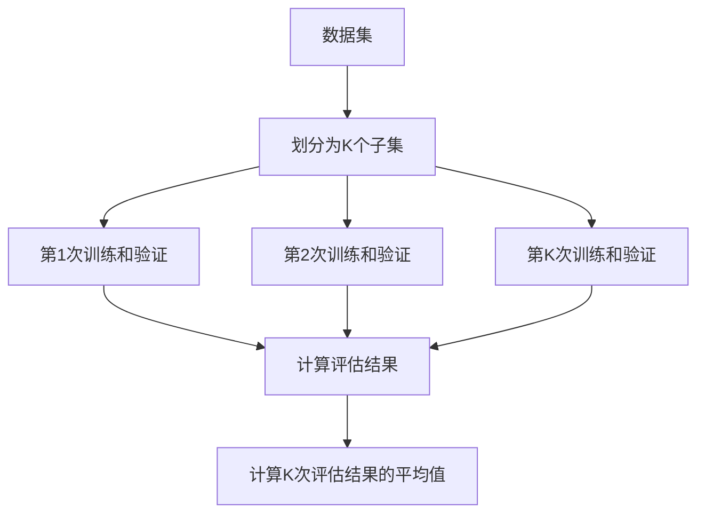
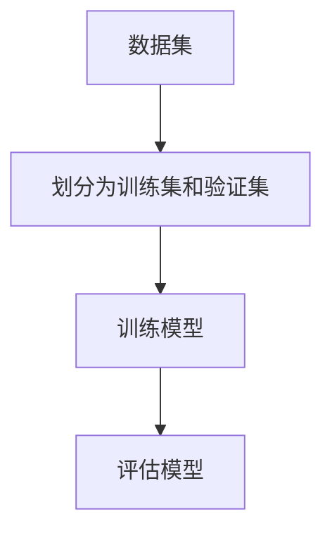
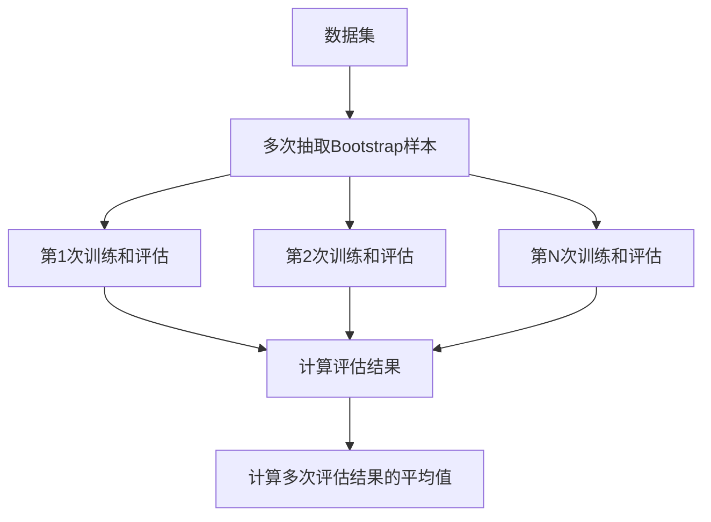

# Python机器学习实战：模型评估与验证的最佳策略

作者：禅与计算机程序设计艺术 / Zen and the Art of Computer Programming

## 1. 背景介绍

### 1.1 问题的由来

在机器学习领域，模型的评估与验证是至关重要的环节。一个模型的好坏不仅仅取决于其在训练数据上的表现，更重要的是其在未知数据上的泛化能力。模型评估与验证的策略直接影响到模型的性能和可靠性。随着数据量的增加和模型复杂度的提升，如何科学地评估和验证模型成为了一个亟待解决的问题。

### 1.2 研究现状

目前，机器学习模型的评估与验证方法多种多样，包括交叉验证、留出法、Bootstrap等。这些方法各有优缺点，适用于不同的应用场景。近年来，随着深度学习的兴起，模型评估与验证的方法也在不断演进，新的评估指标和验证策略层出不穷。

### 1.3 研究意义

科学的模型评估与验证策略不仅可以提高模型的泛化能力，还可以帮助我们更好地理解模型的行为和性能。通过系统地研究和应用这些策略，我们可以在实际项目中更有效地构建和优化机器学习模型，从而提升模型的实际应用价值。

### 1.4 本文结构

本文将从以下几个方面详细探讨Python机器学习中模型评估与验证的最佳策略：

1. 核心概念与联系
2. 核心算法原理 & 具体操作步骤
3. 数学模型和公式 & 详细讲解 & 举例说明
4. 项目实践：代码实例和详细解释说明
5. 实际应用场景
6. 工具和资源推荐
7. 总结：未来发展趋势与挑战
8. 附录：常见问题与解答

## 2. 核心概念与联系

在开始深入探讨模型评估与验证的策略之前，我们需要先了解一些核心概念及其相互之间的联系。

### 2.1 模型评估

模型评估是指通过一定的指标来衡量模型的性能。常见的评估指标包括准确率、精确率、召回率、F1分数、AUC-ROC曲线等。

### 2.2 模型验证

模型验证是指通过一定的方法来验证模型在未知数据上的表现。常见的验证方法包括交叉验证、留出法、Bootstrap等。

### 2.3 过拟合与欠拟合

过拟合是指模型在训练数据上表现很好，但在测试数据上表现较差的现象。欠拟合是指模型在训练数据和测试数据上都表现不好的现象。

### 2.4 交叉验证

交叉验证是一种常用的模型验证方法，通过将数据集划分为多个子集，依次使用其中一个子集作为验证集，其他子集作为训练集，从而多次训练和验证模型。

### 2.5 留出法

留出法是指将数据集划分为训练集和验证集，使用训练集训练模型，使用验证集评估模型。

### 2.6 Bootstrap

Bootstrap是一种通过重采样来估计模型性能的方法。它通过多次从数据集中有放回地抽取样本，训练和评估模型，从而得到模型性能的估计。

## 3. 核心算法原理 & 具体操作步骤

### 3.1 算法原理概述

在本节中，我们将详细介绍几种常用的模型评估与验证算法的原理，包括交叉验证、留出法和Bootstrap。

#### 3.1.1 交叉验证

交叉验证的基本思想是将数据集划分为多个子集，依次使用其中一个子集作为验证集，其他子集作为训练集，从而多次训练和验证模型。常见的交叉验证方法包括K折交叉验证和留一法交叉验证。

#### 3.1.2 留出法

留出法是将数据集划分为训练集和验证集，使用训练集训练模型，使用验证集评估模型。留出法简单易行，但评估结果可能受数据划分的影响较大。

#### 3.1.3 Bootstrap

Bootstrap通过多次从数据集中有放回地抽取样本，训练和评估模型，从而得到模型性能的估计。Bootstrap方法可以有效地估计模型的泛化误差，但计算成本较高。

### 3.2 算法步骤详解

#### 3.2.1 交叉验证步骤

1. 将数据集划分为K个子集。
2. 依次使用每个子集作为验证集，其他子集作为训练集，训练和评估模型。
3. 计算K次评估结果的平均值，作为模型的最终评估结果。



#### 3.2.2 留出法步骤

1. 将数据集划分为训练集和验证集。
2. 使用训练集训练模型。
3. 使用验证集评估模型。



#### 3.2.3 Bootstrap步骤

1. 多次从数据集中有放回地抽取样本，得到多个Bootstrap样本。
2. 使用每个Bootstrap样本训练和评估模型。
3. 计算多次评估结果的平均值，作为模型的最终评估结果。



### 3.3 算法优缺点

#### 3.3.1 交叉验证

优点：
- 评估结果稳定，不易受数据划分的影响。
- 可以有效地利用数据，提高评估结果的可靠性。

缺点：
- 计算成本较高，尤其是当数据量较大时。

#### 3.3.2 留出法

优点：
- 简单易行，计算成本低。

缺点：
- 评估结果可能受数据划分的影响较大，不够稳定。

#### 3.3.3 Bootstrap

优点：
- 可以有效地估计模型的泛化误差。
- 适用于小样本数据集。

缺点：
- 计算成本较高，尤其是当数据量较大时。

### 3.4 算法应用领域

#### 3.4.1 交叉验证

交叉验证广泛应用于各种机器学习任务中，尤其适用于数据量较大、模型复杂度较高的场景。

#### 3.4.2 留出法

留出法适用于数据量较小、模型训练时间较长的场景。

#### 3.4.3 Bootstrap

Bootstrap适用于小样本数据集，尤其是在需要估计模型泛化误差的场景中。

## 4. 数学模型和公式 & 详细讲解 & 举例说明

### 4.1 数学模型构建

在本节中，我们将详细介绍几种常用的模型评估与验证方法的数学模型，包括交叉验证、留出法和Bootstrap。

#### 4.1.1 交叉验证数学模型

设数据集为 $D = \{(x_1, y_1), (x_2, y_2), \ldots, (x_n, y_n)\}$，将其划分为K个子集 $D_1, D_2, \ldots, D_K$。第i次训练和验证的训练集为 $D_{train} = D \setminus D_i$，验证集为 $D_{val} = D_i$。模型的评估结果为：

$$
E_i = \frac{1}{|D_i|} \sum_{(x, y) \in D_i} L(f(x), y)
$$

其中，$L$ 为损失函数，$f$ 为模型。最终的评估结果为：

$$
E = \frac{1}{K} \sum_{i=1}^K E_i
$$

#### 4.1.2 留出法数学模型

设数据集为 $D = \{(x_1, y_1), (x_2, y_2), \ldots, (x_n, y_n)\}$，将其划分为训练集 $D_{train}$ 和验证集 $D_{val}$。模型的评估结果为：

$$
E = \frac{1}{|D_{val}|} \sum_{(x, y) \in D_{val}} L(f(x), y)
$$

#### 4.1.3 Bootstrap数学模型

设数据集为 $D = \{(x_1, y_1), (x_2, y_2), \ldots, (x_n, y_n)\}$，从中多次有放回地抽取样本，得到多个Bootstrap样本 $D_1, D_2, \ldots, D_B$。第i次训练和评估的评估结果为：

$$
E_i = \frac{1}{|D_i|} \sum_{(x, y) \in D_i} L(f(x), y)
$$

最终的评估结果为：

$$
E = \frac{1}{B} \sum_{i=1}^B E_i
$$

### 4.2 公式推导过程

#### 4.2.1 交叉验证公式推导

交叉验证的评估结果是多个子集评估结果的平均值。设第i次训练和验证的评估结果为 $E_i$，则最终的评估结果为：

$$
E = \frac{1}{K} \sum_{i=1}^K E_i
$$

其中，$E_i$ 为第i次验证集上的评估结果：

$$
E_i = \frac{1}{|D_i|} \sum_{(x, y) \in D_i} L(f(x), y)
$$

#### 4.2.2 留出法公式推导

留出法的评估结果是验证集上的评估结果。设验证集为 $D_{val}$，则评估结果为：

$$
E = \frac{1}{|D_{val}|} \sum_{(x, y) \in D_{val}} L(f(x), y)
$$

#### 4.2.3 Bootstrap公式推导

Bootstrap的评估结果是多个Bootstrap样本评估结果的平均值。设第i次Bootstrap样本的评估结果为 $E_i$，则最终的评估结果为：

$$
E = \frac{1}{B} \sum_{i=1}^B E_i
$$

其中，$E_i$ 为第i次Bootstrap样本上的评估结果：

$$
E_i = \frac{1}{|D_i|} \sum_{(x, y) \in D_i} L(f(x), y)
$$

### 4.3 案例分析与讲解

#### 4.3.1 交叉验证案例

假设我们有一个包含1000个样本的数据集，使用5折交叉验证来评估模型。我们将数据集划分为5个子集，每次使用其中一个子集作为验证集，其他子集作为训练集。通过5次训练和验证，得到5个评估结果，最终的评估结果为这5个评估结果的平均值。

#### 4.3.2 留出法案例

假设我们有一个包含1000个样本的数据集，将其划分为训练集（800个样本）和验证集（200个样本）。使用训练集训练模型，使用验证集评估模型，得到评估结果。

#### 4.3.3 Bootstrap案例

假设我们有一个包含1000个样本的数据集，通过Bootstrap方法多次从中有放回地抽取样本，得到多个Bootstrap样本。使用每个Bootstrap样本训练和评估模型，最终的评估结果为多个评估结果的平均值。

### 4.4 常见问题解答

#### 4.4.1 交叉验证的K值如何选择？

K值的选择需要根据具体的数据集和任务来确定。一般来说，K值越大，评估结果越稳定，但计算成本也越高。常见的K值有5和10。

#### 4.4.2 留出法的训练集和验证集比例如何选择？

训练集和验证集的比例需要根据具体的数据集和任务来确定。一般来说，训练集的比例应大于验证集，以保证模型有足够的数据进行训练。常见的比例有80:20和70:30。

#### 4.4.3 Bootstrap方法的B值如何选择？

B值的选择需要根据具体的数据集和任务来确定。一般来说，B值越大，评估结果越稳定，但计算成本也越高。常见的B值有100和1000。

## 5. 项目实践：代码实例和详细解释说明

### 5.1 开发环境搭建

在本节中，我们将介绍如何搭建Python开发环境，以便进行模型评估与验证的实践。

#### 5.1.1 安装Python

首先，确保系统中已安装Python。可以通过以下命令检查Python版本：

```bash
python --version
```

如果未安装Python，可以从[Python官网](https://www.python.org/)下载并安装。

#### 5.1.2 安装必要的库

接下来，安装必要的Python库，包括numpy、scikit-learn等。可以通过以下命令安装：

```bash
pip install numpy scikit-learn
```

### 5.2 源代码详细实现

在本节中，我们将提供一些代码实例，展示如何使用Python进行模型评估与验证。

#### 5.2.1 交叉验证代码实例

```python
import numpy as np
from sklearn.model_selection import KFold
from sklearn.metrics import accuracy_score
from sklearn.datasets import load_iris
from sklearn.tree import DecisionTreeClassifier

# 加载数据集
data = load_iris()
X, y = data.data, data.target

# 定义模型
model = DecisionTreeClassifier()

# 定义K折交叉验证
kf = KFold(n_splits=5)

# 进行交叉验证
scores = []
for train_index, val_index in kf.split(X):
    X_train, X_val = X[train_index], X[val_index]
    y_train, y_val = y[train_index], y[val_index]
    
    # 训练模型
    model.fit(X_train, y_train)
    
    # 评估模型
    y_pred = model.predict(X_val)
    score = accuracy_score(y_val, y_pred)
    scores.append(score)

# 输出评估结果
print(f'交叉验证的平均准确率: {np.mean(scores)}')
```

#### 5.2.2 留出法代码实例

```python
import numpy as np
from sklearn.model_selection import train_test_split
from sklearn.metrics import accuracy_score
from sklearn.datasets import load_iris
from sklearn.tree import DecisionTreeClassifier

# 加载数据集
data = load_iris()
X, y = data.data, data.target

# 划分训练集和验证集
X_train, X_val, y_train, y_val = train_test_split(X, y, test_size=0.2, random_state=42)

# 定义模型
model = DecisionTreeClassifier()

# 训练模型
model.fit(X_train, y_train)

# 评估模型
y_pred = model.predict(X_val)
score = accuracy_score(y_val, y_pred)

# 输出评估结果
print(f'留出法的准确率: {score}')
```

#### 5.2.3 Bootstrap代码实例

```python
import numpy as np
from sklearn.utils import resample
from sklearn.metrics import accuracy_score
from sklearn.datasets import load_iris
from sklearn.tree import DecisionTreeClassifier

# 加载数据集
data = load_iris()
X, y = data.data, data.target

# 定义模型
model = DecisionTreeClassifier()

# 定义Bootstrap次数
B = 100
scores = []

# 进行Bootstrap评估
for _ in range(B):
    X_resample, y_resample = resample(X, y)
    
    # 训练模型
    model.fit(X_resample, y_resample)
    
    # 评估模型
    y_pred = model.predict(X)
    score = accuracy_score(y, y_pred)
    scores.append(score)

# 输出评估结果
print(f'Bootstrap的平均准确率: {np.mean(scores)}')
```

### 5.3 代码解读与分析

#### 5.3.1 交叉验证代码解读

在交叉验证代码实例中，我们首先加载数据集并定义模型。然后，使用KFold类将数据集划分为5个子集。接下来，依次使用每个子集作为验证集，其他子集作为训练集，训练和评估模型。最后，计算5次评估结果的平均值，作为模型的最终评估结果。

#### 5.3.2 留出法代码解读

在留出法代码实例中，我们首先加载数据集并将其划分为训练集和验证集。然后，使用训练集训练模型，使用验证集评估模型，