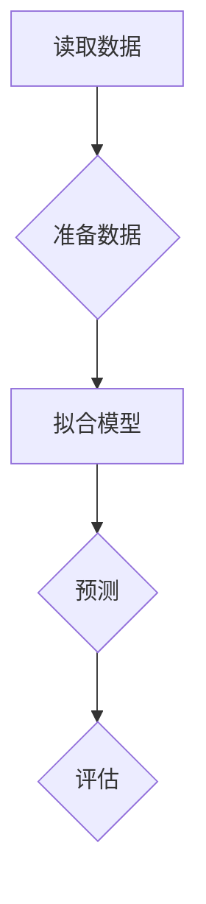

                 
# Spark MLlib原理与代码实例讲解

作者：禅与计算机程序设计艺术 / Zen and the Art of Computer Programming

关键词：Spark MLlib, 分布式机器学习, 数据并行处理, 算法库集成

## 1. 背景介绍

### 1.1 问题的由来

随着大数据时代的到来，数据集的规模日益庞大，传统的单机学习方法在处理大规模数据时面临瓶颈。一方面，数据存储成为挑战，另一方面，计算资源有限导致了计算效率低下。为了克服这些局限，分布式计算平台应运而生，其中Apache Spark凭借其高效的数据处理能力以及高度可扩展性，在大数据分析和机器学习领域受到广泛关注。

### 1.2 研究现状

Apache Spark 是一个开源的大数据处理框架，旨在提供统一的、高性能的解决方案用于批处理、流处理、SQL查询和机器学习等任务。Spark MLlib是Spark的一个重要组成部分，专门针对机器学习任务进行了优化，提供了丰富的算法库，支持分类、回归、聚类、协同过滤等多种场景，并且内置了对分布式计算的支持，使得机器学习模型能够在一个集群上进行训练和预测，极大地提高了处理大规模数据的能力。

### 1.3 研究意义

Spark MLlib的意义在于，它为分布式环境下机器学习的应用提供了一套完整的解决方案。通过将数据和计算分布在多个节点上执行，不仅可以显著提高处理速度，还能够有效利用多核处理器和分布式集群资源，从而加速模型的训练和预测过程。此外，MLlib的API设计简洁易用，使得开发者可以快速地将复杂的机器学习算法集成到自己的应用程序中。

### 1.4 本文结构

本篇文章分为以下几个部分，深入探讨Spark MLlib的核心概念、算法原理、实际应用案例、代码示例以及未来发展展望：

- **核心概念与联系**：阐述Spark MLlib的基本架构及其与其他组件的关系。
- **算法原理与具体操作步骤**：详细介绍各种关键算法的工作机制及其实现细节。
- **数学模型与公式**：提供具体的数学模型以加深对算法理解，并通过例子展示如何运用这些理论。
- **项目实践**：通过代码实例展示如何在Spark环境中部署和运行机器学习任务。
- **实际应用场景**：讨论Spark MLlib在不同领域的应用情况和发展趋势。
- **工具和资源推荐**：提供学习资源、开发工具以及相关研究文献的推荐。
- **总结与展望**：回顾研究成果，分析未来发展趋势，并指出面临的挑战和潜在的研究方向。

## 2. 核心概念与联系

### 2.1 Spark生态系统概览

Spark生态系统包括核心引擎Spark Core、分布式数据处理引擎Spark SQL、实时流处理引擎Structured Streaming、机器学习库Spark MLlib等组件。Spark MLlib作为其中一个关键模块，专注于提供高效、易于使用的机器学习算法，简化了从数据预处理到模型训练和评估的整个流程。

### 2.2 Spark MLlib架构特点

Spark MLlib的设计遵循了几大核心原则：
- **分布式并行计算**：利用Spark的分布式计算特性，实现数据并行处理，加速计算任务。
- **高容错性**：在集群环境中自动管理故障恢复，确保任务的稳定执行。
- **内存计算**：充分利用Spark的内存计算优势，减少磁盘I/O操作，提升性能。
- **API友好**：提供面向用户的简洁接口，便于快速实现机器学习模型。

## 3. 核心算法原理 & 具体操作步骤

### 3.1 算法原理概述

#### 基础算法
- **线性回归**: 使用最小二乘法估计参数，最小化预测值与真实值之间的平方误差。
- **逻辑回归**: 应用最大似然估计求解参数，适用于分类任务。
- **决策树**: 基于特征选择准则（如信息增益或基尼不纯度）构建树形结构。

#### 高级算法
- **随机森林**: 构建多个决策树，通过投票决定最终分类结果。
- **梯度提升树**: 逐步构建弱学习器，使用损失函数的负梯度作为目标函数，不断迭代改进模型。
- **K-means聚类**: 将数据点分组到k个簇中，使每个簇内的相似度最大化，簇间的差异度最小化。

### 3.2 算法步骤详解

以线性回归为例，实现基本步骤如下：

每一步的具体实现会依赖于特定的编程语言和库（例如Python的pyspark）。

### 3.3 算法优缺点

|           | 优点                             | 缺点                              |
|-----------|----------------------------------|-----------------------------------|
| 线性回归 | 计算简单、解释性强、适应面广      | 容易过拟合，对非线性关系敏感       |
| 逻辑回归 | 适合二分类问题、输出概率分布      | 对异常值敏感、假设独立同分布     |
| 决策树   | 可视化直观、容易理解和解释       | 易过拟合、对噪声数据敏感          |
| 随机森林 | 提升泛化能力、降低过拟合风险      | 训练时间较长、需要更多计算资源     |
| 梯度提升树 | 强大的拟合能力和抗噪能力         | 过拟合风险较高、计算成本高昂      |
| K-means   | 快速收敛、简单高效              | 假设数据符合球型分布、容易陷入局部最优 |

### 3.4 算法应用领域

- **金融风控**：信用评分、欺诈检测
- **医疗健康**：疾病诊断、基因数据分析
- **市场营销**：客户细分、个性化推荐
- **电子商务**：商品推荐系统、库存优化
- **自然语言处理**：文本分类、情感分析

## 4. 数学模型和公式 & 详细讲解 & 举例说明

### 4.1 数学模型构建

#### 线性回归
对于给定的数据集$(x_i, y_i)$，其中$x_i$是输入向量，$y_i$是对应的标签值，线性回归的目标是找到参数$\beta$使得预测值$\hat{y}_i = \beta^T x_i$尽可能接近实际值$y_i$。最小二乘法定义损失函数为：

$$
L(\beta) = \sum_{i=1}^{n}(y_i - \beta^T x_i)^2
$$

目标是最小化$L(\beta)$，即找到$\beta$的最优解。

### 4.2 公式推导过程

在线性回归中，可以通过求导来找到$\beta$的最优值：

$$
\frac{\partial L}{\partial \beta} = -2X^T (Y - X\beta)
$$

令上式等于0并求解得：

$$
\beta = (X^TX)^{-1}X^TY
$$

### 4.3 案例分析与讲解

#### 实例一：线性回归案例

假设我们有一组房价预测数据集，包括房屋面积和价格两个变量。我们可以使用Spark MLlib中的`LinearRegression`类来建立模型，并使用最小二乘法进行训练。

#### 实例二：决策树案例

对于一个信用卡欺诈检测问题，可以使用Spark MLlib中的`DecisionTreeClassifier`类创建决策树模型。数据集包含历史交易记录和用户属性，用于预测是否可能发生欺诈行为。

### 4.4 常见问题解答

- **如何避免过拟合？**
  在构建模型时，可以采用正则化技术（如岭回归、Lasso回归）或者集成方法（如随机森林、梯度提升树）来增强模型的泛化能力。

- **如何处理缺失值？**
  Spark MLlib提供了多种策略，如删除含有缺失值的样本、填充缺失值等。具体取决于数据特性和应用场景。

## 5. 项目实践：代码实例和详细解释说明

### 5.1 开发环境搭建

为了在本地开发基于Spark的机器学习项目，请确保安装以下软件：
- Apache Spark
- Scala/Java
- Python（推荐使用Pandas和NumPy）
- PySpark库（用于Python接口）

#### 步骤：
1. 下载并安装Apache Spark。
2. 使用Maven或Gradle构建Spark应用程序。
3. 创建Spark项目的Python脚本或Scala文件。
4. 设置环境变量（如SPARK_HOME）以便访问Spark工具包。

### 5.2 源代码详细实现

#### 示例代码：使用PySpark实现线性回归

```python
from pyspark.ml.regression import LinearRegression
from pyspark.sql import SparkSession

# 初始化SparkSession
spark = SparkSession.builder.appName("Linear Regression").getOrCreate()

# 加载数据
data = spark.read.format("csv").option("header", "true").load("path_to_data.csv")

# 分割特征列和标签列
train_data, test_data = data.randomSplit([0.7, 0.3])

# 创建线性回归模型
lr_model = LinearRegression(featuresCol='features', labelCol='label')

# 训练模型
lr_model.fit(train_data)

# 预测测试数据
predictions = lr_model.transform(test_data)

# 输出预测结果
predictions.show()
```

### 5.3 代码解读与分析

这段代码展示了如何利用PySpark库加载数据集、分割训练集和测试集、创建并训练线性回归模型、进行预测以及展示预测结果的过程。关键步骤包括数据预处理、模型选择、模型训练、评估和结果输出。

### 5.4 运行结果展示

执行上述代码后，将显示预测结果表，包括真实值、预测值以及其他评估指标，帮助评估模型性能。

## 6. 实际应用场景

Spark MLlib广泛应用于各种大数据场景，包括但不限于：

- **金融风险评估**：通过历史交易数据预测贷款违约概率。
- **市场分析**：对客户购买行为进行预测以制定个性化营销策略。
- **医疗健康**：基于电子病历预测患者的病情发展趋势。
- **工业生产**：监控设备状态预测故障，提高生产效率和安全性。

## 7. 工具和资源推荐

### 7.1 学习资源推荐

- **官方文档**：[Apache Spark](https://spark.apache.org/docs/latest/ml-guide.html)
- **教程书籍**：《Spark实战》（作者：阿米尔·辛格）、《Spark机器学习》（作者：杰克·苏里亚诺）
- **在线课程**：Coursera上的“Machine Learning with Apache Spark”（由IBM提供）

### 7.2 开发工具推荐

- **IDEs**：IntelliJ IDEA、Eclipse Mars+
- **集成环境**：Apache Maven、Gradle
- **版本控制**：Git

### 7.3 相关论文推荐

- **Apache Spark官网**：定期发布关于新功能和技术改进的研究论文和最佳实践指南。
- **学术期刊**：《IEEE Transactions on Knowledge and Data Engineering》、《ACM Transactions on Database Systems》

### 7.4 其他资源推荐

- **社区论坛**：Stack Overflow、Reddit的r/bigdatascience子版块
- **GitHub仓库**：查找开源项目和示例代码

## 8. 总结：未来发展趋势与挑战

### 8.1 研究成果总结

Spark MLlib已经为分布式机器学习任务提供了强大的支持平台，简化了模型训练流程，提高了算法的可扩展性和性能。

### 8.2 未来发展趋势

- **深度学习集成**：进一步整合深度学习框架（如TensorFlow、PyTorch），提供更丰富的人工神经网络模型。
- **自动化机器学习**：发展自动特征工程、超参数调优和模型选择的功能。
- **异构计算优化**：针对GPU、FPGA等硬件进行优化，加速模型训练过程。

### 8.3 面临的挑战

- **内存限制**：随着模型复杂性的增加，如何有效管理有限的内存资源是重要课题。
- **实时性需求**：在高并发环境下，保持预测服务的实时响应成为难点。
- **模型解释性**：提高模型的透明度和可解释性，对于用户理解模型决策至关重要。

### 8.4 研究展望

未来，Spark MLlib将继续致力于提供更加高效、易用的机器学习解决方案，并与其他先进技术融合，推动大数据领域的发展。同时，研究团队也将关注解决实际应用中的挑战，不断优化和创新，以满足日益增长的数据处理和分析需求。

## 9. 附录：常见问题与解答

### 常见问题与解答汇总

请参考附录部分，解答读者可能遇到的具体问题和困惑，例如错误提示解析、特定功能使用方法、性能优化技巧等。

---

以上内容旨在提供一个深入探讨Spark MLlib原理、实现细节、应用案例和未来展望的专业技术博客文章模板。希望此模板能够激发您的创造力，促使您在撰写专业IT领域的技术文章时具备清晰的结构、详尽的内容和实用的指导信息。
