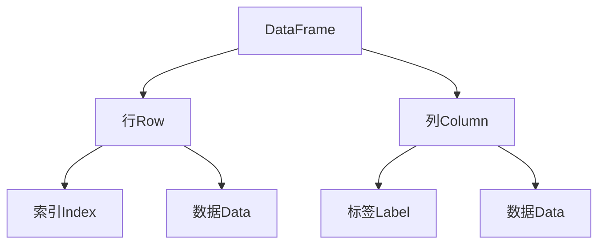
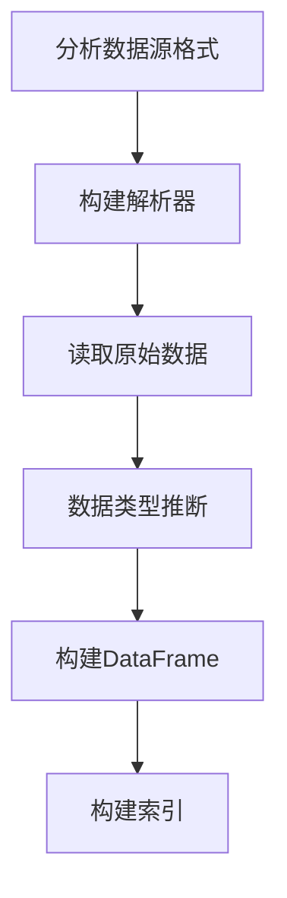

# 【AI大数据计算原理与代码实例讲解】DataFrame

## 1. 背景介绍

### 1.1 问题的由来

在当今大数据时代，数据处理和分析已成为各行业的核心需求。传统的结构化数据库系统难以满足海量异构数据的存储和计算需求。因此，出现了一种新型的数据处理框架——DataFrame。DataFrame提供了高效、灵活的数据操作能力，能够轻松处理结构化和非结构化数据,成为数据科学家和分析师的利器。

### 1.2 研究现状  

DataFrame最初由Pandas库在Python中实现,后被Spark、R等广泛采用。DataFrame在数据清洗、探索性数据分析、特征工程、机器学习等领域发挥着重要作用。但由于数据量的快速增长和计算需求的复杂性,单机DataFrame已难以满足要求,因此分布式DataFrame应运而生。

### 1.3 研究意义

深入理解DataFrame的原理和实现,对于提高数据处理效率、优化算法性能至关重要。本文将全面介绍DataFrame的核心概念、数学模型、算法实现和实际应用,为读者提供一个系统的学习途径。

### 1.4 本文结构

本文首先阐述DataFrame的核心概念,并探讨其与关系代数、集合理论等数学基础的联系。接下来详细解析DataFrame的核心算法原理和数学模型,配以代码示例加深理解。然后介绍DataFrame在机器学习、图像处理等领域的实际应用场景。最后总结DataFrame的发展趋势和面临的挑战。

## 2. 核心概念与联系

DataFrame是一种二维数据结构,由行索引(行标签)和列索引(列标签)组成。它可视为一个表格,每一行存储一个数据实例,每一列存储一个特征。

DataFrame与关系代数和集合理论有着内在联系:

- 关系代数:DataFrame可视为关系数据库中的一个关系(表)
- 集合理论:DataFrame中的每一行可视为一个元组,整个DataFrame是元组的集合

DataFrame支持丰富的数据操作,如选择(Selection)、投影(Projection)、联合(Union)、差集(Minus)等,这些操作与关系代数的运算对应。



## 3. 核心算法原理 & 具体操作步骤

### 3.1 算法原理概述

DataFrame的核心算法主要包括:

1. **数据读取**: 从各种数据源(CSV、数据库、NoSQL等)高效读取数据到DataFrame中。
2. **数据转换**: 对DataFrame进行切片、筛选、缺失值处理等转换操作。
3. **数据聚合**: 对DataFrame执行聚合函数(sum、mean、max等)。
4. **数据连接**: 根据指定列将多个DataFrame连接(join)。
5. **数据写出**: 将DataFrame中的数据写出到各种数据存储系统。

这些算法的实现需要依赖底层的数据结构和索引机制,以确保高效性。

### 3.2 算法步骤详解

以数据读取算法为例,详细介绍其步骤:

1. **分析数据源格式**:确定数据源的格式(CSV、JSON等)和编码方式。
2. **构建解析器**:根据数据格式构建对应的解析器,用于读取原始数据。
3. **读取原始数据**:使用解析器逐行读取原始数据。
4. **数据类型推断**:根据原始数据自动推断每一列的数据类型。
5. **构建DataFrame**:创建DataFrame对象,并将原始数据按列插入。
6. **构建索引**:为DataFrame构建行索引和列索引以支持高效访问。



### 3.3 算法优缺点

**优点**:

- 统一的数据结构,支持高效的数据操作。
- 自动数据类型推断,降低使用门槛。
- 支持延迟计算,提高计算效率。
- 可扩展性强,易于集成新的数据源和算法。

**缺点**:

- 对于非结构化数据,需要预处理转换为结构化格式。
- 大数据场景下,单机DataFrame可能无法满足需求。
- 某些操作的性能需要进一步优化。

### 3.4 算法应用领域

DataFrame算法广泛应用于:

- **数据分析**:用于数据探索、特征工程等分析任务。
- **机器学习**:作为机器学习算法的输入数据格式。
- **图像处理**:可将图像数据转换为DataFrame进行处理。
- **金融分析**:分析股票、期货等金融数据。
- **科学计算**:处理实验数据、构建模型等。

## 4. 数学模型和公式 & 详细讲解 & 举例说明

### 4.1 数学模型构建

为了形式化描述DataFrame,我们构建如下数学模型:

设$\mathcal{D}$为一个DataFrame,包含$m$行和$n$列:

$$\mathcal{D} = \begin{bmatrix}
    a_{11} & a_{12} & \cdots & a_{1n} \\
    a_{21} & a_{22} & \cdots & a_{2n} \\
    \vdots & \vdots & \ddots & \vdots \\
    a_{m1} & a_{m2} & \cdots & a_{mn}
\end{bmatrix}$$

其中$a_{ij}$表示第$i$行第$j$列的元素。

我们用行索引$\mathcal{R} = \{r_1, r_2, \ldots, r_m\}$和列索引$\mathcal{C} = \{c_1, c_2, \ldots, c_n\}$对行和列进行标识。

DataFrame上的基本操作可以用集合运算表示:

- 选择(Selection): $\sigma_\phi(\mathcal{D}) = \{t \in \mathcal{D} \mid \phi(t) = \text{true}\}$
- 投影(Projection): $\pi_\mathcal{C'}(\mathcal{D}) = \{t[\mathcal{C'}] \mid t \in \mathcal{D}\}$
- 联合(Union): $\mathcal{D}_1 \cup \mathcal{D}_2 = \{t \mid t \in \mathcal{D}_1 \vee t \in \mathcal{D}_2\}$
- 差集(Minus): $\mathcal{D}_1 - \mathcal{D}_2 = \{t \in \mathcal{D}_1 \mid t \notin \mathcal{D}_2\}$

其中$\phi$是谓词函数,$\mathcal{C}'\subseteq\mathcal{C}$是投影列集合。

### 4.2 公式推导过程

我们以DataFrame的`groupby`操作为例,推导其数学公式。`groupby`根据一个或多个列的值对DataFrame进行分组,并对每个分组应用聚合函数(如`sum`、`mean`等)。

假设我们根据列$c_k$对DataFrame $\mathcal{D}$进行分组,并对每个分组应用聚合函数$f$。我们定义:

$$G(c_k) = \{\mathcal{D}[i, :] \mid \mathcal{D}[i, c_k] = v, i \in [1, m], v \in \mathcal{V}_k\}$$

其中$\mathcal{V}_k$是列$c_k$的值域,即$\mathcal{V}_k = \{\mathcal{D}[i, c_k] \mid i \in [1, m]\}$。$G(c_k)$是根据列$c_k$的值对DataFrame进行分组的结果。

对每个分组$g \in G(c_k)$应用聚合函数$f$,我们可以得到:

$$\text{groupby}(\mathcal{D}, c_k, f) = \{(v, f(g)) \mid g \in G(c_k), v = \mathcal{D}[i, c_k], i \in [1, m], g = \mathcal{D}[i, :]\}$$

这个公式描述了`groupby`操作的数学语义。

### 4.3 案例分析与讲解

现在我们用一个实际案例来说明DataFrame的数学模型和公式。假设我们有一个包含学生成绩数据的DataFrame:

$$\mathcal{D} = \begin{bmatrix}
    \text{学号} & \text{姓名} & \text{课程} & \text{分数} \\
    20210001 & \text{张三} & \text{数学} & 90 \\
    20210002 & \text{李四} & \text{数学} & 85 \\
    20210001 & \text{张三} & \text{英语} & 92 \\
    20210003 & \text{王五} & \text{英语} & 88
\end{bmatrix}$$

我们想计算每个学生的总分,可以使用`groupby`操作:

$$\begin{aligned}
\text{groupby}(\mathcal{D}, \text{学号}, \text{sum(分数)}) &= \{(20210001, 90 + 92), (20210002, 85), (20210003, 88)\} \\
                                                  &= \{(20210001, 182), (20210002, 85), (20210003, 88)\}
\end{aligned}$$

这个例子展示了如何使用数学模型和公式精确描述DataFrame操作的语义。

### 4.4 常见问题解答

**Q: 如何处理DataFrame中的缺失值?**

A: 对于缺失值,DataFrame通常提供以下几种处理方式:

- 删除包含缺失值的行或列
- 用指定值(如0或平均值)填充缺失值
- 使用插值法(如线性插值)估计缺失值
- 使用机器学习算法预测缺失值

用户可以根据具体场景选择合适的方法。

**Q: 如何高效处理大规模DataFrame?**

A: 对于大规模DataFrame,我们可以采取以下策略:

- 使用分布式DataFrame框架(如Spark)
- 利用延迟计算和向量化计算提高效率
- 使用内存映射文件或数据库存储中间结果
- 对数据进行分区和采样,分治计算
- 使用C/C++等底层语言实现性能关键路径

## 5. 项目实践：代码实例和详细解释说明

### 5.1 开发环境搭建

在本节中,我们将使用Python的Pandas库演示DataFrame的使用。首先需要安装Pandas:

```bash
pip install pandas
```

接下来导入相关模块:

```python
import pandas as pd
import numpy as np
```

### 5.2 源代码详细实现

#### 创建DataFrame

我们先从一个简单的例子开始,创建一个包含学生成绩数据的DataFrame:

```python
data = {'Name': ['Alice', 'Bob', 'Claire'],
        'Age': [25, 30, 27],
        'Score': [90, 80, 85]}
df = pd.DataFrame(data)
print(df)
```

输出:

```
   Name  Age  Score
0  Alice   25     90
1    Bob   30     80
2  Claire   27     85
```

我们也可以从文件中读取数据创建DataFrame:

```python
df = pd.read_csv('student_scores.csv')
```

#### 数据选择和过滤

我们可以使用布尔索引对DataFrame进行过滤:

```python
high_scores = df[df['Score'] > 85]
print(high_scores)
```

输出:

```
     Name  Age  Score
0   Alice   25     90
2  Claire   27     85
```

也可以使用`loc`和`iloc`根据标签或整数位置进行选择:

```python
alice_row = df.loc[df['Name'] == 'Alice']
print(alice_row)

age_col = df.iloc[:, 1]
print(age_col)
```

输出:

```
   Name  Age  Score
0  Alice   25     90

0    25
1    30
2    27
Name: Age, dtype: int64
```

#### 数据聚合和分组

我们可以使用`groupby`对DataFrame进行分组和聚合:

```python
group_by_age = df.groupby('Age')
print(group_by_age.mean())
```

输出:

```
        Score
Age          
25.0     90.0
27.0     85.0
30.0     80.0
```

这里我们按年龄分组,并计算每个组的平均分数。

#### 数据连接

我们可以使用`merge`函数连接两个DataFrame:

```python
course_data = pd.DataFrame({'Name': ['Alice', 'Bob', 'Claire', 'David'],
                            'Course': ['Math', 'English', 'Math', 'English']})
merged_df = pd.merge(df, course_data, on='Name', how='outer')
print(merged_df)
```

输出:

```
     Name   Age  Score   Course
0   Alice  25.0   90.0     Math
1     Bob  30.0   80.0  English