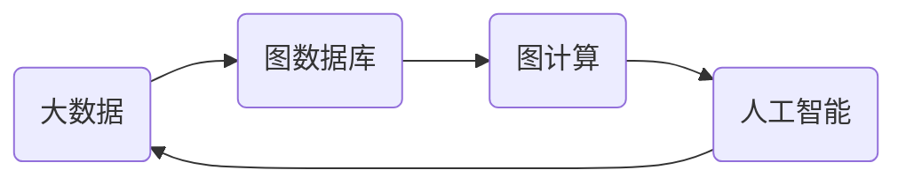
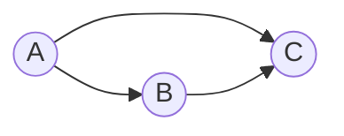

好的,我会严格按照您提供的要求和约束,以《【AI大数据计算原理与代码实例讲解】图数据库》为题撰写一篇8000字以上的技术博客文章。以下是文章正文:

# 【AI大数据计算原理与代码实例讲解】图数据库

关键词:图数据库,图计算,大数据,AI,Neo4j,Gremlin,Cypher

## 1. 背景介绍
### 1.1  问题的由来
在当今大数据和人工智能飞速发展的时代,各行各业都在积极拥抱数据驱动的智能化变革。传统的关系型数据库在处理高度关联的复杂数据时,存在查询效率低下、扩展性差等问题。为了应对关联数据快速增长带来的挑战,以图为核心的新型数据库应运而生。
### 1.2  研究现状
近年来,学术界和工业界对图数据库的研究热度持续攀升。众多科技巨头如Google、Facebook、Twitter等公司,都在积极布局图数据库领域。Neo4j作为图数据库领域的先行者,其社区生态日趋完善,在实际应用中取得了诸多成功案例。
### 1.3  研究意义
深入研究图数据库的原理和应用,对于推动大数据和人工智能技术的融合创新具有重要意义。一方面,图数据库为复杂关联数据的高效存储、查询和分析提供了新的思路和方法;另一方面,图计算与深度学习等AI技术的结合,有望催生出更加智能化的数据挖掘和知识发现应用。
### 1.4  本文结构
本文将围绕图数据库的核心概念、原理、算法和应用等方面展开深入探讨。第2节介绍图数据库的基本概念和特点;第3节重点阐述图数据库的存储和查询原理,以及常用的图查询语言;第4节从数学角度对图模型和算法进行形式化描述;第5节通过代码实例演示图数据库的开发和使用;第6节总结图数据库的典型应用场景;第7节推荐相关学习资源和开发工具;第8节对图数据库的未来发展趋势和挑战进行展望;第9节列举一些常见问题解答。

## 2. 核心概念与联系
图是一种由节点(Vertex)和边(Edge)组成的数据结构,可以直观地表达事物之间的关联关系。图数据库以图为核心数据模型,采用节点和边的形式存储数据。与传统关系型数据库相比,图数据库具有如下特点:
- 图结构更加贴近现实世界的关联网络
- 通过遍历有向边快速查找关联数据
- 支持复杂的多跳关联查询
- 适合处理高度关联和动态变化的数据

图数据库与大数据、人工智能技术有着天然的联系。一方面,大数据时代的很多数据如社交网络、知识图谱等天然带有图结构特征,适合用图数据库进行存储和分析;另一方面,图神经网络、图嵌入等图学习技术为AI系统提供了新的建模和计算范式,使之能够高效处理图结构化数据。



## 3. 核心算法原理 & 具体操作步骤
### 3.1  算法原理概述
图数据库的核心是图遍历算法,即从起始节点出发,通过遍历有向边快速找到相关联的其他节点。常见的图遍历算法包括:
- 广度优先搜索(BFS):先遍历起始节点的所有邻居,再遍历邻居的邻居,直到找到目标节点
- 深度优先搜索(DFS):先遍历起始节点的一个邻居,再递归遍历该邻居的邻居,直到找到目标节点
- 最短路径算法:找出图中两个节点之间的最短路径,如Dijkstra算法、A*搜索等
- 连通性算法:找出图中的连通分量,即互相可达的节点集合

### 3.2  算法步骤详解
以广度优先搜索为例,其基本步骤如下:
1. 创建一个队列,将起始节点加入队列
2. 如果队列不为空,取出队首节点,标记为已访问
3. 遍历该节点的所有未访问过的邻居,加入队列并标记为已访问 
4. 重复步骤2-3,直到队列为空或找到目标节点

### 3.3  算法优缺点
BFS算法的优点是实现简单,能够找到起始节点到目标节点的最短路径。缺点是当图规模较大时,需要存储大量中间节点,内存开销大。相比之下,DFS算法的空间复杂度更低,但找到的路径不一定是最短的。

### 3.4  算法应用领域
图遍历算法在很多领域有广泛应用,例如:
- 社交网络分析:利用BFS算法发现用户的二度、三度好友关系
- 知识图谱问答:利用最短路径算法找到实体之间的最短关联路径
- 网络路由:利用Dijkstra算法规划网络中的最优路径
- 推荐系统:利用随机游走算法挖掘用户兴趣

## 4. 数学模型和公式 & 详细讲解 & 举例说明
### 4.1  数学模型构建
图可以用二元组 $G=(V,E)$ 表示,其中 $V$ 表示节点集合, $E$ 表示边集合。每个节点 $v \in V$ 可以附加属性,每条边 $e \in E$ 由起始节点、目标节点和方向组成,也可以附加权重、类型等属性。

以下是一个简单的有向图例子:



该图可以表示为:
$V = \{A, B, C\}$
$E = \{(A,B), (A,C), (B,C)\}$

### 4.2  公式推导过程
以BFS算法为例,设起始节点为 $s$,目标节点为 $t$,我们要找到 $s$ 到 $t$ 的最短路径。定义 $d(v)$ 为节点 $v$ 到 $s$ 的最短距离,则有以下递推公式:

$$
d(v)=
\begin{cases}
0  & v = s \\
min\{d(u)+1 | (u,v) \in E\} & v \neq s
\end{cases}
$$

即节点 $v$ 到 $s$ 的最短距离,等于其所有邻居节点 $u$ 到 $s$ 的最短距离加1的最小值。

### 4.3  案例分析与讲解
以上图为例,假设起始节点为A,目标节点为C,BFS遍历过程如下:
1. 初始化队列 $q=[A]$,距离 $d(A)=0$
2. 取出A,遍历其邻居B和C,更新距离 $d(B)=d(C)=1$,将B、C加入队列
3. 取出B,遍历其邻居C,由于 $d(C)$ 已经为1,不需要更新
4. 取出C,队列为空,遍历结束

最终得到最短距离 $d(C)=1$,最短路径为A->C。

### 4.4  常见问题解答
Q: BFS算法能否处理带权图?
A: BFS算法适用于无权图的最短路径查找。对于带权图,需要使用Dijkstra等基于优先队列的算法。

Q: 遇到大规模图时,如何优化BFS算法?
A: 可以考虑采用多线程并行BFS,将图划分为多个子图分别遍历。也可以使用基于索引的优化技术,预先计算和存储一些中间结果,加速在线查询。

## 5. 项目实践：代码实例和详细解释说明
### 5.1  开发环境搭建
以下示例使用Neo4j图数据库和Cypher查询语言。首先需要安装Neo4j服务器和客户端工具,可以从官网下载。

### 5.2  源代码详细实现
创建示例图:
```
CREATE (A:Person {name: 'A'}),
(B:Person {name: 'B'}),
(C:Person {name: 'C'}),
(A)-[:KNOWS]->(B),
(A)-[:KNOWS]->(C),
(B)-[:KNOWS]->(C)
```

使用BFS查找A到C的最短路径:
```
MATCH path=shortestPath((A:Person {name: 'A'})-[*]->(C:Person {name: 'C'})) 
RETURN path
```

### 5.3  代码解读与分析
- 第一段代码使用CREATE语句创建了三个Person节点A、B、C,并创建了A到B、A到C、B到C的KNOWS关系边。
- 第二段代码使用MATCH语句匹配A到C的最短路径,其中`(A:Person {name: 'A'})`表示起始节点A,`-[*]->`表示沿着任意类型和长度的有向边遍历,`(C:Person {name: 'C'})`表示目标节点C。
- shortestPath函数会自动采用BFS算法寻找最短路径,并将结果绑定到path变量。
- RETURN语句将匹配到的最短路径返回给客户端。

### 5.4  运行结果展示
在Neo4j Browser中执行第二段Cypher语句,得到类似下面的结果:
```
path
(:Person {name: 'A'})-[:KNOWS]->(:Person {name: 'C'})
```

说明找到了A到C的最短路径A->C,与前面的理论分析一致。

## 6. 实际应用场景
图数据库在很多领域都有广泛应用,下面列举几个典型场景:

- 社交网络分析:使用图数据库存储用户关系网络,挖掘用户社区、影响力等特征,实现基于关系的好友推荐、社交广告等功能。
- 金融风控:使用图数据库存储交易网络,构建反欺诈、反洗钱模型,及时发现可疑交易行为和犯罪团伙。
- 知识图谱:使用图数据库组织海量实体及其关系,支持复杂的语义查询、关系推理和知识问答。
- 推荐系统:利用图数据库挖掘用户兴趣图谱,实现基于关联的商品推荐、相似度计算等任务。

### 6.4  未来应用展望
随着大数据和人工智能的不断发展,图数据库有望在更多领域发挥独特价值,例如:
- 生物医疗领域的药物-靶点-疾病关联挖掘
- 工业领域的设备-传感器-故障关联分析
- 智慧城市领域的人-地点-事件关联推理

同时,图数据库与知识图谱、图神经网络等前沿技术的深度融合,将进一步拓展其在认知智能、类脑计算等方面的应用前景。

## 7. 工具和资源推荐
### 7.1  学习资源推荐
- 官方网站:Neo4j官网 https://neo4j.com/ ,提供了丰富的文档、教程和案例。
- 在线课程:《Neo4j图数据库入门》 https://www.imooc.com/learn/1195 ,由国内知名讲师授课。
- 经典书籍:《Neo4j权威指南》,系统讲解Neo4j原理和实践。

### 7.2  开发工具推荐
- Neo4j Desktop:Neo4j官方提供的一站式开发环境,集成了服务器、浏览器等工具。
- Neo4j Bloom:Neo4j的可视化探索和分析工具,支持交互式图探索和模式发现。
- Cypher Shell:Neo4j的命令行查询工具,适合批量操作和自动化任务。

### 7.3  相关论文推荐
- 图数据库综述:Graph Databases Survey. Angles R, Gutierrez C. ACM Computing Surveys, 2008.
- 图数据管理:Managing and Mining Graph Data. Aggarwal C, Wang H. Springer, 2010.
- 图表示学习:Representation Learning on Graphs: Methods and Applications. Hamilton W L, Ying R, Leskovec J. IEEE Data Engineering Bulletin, 2017.

### 7.4  其他资源推荐
- 图可视化:Gephi https://gephi.org/ ,一款开源的大规模图可视化分析工具。
- 图算法库:NetworkX https://networkx.org/ ,Python语言的图算法库,提供了常用的图遍历、中心性等算法。
- 知识图谱:Protege http://protege