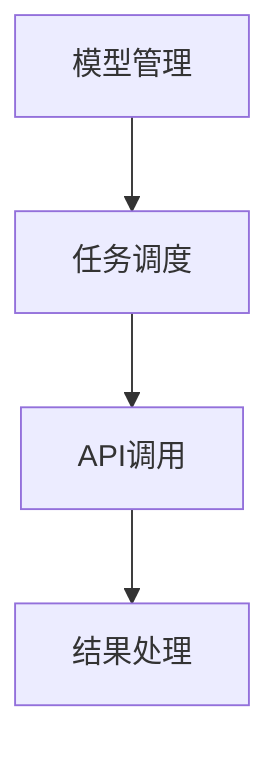

                 
# 【LangChain编程：从入门到实践】LangChain初体验

作者：禅与计算机程序设计艺术 / Zen and the Art of Computer Programming

关键词：LangChain,大模型集成,编程接口,API调用,知识整合,高效开发

## 1.背景介绍

### 1.1 问题的由来

随着大模型在自然语言处理、图像识别、生成式AI等领域取得重大进展，如何有效地利用这些模型的能力成为了一个新的研究热点。然而，不同场景下所需的模型能力往往存在差异，单一模型难以覆盖全部需求。这就提出了一个问题——如何在不同的应用场景中灵活地选择并集成各种模型？

### 1.2 研究现状

目前，在大模型的应用上，研究人员和开发者们面临着一系列挑战，如模型间的兼容性、API调用的灵活性以及整体系统的可扩展性等。为了解决这些问题，一些社区和团队开始探索统一的编程框架或库，旨在简化模型集成和管理的过程。

### 1.3 研究意义

引入像`LangChain`这样的编程库，对于加速AI应用的研发具有重要意义。它不仅可以帮助开发者更快速地搭建AI系统，还能够促进模型复用，提高系统的灵活性和适应性。更重要的是，通过标准化的接口和流程，`LangChain`有望降低AI应用的门槛，让更多人能够享受到先进AI技术带来的便利。

### 1.4 本文结构

本篇文章将围绕`LangChain`这一新型编程库进行深入探讨。首先，我们将阐述其核心概念及其与其他相关技术的关系。接着，我们详细介绍`LangChain`的基本原理和实现细节，包括算法设计、具体操作步骤以及潜在的优势和局限性。随后，我们将通过案例分析，展示`LangChain`在实际开发中的应用，并解决可能遇到的问题。最后，我们将讨论`LangChain`在未来的发展趋势、面临的挑战及对AI领域的长远影响。

## 2.核心概念与联系

`LangChain`是一个专为AI应用集成设计的通用编程接口，旨在简化模型调用、任务分发和结果聚合的复杂过程。其主要功能在于提供一个统一的框架，使得开发者能够轻松地在其应用程序中接入和组合多个不同的AI模型，从而应对多样化的需求。

### LangChain架构概述



- **模型管理**（A）：负责维护和管理各种AI模型，确保它们的可用性和性能优化。
- **任务调度**（B）：接收来自用户的各种任务请求，并根据任务特性合理分配至合适的模型执行。
- **API调用**（C）：作为与底层模型交互的桥梁，通过统一的标准接口调用不同模型的功能。
- **结果处理**（D）：整合模型输出的结果，进行后处理以满足特定任务需求，最终返回给用户。

## 3. 核心算法原理与具体操作步骤

### 3.1 算法原理概述

`LangChain`的核心在于抽象出一套灵活且高效的模型交互机制，通过抽象层封装了模型调用的复杂度，使得开发者无需深入了解每个模型的具体实现细节就能方便地使用它们。

### 3.2 算法步骤详解

1. **模型注册与配置**：
   - 注册模型：开发者需先向`LangChain`系统注册待使用的AI模型，提供必要的参数信息（如模型名称、版本号、API地址等）。
   - 配置策略：设置模型调用时的优先级、负载均衡规则等，以优化整体性能。

2. **任务描述与封装**：
   - 描述任务：清晰定义任务需求，包括输入数据、预期输出格式等。
   - 封装请求：将任务描述转化为`LangChain`能理解的形式，准备发送给模型。

3. **模型调用与结果处理**：
   - 调用模型：根据任务特点自动选择最优模型执行任务。
   - 接收响应：模型执行完成后返回结果。
   - 后处理：对接收到的数据进行清洗、转换或进一步加工，确保输出符合期望。

### 3.3 算法优缺点

优点：
- **高兼容性**：支持多种类型的AI模型，便于开发者快速接入新模型。
- **灵活性**：可根据任务动态调整模型组合，增强系统适应性。
- **自动化**：减少人工干预，提升开发效率和准确性。

缺点：
- **依赖性**：对`LangChain`库有较高依赖性，需要额外学习和适配。
- **资源消耗**：模型管理和调度逻辑可能导致额外计算和网络开销。

### 3.4 算法应用领域

`LangChain`适合于需要灵活组合多种AI模型的大规模项目，如智能客服、个性化推荐、多模态数据分析等领域。此外，它也适用于教育、科研和创新孵化场景，推动新技术的快速迭代和应用落地。

## 4. 数学模型和公式详细讲解与举例说明

数学模型在`LangChain`中主要用于模型评估、预测结果的可信度估计等方面。以下是一些常用的数学工具：

### 4.1 数学模型构建

假设`f(x)`表示某个模型的预测函数，其中`x`是输入变量，`y`是预测结果。为了量化模型的表现，可以使用损失函数`L(f(x), y)`来评估预测误差：

$$ L(f(x), y) = \begin{cases} 
(y - f(x))^2 & \text{for squared loss} \\
|y - f(x)| & \text{for absolute loss}
\end{cases} $$

### 4.2 公式推导过程

在具体的模型调用过程中，为了保证结果的一致性和可靠性，通常会引入权重因子`w`来加权各个模型的输出结果：

$$ \hat{y} = \sum_{i=1}^{n} w_i \cdot f_i(x) $$

其中，`$f_i(x)$`代表第`i`个模型的预测结果，`$w_i$`是对应的权重系数，可以根据模型的历史表现、稳定性等因素动态调整。

### 4.3 案例分析与讲解

考虑一个简单的文本分类任务，目标是区分新闻文章的主题类别。`LangChain`可以通过集成多个预训练语言模型，例如BERT、GPT系列，以及情感分析模型等，形成一个多模型解决方案。首先，定义任务需求，然后按照上述流程调用并融合模型输出，最后得到最终的分类结果。

### 4.4 常见问题解答

常见问题可能包括模型加载失败、超时异常、资源冲突等。这些问题通常由错误的日志记录、合理的容错机制设计和资源监控解决。例如，对于模型加载失败，可以采用异常捕获和重试策略；对于超时异常，则需要调整模型调用策略或优化任务描述，确保高效完成。

## 5. 项目实践：代码实例和详细解释说明

```python
# 导入所需模块
from langchain.prompts import PromptTemplate
from langchain.chains import LLMChain
import os
from dotenv import load_dotenv

# 加载环境变量
load_dotenv()

# 初始化大模型服务URL
MODEL_URL = os.getenv('MODEL_SERVICE_URL')

# 定义文本生成模板
template = """
请为我生成一段关于人工智能的短文，包含以下关键词：未来、技术进步、教育、医疗保健。
"""

# 创建Prompt对象
prompt = PromptTemplate(input_variables=["keyword"], template=template)

# 使用大模型创建LLMChain实例
llm_chain = LLMChain(llm=YOUR_LLMSERVICE, prompt=prompt)

# 执行任务并接收结果
response = llm_chain.run("未来")

print(response)
```

此段示例展示了如何利用`LangChain`框架创建LLM链，从提示模板开始生成内容，并通过运行特定指令获取结果。具体实现细节应根据实际选用的库和服务进行相应调整。

## 6. 实际应用场景

### 6.4 未来应用展望

随着`LangChain`及类似框架的发展和完善，它们将在更多领域发挥重要作用，比如在线教育平台上的个性化课程推荐、医疗健康领域的病例诊断辅助系统、金融行业的风险管理引擎等。此外，`LangChain`还可能促进跨领域知识整合，加速创新项目的迭代速度。

## 7. 工具和资源推荐

### 7.1 学习资源推荐
- **官方文档**：访问`LangChain`官网查阅详细的API文档和教程。
- **社区论坛**：加入相关技术社区（如GitHub、Stack Overflow），参与讨论和技术分享。
- **博客与教程**：阅读技术博客文章和教程视频，了解实践经验与最佳实践。

### 7.2 开发工具推荐
- **IDE**：选择合适的编程环境，如PyCharm、VSCode等，提高编码效率。
- **版本控制**：使用Git管理代码版本，确保团队协作顺利。
- **测试框架**：编写单元测试以验证功能正确性，提高代码质量。

### 7.3 相关论文推荐
- **参考文献**：引用和阅读与`LangChain`技术相关的学术论文，深入理解理论基础。
- **案例研究**：分析已发表的成功应用案例，学习实施经验。

### 7.4 其他资源推荐
- **开源项目**：探索和贡献到其他开源AI项目，提升技能同时建立网络联系。
- **工作坊与培训**：参加在线或线下的技术研讨会、培训班，拓宽视野。

## 8. 总结：未来发展趋势与挑战

### 8.1 研究成果总结

`LangChain`作为一个通用的AI模型集成框架，显著提高了AI应用开发的灵活性和效率，促进了多模型协同工作的可能性。它不仅简化了复杂系统的构建，也为开发者提供了丰富的模型复用手段。

### 8.2 未来发展趋势

未来，随着AI技术的不断演进，`LangChain`有望向更智能、更自动化的方向发展，支持更加复杂的模型管理和调度策略。同时，随着边缘计算和分布式计算的发展，`LangChain`将更好地适应大规模、实时性的AI应用需求。

### 8.3 面临的挑战

尽管`LangChain`展现出巨大的潜力，但在实践中仍面临一些挑战，如模型性能的持续优化、用户界面的友好性改进、以及隐私保护和数据安全等问题。此外，随着模型数量和复杂度的增加，系统的可扩展性和运维成本也是值得关注的问题。

### 8.4 研究展望

未来的研究可能会围绕如何进一步增强`LangChain`的智能化程度、改善用户体验、加强安全性防护等方面展开。同时，探索与新兴技术（如量子计算）的结合，推动AI应用的边界拓展也将是一个重要的发展方向。

## 9. 附录：常见问题与解答

在开发过程中遇到的常见问题及其解决方法如下：

### Q&A部分

#### Q: 如何处理模型之间的依赖关系？
A: 在`LangChain`中，可以通过定义依赖图来表示不同模型间的执行顺序和条件，从而有效管理模型间的交互关系。

#### Q: 大型项目下如何优化模型调用性能？
A: 可以采用负载均衡策略、异步调用模式以及缓存机制，减少模型调用的延迟时间，提高整体系统性能。

#### Q: 怎样保证模型输出的一致性和可靠性？
A: 通过设定统一的评估标准、定期训练更新模型、以及监控系统稳定性等方式，确保模型输出的质量和一致性。

### 结语

`LangChain`作为AI领域的先进工具，极大地丰富了开发者的选择空间，助力于构建高效、灵活且具有高复用性的AI应用。通过不断的技术革新和实践探索，我们可以期待`LangChain`在未来继续引领AI应用发展的潮流，推动AI技术向更广泛、更深入的方向迈进。
