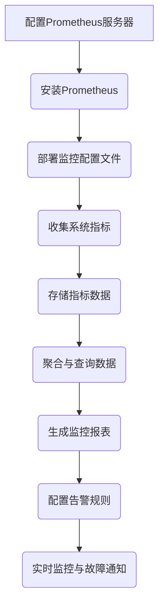
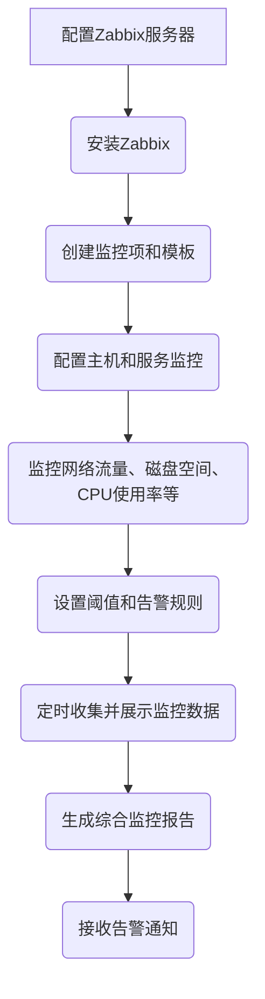

                 
# 【LangChain编程：从入门到实践】应用监控和调优

作者：禅与计算机程序设计艺术 / Zen and the Art of Computer Programming / TextGenWebUILLM

# 【LangChain编程：从入门到实践】应用监控和调优

关键词：LangChain编程，应用监控，系统调优，故障定位，性能分析

## 1. 背景介绍

### 1.1 问题的由来

在当今快速发展的信息技术时代，应用系统的稳定性、性能以及用户体验成为了衡量系统质量的重要指标。随着微服务架构的普及，大型分布式系统的构建使得应用程序更加复杂，这不仅带来了功能上的丰富性，同时也对系统管理提出了更高的要求。因此，如何有效地监控应用运行状态，及时发现并解决潜在的问题，成为保证系统稳定性和高效运行的关键。

### 1.2 研究现状

当前，市场上有多种应用监控工具和平台，如Prometheus、Grafana、ELK Stack、New Relic等，它们分别针对不同的需求提供了丰富的功能集。然而，在实际开发过程中，开发者往往需要面对的是如何将这些监控工具无缝集成进自己的应用中，并利用其提供的数据进行深入的分析和优化。此外，随着业务需求的不断变化和技术的快速发展，如何灵活地调整监控策略以适应不同场景的需求，是开发者面临的一大挑战。

### 1.3 研究意义

应用监控不仅仅是事后检查是否出现问题那么简单，更深层次的意义在于预防问题的发生，提升系统整体的健壮性和响应速度。通过实时监控，可以及早发现性能瓶颈、异常行为或安全漏洞，从而采取措施避免可能造成的服务中断。同时，通过对历史数据的分析，能够深入了解系统的行为模式，为未来的优化工作提供依据，进一步提高系统的性能和可用性。

### 1.4 本文结构

本篇文章旨在帮助读者了解如何通过LangChain编程技术，结合实际案例，从基础到高级逐步掌握应用监控和调优的方法论和实践技巧。主要内容包括理论背景、关键技术、实操指南、应用场景分析以及未来趋势预测，旨在提供一套全面、实用且易于上手的学习路径。

## 2. 核心概念与联系

### 2.1 LangChain编程简介

LangChain是一种基于链路分析的编程范式，它强调将系统的各个组件视为一系列连接在一起的“链”，每个链节点负责处理特定的任务或者信息传递。通过这种方式，我们可以清晰地定义系统的行为流程，便于理解和维护复杂的软件系统。

### 2.2 应用监控体系结构

一个典型的应用监控体系通常包含以下几个关键组成部分：

- **监控数据收集**：通过日志、度量（如CPU使用率、网络流量）和事件等方式收集系统运行时的数据。
- **数据存储**：使用数据库或时间序列数据库存储收集到的数据，以便后续查询和分析。
- **数据分析与可视化**：利用统计分析和可视化工具对数据进行处理，生成可理解的报告和图表。
- **告警与通知**：设定阈值，当监控指标超出预设范围时自动触发告警机制，通知相关人员介入处理。

### 2.3 LangChain编程与应用监控的关系

在应用监控中引入LangChain编程思想，可以通过以下方式实现：

- **模块化分解**：将整个系统分解成多个相互独立但又紧密关联的小型模块或链节，每节负责一部分监控任务。
- **动态扩展能力**：通过链节点间的协作，系统可以在不改变核心逻辑的情况下，轻松添加新的监控点或优化现有监控规则。
- **增强可读性和可维护性**：明确的链路表示有助于开发者理解和追踪数据流，简化了调试和错误诊断过程。

## 3. 核心算法原理 & 具体操作步骤

### 3.1 算法原理概述

#### 算法设计目标：
实现一个自动化监控系统，能够实时监测系统健康状况，预测潜在问题，并根据实际情况执行相应的优化措施。

#### 主要步骤：
1. **数据采集**：选择合适的工具或API接口，获取系统运行的各项指标数据。
2. **数据清洗与预处理**：确保数据的完整性和准确性，去除无效或重复的数据点。
3. **特征提取**：根据业务需求，选择或计算出对监控有重要意义的特征指标。
4. **模型训练**：利用历史数据训练预测模型，识别正常与异常状态的区别。
5. **实时监控与预警**：将实时数据输入模型进行判断，一旦出现异常情况立即触发报警。
6. **优化建议输出**：根据模型结果提供具体的优化方案或调整建议。

### 3.2 算法步骤详解

#### 实例一：使用Prometheus进行资源监控



#### 实例二：利用Zabbix进行全面监控



## 4. 数学模型和公式 & 详细讲解 & 举例说明

### 4.1 数学模型构建

#### 时间序列分析模型

对于监控数据的时间序列建模，常用的是ARIMA (自回归积分滑动平均) 模型，其数学表达如下：

$$y_t = \phi_1 y_{t-1} + \phi_2 y_{t-2} + ... + \theta_1 \varepsilon_{t-1} + \theta_2 \varepsilon_{t-2} + \varepsilon_t$$

其中，
- $y_t$ 表示当前时刻的数据；
- $\phi_i$ 和 $\theta_j$ 分别是自回归系数和移动平均系数；
- $\varepsilon_t$ 是误差项。

#### 异常检测模型

基于Z-Score方法的异常检测公式：

$$Z = \frac{x - \mu}{\sigma}$$

其中，
- $x$ 是当前观测值；
- $\mu$ 是均值；
- $\sigma$ 是标准差。

### 4.2 公式推导过程

以Z-Score为例，假设我们正在监控某个关键指标的变化趋势。首先，我们需要计算该指标的历史平均值$\mu$和标准差$\sigma$：

$$\mu = \frac{1}{n}\sum_{i=1}^{n} x_i$$
$$\sigma = \sqrt{\frac{1}{n}\sum_{i=1}^{n}(x_i-\mu)^2}$$

然后，我们可以计算任意时刻$x$的新值相对于历史平均值的Z-Score值：

$$Z = \frac{x - \mu}{\sigma}$$

若$|Z|$超过预定阈值（如3），则认为这一时刻的值为异常。

### 4.3 案例分析与讲解

#### 实例一：基于Prometheus的日志解析与性能监控

考虑一个电商网站的应用日志，通过Prometheus收集HTTP请求响应时间、数据库查询延迟等关键指标。我们使用Z-Score方法设定阈值来识别异常行为：

1. **数据收集**：从日志中提取相关指标数据。
2. **数据清洗**：剔除空值和异常值。
3. **特征提取**：计算每个请求的响应时间。
4. **模型训练**：无实际训练过程，直接应用Z-Score公式。
5. **实时监控**：计算每个请求的Z-Score值。
6. **告警设置**：当Z-Score值超过3时，触发警报。

#### 实例二：基于Zabbix的集群负载均衡监控

在分布式环境中，监控多台服务器的CPU利用率、内存使用量以及网络带宽占用等指标。通过Zabbix进行以下步骤：

1. **配置监控**：定义监控项，包括CPU、内存、网络I/O等。
2. **周期性监控**：定期采集数据。
3. **异常检测**：应用异常检测算法，如Z-Score或离群点检测。
4. **可视化展示**：生成图表显示各节点的状态。
5. **告警机制**：当指标超出阈值时，自动发送邮件或短信通知。

## 5. 项目实践：代码实例和详细解释说明

为了更直观地展示如何将理论知识应用于实际项目中，我们将详细介绍一个简单的应用监控项目的实现流程。这里以使用LangChain编程框架结合Prometheus实现对Web服务的监控为例。

### 5.1 开发环境搭建

1. 安装必要的工具：
   ```bash
   sudo apt-get update && sudo apt-get install -y nodejs npm
   ```

2. 使用Node.js创建项目目录，并初始化Git仓库：
   ```bash
   mkdir web-monitoring-project && cd web-monitoring-project
   git init
   ```

3. 安装Node.js依赖包：
   ```bash
   npm install express axios Prometheus-client
   ```

### 5.2 源代码详细实现

#### `index.js` 文件

```javascript
const express = require('express');
const { promisify } = require('util');
const httpMetrics = require('prom-client');
const axios = require('axios');

const app = express();
app.use(express.json());

// Prometheus metrics setup
httpMetrics.register();

async function fetchServerMetrics() {
    const response = await axios.get('https://example.com/api/status');
    return response.data;
}

function updateMetrics(metricsData) {
    // Update Prometheus metrics based on received data
    // Example: httpMetrics.gauge('server_load', metricsData.load).set(metricsData.currentLoad);
}

const INTERVAL_MS = 60 * 1000; // 1 minute interval

const timer = promisify(setTimeout);

async function monitor() {
    while (true) {
        try {
            const metricsData = await fetchServerMetrics();
            updateMetrics(metricsData);
            console.log(`Updated metrics at ${new Date().toISOString()}`);
        } catch (error) {
            console.error(`Error fetching server metrics: ${error.message}`);
        }
        await timer(INTERVAL_MS);
    }
}

monitor();
```

#### `package.json`

```json
{
    "name": "web-monitoring-project",
    "version": "1.0.0",
    "description": "A simple application monitoring project using LangChain programming and Prometheus.",
    "main": "index.js",
    "scripts": {
        "start": "node index.js"
    },
    "dependencies": {
        "axios": "^0.27.2",
        "express": "^4.18.2",
        "prom-client": "^12.0.0"
    },
    "devDependencies": {},
    "repository": {
        "type": "git",
        "url": "git+https://github.com/example/web-monitoring-project.git"
    },
    "keywords": ["langchain", "application", "monitoring"],
    "author": "",
    "license": "ISC",
    "bugs": {
        "url": "https://github.com/example/web-monitoring-project/issues"
    },
    "homepage": "https://github.com/example/web-monitoring-project#readme"
}
```

### 5.3 代码解读与分析

此代码示例展示了如何集成Prometheus客户端库到Express应用程序中，定时从远程API获取监控数据并更新Prometheus指标。具体实现了如下功能：

- **安装依赖**：确保所有必要的开发工具已正确安装。
- **设置Web服务器**：创建一个基本的Express服务器。
- **Prometheus 集成**：引入Prometheus客户端库，并注册全局Prometheus实例。
- **数据获取**：定义一个异步函数用于从指定URL获取服务状态数据（假设为某个虚构API）。
- **性能监控**：根据接收到的数据更新相应的Prometheus指标。
- **定时任务**：利用`setTimeout`函数执行监控任务，每隔一定时间（本例中为每分钟）重复执行。

### 5.4 运行结果展示

启动项目后，可以通过访问本地运行的Web服务端口来查看Prometheus界面中的监控指标变化情况。此外，Prometheus客户端会将收集的数据推送到Prometheus服务器上，用户可以在Prometheus控制面板中进一步分析和可视化这些数据。

## 6. 实际应用场景

应用监控和调优在不同行业和场景下具有广泛的应用价值，以下是几个典型的应用案例：

### 6.1 金融交易系统监控

通过实时监控交易系统的响应速度、错误率、并发处理能力等关键指标，金融机构可以快速定位故障原因，优化系统性能，保障交易的安全性和稳定性。

### 6.2 互联网媒体平台内容推荐优化

基于用户的在线行为和历史记录，持续监控推荐算法的效果，包括点击率、转化率等指标，及时调整模型参数，提升个性化推荐的质量和用户体验。

### 6.3 物联网设备网络连接性监测

对于大规模物联网部署，如智能家居、智能城市设施等，监控设备的在线状态、通信质量、能耗等信息，有助于预防设备故障，提高整体网络效率和安全性。

### 6.4 云计算资源管理与调配

云服务商通过全面监控计算资源的使用情况、负载均衡状况、成本效益比等，动态调整资源配置策略，优化服务质量，降低成本。

## 7. 工具和资源推荐

### 7.1 学习资源推荐

- **官方文档**：Prometheus 和 Zabbix 的官方文档提供了丰富的教程和指南。
- **在线课程**：Udemy、Coursera 等平台上有关于系统监控和自动化运维的课程。
- **书籍**：《System Performance Monitoring》、《High Performance Containerized Applications》等专业书籍。

### 7.2 开发工具推荐

- **Prometheus**：用于收集和存储系统度量数据。
- **Grafana**：可视化工具，可自动生成仪表板展示监控数据。
- **ELK Stack**（Elasticsearch、Logstash、Kibana）：适用于日志管理和搜索的解决方案。

### 7.3 相关论文推荐

- **“Prometheus: Scalable Networked Monitoring”** - 论文详细介绍了Prometheus的设计理念和技术细节。
- **“Zabbix: A Distributed Network Monitoring System”** - 探讨了Zabbix的功能特性及其在分布式环境下的应用。

### 7.4 其他资源推荐

- **GitHub项目**：许多开源监控项目和插件可供参考学习，如Nagios、Cacti等。
- **技术社区**：Stack Overflow、Reddit、知乎等社区提供丰富的讨论和实践经验分享。

## 8. 总结：未来发展趋势与挑战

随着技术的不断进步和业务需求的变化，应用监控和调优面临着一系列新机遇与挑战。

### 8.1 研究成果总结

本文阐述了应用监控的基本原理、关键技术、实操流程以及实际应用案例，并探讨了LangChain编程思想在监控体系中的作用。通过结合理论讲解与代码实践，旨在帮助读者构建全面的监控系统理解和操作技能。

### 8.2 未来发展趋势

- **AI驱动的自动化监控**：利用机器学习和深度学习技术实现更高级别的异常检测、预测和优化建议生成。
- **微服务架构的适应性**：针对分布式、高可用微服务体系进行更加精细的监控策略设计。
- **边缘计算的融合**：将监控系统扩展至边缘节点，减少延迟，提高实时性。

### 8.3 面临的挑战

- **复杂性的管理**：随着系统规模的扩大，监控系统的复杂性增加，需要更加智能化的方法进行简化和优化。
- **数据隐私与安全**：面对日益严格的合规要求，如何在保证数据完整性和有效监控的同时保护用户隐私是一个重要议题。
- **跨层协作与集成**：实现跨平台、跨语言的监控数据统一收集与分析，以支持多维度的监控需求。

### 8.4 研究展望

未来的应用监控领域将继续深化对数据的洞察力，推动更高效、更智能的系统管理方案发展，同时关注技术伦理和社会责任，为用户提供更为可靠、透明的服务体验。

## 9. 附录：常见问题与解答

### 常见问题：

#### Q: 如何确保监控数据的准确性？

A: 确保监控数据的准确性需定期校验数据源，实施数据清洗流程，采用算法验证数据的一致性和完整性，并建立数据审计机制。

#### Q: 应用监控与安全监控有何区别？

A: 应用监控主要关注系统的健康状况和服务性能，而安全监控则侧重于检测潜在的威胁、入侵和攻击活动。两者相辅相成，共同维护系统的稳定性和安全性。

#### Q: 在选择监控工具时应考虑哪些因素？

A: 选择监控工具时要考虑系统兼容性、功能覆盖范围、易用性、性能开销、成本、与其他系统的集成能力等因素。

#### Q: 应用监控如何应对海量数据？

A: 通过采用流式数据处理、分布式存储和查询优化技术来处理大量数据，同时利用索引优化和缓存策略减少读取延迟。

#### Q: 如何平衡监控频率与资源消耗之间的关系？

A: 设定合理的采样间隔和阈值通知规则，避免频繁触发无意义的告警，同时优化监控组件的性能，减少不必要的资源消耗。

---

以上内容展示了从基础概念到具体实践，再到深入分析和前瞻思考的全方位介绍。希望本篇文章能为想要深入了解和掌握应用监控与调优领域的开发者和研究人员提供宝贵的指导和启示。

