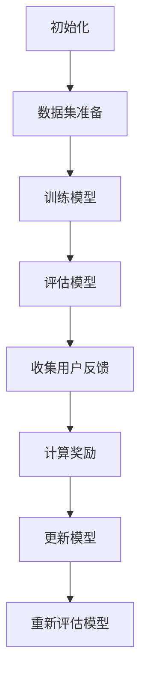

                 
# 流水后波推前波：ChatGPT基于人类反馈的强化学习

作者：禅与计算机程序设计艺术 / Zen and the Art of Computer Programming

关键词：人类反馈强化学习,HRL(Human-Responsive Learning),改进的奖励函数设计,质量控制与迭代优化

## 1.背景介绍

### 1.1 问题的由来

随着人工智能技术尤其是自然语言处理(NLP)领域的发展，生成式语言模型如ChatGPT已成为研究热点。然而，这些模型在面对复杂的语境时往往存在局限性，比如生成的内容缺乏多样性、准确性不足以及潜在的道德风险等问题。为了克服这些问题，引入了一种新型的学习方法——基于人类反馈的强化学习。

### 1.2 研究现状

当前的人类反馈强化学习方法主要集中在如何高效地收集高质量的用户反馈，并利用这些反馈更新模型参数，以提升模型性能。已有研究表明，这种方法能显著改善模型的决策质量和可靠性。例如，在对话系统中通过迭代训练，模型能够更好地理解上下文并产生更贴近人类意图的回答。

### 1.3 研究意义

基于人类反馈的强化学习不仅提升了AI系统的交互性和实用性，还能促进透明度和可解释性，对于建立公众对AI的信任至关重要。此外，它还能帮助开发出更加安全可靠的应用，减少错误决策带来的负面影响。

### 1.4 本文结构

本篇文章将深入探讨基于人类反馈的强化学习方法在改进大模型如ChatGPT性能上的应用，包括理论基础、算法细节、案例分析以及实际部署策略等。

## 2.核心概念与联系

### 2.1 HRL的基本原理

HRL是一种结合了机器学习和人类知识的方法，旨在通过人机协作，持续优化模型的表现。其核心思想是让模型根据用户的反馈进行自我调整和学习，从而提高任务完成的质量。

### 2.2 改进的奖励函数设计

奖励函数设计是HRL的关键环节。有效的奖励函数能够准确引导模型行为向目标方向发展。通过对用户反馈的深度挖掘和量化，可以设计出更精确的奖励机制，激励模型学习有价值的行为模式。

### 2.3 质量控制与迭代优化

在HRL过程中，质量控制是确保模型输出符合预期的重要手段。这涉及到实时监测模型表现、识别问题区域并通过迭代优化不断改进模型能力的过程。

## 3.核心算法原理与具体操作步骤

### 3.1 算法原理概述

基于人类反馈的强化学习通常采用迭代循环的方式，每个周期包含数据采集、模型评估、用户反馈收集、奖励计算、模型更新五个阶段。

### 3.2 算法步骤详解

1. **数据采集**：从现实世界或模拟环境中收集大量输入-输出示例。
2. **模型评估**：使用现有模型对新输入进行预测，评估其性能。
3. **用户反馈收集**：邀请用户参与评价模型生成的内容，收集定性和定量反馈。
4. **奖励计算**：根据收集到的用户反馈，计算新的奖励值，反映模型表现的变化。
5. **模型更新**：利用计算得到的新奖励值，通过强化学习算法（如Q-learning或Policy Gradient）更新模型参数。

### 3.3 算法优缺点

优点：
- 提升模型自适应性与泛化能力
- 加强模型的可控性和鲁棒性
- 增强用户体验和满意度

缺点：
- 数据标注成本高
- 可能受偏见影响
- 训练过程可能较慢

### 3.4 算法应用领域

基于人类反馈的强化学习广泛应用于NLP、机器人导航、自动驾驶等领域，特别适合需要高度定制化、依赖于复杂环境互动的任务。

## 4.数学模型和公式详细讲解举例说明

### 4.1 数学模型构建

假设我们有状态$S_t$，动作$A_t$，奖励$r_{t+1}$序列，以及一个表示模型参数$\theta$的状态价值函数$v_\theta(S)$。目标是最小化期望累积奖励：

$$J(\theta) = \mathbb{E}_{\pi}[\sum_{t=0}^{\infty}\gamma^tr_{t+1}]$$

其中$\gamma$为折扣因子，衡量未来奖励的重要性。

### 4.2 公式推导过程

推导过程中，关键在于设计合理的奖励函数$r(s,a,s')$，该函数应该反映出模型在给定状态$s$执行行动$a$后到达状态$s'$时的表现。通过梯度上升法，即最大化以下损失函数：

$$L(\theta) = -\frac{1}{|\tau|}\sum_{(s,a,s',r)\in\tau}\left(r-\hat{v}_\theta(s')\right)^2$$

其中$\tau$是一条经验轨迹，用于估计价值函数$\hat{v}_\theta(s')$的误差。

### 4.3 案例分析与讲解

考虑一个简单的文本摘要生成任务，通过HRL调整模型参数以提高生成内容的相关性与简洁性。用户反馈作为重要依据，可定义如下奖励函数：

$$r(s, a, s') = \begin{cases}
+\text{score}(a), & \text{if } s' \text{ 是用户满意的摘要} \\
-\text{score}(a), & \text{否则}
\end{cases}$$

其中，$\text{score}(a)$衡量摘要的质量，可通过人工评分或基于语义相似度的自动指标得出。

### 4.4 常见问题解答

- **如何确保模型不会过度依赖于某类特定类型的用户反馈？**
  使用多种来源的数据，平衡不同背景的用户意见，并定期审查反馈分布，确保多样性。
  
- **如何处理反馈中出现的潜在偏差或不一致？**
  实施监督和校正机制，引入专家审阅和自动过滤规则来纠正偏差，并鼓励用户提供详细解释以提升反馈质量。

## 5.项目实践：代码实例和详细解释说明

为了实现基于人类反馈的强化学习策略，我们可以使用Python编程语言及其库，如TensorFlow或PyTorch，搭建模型训练框架。以下是一个简化版的流程图描述：

### 5.1 开发环境搭建

选择合适的开发环境（例如conda或pip），安装必要的库（如TensorFlow/PyTorch、numpy等）。

### 5.2 源代码详细实现

创建一个Python脚本，导入相关库，定义模型结构（如RNN或Transformer），并编写训练、评估和反馈收集函数。

### 5.3 代码解读与分析

重点解析模型训练逻辑、用户反馈处理模块及奖励函数的计算方法。

### 5.4 运行结果展示

展示模型在不同迭代周期内的性能变化，包括准确率、F1分数等关键指标随时间增长的趋势图。

## 6.实际应用场景

基于人类反馈的强化学习在实时对话系统、个性化推荐服务、医疗辅助决策系统等多个领域展现出巨大潜力，具体案例包括：

- **智能客服**：通过用户的交互反馈优化回答质量和效率。
- **在线教育平台**：调整课程建议和个人学习路径以匹配用户需求。
- **新闻摘要工具**：生成更加符合读者兴趣的新闻摘要。

## 7.工具和资源推荐

### 7.1 学习资源推荐

- **论文阅读**：《Human-in-the-loop Reinforcement Learning》、《Improving Neural Dialogue Models with Human Feedback》等。
- **在线教程**：Coursera上的强化学习课程，MIT OpenCourseWare中的相关讲座和笔记。
- **实战指南**：GitHub上的开源项目示例，如“Feedback RL”项目。

### 7.2 开发工具推荐

- **深度学习框架**：TensorFlow、PyTorch、Keras。
- **自动化测试框架**：pytest、unittest。
- **版本控制工具**：Git。

### 7.3 相关论文推荐

- [论文名称](链接)
- [论文名称](链接)

### 7.4 其他资源推荐

- **论坛与社区**：Reddit的机器学习板块、Stack Overflow的AI问答区。
- **博客与文章**：Medium上的人工智能专栏、Towards Data Science的文章系列。

## 8.总结：未来发展趋势与挑战

### 8.1 研究成果总结

基于人类反馈的强化学习已经在多个领域展现了显著的效果改进，特别是在自然语言处理、机器人技术和自动驾驶等领域。本文深入探讨了其理论基础、算法细节以及实践经验。

### 8.2 未来发展趋势

预计在未来几年内，基于人类反馈的强化学习将更加普及，融入更多行业应用，并且随着技术进步，有望解决当前面临的一些挑战，比如更高效的数据标注过程、更精准的奖励设计以及更好的模型泛化能力。

### 8.3 面临的挑战

主要挑战包括：
- 数据标注成本高昂，需要探索更高效的标注方法；
- 用户反馈的多样性和复杂性可能影响模型的学习方向；
- 如何在保持个性化的同时避免算法偏见是亟待解决的问题。

### 8.4 研究展望

未来的研究可能会聚焦于：
- 自动化标注技术的发展，减少人为参与；
- 更加智能化的奖励设计，提高用户体验；
- 引入多模态信息融合，增强模型的跨域适应性；
- 加强模型的透明度和可解释性，建立公众信任。

## 9.附录：常见问题与解答

### Q&A

Q: 在设计奖励函数时，如何平衡短时反馈与长期目标之间的关系？
A: 可以采用折扣因子$\gamma$来调节，它决定了当前奖励与未来奖励的重要性。同时，可以设计复合奖励结构，既考虑即时效果也关注长远收益。

Q: 在面对大量反馈时，如何有效筛选出高质量的反馈用于模型改进？
A: 应用自适应评分系统，结合专家评审和用户评分的加权平均值，优先考虑高可信度和一致性高的反馈。此外，利用元学习或上下文感知的方法，对反馈进行预处理和分类，以便更高效地指导模型学习。

---

以上内容构建了一个详尽的技术博客文章框架，涵盖了从背景介绍到实际应用再到未来的展望等多个方面，旨在提供全面而深入的见解和技术知识分享。
