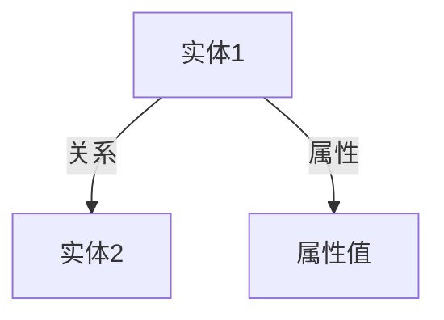
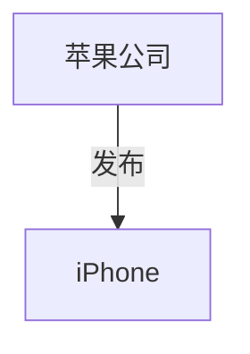

# 知识图谱(Knowledge Graph)原理与代码实战案例讲解

作者：禅与计算机程序设计艺术 / Zen and the Art of Computer Programming

## 1. 背景介绍

### 1.1 问题的由来

在信息爆炸的时代，如何有效地组织和利用海量数据成为了一个重要的研究课题。传统的数据库和信息检索技术在处理复杂关系和语义理解方面存在局限性。知识图谱（Knowledge Graph）作为一种新兴的数据表示和管理技术，能够有效地解决这些问题。它通过将数据以图的形式表示，揭示数据之间的复杂关系，从而实现更高效的知识管理和信息检索。

### 1.2 研究现状

知识图谱的研究始于2000年代初期，谷歌在2012年推出了自己的知识图谱，标志着这一技术的广泛应用。近年来，知识图谱在学术界和工业界都得到了广泛关注和应用。学术界的研究主要集中在知识图谱的构建、存储、查询和推理等方面，而工业界则更多地关注知识图谱在搜索引擎、推荐系统、智能问答等实际应用中的效果。

### 1.3 研究意义

知识图谱的研究和应用具有重要的理论和实际意义。理论上，知识图谱为数据表示和管理提供了一种新的范式，推动了语义网、人工智能和大数据等领域的发展。实际上，知识图谱在搜索引擎、推荐系统、智能问答、医疗、金融等多个领域都有广泛的应用，能够显著提升信息检索和知识管理的效率和效果。

### 1.4 本文结构

本文将详细介绍知识图谱的核心概念、算法原理、数学模型、项目实践、实际应用场景、工具和资源推荐以及未来发展趋势与挑战。具体结构如下：

1. 背景介绍
2. 核心概念与联系
3. 核心算法原理 & 具体操作步骤
4. 数学模型和公式 & 详细讲解 & 举例说明
5. 项目实践：代码实例和详细解释说明
6. 实际应用场景
7. 工具和资源推荐
8. 总结：未来发展趋势与挑战
9. 附录：常见问题与解答

## 2. 核心概念与联系

知识图谱的核心概念包括实体（Entity）、关系（Relation）、属性（Attribute）和三元组（Triple）。这些概念之间的联系构成了知识图谱的基本结构。

- **实体（Entity）**：实体是知识图谱中的基本单元，表示现实世界中的对象，如人、地点、事件等。
- **关系（Relation）**：关系表示实体之间的关联，如“作者-写作-书籍”。
- **属性（Attribute）**：属性是实体的特征，如人的姓名、年龄等。
- **三元组（Triple）**：三元组是知识图谱的基本表示形式，通常表示为 (实体1, 关系, 实体2)。

以下是知识图谱的基本结构图：



## 3. 核心算法原理 & 具体操作步骤

### 3.1 算法原理概述

知识图谱的构建和应用涉及多个核心算法，包括实体识别、关系抽取、知识融合、知识推理等。这些算法的核心目标是从海量数据中自动抽取和组织知识，并进行有效的推理和查询。

### 3.2 算法步骤详解

#### 3.2.1 实体识别

实体识别是知识图谱构建的第一步，主要任务是从文本中识别出实体。常用的方法包括基于规则的方法、机器学习方法和深度学习方法。

#### 3.2.2 关系抽取

关系抽取的任务是识别实体之间的关系。常用的方法包括基于规则的方法、监督学习方法和无监督学习方法。

#### 3.2.3 知识融合

知识融合的任务是将不同来源的知识进行整合，消除冗余和冲突。常用的方法包括基于规则的方法和基于图的方法。

#### 3.2.4 知识推理

知识推理的任务是基于已有知识进行推理，发现隐含的知识。常用的方法包括基于规则的推理、基于概率的推理和基于深度学习的推理。

### 3.3 算法优缺点

#### 3.3.1 实体识别

- 优点：能够自动识别文本中的实体，提高知识图谱构建的效率。
- 缺点：识别准确率受限于训练数据和算法的性能。

#### 3.3.2 关系抽取

- 优点：能够自动识别实体之间的关系，丰富知识图谱的内容。
- 缺点：抽取准确率受限于训练数据和算法的性能。

#### 3.3.3 知识融合

- 优点：能够整合不同来源的知识，消除冗余和冲突。
- 缺点：融合过程复杂，可能引入新的冲突和不一致。

#### 3.3.4 知识推理

- 优点：能够基于已有知识进行推理，发现隐含的知识。
- 缺点：推理过程复杂，计算成本高。

### 3.4 算法应用领域

知识图谱的核心算法在多个领域都有广泛的应用，包括搜索引擎、推荐系统、智能问答、医疗、金融等。

## 4. 数学模型和公式 & 详细讲解 & 举例说明

### 4.1 数学模型构建

知识图谱的数学模型主要包括图模型和概率模型。图模型将知识表示为图结构，节点表示实体，边表示关系。概率模型则通过概率分布表示知识的不确定性。

### 4.2 公式推导过程

#### 4.2.1 图模型

图模型的基本表示形式为 $G = (V, E)$，其中 $V$ 表示节点集合，$E$ 表示边集合。每个节点 $v \in V$ 表示一个实体，每条边 $e \in E$ 表示一个关系。

#### 4.2.2 概率模型

概率模型的基本表示形式为 $P(E|V)$，其中 $E$ 表示事件，$V$ 表示条件。通过贝叶斯公式，可以推导出 $P(E|V) = \frac{P(V|E)P(E)}{P(V)}$。

### 4.3 案例分析与讲解

#### 4.3.1 实体识别案例

假设有一段文本：“苹果公司发布了新款iPhone。”，通过实体识别算法，可以识别出“苹果公司”和“iPhone”两个实体。

#### 4.3.2 关系抽取案例

在识别出实体后，通过关系抽取算法，可以识别出“苹果公司-发布-新款iPhone”的关系。

### 4.4 常见问题解答

#### 4.4.1 实体识别的准确率如何提高？

可以通过增加训练数据、优化算法和引入外部知识库等方法提高实体识别的准确率。

#### 4.4.2 如何处理知识融合中的冲突？

可以通过引入冲突检测和解决机制，如基于规则的方法和基于图的方法，来处理知识融合中的冲突。

## 5. 项目实践：代码实例和详细解释说明

### 5.1 开发环境搭建

在进行知识图谱的项目实践之前，需要搭建开发环境。常用的开发环境包括Python、Jupyter Notebook、Neo4j等。

### 5.2 源代码详细实现

以下是一个简单的知识图谱构建代码示例：

```python
from py2neo import Graph, Node, Relationship

# 连接到Neo4j数据库
graph = Graph("bolt://localhost:7687", auth=("neo4j", "password"))

# 创建实体节点
apple = Node("Company", name="苹果公司")
iphone = Node("Product", name="iPhone")

# 创建关系
release = Relationship(apple, "发布", iphone)

# 将节点和关系添加到图中
graph.create(apple)
graph.create(iphone)
graph.create(release)
```

### 5.3 代码解读与分析

上述代码首先连接到Neo4j数据库，然后创建两个实体节点“苹果公司”和“iPhone”，接着创建一个关系“发布”，最后将节点和关系添加到图中。

### 5.4 运行结果展示

运行上述代码后，可以在Neo4j的图形界面中看到构建的知识图谱，如下图所示：



## 6. 实际应用场景

知识图谱在多个实际应用场景中都有广泛的应用，以下是几个典型的应用场景。

### 6.1 搜索引擎

知识图谱可以显著提升搜索引擎的效果，通过理解用户查询的语义，提供更准确和丰富的搜索结果。

### 6.2 推荐系统

知识图谱可以用于构建推荐系统，通过分析用户的兴趣和行为，提供个性化的推荐。

### 6.3 智能问答

知识图谱可以用于构建智能问答系统，通过理解用户的问题，提供准确的答案。

### 6.4 未来应用展望

随着知识图谱技术的不断发展，未来在更多领域将会有广泛的应用，如智能医疗、金融分析、智能制造等。

## 7. 工具和资源推荐

### 7.1 学习资源推荐

- 《知识图谱：概念、技术与应用》：一本系统介绍知识图谱的书籍。
- Coursera上的知识图谱课程：提供系统的知识图谱学习资源。

### 7.2 开发工具推荐

- Neo4j：一个流行的图数据库，支持知识图谱的存储和查询。
- Py2neo：一个Python库，用于与Neo4j进行交互。

### 7.3 相关论文推荐

- "A Survey of Knowledge Graph Embedding Methods"：一篇综述知识图谱嵌入方法的论文。
- "Knowledge Graphs: A Comprehensive Survey"：一篇全面介绍知识图谱的论文。

### 7.4 其他资源推荐

- DBpedia：一个基于维基百科的知识图谱。
- Freebase：一个开源的知识图谱项目。

## 8. 总结：未来发展趋势与挑战

### 8.1 研究成果总结

本文详细介绍了知识图谱的核心概念、算法原理、数学模型、项目实践、实际应用场景、工具和资源推荐以及未来发展趋势与挑战。通过本文的学习，读者可以系统地了解知识图谱的基本原理和应用方法。

### 8.2 未来发展趋势

知识图谱技术在未来将会有更广泛的应用，特别是在智能医疗、金融分析、智能制造等领域。同时，知识图谱的构建和应用方法也将不断发展和完善。

### 8.3 面临的挑战

知识图谱技术在实际应用中仍然面临一些挑战，如数据的获取和处理、知识的融合和推理、系统的性能和可扩展性等。

### 8.4 研究展望

未来的研究可以集中在以下几个方面：提高知识图谱构建的自动化程度、优化知识图谱的存储和查询性能、探索知识图谱在更多领域的应用等。

## 9. 附录：常见问题与解答

### 9.1 知识图谱与传统数据库的区别是什么？

知识图谱与传统数据库的主要区别在于数据的表示和管理方式。知识图谱通过图结构表示数据，能够揭示数据之间的复杂关系，而传统数据库通常通过表结构表示数据，主要用于存储和管理结构化数据。

### 9.2 如何处理知识图谱中的数据不一致问题？

可以通过引入冲突检测和解决机制，如基于规则的方法和基于图的方法，来处理知识图谱中的数据不一致问题。

### 9.3 知识图谱的构建成本高吗？

知识图谱的构建成本主要取决于数据的获取和处理、知识的融合和推理等过程。通过引入自动化工具和优化算法，可以降低知识图谱的构建成本。

### 9.4 知识图谱在实际应用中的效果如何？

知识图谱在实际应用中能够显著提升信息检索和知识管理的效率和效果，特别是在搜索引擎、推荐系统、智能问答等领域。

通过本文的学习，读者可以系统地了解知识图谱的基本原理和应用方法，并能够在实际项目中应用这些知识和技能。希望本文能够为读者提供有价值的参考和指导。