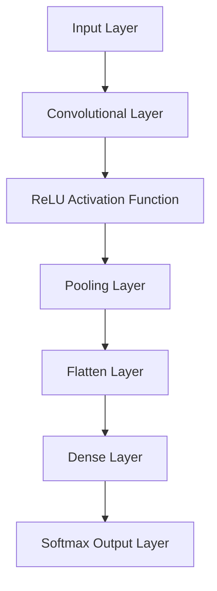

                 
# 神经网络 (Neural Network)

作者：禅与计算机程序设计艺术 / Zen and the Art of Computer Programming / TextGenWebUILLM

# 神经网络 (Neural Network)

## 1. 背景介绍

### 1.1  问题的由来

随着大数据时代的到来，人类面临的问题变得越来越复杂且多样，传统的编程方法在处理这类问题时显得力不从心。机器学习作为解决这些问题的重要手段之一，神经网络因其类比生物神经系统的工作机制而逐渐受到关注。特别是深度学习的兴起，使得神经网络在图像识别、语音识别、自然语言处理等领域取得了显著成就，推动了人工智能的快速发展。

### 1.2  研究现状

当前，神经网络的研究主要集中在以下几个方面：
- **理论基础**：神经科学的进步加深了我们对大脑信息处理方式的理解，促进了神经网络理论的发展。
- **架构创新**：提出了多种新型网络结构，如卷积神经网络（CNN）、循环神经网络（RNN）以及更复杂的 Transformer 架构。
- **优化算法**：针对大规模数据集，研究高效的训练方法，包括自适应学习率算法、分布式训练等。
- **应用拓展**：神经网络的应用范围不断扩展，涉及自动驾驶、医疗诊断、金融风控等多个领域。

### 1.3  研究意义

神经网络不仅实现了高精度的学习能力，还具有泛化能力强、可处理非线性关系等特点，这在许多实际应用中展现出巨大的价值。其发展对于提升自动化水平、改善决策效率、促进科学研究等方面有着不可忽视的作用。

### 1.4  本文结构

本文将深入探讨神经网络的核心概念及其应用，包括基本原理、关键算法、数学模型、实践经验以及未来趋势等内容。我们将从不同角度出发，旨在为读者提供一个全面理解神经网络的知识体系。

## 2. 核心概念与联系

### 2.1 人工神经元

神经网络的基础单元是**人工神经元**（Artificial Neuron），它模仿了真实神经细胞的基本功能。每个神经元接收多个输入信号，通过加权求和后经过激活函数处理产生输出，再传递给下一层的神经元或直接作为最终结果。

$$ \text{Output} = f(\sum_{i=1}^{n} w_i x_i + b) $$

其中，$w_i$ 是权重向量，$x_i$ 是输入值，$b$ 是偏置项，$f$ 是激活函数。

### 2.2 层次结构与前馈网络

神经网络通常被组织成多层结构，每一层包含多个神经元。这种结构称为前馈网络（Feedforward Neural Network）。每层之间的信息流动方向是从输入层到输出层，没有反馈连接。

网络的层数决定了它的复杂度和学习能力。例如，单层感知器只能解决线性可分问题，而多层网络则能够处理更为复杂的非线性关系。

## 3. 核心算法原理 & 具体操作步骤

### 3.1  算法原理概述

神经网络的训练目标是在输入与输出之间建立有效的映射关系，使得网络可以预测未知数据的输出。常见的训练算法有反向传播（Backpropagation）。

### 3.2  算法步骤详解

#### 训练阶段：

1. **初始化参数**：随机设置权重和偏置。
2. **正向传播**：计算输入到隐藏层再到输出层的所有节点的输出。
3. **计算损失**：使用损失函数衡量预测输出与真实标签间的差异。
4. **反向传播**：调整权重以最小化损失，即更新权重和偏置。
5. **重复迭代**：直到达到预定的迭代次数或损失收敛。

#### 预测阶段：

1. **初始化参数**：使用训练后的权重和偏置。
2. **正向传播**：根据训练好的参数进行输入到输出的计算。

### 3.3  算法优缺点

优点：
- **泛化能力**：能够处理非线性关系，并在未见过的数据上表现良好。
- **灵活性**：可以通过增加层数和神经元数量提高模型复杂度。
- **自动特征提取**：深层网络能够自动学习输入数据的抽象表示。

缺点：
- **过拟合**：当模型过于复杂时，可能会导致在训练集上的性能优秀而在测试集上的表现较差。
- **训练时间长**：尤其是深度网络需要大量的计算资源和时间进行训练。
- **解释性差**：深度神经网络往往被视为黑盒模型，难以解释其内部决策过程。

### 3.4  算法应用领域

神经网络广泛应用于：
- **图像分类**：识别图片中的对象和场景。
- **语音识别**：转录口头语言为文本。
- **自然语言处理**：翻译、情感分析、问答系统等。
- **推荐系统**：个性化内容推荐。
- **强化学习**：智能决策和控制策略学习。

## 4. 数学模型和公式 & 详细讲解 & 举例说明

### 4.1  数学模型构建

神经网络的数学模型可以用图论的方式描述，其中节点代表神经元，边代表连接关系及权重。对于简单的二分类任务，可以采用逻辑斯蒂回归（Logistic Regression）作为最简形式的神经网络模型。

### 4.2  公式推导过程

假设我们有一个简单的二分类问题，目标是基于特征$x$预测类别$y$（0或1）。逻辑斯蒂回归的目标函数可以表述为：

$$ P(y|x; w, b) = \frac{e^{wx+b}}{1+e^{wx+b}} $$

其中，$w$是权重向量，$b$是偏置项。

### 4.3 案例分析与讲解

考虑一个简单的手写数字识别问题，使用MNIST数据集。可以搭建一个简单的卷积神经网络（CNN）来实现这一任务。



在这个案例中，使用CNN可以有效地捕获图像局部特征，然后通过全连接层将这些特征整合起来进行分类。

### 4.4 常见问题解答

Q: 如何防止过拟合？
A: 可以通过添加正则化项、采用Dropout技术、增大训练集大小、使用数据增强等方式减少过拟合现象。

Q: 怎么选择合适的超参数？
A: 超参数的选择通常依赖于实验验证和交叉验证方法。通常从已知的合理范围内开始试验，通过网格搜索或随机搜索优化超参数组合。

## 5. 项目实践：代码实例和详细解释说明

### 5.1 开发环境搭建

使用Python及其科学计算库NumPy和深度学习框架TensorFlow或PyTorch进行开发。确保安装了必要的库并配置好运行环境。

```bash
pip install numpy tensorflow
```

### 5.2 源代码详细实现

以下是一个使用PyTorch构建简单神经网络的示例，用于二分类问题：

```python
import torch
from torch import nn, optim

# 定义网络结构
class SimpleNN(nn.Module):
    def __init__(self):
        super(SimpleNN, self).__init__()
        self.fc1 = nn.Linear(784, 128)
        self.relu = nn.ReLU()
        self.fc2 = nn.Linear(128, 64)
        self.output = nn.Linear(64, 1)

    def forward(self, x):
        x = self.fc1(x)
        x = self.relu(x)
        x = self.fc2(x)
        x = self.relu(x)
        output = self.output(x)
        return torch.sigmoid(output)

# 初始化模型、损失函数和优化器
model = SimpleNN()
criterion = nn.BCELoss()
optimizer = optim.SGD(model.parameters(), lr=0.01)

# 训练循环
def train_loop(dataloader, model, loss_fn, optimizer):
    size = len(dataloader.dataset)
    for batch, (X, y) in enumerate(dataloader):
        # 将输入数据转换为张量并移至GPU（如有）
        X, y = X.to(device), y.to(device)
        
        # 前向传递
        pred = model(X)
        
        # 计算损失
        loss = loss_fn(pred, y)
        
        # 后向传递
        optimizer.zero_grad()
        loss.backward()
        optimizer.step()
        
        if batch % 10 == 0:
            loss, current = loss.item(), batch * len(X)
            print(f"loss: {loss:>7f} [{current:>5d}/{size:>5d}]")

device = 'cuda' if torch.cuda.is_available() else 'cpu'
train_loop(train_dataloader, model, criterion, optimizer)
```

### 5.3 代码解读与分析

此代码定义了一个简单的全连接神经网络，包括两个隐藏层和一个输出层。网络在每批数据上执行前向传播，并根据损失函数调整权重。通过调整学习率、优化算法以及网络架构，可以进一步提升模型性能。

### 5.4 运行结果展示

训练完成后，可以通过测试集评估模型性能。显示准确率、混淆矩阵等指标有助于理解模型表现。

## 6. 实际应用场景

神经网络广泛应用于实际世界中的各种场景，如自动驾驶辅助系统利用神经网络进行道路检测和车辆定位；医疗诊断系统使用深度学习模型分析医学影像，提高疾病识别的准确性；金融风险评估通过神经网络模型对用户信用进行评估。

## 7. 工具和资源推荐

### 7.1 学习资源推荐

- **书籍**：《深度学习》(Ian Goodfellow, Yoshua Bengio & Aaron Courville)，全面介绍深度学习理论和实践。
- **在线课程**：Coursera上的“Neural Networks and Deep Learning”系列课程，由Andrew Ng教授主讲。
- **官方文档**：TensorFlow和PyTorch的官方文档提供了丰富的教程和API参考。

### 7.2 开发工具推荐

- **IDE**：PyCharm、VSCode等集成开发环境支持Python开发。
- **版本控制**：Git用于管理代码版本。
- **云服务**：AWS、Google Cloud Platform、Azure提供高性能计算资源和容器服务。

### 7.3 相关论文推荐

- **AI Papers**: 一个开源数据库，收录了大量机器学习和人工智能领域的经典论文。

### 7.4 其他资源推荐

- **GitHub Repositories**: 了解最新的研究进展和技术实现。
- **Kaggle Competitions**: 参与数据科学竞赛，实践所学知识。

## 8. 总结：未来发展趋势与挑战

### 8.1 研究成果总结

神经网络作为人工智能的核心技术之一，在解决复杂问题时展现出了巨大潜力。近年来的研究不仅在理论层面取得了突破，还推动了神经网络在各个行业中的广泛应用。

### 8.2 未来发展趋势

- **可解释性**：增强神经网络的可解释性和透明度，使其决策过程更加清晰，适用于更广泛的领域，尤其是医疗健康、法律和政策制定等领域。
- **迁移学习**：发展更为高效的迁移学习策略，使得模型能够快速适应新任务，减少数据需求。
- **动态网络**：探索自适应和动态调整参数的网络结构，以应对不断变化的数据特性。

### 8.3 面临的挑战

- **隐私保护**：在处理敏感数据时如何平衡模型性能和用户隐私保护是亟需解决的问题。
- **伦理考量**：随着神经网络在社会各方面的应用增加，相关伦理道德问题日益凸显，需要建立相应的规范和准则。

### 8.4 研究展望

未来，神经网络将在更多跨学科领域发挥重要作用，促进科学研究、技术创新和社会进步。同时，加强基础理论研究、改善模型设计和增强实用性将是持续努力的方向。

## 9. 附录：常见问题与解答

对于神经网络中常见的问题，我们整理了一些解答：

Q: 如何选择合适的网络层数？
A: 层数的选择依赖于具体任务的需求和数据特征。一般来说，较深层的网络具有更强的学习能力，但过深可能导致梯度消失或爆炸等问题。可以通过实验和交叉验证来确定最佳层数。

Q: 如何解决过拟合问题？
A: 应用正则化方法、增加数据多样性、采用Dropout、调整超参数等手段可以有效减轻过拟合现象。

Q: 如何优化神经网络的性能？
A: 通过改进网络架构、使用更先进的优化算法、调整学习率、增强数据预处理等方法可以提升模型性能。

深入理解和掌握神经网络的基础原理及其应用，将为开发者提供强大的工具来解决现实世界的复杂问题。随着技术的不断发展，神经网络将继续成为人工智能领域的重要基石，引领科技发展的新篇章。

