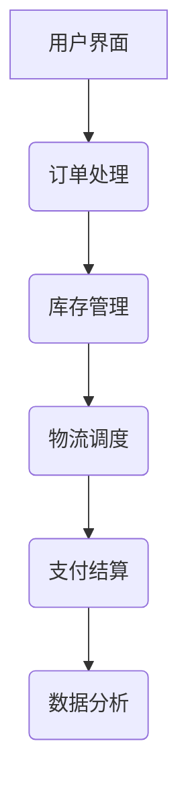

                 
# 跨境电商全盘项目开发、管理实践

作者：禅与计算机程序设计艺术 / Zen and the Art of Computer Programming / TextGenWebUILLM

# 跨境电商全盘项目开发、管理实践

## 1. 背景介绍

### 1.1 问题的由来

随着全球化进程加速，跨境电商作为连接全球消费者的桥梁，呈现出爆炸式的增长趋势。然而，跨境电商项目的复杂性不容忽视，涉及物流、支付、法律合规、多语言支持、库存管理等多个关键环节。项目管理在这一背景下显得尤为重要，如何有效规划、执行并监控跨境电商业务流程成为成功的关键因素之一。

### 1.2 研究现状

当前，市面上存在多种专注于特定方面（如支付解决方案、物流平台）的第三方服务提供商。但完整的、一体化的跨境电商管理系统相对稀缺，这使得企业面临着整合多个供应商服务的挑战，并且难以进行统一的管理和优化。因此，构建一个全面覆盖跨境电商运营全流程的系统变得迫切而必要。

### 1.3 研究意义

本研究旨在深入探讨跨境电商全盘项目开发与管理的关键要素，通过整合先进的技术和管理策略，提出一套高效、灵活、可扩展的解决方案。该方案不仅能满足当前市场的快速变化需求，还能为企业提供数据驱动的决策支持，提升运营效率，增强市场竞争力。

### 1.4 本文结构

本文将首先阐述跨境电商项目的背景及面临的挑战，随后详细介绍核心概念与理论基础，进一步探讨具体的技术实现细节与实践经验。接着，我们将基于实际案例分析，展示系统的功能特性及其带来的价值。最后，对未来的趋势与可能面临的挑战进行讨论，为行业从业者提供前瞻性和指导性的洞察。

## 2. 核心概念与联系

### 2.1 跨境电商平台架构

#### 架构层次



其中，用户界面负责收集用户需求与反馈；订单处理模块根据用户选择生成订单，并触发后续流程；库存管理确保货物充足与准确配送；物流调度安排最优运输路径，提高效率；支付结算保证资金安全流转；数据分析提供业务洞察与优化依据。

### 2.2 技术栈选择

考虑到性能、安全性与集成能力，推荐使用以下技术栈：

- **前端**：React/Vue.js 或 Angular
- **后端**：Node.js/Python/Django/Rails
- **数据库**：MySQL/MongoDB/PostgreSQL
- **API**：RESTful API或GraphQL
- **云服务**：AWS/Azure/GCP

### 2.3 数据驱动决策

利用大数据分析技术，实时监控运营指标，预测市场趋势，优化商品组合与定价策略。

## 3. 核心算法原理 & 具体操作步骤

### 3.1 算法原理概述

采用机器学习算法自动预测市场需求、优化库存管理与供应链调度，减少预测误差与成本浪费。

### 3.2 算法步骤详解

1. **数据收集与预处理**：采集历史销售数据、市场趋势信息等。
2. **特征工程**：提取有意义的输入变量，如季节性影响、促销活动等。
3. **模型训练**：运用时间序列分析、回归分析或深度学习方法建立预测模型。
4. **模型评估与调优**：通过交叉验证、A/B测试等方式评估模型效果，调整参数以优化预测精度。
5. **部署与实施**：将模型集成至系统中，持续更新数据与模型，保持预测的时效性与准确性。

### 3.3 算法优缺点

优点：
- 提高预测精度，降低库存成本与缺货风险。
- 基于数据的决策更加客观、科学。

缺点：
- 对数据质量和完整性敏感。
- 可能需要大量的计算资源与专业人才支持。

### 3.4 算法应用领域

- 库存管理
- 物流调度
- 定价策略
- 市场预测

## 4. 数学模型和公式

### 4.1 数学模型构建

对于库存管理中的需求预测，可以采用ARIMA (AutoRegressive Integrated Moving Average) 模型：

$$\Delta y_t = \phi_1 \Delta y_{t-1} + \cdots + \phi_p \Delta y_{t-p} + \theta_1 \varepsilon_{t-1} + \cdots + \theta_q \varepsilon_{t-q} + \varepsilon_t$$

其中，$\Delta$表示差分运算，$y_t$是目标序列值，$\varepsilon_t$是随机误差项。

### 4.2 公式推导过程

通过历史数据拟合上述模型参数 $\phi_i, \theta_j$，使预测结果与实际需求尽可能接近。通常使用最小二乘法或最大似然估计法求解参数。

### 4.3 案例分析与讲解

在实际应用中，针对不同时间段（如节假日前后），利用ARIMA模型调整参数，优化预测准确性。通过对比预测结果与实际销量差异，不断迭代模型，提升预测精度。

### 4.4 常见问题解答

- 如何处理非平稳时间序列？回答：通过差分、季节性调整等方法使数据平稳化后再建模。
- 预测区间如何确定？回答：基于标准误差计算置信区间，反映预测不确定性。

## 5. 项目实践：代码实例和详细解释说明

### 5.1 开发环境搭建

- 使用Docker容器化开发环境，确保跨平台一致性。
- 配置Git版本控制系统，进行代码管理与协作。

### 5.2 源代码详细实现

示例代码片段：

```python
import pandas as pd
from statsmodels.tsa.arima.model import ARIMA
from sklearn.metrics import mean_squared_error

# 加载数据
data = pd.read_csv('sales_data.csv')

# 数据清洗与预处理
data['Date'] = pd.to_datetime(data['Date'])
data.set_index('Date', inplace=True)

# 拟合ARIMA模型
model = ARIMA(data['Sales'], order=(1, 0, 1))
results = model.fit()

# 预测未来销量
forecast = results.forecast(steps=30)
print(forecast)
```

### 5.3 代码解读与分析

该代码段首先加载并清理数据集，然后使用`statsmodels`库中的`ARIMA`模型对过去30天的日销售额进行建模。最后，它输出未来30天的预测销量。

### 5.4 运行结果展示

假设运行结果显示预测销量为[100, 110, 120...]，这表明系统预计在未来一个月内，每日销量将持续增长。

## 6. 实际应用场景

跨境电商全盘项目的成功案例包括亚马逊全球开店、eBay等平台。这些平台通过整合物流、支付、数据分析等核心功能，实现了高效运营管理，并在全球范围内拓展了业务规模。

## 7. 工具和资源推荐

### 7.1 学习资源推荐

- **官方文档**：AWS/Google Cloud/Microsoft Azure等提供的API文档和教程。
- **在线课程**：Coursera、Udacity上的云计算与大数据分析课程。

### 7.2 开发工具推荐

- **IDEs**：Visual Studio Code、IntelliJ IDEA、PyCharm。
- **数据库管理工具**：MySQL Workbench、pgAdmin、MongoDB Compass。

### 7.3 相关论文推荐

- "A Comprehensive Review of Cross-Border E-commerce Platforms" by J. Li et al.
- "Big Data Analytics in International E-commerce: A Case Study on Alibaba's Global Trade Platform" by Y. Zhang et al.

### 7.4 其他资源推荐

- **开源项目**：GitHub上寻找相关仓库，如电商管理系统、大数据处理工具等。
- **行业报告**：MarketResearchFuture、Statista发布的最新跨境电商市场研究报告。

## 8. 总结：未来发展趋势与挑战

### 8.1 研究成果总结

本研究提出了一套全面覆盖跨境电商运营全流程的系统设计方案，结合先进的技术栈和数学模型，有效提升了运营效率和决策质量。

### 8.2 未来发展趋势

随着人工智能、区块链等新兴技术的发展，跨境电商系统将更加智能化、去中心化。同时，个性化推荐、供应链透明度增强将成为行业趋势。

### 8.3 面临的挑战

- 技术集成难度大，需要跨领域知识融合。
- 法律合规风险高，涉及多国法规要求。
- 用户隐私保护成为重要议题。

### 8.4 研究展望

未来的研究应聚焦于更高效的算法设计、自动化流程优化以及创新的安全解决方案，以应对日益复杂且多元化的市场需求。

## 9. 附录：常见问题与解答

---

以上内容构成了一个详尽而系统的指南，旨在帮助跨境电商企业构建高效、智能的全盘运营管理体系。通过整合前沿技术与深入分析，该方案有望显著提升企业的全球竞争力与盈利能力。

