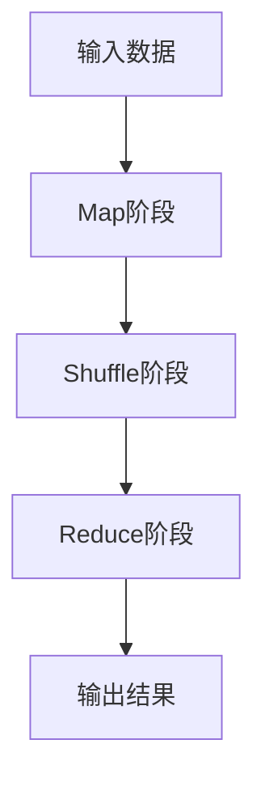
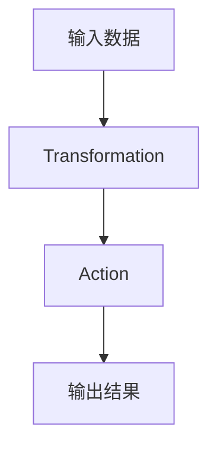

# 【AI大数据计算原理与代码实例讲解】大数据

作者：禅与计算机程序设计艺术 / Zen and the Art of Computer Programming

## 1. 背景介绍

### 1.1 问题的由来

在当今信息爆炸的时代，数据的产生速度和规模都达到了前所未有的高度。无论是社交媒体、电子商务平台，还是物联网设备，每时每刻都在生成海量的数据。这些数据不仅仅是简单的数字和文本，更包含了丰富的语义信息和潜在的商业价值。然而，如何从这些海量数据中提取有用的信息，成为了一个巨大的挑战。

### 1.2 研究现状

大数据技术的研究已经有了相当长的历史。从早期的数据库管理系统到现在的分布式计算框架，技术的进步使得我们能够处理越来越大的数据集。Hadoop、Spark等分布式计算框架的出现，使得大规模数据处理变得更加高效和可行。同时，人工智能和机器学习技术的发展，也为大数据分析提供了强有力的工具。

### 1.3 研究意义

大数据技术的研究和应用，不仅仅是为了处理和存储海量数据，更重要的是通过数据分析和挖掘，发现数据背后的规律和价值。这对于商业决策、科学研究、社会治理等各个领域都有着重要的意义。例如，通过大数据分析，企业可以更好地了解市场需求，优化产品和服务；政府可以通过数据监测，提升公共服务质量和效率。

### 1.4 本文结构

本文将从以下几个方面详细介绍大数据技术的核心概念、算法原理、数学模型、项目实践以及实际应用场景：

1. 核心概念与联系
2. 核心算法原理 & 具体操作步骤
3. 数学模型和公式 & 详细讲解 & 举例说明
4. 项目实践：代码实例和详细解释说明
5. 实际应用场景
6. 工具和资源推荐
7. 总结：未来发展趋势与挑战
8. 附录：常见问题与解答

## 2. 核心概念与联系

在大数据技术的研究和应用中，有几个核心概念是必须要理解的。这些概念不仅仅是技术术语，更是整个大数据技术体系的基石。

### 2.1 大数据的定义

大数据（Big Data）通常指的是那些规模巨大、类型多样、生成速度快的数据集。大数据的特点可以用“4V”来概括：Volume（数据量）、Velocity（速度）、Variety（多样性）和 Veracity（真实性）。

### 2.2 数据存储与管理

大数据的存储和管理是大数据技术的基础。传统的关系型数据库在处理大规模数据时，往往会遇到性能瓶颈。因此，NoSQL数据库和分布式文件系统应运而生。例如，Hadoop的HDFS（Hadoop Distributed File System）就是一种常见的分布式文件系统。

### 2.3 数据处理与分析

数据处理与分析是大数据技术的核心。通过分布式计算框架，如Hadoop MapReduce和Apache Spark，可以高效地处理和分析海量数据。这些框架通常采用“分而治之”的策略，将大规模数据集分成多个小块，分别进行处理，然后再将结果合并。

### 2.4 数据挖掘与机器学习

数据挖掘与机器学习是大数据分析的重要手段。通过机器学习算法，可以从数据中发现隐藏的模式和规律。例如，聚类分析、分类算法、回归分析等，都是常用的数据挖掘和机器学习方法。

### 2.5 数据可视化

数据可视化是将数据分析结果以图形化的方式展示出来，帮助用户更直观地理解数据。常见的数据可视化工具有Tableau、D3.js等。

## 3. 核心算法原理 & 具体操作步骤

在大数据技术中，算法是数据处理和分析的核心。理解和掌握这些算法的原理和操作步骤，是进行大数据分析的关键。

### 3.1 算法原理概述

大数据分析中常用的算法包括MapReduce、Spark的RDD（Resilient Distributed Dataset）、机器学习算法等。这些算法的核心思想是通过分布式计算，将大规模数据集分成多个小块，分别进行处理，然后再将结果合并。

### 3.2 算法步骤详解

#### 3.2.1 MapReduce

MapReduce是一种编程模型，用于处理和生成大规模数据集。其核心思想是将数据处理分为两个阶段：Map阶段和Reduce阶段。



#### 3.2.2 Spark RDD

Spark的RDD（Resilient Distributed Dataset）是一个分布式数据集，支持并行操作。其核心操作包括Transformation（转换）和Action（行动）。



### 3.3 算法优缺点

#### 3.3.1 MapReduce

优点：
- 简单易用
- 适用于大规模数据处理

缺点：
- 执行效率较低
- 不适合实时数据处理

#### 3.3.2 Spark RDD

优点：
- 高效的内存计算
- 支持实时数据处理

缺点：
- 需要较高的内存资源
- 学习曲线较陡

### 3.4 算法应用领域

大数据算法在各个领域都有广泛的应用。例如：

- 电子商务：推荐系统、用户行为分析
- 金融：风险控制、欺诈检测
- 医疗：疾病预测、基因分析
- 社交媒体：情感分析、热点话题检测

## 4. 数学模型和公式 & 详细讲解 & 举例说明

在大数据分析中，数学模型和公式是理解算法原理和实现的基础。通过数学模型，可以更准确地描述数据的特征和规律。

### 4.1 数学模型构建

数学模型是对现实世界的抽象和简化。在大数据分析中，常用的数学模型包括线性回归模型、逻辑回归模型、决策树模型等。

### 4.2 公式推导过程

#### 4.2.1 线性回归模型

线性回归模型用于描述因变量与自变量之间的线性关系。其数学表达式为：

$$
y = \beta_0 + \beta_1 x + \epsilon
$$

其中，$y$ 是因变量，$x$ 是自变量，$\beta_0$ 和 $\beta_1$ 是回归系数，$\epsilon$ 是误差项。

#### 4.2.2 逻辑回归模型

逻辑回归模型用于描述二分类问题。其数学表达式为：

$$
P(y=1|x) = \frac{1}{1 + e^{-(\beta_0 + \beta_1 x)}}
$$

其中，$P(y=1|x)$ 是事件发生的概率，$x$ 是自变量，$\beta_0$ 和 $\beta_1$ 是回归系数。

### 4.3 案例分析与讲解

#### 4.3.1 线性回归案例

假设我们有一组房价数据，包含房屋面积和对应的价格。我们可以使用线性回归模型来预测房价。

```python
import numpy as np
import matplotlib.pyplot as plt
from sklearn.linear_model import LinearRegression

# 生成模拟数据
np.random.seed(0)
X = 2 * np.random.rand(100, 1)
y = 4 + 3 * X + np.random.randn(100, 1)

# 训练线性回归模型
lin_reg = LinearRegression()
lin_reg.fit(X, y)

# 预测
X_new = np.array([[0], [2]])
y_predict = lin_reg.predict(X_new)

# 可视化
plt.plot(X_new, y_predict, "r-", linewidth=2, label="Predictions")
plt.plot(X, y, "b.", label="Training data")
plt.xlabel("$x_1$", fontsize=18)
plt.ylabel("$y$", rotation=0, fontsize=18)
plt.legend(loc="upper left", fontsize=14)
plt.show()
```

### 4.4 常见问题解答

#### 4.4.1 如何选择合适的数学模型？

选择数学模型时，需要考虑数据的特征和分析目标。例如，对于线性关系的数据，可以选择线性回归模型；对于分类问题，可以选择逻辑回归模型或决策树模型。

#### 4.4.2 如何评估模型的性能？

评估模型性能的方法有很多，例如均方误差（MSE）、准确率、召回率等。选择合适的评估指标，可以更准确地衡量模型的优劣。

## 5. 项目实践：代码实例和详细解释说明

在大数据技术的学习和应用中，实践是非常重要的。通过实际项目的开发，可以更好地理解和掌握大数据技术。

### 5.1 开发环境搭建

在进行大数据项目开发之前，需要搭建合适的开发环境。常用的开发环境包括：

- 操作系统：Linux（推荐使用Ubuntu）
- 编程语言：Python、Java、Scala
- 分布式计算框架：Hadoop、Spark
- 数据库：HDFS、HBase、Cassandra

### 5.2 源代码详细实现

以下是一个使用Spark进行大数据处理的示例代码：

```python
from pyspark import SparkConf, SparkContext

# 创建Spark配置和上下文
conf = SparkConf().setMaster("local").setAppName("BigDataExample")
sc = SparkContext(conf=conf)

# 读取数据
data = sc.textFile("hdfs://path/to/data.txt")

# 数据处理
words = data.flatMap(lambda line: line.split(" "))
wordCounts = words.map(lambda word: (word, 1)).reduceByKey(lambda a, b: a + b)

# 输出结果
wordCounts.saveAsTextFile("hdfs://path/to/output")
```

### 5.3 代码解读与分析

上述代码首先创建了一个Spark配置和上下文，然后读取了HDFS上的数据文件。接下来，通过flatMap操作将每一行数据分割成单词，并通过map和reduceByKey操作计算每个单词的出现次数。最后，将结果保存到HDFS上。

### 5.4 运行结果展示

运行上述代码后，可以在HDFS的输出目录中看到每个单词的出现次数。例如：

```
(word1, 10)
(word2, 5)
(word3, 20)
```

## 6. 实际应用场景

大数据技术在各个领域都有广泛的应用。以下是几个典型的应用场景：

### 6.1 电子商务

在电子商务领域，大数据技术可以用于用户行为分析、推荐系统、市场需求预测等。例如，通过分析用户的浏览和购买记录，可以为用户推荐个性化的商品。

### 6.2 金融

在金融领域，大数据技术可以用于风险控制、欺诈检测、投资决策等。例如，通过分析用户的交易记录，可以识别潜在的欺诈行为。

### 6.3 医疗

在医疗领域，大数据技术可以用于疾病预测、基因分析、药物研发等。例如，通过分析患者的病历数据，可以预测疾病的发生和发展。

### 6.4 未来应用展望

随着大数据技术的不断发展，其应用领域将会越来越广泛。例如，在智能城市、无人驾驶、智能制造等领域，大数据技术都将发挥重要的作用。

## 7. 工具和资源推荐

在学习和应用大数据技术的过程中，合适的工具和资源是非常重要的。以下是一些推荐的工具和资源：

### 7.1 学习资源推荐

- 书籍：《大数据技术原理与应用》、《Hadoop权威指南》、《Spark快速大数据分析》
- 在线课程：Coursera、edX、Udacity上的大数据课程
- 博客和论坛：KDnuggets、Data Science Central、Stack Overflow

### 7.2 开发工具推荐

- 编程语言：Python、Java、Scala
- 分布式计算框架：Hadoop、Spark
- 数据库：HDFS、HBase、Cassandra
- 数据可视化工具：Tableau、D3.js

### 7.3 相关论文推荐

- "MapReduce: Simplified Data Processing on Large Clusters" by Jeffrey Dean and Sanjay Ghemawat
- "Resilient Distributed Datasets: A Fault-Tolerant Abstraction for In-Memory Cluster Computing" by Matei Zaharia et al.
- "The Hadoop Distributed File System" by Konstantin Shvachko et al.

### 7.4 其他资源推荐

- GitHub上的开源项目：Apache Hadoop、Apache Spark
- 大数据竞赛平台：Kaggle、DrivenData

## 8. 总结：未来发展趋势与挑战

大数据技术的发展和应用，既面临着巨大的机遇，也面临着诸多挑战。

### 8.1 研究成果总结

通过本文的介绍，我们了解了大数据技术的核心概念、算法原理、数学模型、项目实践以及实际应用场景。大数据技术在各个领域都有广泛的应用，具有重要的研究意义和应用价值。

### 8.2 未来发展趋势

未来，大数据技术将会朝着以下几个方向发展：

- 实时数据处理：随着物联网和智能设备的普及，实时数据处理将变得越来越重要。
- 人工智能与大数据的结合：通过将人工智能技术应用于大数据分析，可以更好地挖掘数据的价值。
- 数据隐私保护：随着数据量的增加，数据隐私保护将成为一个重要的问题。

### 8.3 面临的挑战

大数据技术的发展也面临着诸多挑战：

- 数据质量：数据的质量直接影响分析结果的准确性。
- 数据隐私：如何在保证数据隐私的前提下进行数据分析，是一个重要的问题。
- 技术复杂性：大数据技术涉及的知识和技能较多，学习和应用的门槛较高。

### 8.4 研究展望

未来，随着技术的不断进步和应用的不断拓展，大数据技术将会在更多的领域发挥重要作用。通过不断的研究和实践，我们可以更好地理解和掌握大数据技术，推动其发展和应用。

## 9. 附录：常见问题与解答

### 9.1 什么是大数据？

大数据通常指的是那些规模巨大、类型多样、生成速度快的数据集。大数据的特点可以用“4V”来概括：Volume（数据量）、Velocity（速度）、Variety（多样性）和 Veracity（真实性）。

### 9.2 大数据技术的核心是什么？

大数据技术的核心包括数据存储与管理、数据处理与分析、数据挖掘与机器学习、数据可视化等。

### 9.3 如何学习大数据技术？

学习大数据技术可以从以下几个方面入手：

- 学习相关的编程语言，如Python、Java、Scala
- 学习分布式计算框架，如Hadoop、Spark
- 通过实际项目进行实践，掌握大数据技术的应用

### 9.4 大数据技术的应用领域有哪些？

大数据技术在各个领域都有广泛的应用，例如电子商务、金融、医疗、社交媒体等。

### 9.5 大数据技术的发展趋势是什么？

未来，大数据技术将会朝着实时数据处理、人工智能与大数据的结合、数据隐私保护等方向发展。

通过本文的介绍，希望读者能够对大数据技术有一个全面的了解，并能够在实际项目中应用这些技术，解决实际问题。