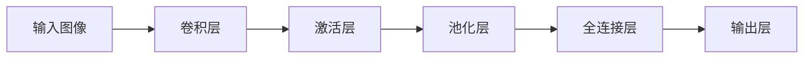

## 1. 背景介绍

### 1.1 问题的由来

在计算机视觉领域，图像识别一直是一个重要的研究课题。传统的图像识别方法，如基于特征的方法，虽然在一些场景下表现良好，但在处理复杂、大规模的图像数据时，往往效果不佳。这是因为这些方法往往需要人工设计和选择特征，而这些特征可能并不能很好地捕捉到图像的复杂性和多样性。因此，如何自动、有效地从图像中提取特征，成为了图像识别领域的一个重要问题。

### 1.2 研究现状

为了解决这个问题，研究者们提出了卷积神经网络（Convolutional Neural Network，简称CNN）。CNN是一种深度学习模型，它能够自动从图像中学习和提取特征，从而大大提高了图像识别的效果。自从1998年LeCun等人首次提出CNN以来，CNN已经在图像识别、语音识别、自然语言处理等多个领域取得了显著的成果。

### 1.3 研究意义

CNN的出现，不仅在理论上推动了深度学习的发展，也在实践中极大地推动了计算机视觉的应用。例如，现在的人脸识别、自动驾驶、医疗图像分析等技术，都离不开CNN的支持。因此，深入理解CNN的原理，并掌握其实践方法，对于计算机视觉和深度学习的研究者和工程师来说，具有重要的意义。

### 1.4 本文结构

本文将首先介绍CNN的核心概念和联系，然后详细解释CNN的算法原理和操作步骤，接着通过数学模型和公式进行深入讲解，并通过实例进行说明。然后，本文将通过一个实际的项目实践，展示如何使用CNN进行图像识别。最后，本文将探讨CNN的实际应用场景，推荐相关的工具和资源，并对CNN的未来发展趋势和挑战进行展望。

## 2. 核心概念与联系

在深入理解CNN之前，我们首先需要了解一些核心的概念和联系。

- **卷积（Convolution）**：卷积是CNN的核心操作，它是一种数学运算，用于从输入数据中提取特征。在CNN中，我们通常使用一些小的、可学习的滤波器（或称为卷积核）对输入数据进行卷积操作，从而得到一些特征图（Feature Map）。

- **池化（Pooling）**：池化是一种降采样操作，用于减少特征图的尺寸，从而减少计算量，同时也能增强模型的鲁棒性。常见的池化操作有最大池化（Max Pooling）和平均池化（Average Pooling）。

- **全连接（Fully Connected）**：全连接层是CNN的最后一层，它将前面的特征图展平（Flatten），然后通过全连接操作，输出最终的分类结果。

- **激活函数（Activation Function）**：激活函数用于增加模型的非线性，从而使模型能够学习更复杂的函数。常见的激活函数有ReLU、Sigmoid、Tanh等。

- **反向传播（Backpropagation）**：反向传播是一种高效的参数更新算法，它通过计算损失函数对参数的梯度，然后按照梯度的反方向更新参数，从而最小化损失函数。

- **优化器（Optimizer）**：优化器用于执行反向传播算法，常见的优化器有SGD、Adam、RMSprop等。

下面是一个典型的CNN的结构图：



## 3. 核心算法原理 & 具体操作步骤

### 3.1 算法原理概述

CNN的基本思想是通过一系列的卷积层、池化层和全连接层，从输入图像中自动学习和提取特征，然后进行分类。下面我们将详细解释这个过程。

### 3.2 算法步骤详解

1. **卷积层**：卷积层是CNN的核心，它使用一些可学习的滤波器对输入数据进行卷积操作，从而提取特征。每个滤波器都会生成一个特征图，特征图的每个元素都是滤波器在对应位置的卷积结果。卷积操作可以看作是滤波器在输入数据上滑动，每滑动到一个位置，就计算滤波器和该位置的输入数据的点积，得到特征图的一个元素。

2. **激活层**：激活层用于增加模型的非线性。在CNN中，我们通常在卷积层后面加一个激活层，使用非线性的激活函数，如ReLU，对特征图进行非线性变换。

3. **池化层**：池化层用于降采样，减少特征图的尺寸，从而减少计算量，同时也能增强模型的鲁棒性。常见的池化操作有最大池化和平均池化。

4. **全连接层**：全连接层是CNN的最后一层，它将前面的特征图展平，然后通过全连接操作，输出最终的分类结果。全连接层的参数通常通过反向传播算法进行学习。

5. **反向传播和参数更新**：在训练过程中，我们首先通过前向传播计算出模型的输出，然后计算出输出和真实标签之间的误差，这个误差就是损失函数。然后，我们通过反向传播算法，计算出损失函数对每个参数的梯度，然后按照梯度的反方向更新参数，从而最小化损失函数。

### 3.3 算法优缺点

CNN的优点主要有以下几点：

- **自动特征提取**：CNN能够自动从输入数据中学习和提取特征，无需人工设计和选择特征，这大大简化了图像识别的过程。

- **局部感知和参数共享**：CNN的卷积操作具有局部感知和参数共享的特性，这使得CNN能够有效地处理图像数据，同时也大大减少了模型的参数数量。

- **鲁棒性**：由于池化层的存在，CNN具有一定的平移不变性，即即使输入图像发生了平移，CNN也能够正确地识别出图像中的对象。

然而，CNN也有一些缺点：

- **计算量大**：尽管CNN通过参数共享和池化操作减少了参数数量，但由于卷积操作的复杂性，CNN的计算量仍然很大，特别是对于大规模的图像数据。

- **超参数多**：CNN的结构（如卷积核的大小和数量、池化方式等）需要人工设定，这些超参数的选择对模型的性能有很大影响，但往往需要大量的实验才能找到最优的设置。

- **解释性差**：虽然CNN能够自动提取特征，但这些特征往往难以解释，这使得CNN的结果往往缺乏解释性。

### 3.4 算法应用领域

CNN在许多领域都有广泛的应用，包括但不限于：

- **图像识别**：CNN是当前最主流的图像识别算法，它在许多图像识别任务中都取得了最好的效果，如ImageNet大规模视觉识别挑战赛（ILSVRC）。

- **视频分析**：CNN也可以用于视频分析，例如，通过将视频帧作为输入，CNN可以用于行人检测、行为识别等任务。

- **自然语言处理**：虽然CNN最初是为图像识别设计的，但它也可以用于自然语言处理。例如，通过将文本转化为词向量，然后将词向量组织成类似于图像的结构，CNN可以用于文本分类、情感分析等任务。

- **语音识别**：CNN也可以用于语音识别。例如，通过将语音信号转化为频谱图，然后将频谱图作为输入，CNN可以用于语音识别、音乐分类等任务。

## 4. 数学模型和公式 & 详细讲解 & 举例说明

### 4.1 数学模型构建

在深入理解CNN的工作原理之前，我们需要先了解一些基本的数学模型和公式。在这一部分，我们将介绍卷积操作、激活函数、池化操作和全连接操作的数学模型。

1. **卷积操作**：假设我们有一个输入图像$I$和一个滤波器$F$，它们的尺寸分别为$m \times n$和$k \times k$，那么卷积操作可以表示为：

$$
(C * F)[i, j] = \sum_{u=0}^{k-1} \sum_{v=0}^{k-1} I[i+u, j+v] \cdot F[u, v]
$$

其中，$*$表示卷积操作，$[i, j]$表示位置，$\cdot$表示点积。

2. **激活函数**：激活函数用于增加模型的非线性。常见的激活函数有ReLU、Sigmoid、Tanh等。例如，ReLU函数可以表示为：

$$
ReLU(x) = max(0, x)
$$

3. **池化操作**：池化操作用于降采样，减少特征图的尺寸。常见的池化操作有最大池化和平均池化。例如，最大池化可以表示为：

$$
MaxPooling(I)[i, j] = max(I[i:i+k, j:j+k])
$$

其中，$max$表示取最大值，$[i:i+k, j:j+k]$表示一个$k \times k$的窗口。

4. **全连接操作**：全连接操作是CNN的最后一层，它将前面的特征图展平，然后通过全连接操作，输出最终的分类结果。全连接操作可以表示为：

$$
FC(I, W, b) = W \cdot I + b
$$

其中，$W$和$b$分别表示权重和偏置，$\cdot$表示点积。

### 4.2 公式推导过程

在这一部分，我们将详细解释上述公式的推导过程。

1. **卷积操作**：卷积操作的公式是通过滤波器在输入图像上滑动，每滑动到一个位置，就计算滤波器和该位置的输入图像的点积，得到特征图的一个元素。这个过程可以表示为：

$$
(C * F)[i, j] = \sum_{u=0}^{k-1} \sum_{v=0}^{k-1} I[i+u, j+v] \cdot F[u, v]
$$

这个公式的含义是，特征图的每个元素都是滤波器和对应位置的输入图像的点积。

2. **激活函数**：激活函数的公式是通过对特征图的每个元素应用非线性函数得到的。例如，ReLU函数的公式是：

$$
ReLU(x) = max(0, x)
$$

这个公式的含义是，如果输入$x$大于0，那么输出$x$，否则输出0。

3. **池化操作**：池化操作的公式是通过在特征图上滑动一个窗口，每滑动到一个位置，就计算窗口内的最大值（或平均值），得到池化后的特征图的一个元素。例如，最大池化的公式是：

$$
MaxPooling(I)[i, j] = max(I[i:i+k, j:j+k])
$$

这个公式的含义是，池化后的特征图的每个元素都是窗口内的最大值。

4. **全连接操作**：全连接操作的公式是通过将特征图展平，然后与权重做点积，再加上偏置，得到最终的输出。这个过程可以表示为：

$$
FC(I, W, b) = W \cdot I + b
$$

这个公式的含义是，全连接层的输出是权重和展平后的特征图的点积，再加上偏置。

### 4.3 案例分析与讲解

为了更好地理解CNN的工作原理，我们来看一个具体的例子。

假设我们有一个$5 \times 5$的输入图像和一个$3 \times 3$的滤波器，如下所示：

```
输入图像：
1 1 1 0 0
0 1 1 1 0
0 0 1 1 1
0 0 1 1 0
0 1 1 0 0

滤波器：
1 0 1
0 1 0
1 0 1
```

我们首先进行卷积操作，得到一个$3 \times 3$的特征图：

```
特征图：
4 3 4
2 4 3
2 3 4
```

然后，我们对特征图应用ReLU激活函数，得到：

```
ReLU特征图：
4 3 4
2 4 3
2 3 4
```

接着，我们进行最大池化操作，得到一个$2 \times 2$的特征图：

```
最大池化特征图：
4 4
2 4
```

最后，我们将特征图展平，然后通过全连接操作，得到最终的输出：

```
全连接输出：
[4, 4, 2, 4] * W + b
```

其中，$W$和$b$是全连接层的参数，需要通过反向传播算法进行学习。

### 4.4 常见