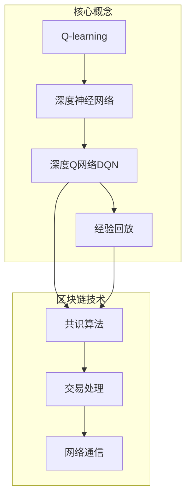

# 深度 Q-learning：在区块链技术中的应用

## 1. 背景介绍

### 1.1 问题的由来

区块链技术自比特币问世以来，备受关注和追捧。它通过去中心化的分布式账本和共识机制，为构建可信赖的分布式系统提供了新的解决方案。然而，区块链系统面临着一些挑战，例如交易吞吐量低、延迟高、可扩展性差等问题。这些问题的根源在于区块链系统中节点之间的协作和决策过程。传统的共识算法往往依赖于固定的规则和参数,难以适应复杂动态环境的变化。

### 1.2 研究现状

为了解决上述问题,研究人员开始探索将强化学习(Reinforcement Learning)技术应用于区块链系统中。强化学习是一种基于环境交互的机器学习范式,通过试错和奖惩机制,智能体可以学习获取最优策略。其中,Q-learning是强化学习中最著名和广泛使用的算法之一。然而,传统的Q-learning算法在处理大规模、高维度的问题时,会遇到"维数灾难"(Curse of Dimensionality)的困境。

### 1.3 研究意义

深度Q-learning(Deep Q-Network, DQN)通过将深度神经网络引入Q-learning,成功解决了维数灾难问题,使得强化学习可以应用于更加复杂的决策过程。将DQN应用于区块链系统,可以使节点通过与环境的交互来自主学习最优决策策略,从而提高系统的性能和可扩展性。此外,DQN还可以帮助区块链系统适应动态变化的环境,提高系统的鲁棒性和自适应能力。

### 1.4 本文结构

本文将首先介绍深度Q-learning的核心概念和原理,包括Q-learning算法、深度神经网络、经验回放等。然后详细阐述深度Q-learning在区块链技术中的应用,包括数学模型、算法流程、项目实践等。最后,探讨深度Q-learning在区块链领域的实际应用场景,并对未来的发展趋势和挑战进行展望。

## 2. 核心概念与联系

深度Q-learning(Deep Q-Network, DQN)是强化学习和深度学习的结合,它将Q-learning算法与深度神经网络相结合,用于解决大规模、高维度的决策问题。

- **Q-learning**是一种基于时间差分(Temporal Difference)的强化学习算法,通过不断更新状态-行为值函数(Q函数)来获取最优策略。
- **深度神经网络**则用于近似和表示高维度的Q函数,解决维数灾难问题。
- **深度Q网络(DQN)**将Q函数用深度神经网络来表示和近似,使得强化学习可以应用于更加复杂的决策过程。
- **经验回放(Experience Replay)**是DQN的一个关键技术,通过存储过去的经验数据,减少数据相关性,提高数据利用效率。

在区块链技术中,节点之间需要通过共识算法来协作处理交易、维护分布式账本。传统的共识算法往往使用固定的规则和参数,难以适应复杂动态环境的变化。通过将深度Q-learning应用于区块链系统,节点可以根据当前环境状态,自主学习最优的交易处理和网络通信策略,从而提高系统的性能、可扩展性和鲁棒性。

## 3. 核心算法原理 & 具体操作步骤

### 3.1 算法原理概述

深度Q-learning算法的核心思想是使用深度神经网络来近似Q函数,从而解决传统Q-learning算法在高维状态空间下的维数灾难问题。算法的基本流程如下:

1. 初始化深度神经网络,用于近似Q函数。
2. 在环境中与智能体进行交互,获取状态、行为和奖励信息。
3. 将获得的经验存储在经验回放池中。
4. 从经验回放池中采样一批数据,作为神经网络的输入。
5. 使用神经网络计算目标Q值和当前Q值,计算损失函数。
6. 通过反向传播算法,更新神经网络的权重参数。
7. 重复步骤2-6,直到收敛或达到预设条件。

### 3.2 算法步骤详解

1. **初始化**
   - 初始化深度神经网络,用于近似Q函数。
   - 初始化经验回放池,用于存储状态、行为、奖励和下一状态的经验数据。
   - 设置超参数,如学习率、折扣因子、探索率等。

2. **与环境交互**
   - 根据当前状态和探索策略(如$\epsilon$-贪婪策略)选择行为。
   - 在环境中执行选择的行为,获取奖励和下一状态。
   - 将(状态、行为、奖励、下一状态)的经验数据存储到经验回放池中。

3. **采样数据**
   - 从经验回放池中随机采样一批数据,作为神经网络的输入。

4. **计算目标Q值和当前Q值**
   - 使用神经网络计算当前Q值:$Q(s,a;\theta)$,其中$\theta$为神经网络的权重参数。
   - 计算目标Q值:$$y = r + \gamma \max_{a'}Q(s',a';\theta^-)$$
     其中$r$为奖励,$\gamma$为折扣因子,$\theta^-$为目标网络的权重参数(固定或缓慢更新)。

5. **计算损失函数**
   - 计算目标Q值与当前Q值之间的均方误差损失函数:$$L = \mathbb{E}\left[(y - Q(s,a;\theta))^2\right]$$

6. **更新神经网络参数**
   - 使用反向传播算法,根据损失函数的梯度更新神经网络的权重参数$\theta$。

7. **重复迭代**
   - 重复步骤2-6,直到算法收敛或达到预设条件。

### 3.3 算法优缺点

**优点:**

- 通过深度神经网络近似Q函数,解决了传统Q-learning算法在高维状态空间下的维数灾难问题。
- 经验回放技术可以减少数据相关性,提高数据利用效率。
- 可以处理连续状态和行为空间,具有更强的泛化能力。
- 通过探索和利用的权衡,可以在exploitation和exploration之间达到平衡。

**缺点:**

- 训练过程复杂,需要大量的计算资源和训练数据。
- 算法的性能高度依赖于神经网络的结构和超参数设置。
- 存在潜在的不稳定性和发散风险,需要采取一些技术(如目标网络、双重Q-learning等)来缓解。
- 在连续控制任务中,可能存在发散或振荡的问题。

### 3.4 算法应用领域

深度Q-learning算法可以应用于各种决策和控制领域,包括但不限于:

- 游戏AI: 如AlphaGo、Atari游戏等。
- 机器人控制: 如机器人路径规划、操作等。
- 自动驾驶: 如车辆决策和控制系统。
- 资源管理: 如数据中心资源调度、能源管理等。
- 金融领域: 如投资组合优化、交易策略等。
- 区块链技术: 如共识算法优化、交易处理策略等。

## 4. 数学模型和公式 & 详细讲解 & 举例说明

### 4.1 数学模型构建

在深度Q-learning算法中,我们需要构建一个数学模型来描述强化学习过程。该模型可以用马尔可夫决策过程(Markov Decision Process, MDP)来表示,定义如下:

$$\mathcal{M} = \langle \mathcal{S}, \mathcal{A}, \mathcal{P}, \mathcal{R}, \gamma \rangle$$

其中:

- $\mathcal{S}$是状态空间,表示环境的所有可能状态。
- $\mathcal{A}$是行为空间,表示智能体在每个状态下可以执行的行为。
- $\mathcal{P}$是状态转移概率函数,定义为$\mathcal{P}_{ss'}^a = \mathbb{P}(s_{t+1}=s'|s_t=s,a_t=a)$,表示在状态$s$下执行行为$a$后,转移到状态$s'$的概率。
- $\mathcal{R}$是奖励函数,定义为$\mathcal{R}_s^a = \mathbb{E}[r_{t+1}|s_t=s,a_t=a]$,表示在状态$s$下执行行为$a$后,获得的期望奖励。
- $\gamma \in [0,1)$是折扣因子,用于权衡当前奖励和未来奖励的重要性。

在MDP模型中,我们的目标是找到一个最优策略$\pi^*$,使得在任意初始状态$s_0$下,期望的累积折扣奖励最大化:

$$\pi^* = \arg\max_\pi \mathbb{E}_\pi\left[\sum_{t=0}^\infty \gamma^t r_t|s_0\right]$$

为了找到最优策略,我们需要定义状态-行为值函数$Q^\pi(s,a)$,表示在策略$\pi$下,从状态$s$执行行为$a$开始,之后遵循$\pi$所能获得的期望累积折扣奖励:

$$Q^\pi(s,a) = \mathbb{E}_\pi\left[\sum_{t=0}^\infty \gamma^t r_t|s_0=s,a_0=a\right]$$

根据贝尔曼方程,最优状态-行为值函数$Q^*(s,a)$满足:

$$Q^*(s,a) = \mathbb{E}_{s'\sim\mathcal{P}}\left[r + \gamma \max_{a'} Q^*(s',a')|s,a\right]$$

深度Q-learning算法的目标就是使用深度神经网络来近似最优的$Q^*$函数。

### 4.2 公式推导过程

在深度Q-learning算法中,我们使用深度神经网络$Q(s,a;\theta)$来近似最优的$Q^*$函数,其中$\theta$是神经网络的权重参数。为了训练神经网络,我们需要定义一个损失函数,并通过梯度下降法来优化参数$\theta$。

首先,我们定义目标Q值$y$:

$$y = r + \gamma \max_{a'}Q(s',a';\theta^-)$$

其中$\theta^-$是目标网络的权重参数,用于提高训练的稳定性。目标网络的参数$\theta^-$会定期复制当前网络的参数$\theta$,但更新频率较低。

然后,我们定义损失函数为目标Q值与当前Q值之间的均方误差:

$$L(\theta) = \mathbb{E}\left[(y - Q(s,a;\theta))^2\right]$$

通过最小化损失函数$L(\theta)$,我们可以使得神经网络$Q(s,a;\theta)$逐渐逼近最优的$Q^*$函数。

为了优化损失函数,我们计算损失函数对参数$\theta$的梯度:

$$\nabla_\theta L(\theta) = \mathbb{E}\left[(y - Q(s,a;\theta))\nabla_\theta Q(s,a;\theta)\right]$$

然后,使用梯度下降法更新参数$\theta$:

$$\theta \leftarrow \theta - \alpha \nabla_\theta L(\theta)$$

其中$\alpha$是学习率,用于控制参数更新的步长。

在实际训练过程中,我们通常会采用小批量梯度下降(Mini-batch Gradient Descent)的方式,从经验回放池中采样一批数据进行训练,以提高数据利用效率和稳定性。

### 4.3 案例分析与讲解

为了更好地理解深度Q-learning算法的原理和应用,我们以一个简单的网格世界(Gridworld)游戏为例进行分析和讲解。

在网格世界游戏中,智能体(Agent)位于一个$n\times n$的网格中,目标是从起始位置到达终止位置(Goal)。每一步,智能体可以选择上下左右四个方向中的一个行为(Action)来移动。如果智能体移动到