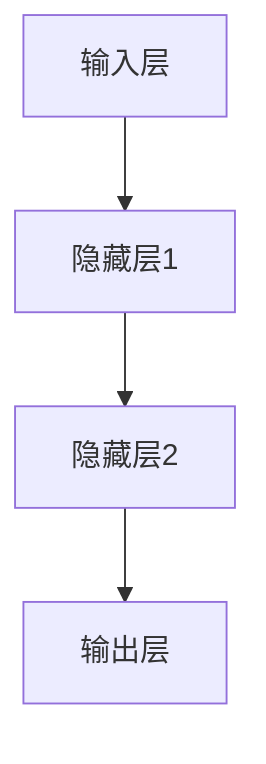
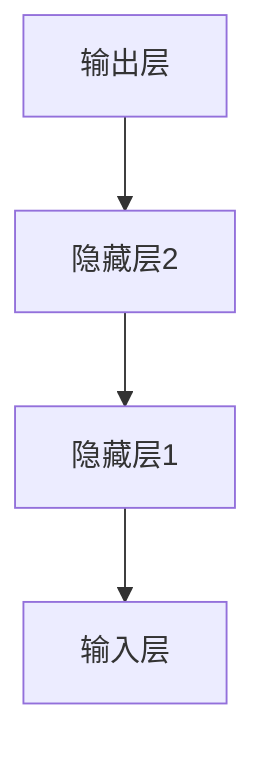
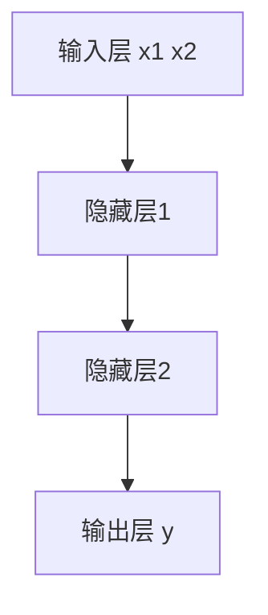

# 深度学习(Deep Learning) - 原理与代码实例讲解

作者：禅与计算机程序设计艺术 / Zen and the Art of Computer Programming

## 1. 背景介绍

### 1.1 问题的由来

深度学习（Deep Learning）作为人工智能（AI）领域的一个重要分支，近年来取得了显著的进展。其核心思想是通过多层神经网络来模拟人脑的工作方式，从而实现对复杂数据的自动学习和特征提取。深度学习的兴起可以追溯到20世纪80年代，但由于计算资源和数据量的限制，早期的研究进展缓慢。随着大数据时代的到来和计算能力的提升，深度学习在图像识别、语音识别、自然语言处理等领域取得了突破性进展。

### 1.2 研究现状

目前，深度学习已经成为人工智能研究的热点领域之一。各大科技公司和研究机构纷纷投入大量资源进行深度学习的研究和应用。深度学习的模型和算法不断推陈出新，从最初的多层感知机（MLP）到卷积神经网络（CNN）、循环神经网络（RNN）、生成对抗网络（GAN）等，深度学习的应用范围也从图像处理扩展到语音识别、自然语言处理、自动驾驶等多个领域。

### 1.3 研究意义

深度学习的研究不仅具有重要的学术价值，还具有广泛的应用前景。通过深入理解深度学习的原理和算法，可以推动人工智能技术的发展，解决实际问题，提高生产效率，改善人们的生活质量。同时，深度学习的研究也为其他学科提供了新的研究工具和方法，促进了跨学科的融合和发展。

### 1.4 本文结构

本文将从以下几个方面对深度学习进行详细讲解：

1. 核心概念与联系
2. 核心算法原理 & 具体操作步骤
3. 数学模型和公式 & 详细讲解 & 举例说明
4. 项目实践：代码实例和详细解释说明
5. 实际应用场景
6. 工具和资源推荐
7. 总结：未来发展趋势与挑战
8. 附录：常见问题与解答

## 2. 核心概念与联系

在深入探讨深度学习的具体算法和应用之前，我们需要先了解一些核心概念和它们之间的联系。这些概念包括神经网络、激活函数、损失函数、优化算法等。

### 神经网络

神经网络是深度学习的基础结构，其灵感来源于生物神经系统。一个典型的神经网络由多个神经元（节点）组成，这些神经元通过权重连接形成网络。神经网络可以分为输入层、隐藏层和输出层。



### 激活函数

激活函数是神经网络中的一个重要组件，它决定了一个神经元的输出。常见的激活函数包括Sigmoid、ReLU、Tanh等。

### 损失函数

损失函数用于衡量模型预测值与真实值之间的差距。常见的损失函数有均方误差（MSE）、交叉熵损失等。

### 优化算法

优化算法用于调整神经网络的权重，以最小化损失函数。常见的优化算法有梯度下降（Gradient Descent）、Adam等。

## 3. 核心算法原理 & 具体操作步骤

### 3.1 算法原理概述

深度学习的核心算法包括前向传播、反向传播和梯度下降。前向传播用于计算神经网络的输出，反向传播用于计算损失函数的梯度，梯度下降用于更新网络的权重。

### 3.2 算法步骤详解

#### 前向传播

前向传播是指从输入层到输出层的计算过程。每一层的输出作为下一层的输入，最终得到模型的预测值。


#### 反向传播

反向传播是指从输出层到输入层的梯度计算过程。通过链式法则计算每一层的梯度，并将其传递到上一层。



#### 梯度下降

梯度下降用于更新神经网络的权重。通过计算损失函数的梯度，沿着梯度的反方向更新权重，以最小化损失函数。

### 3.3 算法优缺点

#### 优点

1. 自动特征提取：深度学习能够自动从数据中提取特征，减少了人工特征工程的工作量。
2. 高效的非线性建模：深度学习能够处理复杂的非线性关系，适用于多种任务。

#### 缺点

1. 计算资源需求高：深度学习模型通常需要大量的计算资源和存储空间。
2. 训练时间长：深度学习模型的训练时间较长，尤其是对于大规模数据集。

### 3.4 算法应用领域

深度学习在多个领域取得了显著的应用成果，包括但不限于：

1. 图像识别：如人脸识别、物体检测等。
2. 语音识别：如语音转文字、语音合成等。
3. 自然语言处理：如机器翻译、文本生成等。
4. 自动驾驶：如车辆检测、路径规划等。

## 4. 数学模型和公式 & 详细讲解 & 举例说明

### 4.1 数学模型构建

深度学习的数学模型主要包括神经网络的结构、激活函数、损失函数和优化算法。以下是一个简单的神经网络模型：

$$
y = f(Wx + b)
$$

其中，$W$ 是权重矩阵，$x$ 是输入向量，$b$ 是偏置向量，$f$ 是激活函数。

### 4.2 公式推导过程

#### 前向传播公式

对于一个两层神经网络，前向传播的公式如下：

$$
z_1 = W_1x + b_1
$$

$$
a_1 = f(z_1)
$$

$$
z_2 = W_2a_1 + b_2
$$

$$
y = f(z_2)
$$

#### 反向传播公式

反向传播的公式通过链式法则计算梯度：

$$
\frac{\partial L}{\partial W_2} = \frac{\partial L}{\partial y} \cdot \frac{\partial y}{\partial z_2} \cdot \frac{\partial z_2}{\partial W_2}
$$

$$
\frac{\partial L}{\partial W_1} = \frac{\partial L}{\partial y} \cdot \frac{\partial y}{\partial z_2} \cdot \frac{\partial z_2}{\partial a_1} \cdot \frac{\partial a_1}{\partial z_1} \cdot \frac{\partial z_1}{\partial W_1}
$$

### 4.3 案例分析与讲解

假设我们有一个简单的二分类问题，输入数据为二维向量，输出为0或1。我们可以构建一个两层神经网络来解决这个问题。

#### 数据集

假设数据集如下：

| x1 | x2 | y |
|----|----|---|
| 0  | 0  | 0 |
| 0  | 1  | 1 |
| 1  | 0  | 1 |
| 1  | 1  | 0 |

#### 模型构建

我们构建一个两层神经网络，输入层有2个节点，隐藏层有2个节点，输出层有1个节点。



#### 前向传播

$$
z_1 = W_1x + b_1
$$

$$
a_1 = f(z_1)
$$

$$
z_2 = W_2a_1 + b_2
$$

$$
y = f(z_2)
$$

#### 反向传播

$$
\frac{\partial L}{\partial W_2} = \frac{\partial L}{\partial y} \cdot \frac{\partial y}{\partial z_2} \cdot \frac{\partial z_2}{\partial W_2}
$$

$$
\frac{\partial L}{\partial W_1} = \frac{\partial L}{\partial y} \cdot \frac{\partial y}{\partial z_2} \cdot \frac{\partial z_2}{\partial a_1} \cdot \frac{\partial a_1}{\partial z_1} \cdot \frac{\partial z_1}{\partial W_1}
$$

### 4.4 常见问题解答

#### 问题1：为什么深度学习需要大量数据？

深度学习模型通常具有大量的参数，需要大量的数据来进行训练，以避免过拟合和提高模型的泛化能力。

#### 问题2：如何选择激活函数？

激活函数的选择取决于具体的任务和模型结构。常见的激活函数有Sigmoid、ReLU、Tanh等。ReLU通常在深度神经网络中表现较好。

## 5. 项目实践：代码实例和详细解释说明

### 5.1 开发环境搭建

在进行深度学习项目实践之前，我们需要搭建开发环境。常用的深度学习框架有TensorFlow、PyTorch等。以下是使用Python和TensorFlow搭建开发环境的步骤：

1. 安装Python
2. 安装TensorFlow
3. 安装其他依赖库（如NumPy、Pandas等）

### 5.2 源代码详细实现

以下是一个简单的深度学习代码实例，使用TensorFlow构建一个两层神经网络来解决二分类问题。

```python
import tensorflow as tf
import numpy as np

# 数据集
X = np.array([[0, 0], [0, 1], [1, 0], [1, 1]])
y = np.array([[0], [1], [1], [0]])

# 构建模型
model = tf.keras.Sequential([
    tf.keras.layers.Dense(2, activation='relu', input_shape=(2,)),
    tf.keras.layers.Dense(1, activation='sigmoid')
])

# 编译模型
model.compile(optimizer='adam', loss='binary_crossentropy', metrics=['accuracy'])

# 训练模型
model.fit(X, y, epochs=1000, verbose=0)

# 评估模型
loss, accuracy = model.evaluate(X, y)
print(f'Loss: {loss}, Accuracy: {accuracy}')
```

### 5.3 代码解读与分析

1. 数据集：我们使用一个简单的二分类数据集，输入为二维向量，输出为0或1。
2. 模型构建：我们使用TensorFlow的Sequential API构建一个两层神经网络，第一层有2个节点，激活函数为ReLU，第二层有1个节点，激活函数为Sigmoid。
3. 模型编译：我们使用Adam优化器和二元交叉熵损失函数来编译模型。
4. 模型训练：我们使用fit方法训练模型，训练1000个epoch。
5. 模型评估：我们使用evaluate方法评估模型的损失和准确率。

### 5.4 运行结果展示

运行上述代码后，我们可以看到模型的损失和准确率。由于数据集较小且简单，模型的准确率应该接近100%。

## 6. 实际应用场景

### 6.1 图像识别

深度学习在图像识别领域取得了显著的成果。通过卷积神经网络（CNN），可以实现对图像的自动特征提取和分类。常见的应用包括人脸识别、物体检测、图像分割等。

### 6.2 语音识别

深度学习在语音识别领域也有广泛的应用。通过循环神经网络（RNN）和长短期记忆网络（LSTM），可以实现对语音信号的建模和识别。常见的应用包括语音转文字、语音合成、语音助手等。

### 6.3 自然语言处理

深度学习在自然语言处理（NLP）领域取得了重要进展。通过Transformer模型，可以实现对文本的自动生成和翻译。常见的应用包括机器翻译、文本生成、情感分析等。

### 6.4 未来应用展望

随着深度学习技术的不断发展，其应用范围将进一步扩大。未来，深度学习有望在医疗诊断、金融分析、自动驾驶等领域发挥更大的作用。

## 7. 工具和资源推荐

### 7.1 学习资源推荐

1. 书籍：《深度学习》 by Ian Goodfellow, Yoshua Bengio, Aaron Courville
2. 在线课程：Coursera上的深度学习专项课程 by Andrew Ng
3. 博客和论坛：Medium上的深度学习专栏、Stack Overflow

### 7.2 开发工具推荐

1. TensorFlow：谷歌开发的开源深度学习框架
2. PyTorch：Facebook开发的开源深度学习框架
3. Jupyter Notebook：交互式编程环境，适合进行深度学习实验

### 7.3 相关论文推荐

1. "ImageNet Classification with Deep Convolutional Neural Networks" by Alex Krizhevsky, Ilya Sutskever, Geoffrey Hinton
2. "Attention is All You Need" by Ashish Vaswani, Noam Shazeer, Niki Parmar, Jakob Uszkoreit, Llion Jones, Aidan N. Gomez, Lukasz Kaiser, Illia Polosukhin

### 7.4 其他资源推荐

1. GitHub：开源项目和代码库
2. Kaggle：数据科学竞赛平台，提供丰富的数据集和竞赛

## 8. 总结：未来发展趋势与挑战

### 8.1 研究成果总结

深度学习在多个领域取得了显著的研究成果，包括图像识别、语音识别、自然语言处理等。通过多层神经网络的自动特征提取和建模能力，深度学习实现了对复杂数据的高效处理。

### 8.2 未来发展趋势

未来，深度学习有望在更多领域发挥作用，如医疗诊断、金融分析、自动驾驶等。同时，深度学习的模型和算法将不断优化，提高计算效率和模型性能。

### 8.3 面临的挑战

尽管深度学习取得了显著的进展，但仍面临一些挑战，如计算资源需求高、训练时间长、模型解释性差等。解决这些挑战需要进一步的研究和技术创新。

### 8.4 研究展望

未来的研究方向包括但不限于：

1. 轻量级模型：开发计算资源需求较低的深度学习模型，适用于移动设备和嵌入式系统。
2. 模型解释性：提高深度学习模型的可解释性，增强对模型决策过程的理解。
3. 跨学科应用：将深度学习技术应用于更多学科领域，推动跨学科的融合和发展。

## 9. 附录：常见问题与解答

### 问题1：深度学习与传统机器学习的区别是什么？

深度学习是机器学习的一个分支，其主要区别在于深度学习通过多层神经网络实现自动特征提取，而传统机器学习通常需要人工设计特征。

### 问题2：如何选择合适的深度学习框架？

选择深度学习框架取决于具体的任务和需求。TensorFlow和PyTorch是目前最常用的深度学习框架，各有优缺点。TensorFlow适合大规模生产环境，PyTorch适合研究和实验。

### 问题3：如何解决深度学习中的过拟合问题？

常见的解决过拟合问题的方法包括数据增强、正则化（如L2正则化、Dropout）、交叉验证等。

### 问题4：深度学习模型的训练时间过长怎么办？

可以通过以下方法缩短训练时间：使用更高效的优化算法（如Adam）、使用GPU加速、减少模型参数、使用预训练模型等。

以上是关于深度学习的详细讲解和代码实例，希望对读者有所帮助。深度学习作为人工智能领域的重要技术，具有广泛的应用前景和研究价值。通过不断学习和实践，我们可以更好地理解和应用深度学习技术，解决实际问题，推动技术进步。