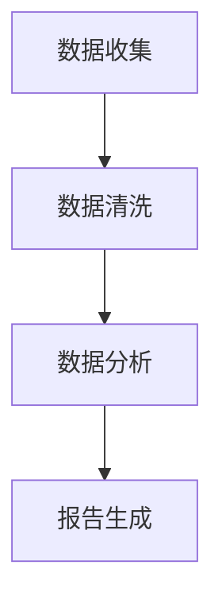

# AI人工智能代理工作流AI Agent WorkFlow：代理工作流的可视化与用户交互设计

作者：禅与计算机程序设计艺术 / Zen and the Art of Computer Programming

## 1. 背景介绍

### 1.1 问题的由来

随着人工智能技术的飞速发展，AI代理（AI Agent）的应用越来越广泛。AI代理能够在没有人类直接控制的情况下，执行特定的任务或决策。然而，随着AI代理的复杂性增加，如何有效地管理和监控它们的工作流程，以及提供友好的用户交互界面，成为了一个重要的研究课题。

### 1.2 研究现状

目前，AI代理工作流的研究主要集中在以下几个方面：

1. **工作流建模**：如何定义和描述AI代理的工作流程。
2. **工作流引擎**：如何实现AI代理工作流的执行和管理。
3. **用户交互**：如何设计友好的用户界面，方便用户监控和管理AI代理。

### 1.3 研究意义

研究AI代理工作流的可视化和用户交互设计，对于以下方面具有重要意义：

1. **提高工作效率**：通过可视化的工作流设计，可以减少错误和提高工作效率。
2. **增强可维护性**：清晰的流程定义有助于后续的维护和升级。
3. **提升用户体验**：友好的用户交互设计可以降低用户的认知负荷，提高用户满意度。

### 1.4 本文结构

本文将首先介绍AI代理工作流的核心概念，然后讨论可视化与用户交互设计的相关技术，接着通过具体案例进行分析，最后展望未来发展趋势。

## 2. 核心概念与联系

### 2.1 AI代理

AI代理是一种能够自主执行任务或做出决策的智能实体。它们可以是有形的（如机器人）或无形的（如软件程序）。

### 2.2 工作流

工作流是一系列有序的步骤，用于完成特定任务。在AI代理的上下文中，工作流描述了AI代理执行任务的流程。

### 2.3 可视化

可视化是将抽象信息转换为图形或图像的过程。在AI代理工作流中，可视化可以帮助用户直观地理解工作流程。

### 2.4 用户交互设计

用户交互设计是指设计用户与系统交互的方式，以提升用户体验。

## 3. 核心算法原理 & 具体操作步骤

### 3.1 算法原理概述

AI代理工作流的可视化与用户交互设计涉及以下核心算法原理：

1. **工作流建模**：使用图形化工具定义工作流，如BPMN（Business Process Modeling and Notation）。
2. **工作流引擎**：实现工作流的执行和管理，如基于规则引擎的执行。
3. **可视化**：使用图表和图形表示工作流，如使用D3.js进行可视化。
4. **用户交互设计**：设计用户界面，如使用React或Vue.js。

### 3.2 算法步骤详解

1. **定义工作流**：使用图形化工具定义工作流，包括开始节点、结束节点、条件分支和任务节点。
2. **实现工作流引擎**：开发工作流引擎，用于执行和管理工作流。
3. **可视化工作流**：使用可视化库将工作流转换为图形表示。
4. **设计用户交互**：设计用户界面，包括工作流编辑器、监控界面和任务执行界面。

### 3.3 算法优缺点

#### 优点

1. **提高工作效率**：可视化工作流和友好的用户界面可以减少错误和提高工作效率。
2. **增强可维护性**：清晰的工作流定义和易于操作的用户界面有助于后续的维护和升级。

#### 缺点

1. **开发成本**：设计可视化界面和用户交互可能需要额外的开发成本。
2. **学习曲线**：用户可能需要一定时间来熟悉新的用户界面和操作方式。

### 3.4 算法应用领域

AI代理工作流的可视化与用户交互设计可以应用于以下领域：

1. **企业级应用**：如企业资源规划（ERP）系统、客户关系管理（CRM）系统等。
2. **人工智能应用**：如机器人流程自动化（RPA）系统、智能客服系统等。

## 4. 数学模型和公式 & 详细讲解 & 举例说明

### 4.1 数学模型构建

在AI代理工作流中，可以使用图论来构建数学模型。图由节点（代表任务）和边（代表任务之间的关系）组成。

### 4.2 公式推导过程

假设工作流图G = (V, E)包含节点集合V和边集合E。我们可以使用以下公式来表示工作流：

$$
F(G) = \sum_{v \in V} f(v) + \sum_{(u, v) \in E} g(u, v)
$$

其中：

- $F(G)$表示工作流的复杂度。
- $f(v)$表示节点v的复杂度。
- $g(u, v)$表示边(u, v)的复杂度。

### 4.3 案例分析与讲解

假设有一个简单的AI代理工作流，包含以下任务：

1. 数据收集
2. 数据清洗
3. 数据分析
4. 报告生成

我们可以使用以下图来表示这个工作流：



### 4.4 常见问题解答

**Q：如何提高工作流的可视化效果？**

**A**：可以通过以下方法提高工作流的可视化效果：

1. 使用清晰的节点和边形状。
2. 使用颜色和图标来区分不同的任务类型。
3. 使用动画和过渡效果来增强视觉效果。

## 5. 项目实践：代码实例和详细解释说明

### 5.1 开发环境搭建

1. 安装Node.js和npm。
2. 安装可视化库，如D3.js。
3. 安装用户界面库，如React或Vue.js。

### 5.2 源代码详细实现

以下是一个使用React和D3.js实现的可视化工作流示例：

```javascript
import React, { useState } from 'react';
import * as d3 from 'd3';

const WorkflowVisualizer = ({ workflow }) => {
  const [width, setWidth] = useState(window.innerWidth);
  const [height, setHeight] = useState(window.innerHeight);

  const renderWorkflow = () => {
    const svg = d3.select('svg');
    svg.attr('width', width);
    svg.attr('height', height);

    // 定义节点和边
    const nodes = workflow.nodes;
    const links = workflow.links;

    // 定义布局
    const simulation = d3.forceSimulation(nodes)
      .force('link', d3.forceLink(links).id(d => d.id))
      .force('charge', d3.forceManyBody().strength(-800))
      .force('center', d3.forceCenter(width / 2, height / 2));

    // 绘制节点
    svg.selectAll('circle')
      .data(nodes)
      .enter().append('circle')
      .attr('r', 10)
      .attr('fill', 'blue')
      .attr('cx', d => d.x)
      .attr('cy', d => d.y)
      .call(d3.drag()
        .on('start', dragstarted)
        .on('drag', dragged)
        .on('end', dragended));

    // 绘制边
    svg.selectAll('line')
      .data(links)
      .enter().append('line')
      .attr('x1', d => d.source.x)
      .attr('y1', d => d.source.y)
      .attr('x2', d => d.target.x)
      .attr('y2', d => d.target.y);

    // 拖动节点
    const dragHandler = simulation.drag().on('drag', (event, d) => {
      d.fx = event.x;
      d.fy = event.y;
    });

    // 开始拖动
    function dragstarted(event, d) {
      if (!event.active) simulation.alphaTarget(0.3).restart();
      d.fx = d.x;
      d.fy = d.y;
    }

    // 拖动中
    function dragged(event, d) {
      d.fx = event.x;
      d.fy = event.y;
    }

    // 结束拖动
    function dragended(event, d) {
      if (!event.active) simulation.alphaTarget(0);
      d.fx = null;
      d.fy = null;
    }
  };

  React.useEffect(() => {
    renderWorkflow();
    const handleResize = () => {
      setWidth(window.innerWidth);
      setHeight(window.innerHeight);
    };
    window.addEventListener('resize', handleResize);
    return () => window.removeEventListener('resize', handleResize);
  }, []);

  return <svg />;
};

export default WorkflowVisualizer;
```

### 5.3 代码解读与分析

1. **导入库**：首先，我们导入了React和D3.js库。
2. **定义组件**：定义了`WorkflowVisualizer`组件，该组件接收一个包含节点和边的`workflow`对象作为属性。
3. **渲染工作流**：使用D3.js的力导向布局绘制工作流图。
4. **拖动节点**：通过D3.js的拖动功能，允许用户拖动节点。

### 5.4 运行结果展示

运行上述代码将生成一个可视化工作流图，用户可以拖动节点来调整布局。

## 6. 实际应用场景

### 6.1 企业级应用

在ERP系统或CRM系统中，可视化工作流可以帮助企业监控和管理业务流程，提高工作效率。

### 6.2 人工智能应用

在RPA系统或智能客服系统中，可视化工作流可以帮助用户设计和测试自动化流程，提高系统的智能化水平。

## 7. 工具和资源推荐

### 7.1 学习资源推荐

1. **《设计工作流》**：作者：Joe Justice
2. **《D3.js可视化教程》**：作者：Jake Porway

### 7.2 开发工具推荐

1. **Visual Paradigm**：提供图形化工作流设计工具。
2. **D3.js**：提供可视化库。
3. **React**：提供用户界面库。

### 7.3 相关论文推荐

1. **《工作流可视化的研究综述》**：作者：张华、李晓辉
2. **《基于D3.js的动态工作流可视化》**：作者：王磊、刘勇

### 7.4 其他资源推荐

1. **工作流管理联盟（Workflow Management Coalition, WfMC）**：[https://www.wfmc.org/](https://www.wfmc.org/)
2. **D3.js官网**：[https://d3js.org/](https://d3js.org/)

## 8. 总结：未来发展趋势与挑战

AI人工智能代理工作流的可视化与用户交互设计在未来将面临以下发展趋势和挑战：

### 8.1 发展趋势

1. **更加智能的工作流引擎**：通过机器学习等技术，使工作流引擎更加智能，能够自动优化工作流。
2. **跨平台和跨设备**：工作流设计工具和用户界面将更加适用于多种平台和设备。
3. **更加直观的用户体验**：通过虚拟现实（VR）和增强现实（AR）技术，提供更加直观的用户体验。

### 8.2 面临的挑战

1. **性能优化**：随着工作流和用户界面的复杂性增加，需要优化性能，确保系统运行流畅。
2. **安全性**：保护工作流和用户数据的安全，防止恶意攻击和数据泄露。
3. **定制化**：满足不同用户和场景的个性化需求，提供定制化的工作流和用户界面。

### 8.3 研究展望

随着AI技术的不断发展，AI人工智能代理工作流的可视化与用户交互设计将在以下方面取得突破：

1. **智能化工作流设计**：利用AI技术自动设计工作流，提高设计效率和质量。
2. **自适应工作流执行**：根据任务执行情况和用户反馈，动态调整工作流。
3. **跨领域应用**：将AI代理工作流应用到更多领域，如智能制造、智慧城市等。

AI人工智能代理工作流的可视化与用户交互设计将不断发展和完善，为人工智能的应用带来更多的可能性。

## 9. 附录：常见问题与解答

### 9.1 什么是工作流？

**A**：工作流是一系列有序的步骤，用于完成特定任务。在工作流中，任务按照一定的顺序执行，并可能存在条件分支。

### 9.2 可视化工作流有何优势？

**A**：可视化工作流可以帮助用户直观地理解工作流程，提高工作效率，增强可维护性。

### 9.3 如何选择合适的工作流设计工具？

**A**：选择工作流设计工具时，需要考虑以下因素：

1. **易用性**：工具是否易于学习和使用。
2. **功能**：工具是否支持所需的功能，如工作流建模、可视化、用户交互等。
3. **集成**：工具是否易于与其他系统集成。

### 9.4 如何优化工作流的性能？

**A**：优化工作流性能可以从以下方面入手：

1. **简化工作流**：删除不必要的步骤，减少工作流复杂性。
2. **并行执行**：将可以并行执行的任务同时执行，提高效率。
3. **缓存结果**：缓存已计算的结果，避免重复计算。