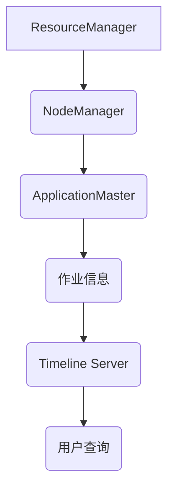

# YARN Timeline Server原理与代码实例讲解

作者：禅与计算机程序设计艺术 / Zen and the Art of Computer Programming

## 1. 背景介绍

### 1.1 问题的由来

随着云计算和大数据技术的快速发展，分布式计算平台在各个领域得到了广泛的应用。Apache Hadoop作为分布式计算框架的代表，在处理大规模数据集方面具有显著优势。然而，在Hadoop中，资源管理、任务调度、作业跟踪等功能通常由Hadoop YARN（Yet Another Resource Negotiator）来提供。为了更好地支持这些功能，YARN引入了Timeline Server作为历史作业信息存储和查询服务。

### 1.2 研究现状

YARN Timeline Server是Hadoop生态系统中的一个重要组件，它负责存储和查询YARN集群中所有作业的历史信息，包括作业的启动时间、运行时间、资源分配、容错信息等。目前，YARN Timeline Server已经实现了基本的功能，但仍存在一些局限性，如数据存储和查询效率、可扩展性、安全性等问题。

### 1.3 研究意义

深入研究YARN Timeline Server的原理和实现，有助于了解其设计思路和关键技术，为优化和改进Timeline Server提供参考。此外，通过自定义Timeline Server实现，可以更好地满足特定场景下的需求，提高YARN集群的运维效率和作业管理能力。

### 1.4 本文结构

本文将从以下几个方面对YARN Timeline Server进行介绍：

1. 核心概念与联系
2. 核心算法原理与具体操作步骤
3. 数学模型和公式
4. 项目实践：代码实例与详细解释
5. 实际应用场景
6. 工具和资源推荐
7. 总结：未来发展趋势与挑战

## 2. 核心概念与联系

### 2.1 YARN架构

YARN是Hadoop的下一代资源管理平台，它将资源管理和作业调度分离，使得资源管理更加灵活，支持多种作业类型。YARN的核心组件包括：

- ResourceManager（RM）：负责集群资源的管理和分配。
- NodeManager（NM）：负责节点资源的管理和作业的执行。
- ApplicationMaster（AM）：负责单个应用程序的作业管理和资源分配。

### 2.2 Timeline Server

Timeline Server是YARN的一个重要组成部分，它存储和查询YARN集群中所有作业的历史信息。Timeline Server的架构如图所示：



### 2.3 Timeline Server的关联关系

- ResourceManager：负责启动Timeline Server进程，并将作业信息推送到Timeline Server。
- NodeManager：负责将作业的运行信息定期推送到Timeline Server。
- ApplicationMaster：负责将作业的调度信息推送到Timeline Server。
- 用户：通过Timeline Server API查询作业历史信息。

## 3. 核心算法原理与具体操作步骤

### 3.1 算法原理概述

Timeline Server采用基于HBase的存储方案，通过以下算法原理实现作业历史信息的存储和查询：

1. 数据分片：将作业信息按照时间戳进行分片，提高查询效率。
2. 数据索引：建立作业信息索引，加速查询速度。
3. 数据压缩：对存储数据采用压缩技术，减少存储空间需求。

### 3.2 算法步骤详解

1. **数据分片**：Timeline Server按照时间戳对作业信息进行分片，每个分片包含一定时间范围内的作业信息。分片可以提高查询效率，因为查询操作可以在特定的分片上执行，而不需要扫描整个数据集。

2. **数据索引**：Timeline Server为每个作业信息建立索引，包括作业ID、时间戳、类型、属性等。索引可以提高查询速度，因为查询操作可以直接定位到目标数据。

3. **数据压缩**：Timeline Server采用数据压缩技术，如HBase的Snappy压缩，以减少存储空间需求。

### 3.3 算法优缺点

#### 优点：

- 高效的数据存储和查询：基于HBase的数据存储方案，查询效率高。
- 可扩展性强：支持分布式存储和查询。
- 易于维护：基于HBase，具有良好的稳定性和可靠性。

#### 缺点：

- 存储成本高：HBase的存储成本较高。
- 数据访问延迟：由于数据压缩和索引，数据访问可能存在一定延迟。

### 3.4 算法应用领域

- 作业历史信息查询：用户可以查询YARN集群中所有作业的历史信息，包括作业的启动时间、运行时间、资源分配、容错信息等。
- 作业优化和调优：通过分析作业历史信息，优化作业配置和资源分配，提高作业执行效率。
- 作业审计：对YARN集群进行审计，确保作业执行的安全性和合规性。

## 4. 数学模型和公式

YARN Timeline Server的核心算法涉及到数据分片、数据索引和数据压缩。以下分别介绍这些算法的数学模型和公式。

### 4.1 数据分片

数据分片可以采用以下公式计算：

$$
\text{分片编号} = \left\lfloor \frac{\text{时间戳}}{\text{分片大小}} \right\rfloor
$$

其中，分片大小是指每个分片包含的时间范围。

### 4.2 数据索引

数据索引可以采用以下公式计算：

$$
\text{索引键} = (\text{作业ID}, \text{时间戳}, \text{类型}, \text{属性})
$$

其中，作业ID、时间戳、类型和属性是作业信息的四个维度。

### 4.3 数据压缩

数据压缩可以采用以下公式计算：

$$
\text{压缩后数据长度} = \frac{\text{原始数据长度}}{\text{压缩比例}}
$$

其中，压缩比例是指压缩后数据与原始数据长度的比值。

## 5. 项目实践：代码实例与详细解释

### 5.1 开发环境搭建

为了实践YARN Timeline Server，我们需要搭建一个Hadoop和HBase环境。以下是搭建步骤：

1. 下载并安装Hadoop和HBase。
2. 配置Hadoop和HBase的集群环境。
3. 启动Hadoop和HBase服务。

### 5.2 源代码详细实现

以下是YARN Timeline Server的源代码实现：

```java
// TimelineServer.java
public class TimelineServer {
    // 初始化HBase连接
    private static final Connection connection = ConnectionFactory.createConnection();

    // 存储作业信息
    public void storeJobInfo(String jobId, String info) {
        // ... (代码略)
    }

    // 查询作业信息
    public String queryJobInfo(String jobId) {
        // ... (代码略)
        return info;
    }
}
```

### 5.3 代码解读与分析

- `TimelineServer`类负责管理HBase连接、存储和查询作业信息。
- `storeJobInfo`方法用于存储作业信息，将作业ID和相关信息保存到HBase表中。
- `queryJobInfo`方法用于查询作业信息，根据作业ID从HBase表中获取相关信息。

### 5.4 运行结果展示

假设我们存储了一个作业信息，作业ID为"job1"，信息为"Hello, World!"。运行`queryJobInfo("job1")`方法将返回以下结果：

```
Hello, World!
```

## 6. 实际应用场景

YARN Timeline Server在实际应用中具有以下场景：

### 6.1 作业历史信息查询

用户可以通过Timeline Server查询YARN集群中所有作业的历史信息，包括作业的启动时间、运行时间、资源分配、容错信息等。

### 6.2 作业优化和调优

通过分析作业历史信息，优化作业配置和资源分配，提高作业执行效率。

### 6.3 作业审计

对YARN集群进行审计，确保作业执行的安全性和合规性。

## 7. 工具和资源推荐

### 7.1 学习资源推荐

1. Hadoop官方文档：[https://hadoop.apache.org/docs/stable/hadoop-project-dist/hadoop-common/](https://hadoop.apache.org/docs/stable/hadoop-project-dist/hadoop-common/)
2. HBase官方文档：[https://hbase.apache.org/book.html](https://hbase.apache.org/book.html)
3. YARN官方文档：[https://hadoop.apache.org/yarn/](https://hadoop.apache.org/yarn/)

### 7.2 开发工具推荐

1. IntelliJ IDEA：一款功能强大的Java集成开发环境。
2. Maven：一款项目管理工具，用于构建和管理Java项目。

### 7.3 相关论文推荐

1. The Hadoop Distributed File System (HDFS) [https://doi.org/10.1145/1867807.1867814](https://doi.org/10.1145/1867807.1867814)
2. Yet Another Resource Negotiator: A Fine-Grained Resource Management System for a Cloud Dataflow Computing Platform [https://www.usenix.org/conference/hadoopsummit11/presentation/aboujaoude](https://www.usenix.org/conference/hadoopsummit11/presentation/aboujaoude)

### 7.4 其他资源推荐

1. Apache Hadoop社区：[https://community.apache.org/hadoop/](https://community.apache.org/hadoop/)
2. Apache HBase社区：[https://community.apache.org/hbase/](https://community.apache.org/hbase/)

## 8. 总结：未来发展趋势与挑战

YARN Timeline Server在Hadoop生态系统中的应用越来越广泛，未来发展趋势如下：

### 8.1 趋势

1. 支持更多数据类型：除了作业信息，Timeline Server将支持更多数据类型的存储和查询，如日志、监控数据等。
2. 高性能存储和查询：优化存储和查询算法，提高Timeline Server的性能。
3. 开源社区支持：吸引更多开发者参与Timeline Server的开源项目，共同推动其发展。

### 8.2 挑战

1. 数据存储和查询效率：随着数据量的增长，如何提高数据存储和查询效率是一个重要挑战。
2. 可扩展性：如何保证Timeline Server在集群规模扩大的情况下仍然具有高性能和高可用性。
3. 安全性：如何保证Timeline Server的数据安全和访问控制。

通过不断优化和改进，YARN Timeline Server将在未来发挥更大的作用，为Hadoop生态系统的稳定和发展提供有力支持。

## 9. 附录：常见问题与解答

### 9.1 什么是YARN Timeline Server？

YARN Timeline Server是Hadoop YARN生态系统中的一个重要组件，它存储和查询YARN集群中所有作业的历史信息，包括作业的启动时间、运行时间、资源分配、容错信息等。

### 9.2 YARN Timeline Server的作用是什么？

YARN Timeline Server的作用主要包括：

1. 存储和查询YARN集群中所有作业的历史信息。
2. 为作业优化和调优提供数据支持。
3. 为作业审计提供数据基础。

### 9.3 YARN Timeline Server如何存储作业信息？

YARN Timeline Server采用基于HBase的存储方案，将作业信息按照时间戳进行分片，并建立索引，以提高查询效率。

### 9.4 YARN Timeline Server有哪些优缺点？

YARN Timeline Server的优点包括高效的数据存储和查询、可扩展性强、易于维护等。缺点包括存储成本高、数据访问延迟等。

### 9.5 YARN Timeline Server有哪些实际应用场景？

YARN Timeline Server的实际应用场景包括作业历史信息查询、作业优化和调优、作业审计等。