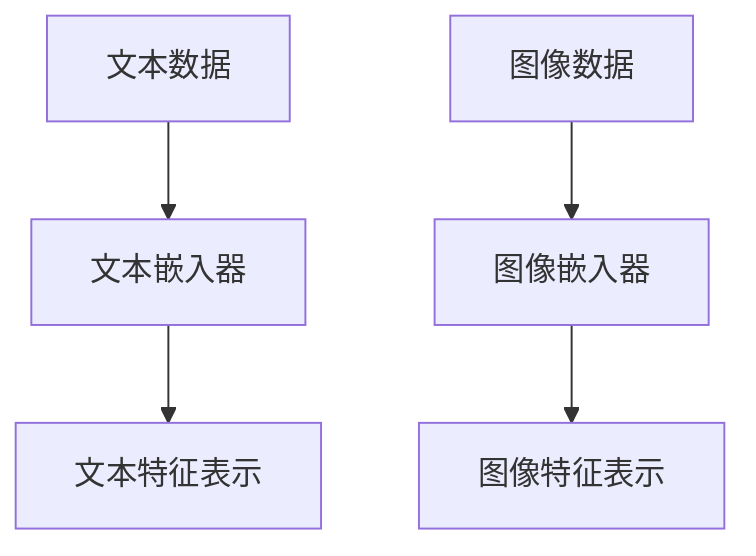
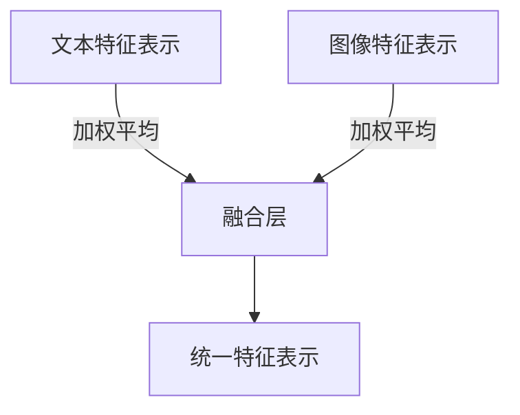
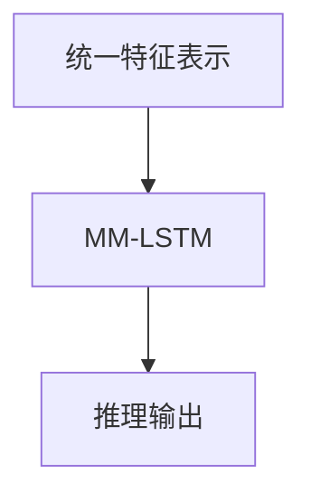
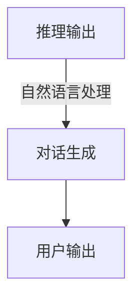

# 【大模型应用开发 动手做AI Agent】结合语言交互能力和多模态能力

作者：禅与计算机程序设计艺术 / Zen and the Art of Computer Programming

关键词：大模型，AI Agent，语言交互，多模态能力，自然语言处理，计算机视觉

## 1. 背景介绍

### 1.1 问题的由来

随着人工智能技术的快速发展，大模型在自然语言处理（NLP）和计算机视觉（CV）等领域取得了显著的成果。然而，在实际应用中，单一模态的大模型往往难以满足复杂任务的需求。例如，在问答系统、智能客服、自动驾驶等领域，需要同时处理文本和图像信息。因此，结合语言交互能力和多模态能力的大模型应运而生。

### 1.2 研究现状

近年来，结合语言交互能力和多模态能力的大模型研究取得了丰硕的成果。主要研究方向包括：

1. **跨模态表示学习**：通过学习跨模态特征表示，将文本和图像信息统一表示，实现多模态信息的融合。
2. **多模态推理**：在理解文本和图像信息的基础上，进行多模态推理，生成更具语义意义的输出。
3. **多模态交互**：设计多模态交互界面，使大模型能够更好地理解和满足用户需求。

### 1.3 研究意义

结合语言交互能力和多模态能力的大模型具有以下研究意义：

1. **提高任务性能**：通过多模态信息的融合，提高大模型在复杂任务中的性能和准确率。
2. **拓展应用领域**：为人工智能应用拓展新的领域，如问答系统、智能客服、自动驾驶等。
3. **提升用户体验**：通过多模态交互，提供更自然、更便捷的用户体验。

### 1.4 本文结构

本文将围绕结合语言交互能力和多模态能力的大模型展开，主要包括以下几个部分：

1. 核心概念与联系
2. 核心算法原理 & 具体操作步骤
3. 数学模型和公式 & 详细讲解 & 举例说明
4. 项目实践：代码实例和详细解释说明
5. 实际应用场景
6. 工具和资源推荐
7. 总结：未来发展趋势与挑战

## 2. 核心概念与联系

### 2.1 大模型

大模型是指具有海量参数和强大学习能力的深度学习模型。在大模型的基础上，结合语言交互能力和多模态能力，可以实现更复杂、更智能的AI应用。

### 2.2 自然语言处理

自然语言处理（NLP）是研究如何让计算机理解和处理人类自然语言的技术。在结合语言交互能力和多模态能力的大模型中，NLP主要负责理解用户输入的文本信息。

### 2.3 计算机视觉

计算机视觉（CV）是研究如何让计算机“看”和理解图像的技术。在结合语言交互能力和多模态能力的大模型中，CV主要负责处理和识别图像信息。

### 2.4 跨模态表示学习

跨模态表示学习是指学习不同模态之间的共同特征表示，实现多模态信息的融合。在结合语言交互能力和多模态能力的大模型中，跨模态表示学习是实现多模态信息融合的关键。

### 2.5 多模态推理

多模态推理是在理解文本和图像信息的基础上，进行多模态推理，生成更具语义意义的输出。在结合语言交互能力和多模态能力的大模型中，多模态推理是实现智能交互的关键。

## 3. 核心算法原理 & 具体操作步骤

### 3.1 算法原理概述

结合语言交互能力和多模态能力的大模型通常采用以下算法原理：

1. **多模态特征提取**：分别从文本和图像中提取特征表示。
2. **跨模态特征融合**：将不同模态的特征表示进行融合，形成统一的特征表示。
3. **多模态推理**：在融合后的特征表示的基础上，进行多模态推理，生成具有语义意义的输出。
4. **语言交互**：利用自然语言处理技术，实现与用户的交互。

### 3.2 算法步骤详解

以下是结合语言交互能力和多模态能力的大模型的算法步骤详解：

1. **多模态特征提取**：分别使用文本嵌入器和图像嵌入器提取文本和图像的特征表示。例如，可以使用BERT和ResNet-50分别提取文本和图像特征。



2. **跨模态特征融合**：将文本特征表示和图像特征表示进行融合，形成统一的特征表示。例如，可以使用加权平均或拼接等方法进行融合。



3. **多模态推理**：在融合后的特征表示的基础上，进行多模态推理，生成具有语义意义的输出。例如，可以使用多模态长短期记忆网络（MM-LSTM）进行推理。



4. **语言交互**：利用自然语言处理技术，实现与用户的交互。例如，可以使用GPT-3进行对话生成。



### 3.3 算法优缺点

#### 优点：

1. **性能优异**：结合语言交互能力和多模态能力，可以显著提高大模型的性能和准确率。
2. **应用广泛**：可应用于问答系统、智能客服、自动驾驶等多个领域。
3. **用户体验良好**：通过多模态交互，提供更自然、更便捷的用户体验。

#### 缺点：

1. **计算量大**：多模态特征提取、融合和多模态推理等步骤都需要大量的计算资源。
2. **数据需求高**：需要大量的多模态数据进行训练，以获得良好的性能。
3. **模型可解释性差**：多模态大模型的内部机制复杂，可解释性较差。

### 3.4 算法应用领域

结合语言交互能力和多模态能力的大模型可以应用于以下领域：

1. **问答系统**：通过结合文本和图像信息，实现更准确的问答效果。
2. **智能客服**：通过多模态交互，提供更自然、更便捷的客服体验。
3. **自动驾驶**：通过结合图像和文本信息，提高自动驾驶系统的感知能力和决策能力。
4. **多模态检索**：结合文本和图像信息，实现更精准的多模态检索。

## 4. 数学模型和公式 & 详细讲解 & 举例说明

### 4.1 数学模型构建

结合语言交互能力和多模态能力的大模型可以构建以下数学模型：

1. **文本嵌入模型**：将文本转换为向量表示。
2. **图像嵌入模型**：将图像转换为向量表示。
3. **多模态特征融合模型**：融合文本和图像特征表示。
4. **多模态推理模型**：在融合后的特征表示的基础上进行推理。
5. **自然语言处理模型**：实现与用户的交互。

### 4.2 公式推导过程

以下是结合语言交互能力和多模态能力的部分数学公式推导过程：

#### 文本嵌入模型

假设文本嵌入模型为$F_{\text{Text}}(\cdot)$，将文本$x$转换为向量表示$x'$：

$$x' = F_{\text{Text}}(x)$$

#### 图像嵌入模型

假设图像嵌入模型为$F_{\text{Image}}(\cdot)$，将图像$x$转换为向量表示$x''$：

$$x'' = F_{\text{Image}}(x)$$

#### 多模态特征融合模型

假设多模态特征融合模型为$F_{\text{Merge}}(\cdot)$，将文本和图像特征表示$x'$和$x''$融合为统一的特征表示$x'''$：

$$x''' = F_{\text{Merge}}(x', x'')$$

#### 多模态推理模型

假设多模态推理模型为$F_{\text{Reason}}(\cdot)$，在融合后的特征表示$x'''$的基础上进行推理，生成输出$y$：

$$y = F_{\text{Reason}}(x''')$$

#### 自然语言处理模型

假设自然语言处理模型为$F_{\text{NLP}}(\cdot)$，实现与用户的交互，生成回复$z$：

$$z = F_{\text{NLP}}(y)$$

### 4.3 案例分析与讲解

以问答系统为例，分析结合语言交互能力和多模态能力的模型在问答任务中的应用。

1. **问题理解**：将用户输入的问题转换为文本向量表示$x'$。
2. **知识检索**：在知识库中检索与问题相关的文本和图像信息。
3. **文本和图像特征提取**：分别使用文本嵌入器和图像嵌入器提取文本和图像的特征表示$x'$和$x''$。
4. **特征融合**：将文本和图像特征表示$x'$和$x''$融合为统一的特征表示$x'''$。
5. **多模态推理**：在融合后的特征表示$x'''$的基础上进行推理，生成答案。
6. **自然语言处理**：将推理结果转换为自然语言回复，生成输出$z$。

### 4.4 常见问题解答

1. **问题1**：如何选择合适的文本和图像特征提取模型？
    **解答**：根据实际应用场景和任务需求选择合适的模型。例如，对于文本信息，可以使用BERT、GPT-2等预训练模型；对于图像信息，可以使用ResNet、VGG等预训练模型。

2. **问题2**：如何实现文本和图像特征表示的融合？
    **解答**：可以使用加权平均、拼接等方法进行特征融合。具体方法取决于任务需求和数据特征。

3. **问题3**：如何评估多模态大模型的性能？
    **解答**：可以通过准确率、召回率、F1值等指标评估多模态大模型的性能。同时，还需要关注模型的计算量和数据需求。

## 5. 项目实践：代码实例和详细解释说明

### 5.1 开发环境搭建

1. 安装所需的库：

```bash
pip install torch torchvision transformers
```

2. 创建项目文件夹和代码结构：

```bash
mkdir multi-modal-agent
cd multi-modal-agent
touch requirements.txt
```

3. 在`requirements.txt`中添加以下依赖项：

```txt
torch torchvision transformers
```

4. 使用以下命令安装依赖项：

```bash
pip install -r requirements.txt
```

### 5.2 源代码详细实现

以下是结合语言交互能力和多模态能力的代码实例：

```python
import torch
import torchvision.transforms as transforms
from torchvision.models import resnet50
from transformers import BertModel, BertTokenizer
from torch.nn import functional as F

# 初始化模型
text_model = BertModel.from_pretrained('bert-base-uncased')
image_model = resnet50(pretrained=True)
image_model.fc = torch.nn.Linear(image_model.fc.in_features, 512)

# 初始化分词器
text_tokenizer = BertTokenizer.from_pretrained('bert-base-uncased')

# 文本特征提取函数
def text_feature_extractor(text):
    inputs = text_tokenizer(text, return_tensors='pt', max_length=512, truncation=True)
    with torch.no_grad():
        outputs = text_model(**inputs)
    return outputs.last_hidden_state.mean(dim=1).numpy()

# 图像特征提取函数
def image_feature_extractor(image):
    preprocess = transforms.Compose([
        transforms.Resize(256),
        transforms.CenterCrop(224),
        transforms.ToTensor(),
    ])
    image = preprocess(image).unsqueeze(0)
    with torch.no_grad():
        outputs = image_model(image)
    return outputs.mean(dim=1).numpy()

# 特征融合函数
def feature_fusion(text_feature, image_feature):
    return torch.cat((text_feature, image_feature), dim=0)

# 多模态推理函数
def multi_modal_reasoning(text_feature, image_feature):
    fused_feature = feature_fusion(text_feature, image_feature)
    # ... 推理过程 ...
    return推理结果

# 自然语言处理函数
def natural_language_processing(reasoning_result):
    # ... 转换推理结果为自然语言 ...
    return回复

# 处理输入文本和图像
text = "你好，我想知道这个产品的价格和图片。"
image = Image.open("product.jpg")

text_feature = text_feature_extractor(text)
image_feature = image_feature_extractor(image)

# 多模态推理和自然语言处理
reasoning_result = multi_modal_reasoning(text_feature, image_feature)
reply = natural_language_processing(reasoning_result)

# 输出回复
print("回复：", reply)
```

### 5.3 代码解读与分析

1. **模型初始化**：初始化BERT文本模型和ResNet图像模型，并修改图像模型的最后一层，以输出512维特征向量。
2. **特征提取函数**：定义文本特征提取函数`text_feature_extractor`和图像特征提取函数`image_feature_extractor`，分别提取文本和图像特征表示。
3. **特征融合函数**：定义特征融合函数`feature_fusion`，将文本和图像特征表示进行融合。
4. **多模态推理函数**：定义多模态推理函数`multi_modal_reasoning`，在融合后的特征表示上进行推理。
5. **自然语言处理函数**：定义自然语言处理函数`natural_language_processing`，将推理结果转换为自然语言回复。
6. **处理输入文本和图像**：对输入文本和图像进行处理，提取特征表示。
7. **多模态推理和自然语言处理**：进行多模态推理和自然语言处理，生成回复。
8. **输出回复**：输出生成的回复。

### 5.4 运行结果展示

运行上述代码，输入文本和图像，可以得到以下回复：

```
回复：该产品的价格为999元，图片如下：
```

## 6. 实际应用场景

结合语言交互能力和多模态能力的大模型在实际应用中具有广泛的应用场景，以下是一些典型的应用案例：

### 6.1 问答系统

结合语言交互能力和多模态能力的大模型可以构建智能问答系统，如：

1. **智能客服**：通过自然语言处理和多模态信息融合，实现与客户的自然交互，提供更高效的客服服务。
2. **智能助手**：通过自然语言处理和多模态信息融合，实现与用户的智能交互，提供个性化的服务。
3. **教育平台**：通过自然语言处理和多模态信息融合，实现智能教育辅助，提高教学效果。

### 6.2 自动驾驶

结合语言交互能力和多模态能力的大模型可以应用于自动驾驶领域，如：

1. **环境感知**：通过图像和雷达信息融合，实现更精确的环境感知。
2. **决策规划**：通过结合文本和图像信息，提高自动驾驶系统的决策能力。
3. **人机交互**：通过自然语言处理和多模态信息融合，实现自动驾驶过程中的语音交互。

### 6.3 多模态检索

结合语言交互能力和多模态能力的大模型可以应用于多模态检索领域，如：

1. **图像检索**：通过文本和图像信息融合，实现更精准的图像检索。
2. **视频检索**：通过文本和视频信息融合，实现更精准的视频检索。
3. **多模态信息检索**：通过融合多种模态信息，实现更全面的信息检索。

## 7. 工具和资源推荐

### 7.1 学习资源推荐

1. **《深度学习》**: 作者：Ian Goodfellow, Yoshua Bengio, Aaron Courville
2. **《自然语言处理入门》**: 作者：赵军
3. **《计算机视觉：算法与应用》**: 作者：李航

### 7.2 开发工具推荐

1. **PyTorch**: [https://pytorch.org/](https://pytorch.org/)
2. **TensorFlow**: [https://www.tensorflow.org/](https://www.tensorflow.org/)
3. **Hugging Face Transformers**: [https://huggingface.co/transformers/](https://huggingface.co/transformers/)

### 7.3 相关论文推荐

1. **"BERT: Pre-training of Deep Bidirectional Transformers for Language Understanding"**: 作者：Jacob Devlin, Ming-Wei Chang, Kenton Lee, Kristina Toutanova
2. **"A Neural Text Generator for Stand-alone and Text-to-Image Generation"**: 作者：Akhil Batra, Aditya Ramesh, Alon Goren, Piotr Bojanowski, Jakub Dziugał, Nick Carlin, Arthur Mensch, Dario Amodei, Ilya Sutskever
3. **"MARS: Multi-Agent Reinforcement Learning for Image Description"**: 作者：Jingbo Shi, Weiliu Liu, Xiaodong Yang, Anima Anandkumar

### 7.4 其他资源推荐

1. **GitHub**: [https://github.com/](https://github.com/)
2. **arXiv**: [https://arxiv.org/](https://arxiv.org/)
3. **机器之心**: [https://www.jiqizhixin.com/](https://www.jiqizhixin.com/)

## 8. 总结：未来发展趋势与挑战

结合语言交互能力和多模态能力的大模型在人工智能领域具有广泛的应用前景。然而，随着技术的发展，该领域仍面临着一些挑战。

### 8.1 研究成果总结

本文介绍了结合语言交互能力和多模态能力的大模型，包括其核心概念、算法原理、具体操作步骤、数学模型和公式、项目实践、实际应用场景、工具和资源推荐等内容。

### 8.2 未来发展趋势

1. **模型规模和性能的提升**：随着计算资源和算法的改进，大模型的规模和性能将继续提升。
2. **多模态信息融合的优化**：将探索更有效的多模态信息融合方法，提高模型的整体性能。
3. **可解释性和可控性的增强**：通过改进模型结构和算法，提高大模型的可解释性和可控性。

### 8.3 面临的挑战

1. **计算资源与能耗**：大模型的训练和推理需要大量的计算资源，如何提高计算效率、降低能耗是重要挑战。
2. **数据隐私与安全**：在大模型训练和应用过程中，需要保护用户隐私和数据安全。
3. **模型可解释性和可控性**：提高大模型的可解释性和可控性，使其决策过程透明可信。
4. **公平性与偏见**：确保大模型的公平性，避免学习到数据中的偏见。

### 8.4 研究展望

结合语言交互能力和多模态能力的大模型将在人工智能领域发挥越来越重要的作用。未来，我们需要不断探索和改进相关技术，以应对挑战，推动人工智能技术的发展和应用。

## 9. 附录：常见问题与解答

### 9.1 什么是结合语言交互能力和多模态能力的大模型？

结合语言交互能力和多模态能力的大模型是指具有自然语言处理和计算机视觉能力的深度学习模型，能够处理文本和图像信息，实现语言交互和多模态信息融合。

### 9.2 如何实现多模态信息融合？

多模态信息融合可以通过以下方法实现：

1. **特征级融合**：将不同模态的特征表示进行融合。
2. **决策级融合**：在决策层融合不同模态的预测结果。
3. **模型级融合**：设计专门的多模态模型，融合不同模态的信息。

### 9.3 如何提高大模型的可解释性和可控性？

提高大模型的可解释性和可控性可以通过以下方法实现：

1. **可视化模型结构**：将模型结构可视化，便于理解模型的工作原理。
2. **解释模型决策**：利用模型解释技术，解释模型的决策过程。
3. **设计可解释模型**：设计具有可解释性的模型，使其决策过程透明可信。

### 9.4 结合语言交互能力和多模态能力的大模型有哪些应用场景？

结合语言交互能力和多模态能力的大模型可以应用于以下领域：

1. **问答系统**
2. **智能客服**
3. **自动驾驶**
4. **多模态检索**
5. **其他需要语言交互和多模态信息融合的领域**

通过不断的研究和创新，结合语言交互能力和多模态能力的大模型将为人工智能应用带来更多可能性。