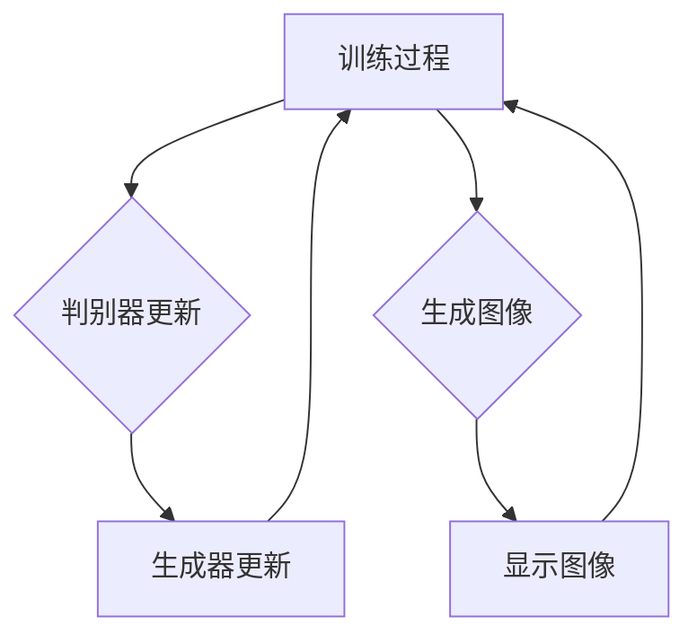

# 生成对抗网络 (GAN) 原理与代码实例讲解

作者：禅与计算机程序设计艺术 / Zen and the Art of Computer Programming

## 关键词：

生成对抗网络（GAN）、深度学习、无监督学习、生成模型、图像合成、数据增强

## 1. 背景介绍

### 1.1 问题的由来

生成对抗网络（GAN）是一种基于深度学习的无监督学习框架，由Ian Goodfellow等人在2014年首次提出。GAN的初衷是为了解决生成模型领域中的问题，如图像合成、数据增强等。传统的生成模型往往难以训练，而GAN通过引入对抗性训练的概念，成功地解决了这一难题。

### 1.2 研究现状

自从GAN提出以来，它在学术界和工业界都引起了广泛关注。近年来，GAN在图像生成、视频生成、文本生成等领域取得了显著的成果。同时，研究者们也提出了许多改进的GAN架构，如条件GAN、WGAN、CycleGAN等，进一步提升了GAN的性能和应用范围。

### 1.3 研究意义

GAN作为一种强大的生成模型，在许多领域都展现出巨大的潜力。它不仅能够生成高质量的图像、视频、文本等数据，还能够用于数据增强、异常检测、图像修复等任务。因此，GAN的研究具有重要的理论意义和应用价值。

### 1.4 本文结构

本文将首先介绍GAN的核心概念和原理，然后通过具体的代码实例讲解GAN的构建和训练过程。接着，我们将探讨GAN的数学模型和公式，并通过案例分析来展示GAN在不同领域的应用。最后，我们将总结GAN的未来发展趋势和挑战。

## 2. 核心概念与联系

### 2.1 对抗性生成模型

生成对抗网络（GAN）由两个核心组件组成：生成器（Generator）和判别器（Discriminator）。生成器负责生成与真实数据分布相似的样本，而判别器则负责区分真实样本和生成样本。两者之间进行对抗性训练，直到生成器生成的样本在判别器面前难以区分。

### 2.2 对抗性训练

对抗性训练是GAN的核心思想。在对抗性训练过程中，生成器和判别器交替进行训练，生成器不断改进其生成策略，以欺骗判别器，而判别器则努力提高其区分真实样本和生成样本的能力。

### 2.3 联系

GAN中的生成器和判别器相互制约、相互促进，共同驱动整个训练过程。生成器不断学习如何生成更加逼真的样本，而判别器则不断提高对真实样本和生成样本的区分能力，两者之间的对抗性训练使得GAN能够生成高质量的生成样本。

## 3. 核心算法原理 & 具体操作步骤

### 3.1 算法原理概述

GAN由以下三个主要部分组成：

1. **生成器（Generator）**：负责生成与真实数据分布相似的样本。
2. **判别器（Discriminator）**：负责区分真实样本和生成样本。
3. **损失函数**：用于评估生成器生成的样本与真实样本的相似程度，以及判别器区分真实样本和生成样本的能力。

### 3.2 算法步骤详解

1. **初始化**：初始化生成器和判别器的参数。
2. **生成器生成样本**：生成器根据随机噪声生成样本。
3. **判别器评估样本**：判别器评估生成的样本和真实样本，输出对应的概率分布。
4. **生成器更新**：根据判别器的反馈，更新生成器的参数，使得生成器生成的样本在判别器面前更加难以区分。
5. **判别器更新**：根据生成器生成的样本和真实样本，更新判别器的参数，提高其区分真实样本和生成样本的能力。
6. **重复步骤2-5**：重复上述步骤，直到生成器生成的样本在判别器面前难以区分，或者满足一定的训练迭代次数。

### 3.3 算法优缺点

**优点**：

1. 无需标注数据：GAN可以用于无监督学习，无需标注数据。
2. 高质量生成样本：GAN能够生成高质量、逼真的生成样本。
3. 广泛应用：GAN在图像生成、视频生成、文本生成等领域都有广泛的应用。

**缺点**：

1. 训练不稳定：GAN的训练过程容易出现模式崩溃、梯度消失等问题，导致训练不稳定。
2. 难以评估：GAN生成的样本质量难以客观评估。

### 3.4 算法应用领域

GAN在以下领域有着广泛的应用：

1. **图像生成**：例如，生成逼真的图像、修复图像、生成新的图像等。
2. **视频生成**：例如，生成新的视频片段、生成视频中的动作等。
3. **文本生成**：例如，生成文章、生成对话等。
4. **数据增强**：例如，用于计算机视觉任务的数据增强。
5. **异常检测**：例如，用于检测图像或视频中的异常行为。

## 4. 数学模型和公式 & 详细讲解 & 举例说明

### 4.1 数学模型构建

GAN的数学模型主要包括以下部分：

1. **生成器模型**：$G(z)$，表示从噪声空间$Z$中生成样本$X$的函数。
2. **判别器模型**：$D(x)$，表示对样本$X$进行二分类的函数，输出为$D(x) = P(X \text{为真实样本}|X)$。
3. **损失函数**：损失函数用于评估生成器生成的样本与真实样本的相似程度，以及判别器区分真实样本和生成样本的能力。

### 4.2 公式推导过程

1. **生成器损失函数**：$L_G = -\mathbb{E}_{z \sim p_z(z)}[\log D(G(z))]$
2. **判别器损失函数**：$L_D = -\mathbb{E}_{x \sim p_x(x)}[\log D(x)] - \mathbb{E}_{z \sim p_z(z)}[\log (1 - D(G(z))]$

### 4.3 案例分析与讲解

以下是一个简单的GAN示例，用于生成手写数字图像：

1. **生成器**：使用一个简单的神经网络，输入为噪声向量$z$，输出为手写数字图像$X$。
2. **判别器**：同样使用一个神经网络，输入为手写数字图像$X$，输出为概率$D(X)$，表示$X$为真实样本的概率。
3. **训练过程**：在训练过程中，生成器和判别器交替进行更新，直到生成器生成的图像在判别器面前难以区分。

### 4.4 常见问题解答

1. **为什么GAN需要对抗性训练**？
    GAN通过对抗性训练来训练生成器和判别器，使得生成器能够生成更加逼真的样本，而判别器能够更好地区分真实样本和生成样本。

2. **GAN如何防止模式崩溃**？
    模式崩溃是GAN训练过程中常见的问题。为了防止模式崩溃，可以采用以下方法：
    - 使用合适的网络结构和参数。
    - 使用合适的数据预处理和正则化技术。
    - 使用学习率调度策略。

## 5. 项目实践：代码实例和详细解释说明

### 5.1 开发环境搭建

首先，安装所需的库：

```bash
pip install tensorflow numpy matplotlib
```

### 5.2 源代码详细实现

以下是一个简单的GAN示例代码，用于生成手写数字图像：

```python
import tensorflow as tf
from tensorflow.keras.layers import Dense, Flatten, Reshape
from tensorflow.keras.models import Sequential

def build_generator():
    model = Sequential([
        Dense(256, activation='relu', input_shape=(100,)),
        Dense(512, activation='relu'),
        Dense(1024, activation='relu'),
        Flatten(),
        Reshape((28, 28, 1))
    ])
    return model

def build_discriminator():
    model = Sequential([
        Flatten(),
        Dense(512, activation='relu'),
        Dense(256, activation='relu'),
        Dense(1, activation='sigmoid')
    ])
    return model

def build_gan(generator, discriminator):
    model = Sequential()
    model.add(generator)
    model.add(discriminator)
    model.compile(optimizer='adam', loss='binary_crossentropy')
    return model

# 构建生成器和判别器
generator = build_generator()
discriminator = build_discriminator()
gan = build_gan(generator, discriminator)

# 数据预处理
(x_train, _), (_, _) = tf.keras.datasets.mnist.load_data()
x_train = x_train / 255.0
x_train = x_train.reshape(x_train.shape[0], 28, 28, 1)

# 训练GAN
epochs = 100
batch_size = 32
z_dim = 100

for epoch in range(epochs):
    for i in range(0, x_train.shape[0], batch_size):
        batch_images = x_train[i:i + batch_size]
        batch_images = batch_images.reshape(batch_images.shape[0], 28, 28, 1)
        batch_noise = np.random.normal(0, 1, (batch_images.shape[0], z_dim))

        generated_images = generator.predict(batch_noise)

        real_output = tf.keras.backend.concatenate([batch_images, batch_images], axis=0)
        fake_output = tf.keras.backend.concatenate([generated_images, batch_images], axis=0)

        real_labels = np.ones((batch_images.shape[0], 1))
        fake_labels = np.zeros((batch_images.shape[0], 1))

        d_loss_real = discriminator.train_on_batch(real_output, real_labels)
        d_loss_fake = discriminator.train_on_batch(fake_output, fake_labels)
        d_loss = 0.5 * np.add(d_loss_real, d_loss_fake)

        z = np.random.normal(0, 1, (batch_images.shape[0], z_dim))
        g_loss = gan.train_on_batch(z, real_labels)

        print(f"Epoch {epoch}, Discriminator loss: {d_loss}, Generator loss: {g_loss}")

# 生成图像
noise = np.random.normal(0, 1, (1, z_dim))
generated_image = generator.predict(noise)
plt.imshow(generated_image[0, :, :, 0], cmap='gray')
plt.show()
```

### 5.3 代码解读与分析

1. **构建生成器**：生成器是一个简单的全连接神经网络，用于生成手写数字图像。
2. **构建判别器**：判别器也是一个全连接神经网络，用于区分真实样本和生成样本。
3. **构建GAN**：GAN由生成器和判别器组成，使用`train_on_batch`方法进行训练。
4. **数据预处理**：将MNIST数据集进行预处理，并将其归一化到[0, 1]区间。
5. **训练GAN**：在训练过程中，生成器和判别器交替进行更新，直到生成器生成的图像在判别器面前难以区分。
6. **生成图像**：使用生成器生成一个手写数字图像。

### 5.4 运行结果展示

通过上述代码，我们可以训练一个GAN模型，并使用该模型生成手写数字图像。以下是训练过程中的部分图像和最终生成的图像：



## 6. 实际应用场景

GAN在以下领域有着广泛的应用：

### 6.1 图像生成

1. **风格迁移**：将一幅图像的风格迁移到另一幅图像，例如将照片中的风景转换为梵高式的画风。
2. **图像修复**：修复损坏或模糊的图像，例如去除照片中的噪点或划痕。
3. **图像合成**：生成新的图像，例如生成具有特定属性或特征的图像。

### 6.2 视频生成

1. **视频风格转换**：将一段视频的风格转换为另一种风格，例如将动画视频转换为真人视频。
2. **视频修复**：修复损坏或模糊的视频，例如去除视频中的噪点或划痕。
3. **视频合成**：生成新的视频，例如生成具有特定场景或动作的视频。

### 6.3 文本生成

1. **文章生成**：生成具有特定主题或风格的文章，例如生成新闻报道、技术文章等。
2. **对话生成**：生成具有特定主题或风格的对话，例如生成聊天机器人对话、角色扮演对话等。

### 6.4 数据增强

1. **计算机视觉任务**：使用GAN生成新的图像，用于计算机视觉任务的数据增强。
2. **自然语言处理任务**：使用GAN生成新的文本，用于自然语言处理任务的数据增强。

## 7. 工具和资源推荐

### 7.1 学习资源推荐

1. **《生成对抗网络：原理、应用与实现》**：作者：王翀
2. **《深度学习：原理与实战》**：作者：Ian Goodfellow、Yoshua Bengio、Aaron Courville

### 7.2 开发工具推荐

1. **TensorFlow**：[https://www.tensorflow.org/](https://www.tensorflow.org/)
2. **PyTorch**：[https://pytorch.org/](https://pytorch.org/)

### 7.3 相关论文推荐

1. **《Generative Adversarial Nets》**：作者：Ian J. Goodfellow等
2. **《Unsupervised Representation Learning with Deep Convolutional Generative Adversarial Networks》**：作者：Alec Radford等

### 7.4 其他资源推荐

1. **GitHub**：[https://github.com/](https://github.com/)
2. **Hugging Face**：[https://huggingface.co/](https://huggingface.co/)

## 8. 总结：未来发展趋势与挑战

GAN作为一种强大的生成模型，在学术界和工业界都取得了显著的成果。未来，GAN的发展趋势和挑战主要体现在以下几个方面：

### 8.1 未来发展趋势

1. **多模态学习**：将GAN应用于图像、视频、音频、文本等多种模态的数据生成。
2. **自监督学习**：利用无标注数据进行GAN的训练，提高模型的泛化能力和鲁棒性。
3. **小样本学习**：在少量样本的情况下，使用GAN进行高精度生成。
4. **可解释性和可控性**：提高GAN的可解释性和可控性，使得生成的样本更加符合人类需求。

### 8.2 面临的挑战

1. **训练稳定性**：GAN的训练过程容易出现模式崩溃、梯度消失等问题，导致训练不稳定。
2. **样本质量**：GAN生成的样本质量可能受到数据分布、模型结构等因素的影响。
3. **公平性与偏见**：GAN在训练过程中可能学习到数据中的偏见，导致不公平的生成结果。
4. **数据隐私**：GAN的训练过程中可能涉及大量敏感数据，如何保护数据隐私是一个重要问题。

总之，GAN作为一种强大的生成模型，在未来仍具有巨大的发展潜力。通过不断的研究和创新，GAN将在更多领域发挥重要作用。

## 9. 附录：常见问题与解答

### 9.1 什么是GAN？

GAN是一种基于深度学习的无监督学习框架，由生成器和判别器组成。生成器负责生成与真实数据分布相似的样本，而判别器负责区分真实样本和生成样本。两者之间进行对抗性训练，直到生成器生成的样本在判别器面前难以区分。

### 9.2 GAN如何防止模式崩溃？

为了防止模式崩溃，可以采用以下方法：

1. 使用合适的网络结构和参数。
2. 使用合适的数据预处理和正则化技术。
3. 使用学习率调度策略。
4. 使用梯度惩罚方法，如Wasserstein GAN（WGAN）。

### 9.3 GAN如何生成高质量的样本？

1. 使用合适的网络结构和参数。
2. 使用合适的数据集和训练策略。
3. 使用正则化技术，如权重衰减、dropout等。
4. 使用梯度惩罚方法，如WGAN。

### 9.4 GAN如何应用在图像生成领域？

GAN在图像生成领域的应用主要包括：

1. **风格迁移**：将一幅图像的风格迁移到另一幅图像。
2. **图像修复**：修复损坏或模糊的图像。
3. **图像合成**：生成具有特定属性或特征的图像。

### 9.5 GAN如何应用在视频生成领域？

GAN在视频生成领域的应用主要包括：

1. **视频风格转换**：将一段视频的风格转换为另一种风格。
2. **视频修复**：修复损坏或模糊的视频。
3. **视频合成**：生成具有特定场景或动作的视频。