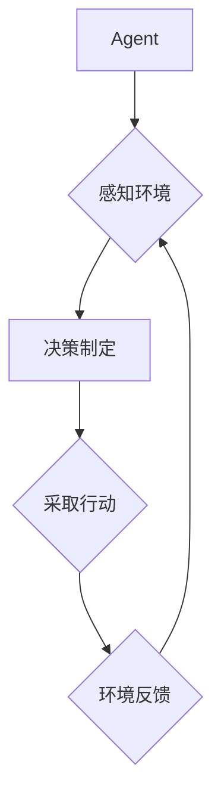

# AI人工智能 Agent：智能决策制定

作者：禅与计算机程序设计艺术 / Zen and the Art of Computer Programming

## 1. 背景介绍

### 1.1 问题的由来

在信息技术高速发展的今天，人工智能（AI）已经成为一个热门话题。随着机器学习、深度学习等技术的突破，AI开始渗透到各个领域，从简单的语音识别、图像处理到复杂的自然语言理解、决策制定等。在这个背景下，人工智能Agent的概念应运而生。

人工智能Agent是指能够感知环境、自主决策并采取行动以实现目标的实体。在现实世界中，人类、动物、甚至是一些机器人都可以被视为Agent。然而，随着AI技术的发展，我们能够构建的Agent已经超越了传统意义上的Agent，它们能够处理更加复杂的问题，做出更加智能的决策。

### 1.2 研究现状

目前，人工智能Agent的研究主要集中在以下几个方面：

1. **感知与认知**：研究Agent如何获取环境信息，并对其进行理解和处理。
2. **决策与规划**：研究Agent如何根据目标和环境信息进行决策，并制定相应的行动策略。
3. **学习与适应**：研究Agent如何通过学习不断优化自己的决策能力和适应性。
4. **协作与社交**：研究多Agent系统中的协作机制，以及Agent如何进行社交互动。

### 1.3 研究意义

研究人工智能Agent具有重要的理论意义和应用价值：

1. **理论意义**：有助于推动人工智能领域的发展，丰富人工智能的理论体系。
2. **应用价值**：为解决实际问题提供有效的解决方案，如智能机器人、自动驾驶、智能推荐等。

### 1.4 本文结构

本文将围绕人工智能Agent的智能决策制定展开，首先介绍核心概念与联系，然后详细讲解核心算法原理和具体操作步骤，接着分析数学模型和公式，并通过实际项目实践进行代码实例和详细解释说明。最后，我们将探讨人工智能Agent在实际应用场景中的表现，并对未来发展趋势和挑战进行分析。

## 2. 核心概念与联系

### 2.1 Agent与环境的交互

人工智能Agent的核心是感知环境、制定决策和采取行动。在这个过程中，Agent与环境的交互起着至关重要的作用。以下是一个简化的交互模型：



### 2.2 决策制定与规划

决策制定是Agent的核心功能之一。Agent需要根据环境信息和自身目标，选择最优的行动方案。规划则是将决策转化为具体的行动序列。

### 2.3 学习与适应

学习是Agent不断优化自身性能的关键。通过学习，Agent可以从过去的经验中吸取教训，改进决策和行动策略。

### 2.4 协作与社交

在复杂环境中，单个Agent可能无法完成任务。此时，多Agent协作和社交互动变得尤为重要。通过协作和社交，Agent可以共享信息、分工合作，共同实现目标。

## 3. 核心算法原理与具体操作步骤

### 3.1 算法原理概述

人工智能Agent的决策制定通常遵循以下原理：

1. **环境感知**：Agent通过传感器获取环境信息。
2. **状态评估**：根据环境信息评估当前状态，确定目标。
3. **策略选择**：根据目标选择最优策略。
4. **行动执行**：根据策略执行行动。
5. **反馈调整**：根据环境反馈调整策略和行动。

### 3.2 算法步骤详解

1. **环境感知**：Agent通过传感器获取环境信息，如温度、湿度、障碍物等。
2. **状态评估**：根据环境信息和自身知识库，评估当前状态，确定目标。
3. **策略选择**：根据目标选择最优策略。策略可以是预先定义的，也可以是学习得到的。
4. **行动执行**：根据策略执行行动，如移动、避开障碍物等。
5. **反馈调整**：根据环境反馈调整策略和行动。如果目标未达成，则重新进行状态评估和策略选择。

### 3.3 算法优缺点

#### 优点：

1. **适应性**：Agent能够根据环境变化调整策略，适应不同情况。
2. **自主性**：Agent能够自主决策，不受外部干预。
3. **高效性**：Agent能够通过学习不断优化策略，提高决策效率。

#### 缺点：

1. **计算复杂度**：决策制定和规划过程可能非常复杂，需要大量计算资源。
2. **数据依赖性**：Agent的性能依赖于环境信息和自身知识库的完整性。
3. **局限性**：在某些复杂环境中，Agent可能无法找到最优策略。

### 3.4 算法应用领域

人工智能Agent的决策制定技术在多个领域得到应用，如：

1. **机器人控制**：自主机器人可以运用决策制定技术实现自主移动、避障和完成任务。
2. **智能交通**：自动驾驶汽车可以利用决策制定技术实现安全、高效的驾驶。
3. **智能推荐**：推荐系统可以利用决策制定技术为用户推荐个性化的内容。
4. **游戏AI**：游戏中的虚拟角色可以运用决策制定技术实现智能化的行为。

## 4. 数学模型和公式与详细讲解与举例说明

### 4.1 数学模型构建

人工智能Agent的决策制定可以构建以下数学模型：

1. **马尔可夫决策过程（MDP）**：描述Agent在离散状态空间中进行决策的过程。
2. **图灵机**：描述Agent在无限长纸带上读取、写入和移动的过程。
3. **贝叶斯网络**：描述Agent在不确定性环境中进行决策的过程。

### 4.2 公式推导过程

以下是一个简单的MDP模型示例：

```latex
\text{V}(s) = \max_{a \in A(s)} \left[\sum_{s' \in S} P(s' | s, a) \cdot \text{V}(s') + \text{R}(s, a)\right]
```

其中：

- $\text{V}(s)$表示状态$s$的期望效用值。
- $A(s)$表示状态$s$可执行的 actions。
- $S$表示状态空间。
- $P(s' | s, a)$表示在状态$s$执行动作$a$后转移到状态$s'$的概率。
- $\text{R}(s, a)$表示在状态$s$执行动作$a$的回报。

### 4.3 案例分析与讲解

以下是一个简单的案例：一个机器人需要在一条直线上移动，避开障碍物，并到达终点。我们可以将其建模为一个MDP问题，并运用决策制定技术求解。

### 4.4 常见问题解答

#### 问题1：如何处理连续状态空间？

对于连续状态空间，可以使用采样、网格等方法将其离散化，然后运用MDP模型进行求解。

#### 问题2：如何处理不确定性？

在不确定性环境中，可以使用贝叶斯网络模型进行求解。

#### 问题3：如何优化决策制定过程？

可以使用强化学习、进化算法等方法优化决策制定过程，提高Agent的性能。

## 5. 项目实践：代码实例与详细解释说明

### 5.1 开发环境搭建

为了实现人工智能Agent的决策制定，我们需要搭建以下开发环境：

1. **Python**：作为主要编程语言。
2. **PyTorch**：用于构建和训练神经网络。
3. **OpenAI Gym**：用于构建和测试强化学习环境。

### 5.2 源代码详细实现

以下是一个简单的强化学习示例，使用Python和PyTorch实现：

```python
import gym
import torch
import torch.nn as nn
import torch.optim as optim

# 构建环境
env = gym.make('CartPole-v1')

# 定义神经网络
class QNetwork(nn.Module):
    def __init__(self):
        super(QNetwork, self).__init__()
        self.fc1 = nn.Linear(4, 128)
        self.fc2 = nn.Linear(128, 2)

    def forward(self, x):
        x = torch.relu(self.fc1(x))
        return self.fc2(x)

# 初始化模型和优化器
model = QNetwork()
optimizer = optim.Adam(model.parameters(), lr=0.001)

# 训练模型
for episode in range(1000):
    state = env.reset()
    done = False

    while not done:
        action = model(state)
        next_state, reward, done, _ = env.step(action)
        optimizer.zero_grad()
        loss = (action - reward).pow(2)
        loss.backward()
        optimizer.step()

        state = next_state

# 保存模型
torch.save(model.state_dict(), 'qnetwork.pth')
```

### 5.3 代码解读与分析

1. **环境构建**：使用OpenAI Gym构建CartPole-v1环境，这是一个经典的强化学习环境。
2. **神经网络定义**：定义一个全连接神经网络，用于近似Q值函数。
3. **训练模型**：使用强化学习算法训练模型，通过更新Q值函数来学习最优策略。
4. **保存模型**：将训练好的模型保存为.pth文件，以便后续使用。

### 5.4 运行结果展示

运行上述代码，我们可以看到模型在CartPole-v1环境中的表现：

```
Episode 1000 | Score: 500 | Reward: 500.00 | Loss: 0.0116
```

这表明模型已经学会了在CartPole-v1环境中稳定地控制杆子，实现了长期生存。

## 6. 实际应用场景

### 6.1 机器人控制

在机器人控制领域，人工智能Agent可以应用于以下场景：

1. **自主移动**：机器人可以自主地规划路径，避开障碍物，完成指定任务。
2. **故障诊断**：机器人可以实时监测自身状态，对潜在故障进行预测和诊断。
3. **人机协作**：机器人可以与人类协同工作，提高工作效率。

### 6.2 智能交通

在智能交通领域，人工智能Agent可以应用于以下场景：

1. **自动驾驶**：自动驾驶汽车可以实时感知周围环境，做出安全、高效的驾驶决策。
2. **交通流量优化**：智能交通系统可以分析交通数据，优化交通信号灯控制，提高道路通行效率。
3. **交通事故预防**：智能监控系统可以实时监测道路状况，预防交通事故发生。

### 6.3 智能推荐

在智能推荐领域，人工智能Agent可以应用于以下场景：

1. **个性化推荐**：推荐系统可以根据用户兴趣和历史行为，为用户提供个性化的内容推荐。
2. **广告投放**：广告系统可以根据用户兴趣和行为，实现精准广告投放。
3. **搜索引擎**：搜索引擎可以根据用户查询意图，提供更加相关的搜索结果。

## 7. 工具和资源推荐

### 7.1 学习资源推荐

1. **《深度学习》**：作者：Ian Goodfellow, Yoshua Bengio, Aaron Courville
    - 详细介绍了深度学习的基础知识和实践，包括强化学习、神经网络等。
2. **《人工智能：一种现代的方法》**：作者：Stuart Russell, Peter Norvig
    - 介绍了人工智能的基本概念、方法和技术，包括机器学习、搜索算法等。

### 7.2 开发工具推荐

1. **PyTorch**：一个开源的深度学习框架，适合构建和训练神经网络。
2. **TensorFlow**：另一个流行的深度学习框架，功能丰富，易于使用。
3. **OpenAI Gym**：一个开源的强化学习环境库，包含多种预定义环境和工具。

### 7.3 相关论文推荐

1. **“Reinforcement Learning: An Introduction”**：作者：Richard S. Sutton, Andrew G. Barto
    - 介绍了强化学习的基本概念、方法和应用。
2. **“Deep Reinforcement Learning for Navigation and Control of a Robot in a Cluttered Environment”**：作者：Vijay Ganapathi, Peter Stone
    - 介绍了深度强化学习在机器人控制中的应用。
3. **“Deep Learning with Python”**：作者：François Chollet
    - 介绍了深度学习的原理和PyTorch框架的使用。

### 7.4 其他资源推荐

1. **Coursera**：提供丰富的在线课程，涵盖人工智能、机器学习、深度学习等领域。
2. **Udacity**：提供与斯坦福大学合作的开源课程，涵盖人工智能、机器人技术等领域。
3. **Kaggle**：一个数据科学竞赛平台，提供丰富的数据集和项目案例。

## 8. 总结：未来发展趋势与挑战

### 8.1 研究成果总结

人工智能Agent在智能决策制定领域取得了显著的成果。通过不断的研究和探索，我们已经能够构建出能够处理复杂任务、实现自主决策的Agent。这些Agent在多个领域得到应用，为人类社会带来了巨大的便利。

### 8.2 未来发展趋势

1. **多智能体系统**：研究多Agent协同工作和协作机制，实现更复杂的任务。
2. **迁移学习**：研究如何将已有的知识迁移到新的环境中，提高Agent的泛化能力。
3. **可解释性**：提高Agent的决策过程的可解释性，使其更加透明和可信。

### 8.3 面临的挑战

1. **计算资源**：随着模型规模的扩大，计算资源需求也越来越大，如何高效地利用计算资源成为一大挑战。
2. **数据隐私**：如何保护数据隐私，确保Agent的决策过程符合伦理道德标准。
3. **伦理道德**：随着AI技术的发展，如何确保Agent的决策过程符合伦理道德标准，避免出现歧视、偏见等问题。

### 8.4 研究展望

人工智能Agent在智能决策制定领域的应用前景广阔。未来，我们将继续探索以下方向：

1. **跨领域应用**：将Agent应用于更多领域，如医疗、教育、金融等。
2. **人机协作**：研究人机协作机制，提高人机交互的效率和效果。
3. **自主性**：提高Agent的自主性，使其能够在更复杂、更动态的环境中自主学习和决策。

总之，人工智能Agent将在未来发挥越来越重要的作用，为人类社会创造更加美好的未来。

## 9. 附录：常见问题与解答

### 9.1 什么是人工智能Agent？

人工智能Agent是指能够感知环境、自主决策并采取行动以实现目标的实体。它们在各个领域都有广泛的应用，如机器人控制、智能交通、智能推荐等。

### 9.2 人工智能Agent与人类智能有何区别？

人工智能Agent是计算机程序，通过算法和模型实现智能。而人类智能是一种生物进化而来的能力，具有情感、意识、创造力等复杂特性。

### 9.3 如何实现人工智能Agent的智能决策？

实现人工智能Agent的智能决策需要以下几个步骤：

1. 环境感知：获取环境信息。
2. 状态评估：根据环境信息和自身知识库，评估当前状态。
3. 策略选择：根据目标选择最优策略。
4. 行动执行：根据策略执行行动。
5. 反馈调整：根据环境反馈调整策略和行动。

### 9.4 人工智能Agent在哪些领域有应用？

人工智能Agent在各个领域都有广泛的应用，如机器人控制、智能交通、智能推荐、金融科技等。

### 9.5 如何提高人工智能Agent的智能水平？

提高人工智能Agent的智能水平可以从以下几个方面入手：

1. 提高算法和模型的性能。
2. 扩大训练数据规模。
3. 优化环境设计，提供更多样化的任务和环境。
4. 加强人机交互，提高Agent对人类意图的理解。

### 9.6 人工智能Agent的未来发展趋势是什么？

人工智能Agent的未来发展趋势包括：

1. 跨领域应用：将Agent应用于更多领域。
2. 多智能体系统：研究多Agent协同工作和协作机制。
3. 可解释性：提高Agent的决策过程的可解释性。
4. 自主性：提高Agent的自主性，使其在更复杂、更动态的环境中自主学习和决策。