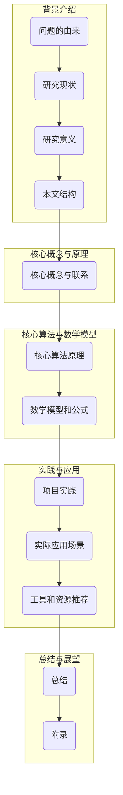
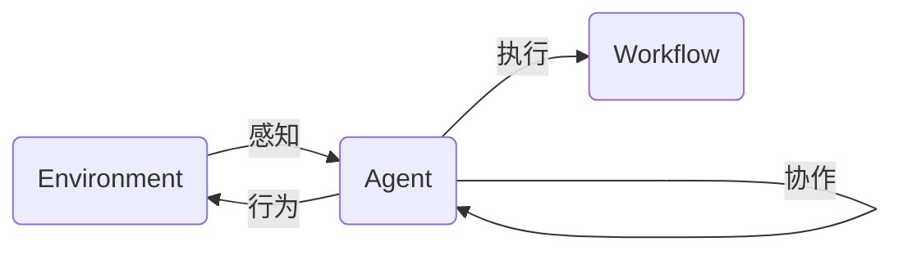

# AI人工智能代理工作流AI Agent WorkFlow：代理通信与协作模型概览

## 1. 背景介绍

### 1.1 问题的由来

在当今快节奏的商业环境中,企业和组织面临着越来越多的挑战,例如高度复杂的工作流程、海量数据处理、实时决策需求等。为了应对这些挑战,人工智能(AI)代理技术应运而生。AI代理是一种自主软件实体,能够感知环境、处理信息、做出决策并执行行动,从而协助或代替人类完成各种任务。

随着AI技术的不断发展,代理系统变得越来越智能和复杂。单个代理已经无法满足现代应用的需求,因此需要多个代理协同工作,形成了"AI代理工作流"(AI Agent Workflow)的概念。在这种工作流中,代理之间需要高效通信和协作,以完成分布式任务。然而,代理通信和协作模型的设计和实现存在诸多挑战,这正是本文探讨的核心问题。

### 1.2 研究现状

目前,已有多种代理通信和协作模型被提出和研究,例如基于消息传递的模型、基于协议的模型、基于组织的模型等。这些模型各有优缺点,适用于不同的应用场景。

基于消息传递的模型通过定义消息格式和传递机制来实现代理之间的通信,具有较好的可扩展性和灵活性。但是,它缺乏对代理行为和协作过程的高级控制。

基于协议的模型则通过预定义的协议规范来约束代理的行为和交互过程,确保代理之间的通信和协作能够按照预期进行。然而,这种模型通常缺乏动态适应能力,难以应对复杂和不确定的环境。

基于组织的模型将代理视为组织中的成员,通过定义组织结构、角色和规则来协调代理的行为。这种模型具有较好的可扩展性和鲁棒性,但是实现起来较为复杂。

### 1.3 研究意义

设计一种高效、可靠、可扩展的代理通信和协作模型,对于实现智能化的分布式系统和应用具有重要意义。它可以带来以下好处:

1. **提高系统效率**:通过代理之间的协作,可以更好地分配和利用计算资源,提高任务执行效率。
2. **增强系统鲁棒性**:代理可以相互监控和备份,提高系统的容错能力和可靠性。
3. **支持复杂任务**:多个代理协同工作,可以完成单个代理无法胜任的复杂任务。
4. **促进决策优化**:代理可以共享信息和知识,从而做出更加明智的决策。
5. **实现动态适应**:代理可以根据环境变化动态调整行为和协作策略。

### 1.4 本文结构

本文将全面介绍AI代理工作流中的通信和协作模型。首先阐述核心概念和原理,然后详细讨论核心算法和数学模型,并通过实际案例和代码示例进行说明。最后,探讨该模型的应用场景、发展趋势和挑战。文章结构如下:

## 2. 核心概念与联系

在探讨AI代理工作流的通信和协作模型之前,我们先介绍一些核心概念:

1. **代理(Agent)**: 代理是一种自主的软件实体,能够感知环境、处理信息、做出决策并执行行动。代理可以代表人或其他实体,执行特定任务。

2. **环境(Environment)**: 环境是代理所处的外部世界,包括其他代理、资源、约束条件等。代理通过感知器获取环境信息,并通过执行器对环境产生影响。

3. **感知(Perception)**: 代理通过感知器获取环境信息,例如传感器数据、消息等。感知是代理了解环境的基础。

4. **行为(Action)**: 代理根据感知到的信息和内部状态,做出决策并执行相应的行为,通过执行器对环境产生影响。

5. **通信(Communication)**: 代理之间需要通过通信来交换信息、协调行为。通信可以是直接的(如消息传递),也可以是间接的(如通过环境交互)。

6. **协作(Cooperation)**: 多个代理通过通信和协调行为,共同完成一个或多个目标,这个过程称为协作。协作需要代理之间的互相理解和信任。

7. **工作流(Workflow)**: 工作流是一系列有序的活动,用于完成特定的任务或目标。AI代理工作流是由多个代理协同执行的工作流程。

这些概念相互关联,构成了AI代理工作流的基础。代理在特定环境中感知信息、做出决策并执行行为,同时通过通信和协作来完成复杂的工作流任务。下图展示了这些概念之间的关系:

## 3. 核心算法原理 & 具体操作步骤

### 3.1 算法原理概述

AI代理工作流的通信和协作模型需要解决以下几个关键问题:

1. **通信机制**: 如何实现代理之间高效、可靠的信息交换?
2. **协作策略**: 如何协调多个代理的行为,使它们能够协同完成任务?
3. **任务分解**: 如何将复杂任务分解为可由多个代理执行的子任务?
4. **资源分配**: 如何合理分配计算资源,提高任务执行效率?
5. **冲突解决**: 如何处理代理之间的冲突和不一致情况?
6. **动态适应**: 如何使模型能够动态适应环境变化?

为了解决这些问题,我们提出了一种基于契约网(Contract Net)协议和多智能体系统(Multi-Agent System)理论的通信和协作模型。该模型的核心算法步骤如下:

### 3.2 算法步骤详解

1. **任务分解**

   - 将复杂任务分解为一系列子任务,每个子任务都有明确的目标和约束条件。
   - 使用层次分析法(Analytic Hierarchy Process, AHP)等方法确定每个子任务的优先级和权重。

2. **代理发现**

   - 使用多播或中介机制发现能够执行特定子任务的合适代理。
   - 代理通过注册和发布自身能力,使其他代理能够发现它们。

3. **任务招标**

   - 管理代理(Manager Agent)向合适的代理发送任务招标请求(Task Announcement)。
   - 招标请求包含子任务描述、约束条件、截止时间等信息。

4. **投标响应**

   - 接收到招标请求的代理计算执行该子任务的成本和效用。
   - 代理根据自身状态和能力决定是否投标,并向管理代理发送投标响应(Bid)。

5. **投标评估**

   - 管理代理收集所有投标响应,并根据预定义的评估函数(如成本、时间、信任度等)对投标进行评估和排序。
   - 选择最优投标,将子任务分配给相应的代理执行。

6. **任务执行**

   - 被选中的代理执行分配的子任务。
   - 代理可以根据需要与其他代理通信和协作,例如请求帮助、共享信息等。

7. **结果汇报**

   - 代理将子任务执行结果报告给管理代理。
   - 管理代理汇总所有子任务结果,得到整个任务的最终输出。

8. **动态调整**

   - 在执行过程中,代理和管理代理会持续监控环境变化和任务进度。
   - 如果发生意外情况(如代理失效、约束条件变化等),可以动态调整分配策略和协作方式。

该算法的优点是将复杂任务分解为多个子任务,由不同代理并行执行,从而提高了效率和鲁棒性。同时,基于投标机制可以选择最优代理执行每个子任务,提高了资源利用率。此外,算法具有一定的动态适应能力,可以根据环境变化调整策略。

### 3.3 算法优缺点

**优点**:

1. **高效并行**: 将任务分解为多个子任务,由不同代理并行执行,提高了整体效率。
2. **资源优化**: 通过投标机制选择最优代理执行每个子任务,提高了资源利用率。
3. **容错能力**: 如果某个代理失效,可以重新分配其任务,提高了系统的鲁棒性。
4. **动态适应**: 算法可以根据环境变化动态调整分配策略和协作方式。
5. **开放性**: 新的代理可以动态加入系统,提高了系统的扩展性。

**缺点**:

1. **通信开销**: 代理之间需要频繁通信(招标、投标、结果汇报等),会带来一定的通信开销。
2. **决策复杂度**: 评估投标响应和做出最优决策是一个复杂的过程,需要精心设计评估函数。
3. **任务依赖**: 如果子任务之间存在依赖关系,可能会影响并行执行的效率。
4. **信任问题**: 代理之间需要建立一定的信任机制,以确保协作的可靠性。
5. **动态性挑战**: 在高度动态的环境中,算法的适应能力可能受到限制。

### 3.4 算法应用领域

该算法可以应用于各种需要多个智能体协同工作的领域,例如:

1. **智能制造**: 多个机器人代理协作完成复杂的制造任务。
2. **智能交通**: 车辆代理协作规划最优路线,减少拥堵。
3. **智能物流**: 多个代理协调仓储、运输等物流活动。
4. **智能建筑**: 代理协作管理建筑的能源利用、安全等方面。
5. **智能医疗**: 代理协助诊断、治疗方案制定等医疗任务。
6. **军事指挥**: 代理协助战场决策、资源调度等军事任务。
7. **科学计算**: 代理协作执行大规模并行计算任务。
8. **智能游戏**: 代理扮演不同角色,协作完成游戏任务。

总的来说,该算法适用于需要多个智能体高效协作的分布式系统和应用场景。

## 4. 数学模型和公式 & 详细讲解 & 举例说明

在AI代理工作流的通信和协作模型中,我们需要构建数学模型来量化和优化各个环节,例如任务分解、代理选择、资源分配等。下面将详细介绍相关的数学模型和公式。

### 4.1 数学模型构建

#### 任务模型

我们将整个任务表示为一个有向无环图 $G = (V, E)$,其中:

- $V$ 是任务节点集合,每个节点 $v_i \in V$ 表示一个子任务。
- $E$ 是边集合,表示子任务之间的依赖关系。如果存在一条边 $(v_i, v_j) \in E$,则表示子任务 $v_j$ 依赖于子任务 $v_i$ 的输出。

每个子任务 $v_i$ 都有一个关联的代价函数 $c_i(a_i)$,表示由代理 $a_i$ 执行该子