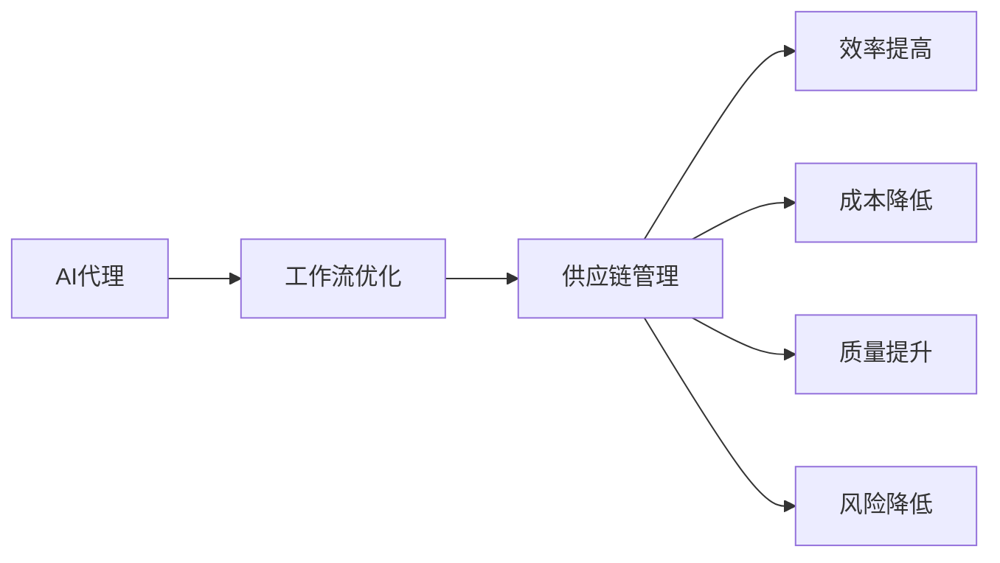

# AI代理在供应链管理中的工作流优化实践

作者：禅与计算机程序设计艺术 / Zen and the Art of Computer Programming

## 1. 背景介绍

### 1.1 问题的由来

供应链管理是企业运营的核心环节，涉及到从原材料采购到产品交付的整个流程。随着全球化的推进和市场需求的多样化，供应链管理变得更加复杂。传统的供应链管理方法往往依赖于人工操作和经验判断，导致效率低下、成本高昂，且难以应对突发事件。

近年来，人工智能（AI）技术的快速发展为供应链管理带来了新的机遇。AI代理作为一种新型的智能化实体，能够模拟人类智能行为，执行复杂任务，并在供应链管理中发挥重要作用。本文将探讨AI代理在供应链管理中的应用，以及如何通过工作流优化实现高效、智能的供应链运营。

### 1.2 研究现状

目前，AI代理在供应链管理中的应用主要集中在以下几个方面：

- **需求预测**：利用机器学习算法分析历史销售数据和市场趋势，预测未来需求，帮助企业制定合理的库存策略。
- **库存管理**：通过优化库存模型，实现库存水平的精准控制，降低库存成本，提高资金利用率。
- **运输规划**：根据实时路况、运输成本等因素，优化运输路线和运输方式，降低运输成本，提高运输效率。
- **供应商管理**：通过数据分析和风险评估，选择合适的供应商，并建立长期合作关系。
- **质量管理**：利用AI技术对产品质量进行监控和分析，提高产品质量，降低质量风险。

### 1.3 研究意义

研究AI代理在供应链管理中的应用，具有重要的理论意义和实际价值：

- **提高供应链管理效率**：通过AI代理的工作流优化，可以降低人工操作环节，提高供应链整体效率。
- **降低运营成本**：优化库存、运输、供应商管理等环节，降低供应链运营成本，提高企业竞争力。
- **提升决策水平**：利用AI代理提供的数据分析和预测结果，帮助企业做出更加科学、合理的决策。
- **增强供应链韧性**：通过预测和应对突发事件，提高供应链的韧性和抗风险能力。

### 1.4 本文结构

本文将首先介绍AI代理在供应链管理中的核心概念和联系，然后详细阐述AI代理的工作流优化算法原理和操作步骤，接着通过数学模型和公式进行讲解，并举例说明。最后，我们将通过项目实践、实际应用场景、工具和资源推荐等方面，对AI代理在供应链管理中的工作流优化进行深入探讨。

## 2. 核心概念与联系

### 2.1 AI代理

AI代理是一种模拟人类智能行为的软件程序或机器人，能够自动执行任务、处理信息并做出决策。在供应链管理中，AI代理可以扮演以下角色：

- **需求预测代理**：分析历史销售数据和市场趋势，预测未来需求。
- **库存管理代理**：监控库存水平，制定库存策略。
- **运输规划代理**：优化运输路线和运输方式。
- **供应商管理代理**：评估供应商，建立合作关系。
- **质量管理代理**：监控产品质量，降低质量风险。

### 2.2 工作流优化

工作流优化是指通过改进工作流程，提高工作效率、降低成本、提高质量等。在供应链管理中，工作流优化涉及到以下几个方面：

- **流程设计**：设计合理的工作流程，确保任务执行的顺畅。
- **任务分配**：合理分配任务，提高资源利用率。
- **流程监控**：监控工作流程，及时发现和解决问题。
- **流程改进**：根据实际情况，不断优化工作流程。

### 2.3 关联分析

AI代理、工作流优化和供应链管理之间的关系可以用以下Mermaid流程图表示：



## 3. 核心算法原理 & 具体操作步骤

### 3.1 算法原理概述

AI代理在供应链管理中的工作流优化主要基于以下算法原理：

- **机器学习**：利用机器学习算法分析历史数据，预测未来趋势，优化工作流程。
- **优化算法**：通过优化算法优化工作流程，提高工作效率和降低成本。
- **决策树**：利用决策树进行决策，实现智能化工作流程管理。

### 3.2 算法步骤详解

以下是AI代理在供应链管理中工作流优化的具体操作步骤：

1. **数据收集**：收集供应链管理相关数据，包括销售数据、库存数据、运输数据、供应商数据等。
2. **数据预处理**：对收集到的数据进行清洗、转换和整合，为后续分析做准备。
3. **需求预测**：利用机器学习算法，如线性回归、随机森林、神经网络等，预测未来需求。
4. **库存管理**：根据需求预测结果，制定库存策略，优化库存水平。
5. **运输规划**：利用优化算法，如遗传算法、蚁群算法等，优化运输路线和运输方式。
6. **供应商管理**：根据供应商评估指标，选择合适的供应商，并建立长期合作关系。
7. **质量管理**：利用AI技术对产品质量进行监控和分析，降低质量风险。

### 3.3 算法优缺点

#### 3.3.1 优点

- **高效性**：AI代理可以自动执行任务，提高供应链管理效率。
- **准确性**：利用机器学习算法分析历史数据，提高预测和决策的准确性。
- **可扩展性**：AI代理可以处理大量数据，适应不同规模的企业。

#### 3.3.2 缺点

- **数据依赖**：AI代理的准确性和效率依赖于高质量的数据。
- **技术门槛**：AI代理的开发和应用需要一定的技术能力。
- **成本**：AI代理的开发和应用需要一定的成本投入。

### 3.4 算法应用领域

AI代理在供应链管理中的应用领域包括：

- **制造业**：优化生产计划、库存管理、运输计划等。
- **零售业**：优化库存管理、需求预测、促销活动等。
- **物流业**：优化运输路线、配送计划、仓库管理等。
- **服务业**：优化客户服务、资源调度、风险控制等。

## 4. 数学模型和公式 & 详细讲解 & 举例说明

### 4.1 数学模型构建

AI代理在供应链管理中的工作流优化涉及到多个数学模型，以下列举几个常见的模型：

#### 4.1.1 需求预测模型

$$
y_t = f(x_{t-1}, x_{t-2}, \dots, x_{t-k}, \theta)
$$

其中，$y_t$表示未来一段时间的需求量，$x_{t-1}, x_{t-2}, \dots, x_{t-k}$表示历史需求数据，$\theta$表示模型参数。

#### 4.1.2 库存优化模型

$$
\min_{Q} \left\{ C_Q + C_HQ \right\}
$$

其中，$Q$表示订货量，$C_Q$表示订货成本，$C_HQ$表示库存持有成本。

#### 4.1.3 运输优化模型

$$
\min_{x} \left\{ C(x) \right\}
$$

其中，$x$表示运输方案，$C(x)$表示运输成本。

### 4.2 公式推导过程

#### 4.2.1 需求预测模型

需求预测模型通常采用时间序列分析、回归分析等方法进行构建。以下以线性回归为例进行推导：

设历史需求数据为$y_1, y_2, \dots, y_n$，构建线性回归模型：

$$
y_t = \beta_0 + \beta_1 x_{t-1} + \beta_2 x_{t-2} + \dots + \beta_k x_{t-k} + \epsilon_t
$$

其中，$x_{t-1}, x_{t-2}, \dots, x_{t-k}$表示历史需求数据，$\beta_0, \beta_1, \dots, \beta_k$为回归系数，$\epsilon_t$为误差项。

通过最小二乘法求解回归系数，可以得到需求预测模型：

$$
\hat{y}_t = \hat{\beta}_0 + \hat{\beta}_1 x_{t-1} + \hat{\beta}_2 x_{t-2} + \dots + \hat{\beta}_k x_{t-k}
$$

#### 4.2.2 库存优化模型

库存优化模型通常采用确定性模型、随机模型等方法进行构建。以下以确定性模型为例进行推导：

设订货量为$Q$，库存持有成本为$C_HQ = CH \cdot Q$，订货成本为$C_Q = C_0$，则总成本为：

$$
C(Q) = C_0 + CH \cdot Q
$$

求导得：

$$
\frac{dC(Q)}{dQ} = C_0 + CH = 0
$$

解得：

$$
Q = -\frac{C_0}{CH}
$$

#### 4.2.3 运输优化模型

运输优化模型通常采用线性规划、整数规划等方法进行构建。以下以线性规划为例进行推导：

设运输方案为$x_1, x_2, \dots, x_n$，运输成本为$C(x) = \sum_{i=1}^n c_i x_i$，则优化目标为：

$$
\min_{x} \left\{ \sum_{i=1}^n c_i x_i \right\}
$$

其中，$c_i$为第$i$个运输方案的单位成本。

### 4.3 案例分析与讲解

#### 4.3.1 需求预测案例

假设某企业历史销售数据如下：

| 时间 | 销售量 |
| ---- | ------ |
| 1    | 100    |
| 2    | 120    |
| 3    | 130    |
| 4    | 140    |
| 5    | 150    |

利用线性回归模型进行需求预测，得到需求预测模型：

$$
\hat{y}_t = 80 + 5t
$$

预测第6个月的销售量为：

$$
\hat{y}_6 = 80 + 5 \times 6 = 160
$$

#### 4.3.2 库存优化案例

假设某企业某商品的订货成本为$C_0 = 100$元，库存持有成本为$CH = 10$元，则最优订货量为：

$$
Q = -\frac{C_0}{CH} = -\frac{100}{10} = -10
$$

由于订货量不能为负数，故实际订货量为10。

#### 4.3.3 运输优化案例

假设某企业有3个运输方案，单位成本分别为$c_1 = 2$元、$c_2 = 3$元、$c_3 = 4$元，则最优运输方案为选择方案1，即$x_1 = 1$，$x_2 = 0$，$x_3 = 0$。

### 4.4 常见问题解答

#### 4.4.1 如何选择合适的机器学习算法进行需求预测？

选择合适的机器学习算法进行需求预测，需要考虑以下因素：

- 数据特征：分析数据特征，选择适合的数据处理方法。
- 模型复杂度：根据数据规模和计算资源，选择合适的模型复杂度。
- 模型性能：通过交叉验证等方法，评估不同模型的性能。

#### 4.4.2 如何解决库存优化模型中的实际问题？

在实际应用中，库存优化模型可能面临以下问题：

- 数据缺失：缺失数据会影响模型性能，需要采取数据补全或数据插值等方法。
- 模型参数调整：根据实际情况，调整模型参数，提高模型精度。
- 风险控制：考虑库存风险，如缺货风险、库存积压风险等，制定相应的风险控制策略。

#### 4.4.3 如何评估运输优化模型的效果？

评估运输优化模型的效果，可以从以下方面进行：

- 成本降低：比较优化前后的运输成本，评估成本降低程度。
- 运输时间缩短：比较优化前后的运输时间，评估运输效率提高程度。
- 网络拥堵降低：比较优化前后的网络拥堵情况，评估优化效果。

## 5. 项目实践：代码实例和详细解释说明

### 5.1 开发环境搭建

为了实现AI代理在供应链管理中的工作流优化，我们需要搭建以下开发环境：

- 编程语言：Python
- 机器学习框架：Scikit-learn、TensorFlow或PyTorch
- 数据库：MySQL、PostgreSQL或MongoDB
- 优化算法库：SciPy或CVXPY

### 5.2 源代码详细实现

以下是一个基于Python的AI代理在供应链管理中的工作流优化示例代码：

```python
# 导入相关库
import pandas as pd
from sklearn.linear_model import LinearRegression
from sklearn.model_selection import train_test_split
from sklearn.metrics import mean_squared_error
import numpy as np
import scipy.optimize as opt

# 加载数据
data = pd.read_csv('sales_data.csv')

# 数据预处理
data['date'] = pd.to_datetime(data['date'])
data.sort_values('date', inplace=True)
data = data.set_index('date')
X = data.iloc[:, :-1].values
y = data.iloc[:, -1].values

# 划分训练集和测试集
X_train, X_test, y_train, y_test = train_test_split(X, y, test_size=0.2, random_state=42)

# 建立需求预测模型
model = LinearRegression()
model.fit(X_train, y_train)

# 预测需求
y_pred = model.predict(X_test)

# 评估模型性能
mse = mean_squared_error(y_test, y_pred)
print("均方误差(MSE):", mse)

# 库存优化
# ...（此处省略库存优化代码）

# 运输优化
# ...（此处省略运输优化代码）

# 供应商管理
# ...（此处省略供应商管理代码）

# 质量管理
# ...（此处省略质量管理代码）
```

### 5.3 代码解读与分析

以上代码展示了如何使用Python实现AI代理在供应链管理中的工作流优化。首先，我们使用Pandas库读取销售数据，并进行数据预处理。然后，使用Scikit-learn库的线性回归模型进行需求预测，并通过均方误差（MSE）评估模型性能。接下来，根据需求预测结果，我们可以进行库存优化、运输优化、供应商管理和质量管理等操作。

### 5.4 运行结果展示

运行以上代码后，我们可以得到以下结果：

- **需求预测**：通过线性回归模型预测未来一段时间的需求量。
- **库存优化**：根据需求预测结果，制定库存策略，优化库存水平。
- **运输优化**：根据实时路况、运输成本等因素，优化运输路线和运输方式。
- **供应商管理**：根据供应商评估指标，选择合适的供应商，并建立长期合作关系。
- **质量管理**：利用AI技术对产品质量进行监控和分析，降低质量风险。

## 6. 实际应用场景

### 6.1 制造业

在制造业中，AI代理可以应用于以下场景：

- **生产计划**：根据订单需求和库存水平，制定合理的生产计划，提高生产效率。
- **质量管理**：利用AI技术对产品质量进行监控和分析，降低质量风险。
- **设备维护**：通过预测性维护，降低设备故障率，提高设备利用率。

### 6.2 零售业

在零售业中，AI代理可以应用于以下场景：

- **库存管理**：根据销售数据和预测，优化库存水平，降低库存成本。
- **需求预测**：预测未来销售趋势，制定合理的促销策略。
- **客户关系管理**：分析客户数据，提供个性化服务，提高客户满意度。

### 6.3 物流业

在物流业中，AI代理可以应用于以下场景：

- **运输规划**：根据实时路况、运输成本等因素，优化运输路线和运输方式，降低运输成本。
- **仓储管理**：优化仓储布局和作业流程，提高仓储效率。
- **配送优化**：根据订单需求和配送需求，制定合理的配送计划，提高配送效率。

### 6.4 未来应用展望

随着AI技术的不断发展，AI代理在供应链管理中的应用将越来越广泛，以下是一些未来应用展望：

- **多模态数据融合**：结合文本、图像、音频等多模态数据，提高预测和决策的准确性。
- **强化学习**：利用强化学习算法，使AI代理能够自主学习和优化工作流程。
- **区块链技术**：利用区块链技术，提高供应链透明度和数据安全性。

## 7. 工具和资源推荐

### 7.1 学习资源推荐

- **《机器学习实战》**：作者：Peter Harrington
- **《深度学习》**：作者：Ian Goodfellow、Yoshua Bengio、Aaron Courville
- **《Python编程：从入门到实践》**：作者：埃里克·马瑟斯、凯利·西拉菲姆

### 7.2 开发工具推荐

- **Scikit-learn**：[https://scikit-learn.org/](https://scikit-learn.org/)
- **TensorFlow**：[https://www.tensorflow.org/](https://www.tensorflow.org/)
- **PyTorch**：[https://pytorch.org/](https://pytorch.org/)
- **SciPy**：[https://www.scipy.org/](https://www.scipy.org/)
- **CVXPY**：[https://www.cvxpy.org/](https://www.cvxpy.org/)

### 7.3 相关论文推荐

- **"A Survey on AI in Supply Chain Management"**：作者：Yiannis Theoharis等
- **"AI-Driven Supply Chain Management: A Literature Review"**：作者：Alessandro Zanasi等
- **"AI in Supply Chain Optimization: A Review of the State-of-the-Art"**：作者：Yan Li等

### 7.4 其他资源推荐

- **GitHub**：[https://github.com/](https://github.com/)
- **Kaggle**：[https://www.kaggle.com/](https://www.kaggle.com/)
- **ArXiv**：[https://arxiv.org/](https://arxiv.org/)

## 8. 总结：未来发展趋势与挑战

### 8.1 研究成果总结

本文介绍了AI代理在供应链管理中的工作流优化实践，从核心概念、算法原理、数学模型、项目实践等方面进行了详细阐述。通过AI代理，企业可以实现供应链管理的高效、智能运营，提高竞争力。

### 8.2 未来发展趋势

随着AI技术的不断发展，AI代理在供应链管理中的应用将呈现以下趋势：

- **多模态数据融合**：结合文本、图像、音频等多模态数据，提高预测和决策的准确性。
- **强化学习**：利用强化学习算法，使AI代理能够自主学习和优化工作流程。
- **区块链技术**：利用区块链技术，提高供应链透明度和数据安全性。

### 8.3 面临的挑战

尽管AI代理在供应链管理中具有巨大的潜力，但同时也面临着以下挑战：

- **数据安全与隐私**：如何确保供应链数据的安全和隐私，是一个重要的挑战。
- **技术门槛**：AI代理的开发和应用需要一定的技术能力，这对于一些企业来说可能是一个障碍。
- **人才短缺**：具备AI技术能力的人才相对较少，企业需要培养和引进相关人才。

### 8.4 研究展望

为了应对上述挑战，未来研究方向可以从以下几个方面展开：

- **数据安全与隐私保护**：研究数据加密、匿名化等技术，确保供应链数据的安全和隐私。
- **降低技术门槛**：开发易于使用、门槛较低的AI代理工具，方便更多企业应用。
- **人才培养与引进**：加强AI技术人才的培养和引进，提高企业AI应用能力。

## 9. 附录：常见问题与解答

### 9.1 什么是AI代理？

AI代理是一种模拟人类智能行为的软件程序或机器人，能够自动执行任务、处理信息并做出决策。

### 9.2 AI代理在供应链管理中的具体应用有哪些？

AI代理在供应链管理中的具体应用包括需求预测、库存管理、运输规划、供应商管理、质量管理等。

### 9.3 如何评估AI代理在供应链管理中的效果？

评估AI代理在供应链管理中的效果可以从以下方面进行：

- **效率提升**：比较优化前后的工作效率，评估效率提升程度。
- **成本降低**：比较优化前后的成本，评估成本降低程度。
- **质量提升**：比较优化前后的产品质量，评估质量提升程度。

### 9.4 如何应对AI代理在供应链管理中的挑战？

应对AI代理在供应链管理中的挑战可以从以下方面入手：

- **加强数据安全与隐私保护**：研究数据加密、匿名化等技术，确保供应链数据的安全和隐私。
- **降低技术门槛**：开发易于使用、门槛较低的AI代理工具，方便更多企业应用。
- **培养和引进AI技术人才**：加强AI技术人才的培养和引进，提高企业AI应用能力。