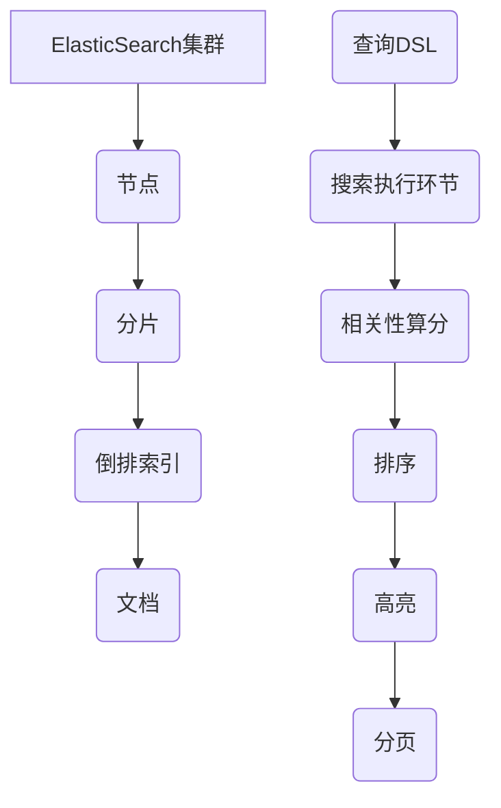
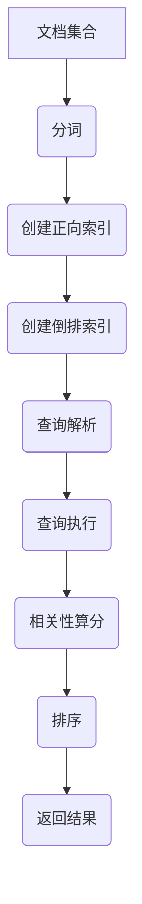

# ElasticSearch分布式搜索引擎原理与代码实例讲解

## 1. 背景介绍

### 1.1 问题的由来

在当今的数字时代，海量的数据被不断产生和存储。如何高效地检索和管理这些庞大的数据集成为了一个关键挑战。传统的关系型数据库虽然在事务处理和数据一致性方面表现出色,但在处理非结构化数据和大规模分布式环境下却显得力不从心。这就催生了全文搜索引擎的兴起,旨在提供快速、可扩展且高可用的数据检索服务。

ElasticSearch作为一款开源的分布式全文搜索和分析引擎,凭借其简单、高效且可扩展的特性,迅速成为大数据场景下的首选方案之一。它基于Apache Lucene构建,采用RESTful API,支持多种语言的客户端,并且提供了分布式集群部署、近实时搜索等强大功能。

### 1.2 研究现状

近年来,ElasticSearch在各行各业得到了广泛应用,例如电子商务网站的商品搜索、日志分析和监控、安全信息与事件管理(SIEM)等。越来越多的公司和组织开始将ElasticSearch作为核心基础设施的一部分进行部署和使用。

与此同时,ElasticSearch的生态系统也在不断壮大。Kibana、Logstash、Beats等工具与ElasticSearch形成了强大的ELK Stack,为用户提供了日志采集、数据可视化等全方位支持。此外,ElasticSearch的官方文档和社区也在持续完善,为用户提供了丰富的学习资源和技术支持。

### 1.3 研究意义

深入理解ElasticSearch的原理和实现细节,对于充分发挥其强大功能、优化性能、解决实际问题至关重要。本文将从ElasticSearch的核心概念、算法原理、数学模型、代码实现等多个层面进行全面剖析,旨在帮助读者掌握ElasticSearch的本质,提升搜索引擎的开发和应用能力。

### 1.4 本文结构

本文将按照以下结构展开:

1. 背景介绍
2. 核心概念与联系
3. 核心算法原理与具体操作步骤
4. 数学模型和公式详细讲解与举例说明
5. 项目实践:代码实例和详细解释说明
6. 实际应用场景
7. 工具和资源推荐
8. 总结:未来发展趋势与挑战
9. 附录:常见问题与解答

## 2. 核心概念与联系

在深入探讨ElasticSearch的原理之前,我们需要先了解一些核心概念及其相互关系。ElasticSearch的设计思想源于Apache Lucene,但在此基础上进行了分布式扩展和优化,形成了独特的架构和特性。



1. **集群(Cluster)**: ElasticSearch以集群的方式运行,可以包含多个节点,从而实现水平扩展和高可用。
2. **节点(Node)**: 集群中的每个实例称为一个节点,可以承担不同的角色,如数据节点、主节点等。
3. **分片(Shard)**: 索引被水平分片存储在不同的节点上,每个分片都是一个完整的Lucene实例。
4. **倒排索引(Inverted Index)**: ElasticSearch的核心数据结构,用于快速查找匹配查询的文档。
5. **文档(Document)**: ElasticSearch存储和检索的基本单位,类似于关系型数据库中的行。
6. **查询DSL(Query DSL)**: ElasticSearch提供了基于JSON的领域特定语言(DSL),用于构建灵活、复杂的查询。
7. **搜索执行环节(Search Execution)**: 查询在集群中的执行过程,包括查询解析、分发、聚合等多个阶段。
8. **相关性算分(Relevance Scoring)**: ElasticSearch使用复杂的相关性算分机制,为每个匹配的文档计算相关性分数。
9. **排序(Sorting)**: 根据相关性分数或其他字段对搜索结果进行排序。
10. **高亮(Highlighting)**: 在搜索结果中突出显示匹配查询的关键词。
11. **分页(Pagination)**: 将搜索结果分页返回,以提高性能和用户体验。

这些核心概念相互关联,共同构建了ElasticSearch的分布式搜索和分析引擎。下一部分将详细探讨ElasticSearch的核心算法原理和具体实现。

## 3. 核心算法原理与具体操作步骤

### 3.1 算法原理概述

ElasticSearch的核心算法基于Apache Lucene,采用倒排索引(Inverted Index)和BM25相关性算分模型。倒排索引是一种将文档中的词条映射到其所在文档的数据结构,用于快速查找匹配查询的文档。BM25则是一种计算查询与文档相关性分数的算法,用于对搜索结果进行排序。



1. **文档集合**: ElasticSearch存储和检索的文档集合。
2. **分词(Tokenization)**: 将文档内容分割成一个个词条(Term)的过程。
3. **创建正向索引(Forward Index)**: 将文档中的词条映射到文档ID的过程,构建正向索引。
4. **创建倒排索引(Inverted Index)**: 将正向索引反转,构建倒排索引,即将词条映射到包含该词条的文档列表。
5. **查询解析(Query Parsing)**: 将用户输入的查询解析成ElasticSearch可以理解的查询语法树。
6. **查询执行(Query Execution)**: 在倒排索引中查找匹配查询的文档。
7. **相关性算分(Relevance Scoring)**: 使用BM25算法计算每个匹配文档与查询的相关性分数。
8. **排序(Sorting)**: 根据相关性分数或其他字段对搜索结果进行排序。
9. **返回结果(Result Returning)**: 将排序后的搜索结果返回给用户。

### 3.2 算法步骤详解

#### 3.2.1 分词(Tokenization)

分词是ElasticSearch索引和搜索的基础。ElasticSearch使用分词器(Analyzer)将文本分割成一个个词条。常用的分词器包括标准分词器(Standard Analyzer)、简单分词器(Simple Analyzer)、空白分词器(Whitespace Analyzer)等。

例如,使用标准分词器对句子"The quick brown fox jumps over the lazy dog."进行分词,结果如下:

```
["the", "quick", "brown", "fox", "jumps", "over", "the", "lazy", "dog"]
```

#### 3.2.2 创建正向索引(Forward Index)

正向索引是将文档中的词条映射到文档ID的过程。例如,对于文档"The quick brown fox jumps over the lazy dog."的正向索引可能如下:

```
{
  "the": [1, 7],
  "quick": [2],
  "brown": [3],
  "fox": [4],
  "jumps": [5],
  "over": [6],
  "lazy": [8],
  "dog": [9]
}
```

其中,键是词条,值是包含该词条的文档ID列表。

#### 3.2.3 创建倒排索引(Inverted Index)

倒排索引是将正向索引反转的过程,即将词条映射到包含该词条的文档列表。例如,上面的正向索引对应的倒排索引如下:

```
{
  1: ["the"],
  2: ["quick"],
  3: ["brown"],
  4: ["fox"],
  5: ["jumps"],
  6: ["over"],
  7: ["the"],
  8: ["lazy"],
  9: ["dog"]
}
```

其中,键是文档ID,值是该文档包含的词条列表。

#### 3.2.4 查询解析(Query Parsing)

当用户输入查询时,ElasticSearch会将查询解析成一个查询语法树(Query Syntax Tree)。例如,查询"quick brown fox"可能被解析成:

```json
{
  "bool": {
    "must": [
      { "term": { "_all": "quick" }},
      { "term": { "_all": "brown" }},
      { "term": { "_all": "fox" }}
    ]
  }
}
```

这表示查询要求文档同时包含"quick"、"brown"和"fox"这三个词条。

#### 3.2.5 查询执行(Query Execution)

查询执行过程是在倒排索引中查找匹配查询的文档。对于上面的查询语法树,ElasticSearch会执行以下操作:

1. 从倒排索引中找到包含"quick"的文档列表。
2. 从倒排索引中找到包含"brown"的文档列表。
3. 从倒排索引中找到包含"fox"的文档列表。
4. 计算三个列表的交集,得到同时包含这三个词条的文档列表。

#### 3.2.6 相关性算分(Relevance Scoring)

对于匹配查询的文档,ElasticSearch使用BM25算法计算其与查询的相关性分数。BM25算法考虑了多个因素,包括词条频率(Term Frequency)、逆文档频率(Inverse Document Frequency)、字段长度规范化(Field-Length Normalization)等。

BM25公式如下:

$$
\mathrm{score}(D,Q) = \sum_{q \in Q} \mathrm{IDF}(q) \cdot \frac{f(q,D) \cdot (k_1 + 1)}{f(q,D) + k_1 \cdot \left( 1 - b + b \cdot \frac{|D|}{avgdl} \right)}
$$

其中:

- $D$ 表示文档
- $Q$ 表示查询
- $q$ 表示查询中的词条
- $\mathrm{IDF}(q)$ 表示词条 $q$ 的逆文档频率
- $f(q,D)$ 表示词条 $q$ 在文档 $D$ 中出现的频率
- $|D|$ 表示文档 $D$ 的长度
- $avgdl$ 表示文档集合的平均长度
- $k_1$ 和 $b$ 是调节因子,用于控制词条频率和文档长度对相关性分数的影响

通过计算每个匹配文档的相关性分数,ElasticSearch可以对搜索结果进行排序,将最相关的文档排在前面。

#### 3.2.7 排序(Sorting)

ElasticSearch支持根据相关性分数或其他字段对搜索结果进行排序。默认情况下,搜索结果会按照相关性分数降序排列。用户也可以指定其他排序字段和排序顺序。

例如,以下查询会按照价格字段升序排列搜索结果:

```json
{
  "query": {
    "match": {
      "_all": "brown fox"
    }
  },
  "sort": [
    {
      "price": "asc"
    }
  ]
}
```

#### 3.2.8 高亮(Highlighting)

ElasticSearch支持在搜索结果中高亮显示匹配查询的关键词。这有助于用户快速定位相关内容。高亮功能通过在匹配的词条周围添加HTML标记实现。

例如,以下查询会在结果中高亮显示"quick"和"brown"这两个词条:

```json
{
  "query": {
    "match": {
      "_all": "quick brown"
    }
  },
  "highlight": {
    "fields": {
      "_all": {}
    }
  }
}
```

#### 3.2.9 分页(Pagination)

为了提高性能和用户体验,ElasticSearch支持将搜索结果分页返回。用户可以指定每页的结果数量和要返回的页码。

例如,以下查询会返回第二页的10条结果:

```json
{
  "query": {
    "match_all": {}
  },
  "from": 10,
  "size": 10
}
```

其中,`from`表示起始偏移量,`size`表示每页的结果数量。

### 3.3 算法优缺点

ElasticSearch的核心算法具有以下优点:

1. **快速搜索**: 基于倒排索引和BM25算法,ElasticSearch可以快速查找匹配查询的文