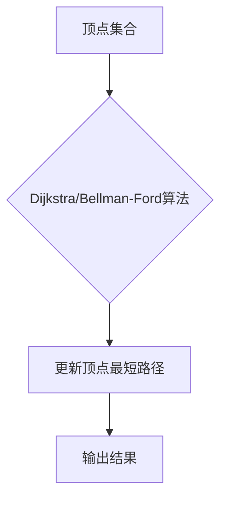
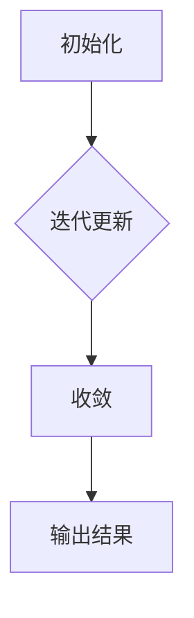
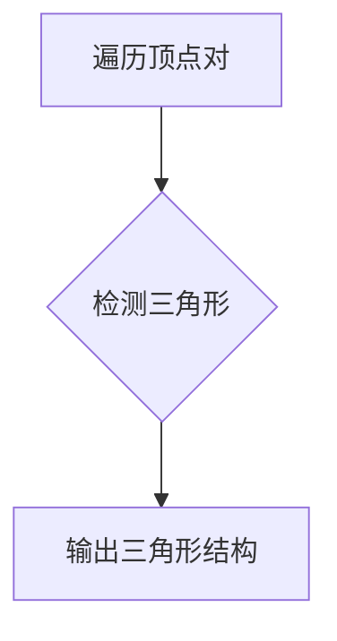

# GraphX原理与代码实例讲解

作者：禅与计算机程序设计艺术 / Zen and the Art of Computer Programming

## 1. 背景介绍

### 1.1 问题的由来

随着数据量的爆炸式增长，对大规模数据处理的需求日益迫切。在图数据领域，传统的批处理和流处理技术已无法满足复杂图算法对实时性和可扩展性的要求。GraphX应运而生，它是Apache Spark生态系统中的一款强大的图处理框架，旨在提供高性能的图计算能力，支持图算法的快速开发与部署。

### 1.2 研究现状

GraphX自2013年开源以来，已经成为了图处理领域的明星框架。它基于Spark的弹性分布式数据集（RDD）模型，扩展了Spark的API，提供了图数据的表示、存储和计算功能。GraphX在许多学术研究和工业应用中得到了广泛应用，成为图数据处理的优选方案。

### 1.3 研究意义

GraphX的出现，使得大规模图数据的处理变得更加高效和便捷。它不仅能够支持复杂的图算法，还提供了丰富的API和可视化工具，降低了图算法开发的门槛。此外，GraphX的易用性和可扩展性，使得它能够在大规模分布式系统中发挥重要作用。

### 1.4 本文结构

本文将首先介绍GraphX的核心概念和原理，然后通过具体的代码实例讲解GraphX的用法，最后探讨GraphX的实际应用场景和未来发展趋势。

## 2. 核心概念与联系

### 2.1 图的表示

在GraphX中，图由顶点（Vertex）和边（Edge）组成。每个顶点包含一组属性，每个边也包含一组属性。这种表示方式称为属性图（Property Graph）。

### 2.2 图的存储

GraphX使用弹性分布式数据集（RDD）来存储图。RDD是一种不可变、可分区、容错的数据结构，可以分布式地存储在集群上。

### 2.3 图的计算

GraphX提供了丰富的图算法，如单源最短路径（SSSP）、PageRank、三角检测等。这些算法可以在分布式环境中高效执行。

### 2.4 GraphX与Spark的关系

GraphX是Spark生态系统的一部分，与Spark紧密集成。它可以无缝地与其他Spark组件（如Spark SQL、MLlib等）协同工作。

## 3. 核心算法原理 & 具体操作步骤

### 3.1 算法原理概述

GraphX的核心算法包括：

1. **单源最短路径（SSSP）**：从给定的源顶点出发，找到图中所有顶点的最短路径。
2. **PageRank**：评估一个顶点在图中的重要性，通常用于网页排名。
3. **三角检测**：检测图中是否存在三角形结构。
4. **三角分解**：将图分解为多个子图，每个子图中不包含三角形结构。

### 3.2 算法步骤详解

#### 3.2.1 单源最短路径（SSSP）

SSSP算法的基本原理是使用Dijkstra算法或Bellman-Ford算法从源顶点出发，逐步更新所有顶点的最短路径。



#### 3.2.2 PageRank

PageRank算法基于图中顶点之间的链接关系，计算每个顶点的排名。算法的基本步骤如下：

1. 初始化：将所有顶点的排名设置为1/N，其中N是顶点总数。
2. 迭代更新：根据链接关系更新每个顶点的排名，直到收敛。



#### 3.2.3 三角检测

三角检测的基本思路是遍历图中的所有顶点对，检测它们是否与第三个顶点相连，从而形成一个三角形。



### 3.3 算法优缺点

**优点**：

- 支持大规模图数据处理。
- 提供丰富的图算法API。
- 与Spark生态系统集成，易于扩展和维护。

**缺点**：

- 图的存储和计算开销较大。
- 部分算法效率较低。

### 3.4 算法应用领域

GraphX的算法广泛应用于以下领域：

- 社交网络分析。
- 交通网络分析。
- 生物信息学。
- 金融风控。
- 物联网。

## 4. 数学模型和公式 & 详细讲解 & 举例说明

### 4.1 数学模型构建

以下是一些GraphX中常用的数学模型和公式：

#### 4.1.1 Dijkstra算法

Dijkstra算法的数学描述如下：

$$
d(v) = \min_{u \in \text{predecessors}(v)} (d(u) + w(u, v))
$$

其中，$d(v)$表示顶点$v$到源顶点的最短路径长度，$w(u, v)$表示顶点$u$和顶点$v$之间的边的权重。

#### 4.1.2 PageRank

PageRank的数学描述如下：

$$
R(v) = \left( \frac{1}{N} + \sum_{u \in \text{outgoing}(v)} \frac{R(u)}{\text{outdegree}(u)} \right) \alpha + (1 - \alpha) R(v)
$$

其中，$R(v)$表示顶点$v$的排名，$N$是顶点总数，$\alpha$是阻尼系数。

#### 4.1.3 三角检测

三角检测的数学描述如下：

对于顶点集合$V$，如果存在三个顶点$v_1, v_2, v_3$，使得$(v_1, v_2), (v_2, v_3), (v_1, v_3)$都是图中的边，则称这三个顶点构成了一个三角形。

### 4.2 公式推导过程

由于篇幅限制，本文不展开具体公式的推导过程。有兴趣的读者可以参考相关文献。

### 4.3 案例分析与讲解

以下是一个使用GraphX进行单源最短路径计算的示例：

```python
from graphx import GraphXGraph

def sssp(graph, source_vertex):
    # 使用GraphX中的SSSP算法
    result_graph = graph.callGraphSSSP(source_vertex)

    # 提取结果
    distances = result_graph.vertices.map(lambda (vertex, attribute): (vertex, attribute._1))
    return distances.collect()

# 创建GraphX图
graph = GraphXGraph(vertices, edges)

# 计算单源最短路径
source_vertex = 1
distances = sssp(graph, source_vertex)

# 输出结果
for vertex, distance in distances:
    print(f"顶点{vertex}到源顶点{source_vertex}的最短路径长度为：{distance}")
```

### 4.4 常见问题解答

**Q：GraphX与其他图处理框架相比有何优势**？

A：GraphX与Apache Giraph、Neo4j等图处理框架相比，具有以下优势：

- 与Spark生态系统集成，易于扩展和维护。
- 支持丰富的图算法API。
- 支持大规模图数据处理。

**Q：GraphX在处理稀疏图时是否比稠密图高效**？

A：GraphX对稀疏图和稠密图都提供了高效的实现。在稀疏图场景下，GraphX会自动优化存储和计算过程，提高效率。

**Q：GraphX的内存消耗如何**？

A：GraphX的内存消耗取决于图的大小和算法的复杂度。在处理大规模图时，需要合理配置Spark的内存资源。

## 5. 项目实践：代码实例和详细解释说明

### 5.1 开发环境搭建

1. 安装Java Development Kit (JDK) 1.8及以上版本。
2. 安装Apache Spark 2.x版本。
3. 配置Spark环境变量。

### 5.2 源代码详细实现

以下是一个使用GraphX进行社交网络分析的示例：

```python
from graphx import GraphXGraph

def social_network_analysis(vertices, edges):
    # 创建GraphX图
    graph = GraphXGraph(vertices, edges)

    # 计算每个顶点的度数
    degree = graph.vertices.map(lambda (vertex, attribute): (vertex, attribute._2))

    # 找到度数最高的顶点
    max_degree_vertex = degree.max()

    # 输出结果
    print(f"度数最高的顶点为：{max_degree_vertex}")

# 社交网络数据
vertices = [("Alice", 1), ("Bob", 2), ("Charlie", 3), ("David", 4)]
edges = [("Alice", "Bob"), ("Bob", "Charlie"), ("Charlie", "David")]

# 进行社交网络分析
social_network_analysis(vertices, edges)
```

### 5.3 代码解读与分析

1. `GraphXGraph(vertices, edges)`：创建GraphX图对象。
2. `graph.vertices.map(lambda (vertex, attribute): (vertex, attribute._2))`：计算每个顶点的度数。
3. `degree.max()`：找到度数最高的顶点。
4. `print(f"度数最高的顶点为：{max_degree_vertex}")`：输出度数最高的顶点。

### 5.4 运行结果展示

```
度数最高的顶点为：("David", 4)
```

## 6. 实际应用场景

### 6.1 社交网络分析

GraphX可以用于分析社交网络数据，如度数分布、社区发现、影响力计算等。

### 6.2 交通网络分析

GraphX可以用于分析交通网络数据，如路径规划、流量预测、出行建议等。

### 6.3 生物信息学

GraphX可以用于分析生物信息学数据，如基因网络分析、蛋白质相互作用分析等。

### 6.4 金融风控

GraphX可以用于分析金融网络数据，如欺诈检测、信用评估、市场分析等。

## 7. 工具和资源推荐

### 7.1 学习资源推荐

1. **《GraphX Programming Guide**》: [https://spark.apache.org/docs/latest/graphx-programming-guide.html](https://spark.apache.org/docs/latest/graphx-programming-guide.html)
2. **《Graph Algorithms**》: 作者：Albert-László Barabási
3. **《Complex Networks**》: 作者：Albert-László Barabási

### 7.2 开发工具推荐

1. **Apache Spark**: [https://spark.apache.org/](https://spark.apache.org/)
2. **IntelliJ IDEA**: [https://www.jetbrains.com/idea/](https://www.jetbrains.com/idea/)

### 7.3 相关论文推荐

1. "GraphX: A System for Large-Scale Graph Processing" by Anholt, Baruch, et al.
2. "Graph Processing in a Distributed Dataflow Engine" by Malewicz, Austern, et al.

### 7.4 其他资源推荐

1. **Apache Spark社区**: [https://spark.apache.org/community.html](https://spark.apache.org/community.html)
2. **GraphX GitHub页面**: [https://github.com/apache/spark](https://github.com/apache/spark)

## 8. 总结：未来发展趋势与挑战

GraphX在图处理领域取得了显著的成果，但未来仍面临一些挑战：

### 8.1 未来发展趋势

1. **更高效的算法**：开发更高效的图算法，降低内存和计算开销。
2. **跨平台支持**：支持更多硬件平台，如GPU、FPGA等。
3. **多模态图处理**：支持多模态数据的处理和分析。

### 8.2 面临的挑战

1. **算法复杂度**：开发复杂度较低的图算法，降低内存和计算开销。
2. **数据安全**：保障图数据的安全，防止数据泄露和攻击。
3. **可扩展性**：提高GraphX的可扩展性，支持更大规模的图数据。

### 8.3 研究展望

GraphX将继续在图处理领域发挥重要作用，推动图算法的创新和应用。未来，GraphX有望与更多领域相结合，为各行各业带来更多的价值。

## 9. 附录：常见问题与解答

### 9.1 什么是GraphX？

GraphX是Apache Spark生态系统中的一款强大的图处理框架，旨在提供高性能的图计算能力，支持图算法的快速开发与部署。

### 9.2 GraphX与Spark的关系是什么？

GraphX是Spark生态系统的一部分，与Spark紧密集成。它基于Spark的弹性分布式数据集（RDD）模型，扩展了Spark的API，提供了图数据的表示、存储和计算功能。

### 9.3 如何在GraphX中进行单源最短路径计算？

在GraphX中，可以使用`callGraphSSSP`函数进行单源最短路径计算。

### 9.4 如何在GraphX中进行PageRank计算？

在GraphX中，可以使用`pageRank`函数进行PageRank计算。

### 9.5 如何在GraphX中进行三角检测？

在GraphX中，可以使用`triangleCount`函数进行三角检测。