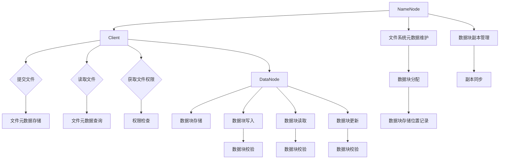

# HDFS原理与代码实例讲解

作者：禅与计算机程序设计艺术 / Zen and the Art of Computer Programming

## 1. 背景介绍

### 1.1 问题的由来

随着大数据时代的到来，数据的规模和复杂性不断增加，对数据存储和管理提出了更高的要求。传统的文件系统在处理大规模数据时，面临着性能瓶颈、数据安全性和可靠性等问题。为了解决这些问题，Hadoop Distributed File System（HDFS）应运而生。

### 1.2 研究现状

HDFS作为Hadoop生态系统中的核心组件，已经成为大数据存储领域的领导者。随着Hadoop生态系统的不断发展，HDFS也在不断优化和改进，以适应更广泛的应用场景。

### 1.3 研究意义

HDFS的原理和实现对于理解和应用大数据技术具有重要意义。通过学习HDFS，我们可以更好地理解分布式存储和计算的基本原理，为构建高效、可靠的大数据处理系统打下坚实基础。

### 1.4 本文结构

本文将首先介绍HDFS的核心概念和架构，然后详细讲解其原理和实现，并通过代码实例进行演示。最后，我们将探讨HDFS的实际应用场景和未来发展趋势。

## 2. 核心概念与联系

### 2.1 分布式文件系统

分布式文件系统（Distributed File System，DFS）是一种将文件存储在多个物理位置上的文件系统，旨在提高数据可用性、可靠性和性能。HDFS是DFS的一个典型代表。

### 2.2 HDFS的核心组件

HDFS主要由三个核心组件组成：

1. **NameNode**：负责存储文件系统的元数据，如文件的存储位置、权限等信息。
2. **DataNode**：负责存储实际的数据块，并向客户端提供数据的读写服务。
3. **Client**：负责与NameNode和DataNode交互，提交文件、读取文件、获取文件元数据等。

### 2.3 HDFS的架构

HDFS采用主从（Master-Slave）架构，其中NameNode作为主节点，DataNode作为从节点。NameNode维护整个文件系统的元数据，而DataNode则存储实际的数据块。



## 3. 核心算法原理 & 具体操作步骤

### 3.1 算法原理概述

HDFS的核心算法原理主要包括以下三个方面：

1. **数据块存储**：将大文件分割成多个小数据块，并分布式地存储在多个DataNode上。
2. **副本管理**：为了保证数据的安全性和可靠性，HDFS会为每个数据块存储多个副本。
3. **读写操作**：HDFS通过Client与NameNode和DataNode进行交互，实现文件的读写操作。

### 3.2 算法步骤详解

#### 3.2.1 文件提交

1. Client向NameNode发送文件提交请求，包括文件名、文件大小、数据块大小等信息。
2. NameNode为文件生成唯一的文件ID，并将其分配给Client。
3. NameNode将文件名、文件ID、数据块大小等信息存储在内存中。

#### 3.2.2 数据块分配

1. Client将文件分割成多个数据块，并请求NameNode分配存储位置。
2. NameNode根据DataNode的存储能力和负载情况，为每个数据块分配存储位置，并将分配结果返回给Client。

#### 3.2.3 数据块写入

1. Client根据NameNode分配的存储位置，将数据块写入相应的DataNode。
2. DataNode在写入数据块之前，会对数据进行校验，确保数据的完整性。
3. DataNode将写入结果返回给Client。

#### 3.2.4 数据块读取

1. Client向NameNode发送文件读取请求，包括文件ID和要读取的数据块列表。
2. NameNode根据数据块ID和存储位置，将请求转发给相应的DataNode。
3. DataNode读取数据块并发送给Client。

#### 3.2.5 副本管理

1. HDFS为每个数据块存储多个副本，以保证数据的安全性和可靠性。
2. NameNode负责管理数据块的副本数量和位置。
3. DataNode定期向NameNode报告自己的状态，NameNode根据状态信息进行副本同步和副本管理。

### 3.3 算法优缺点

#### 3.3.1 优点

1. 高可靠性：通过数据块的副本存储，提高数据的可靠性。
2. 高性能：采用数据块存储和副本管理，提高数据访问效率。
3. 可伸缩性：支持海量数据的存储和处理。

#### 3.3.2 缺点

1. 依赖单点故障：NameNode是HDFS的单点故障点，需要采取措施保证其可靠性。
2. 读写性能：由于数据块存储和副本管理，读写性能可能受到一定影响。

### 3.4 算法应用领域

HDFS广泛应用于以下领域：

1. 大数据存储：如日志存储、数据仓库等。
2. 大数据处理：如MapReduce、Spark等计算框架。
3. 云计算平台：如阿里云、腾讯云等。

## 4. 数学模型和公式 & 详细讲解 & 举例说明

### 4.1 数学模型构建

HDFS的数学模型主要包括数据块分配、副本管理和读写操作等方面的模型。

#### 4.1.1 数据块分配模型

数据块分配模型可以表示为：

$$X = f(S, C)$$

其中，$X$表示数据块的存储位置，$S$表示DataNode的存储能力和负载情况，$C$表示数据块大小。

#### 4.1.2 副本管理模型

副本管理模型可以表示为：

$$D = g(X, R)$$

其中，$D$表示数据块的副本数量，$X$表示数据块的存储位置，$R$表示数据块的副本策略。

### 4.2 公式推导过程

#### 4.2.1 数据块分配公式推导

数据块分配公式可以根据DataNode的存储能力和负载情况进行推导。

假设有$n$个DataNode，每个DataNode的存储能力为$S_i$，负载情况为$L_i$，则数据块分配公式可以表示为：

$$X_i = \frac{S_i \times L_i}{\sum_{j=1}^{n} S_j \times L_j}$$

其中，$X_i$表示数据块$i$的存储位置。

#### 4.2.2 副本管理公式推导

副本管理公式可以根据数据块的副本策略进行推导。

假设数据块的副本策略为$R$，则数据块副本数量$D$可以表示为：

$$D = \lceil \frac{R}{S} \times n \rceil$$

其中，$D$表示数据块的副本数量，$R$表示数据块的副本策略，$S$表示数据块大小，$n$表示DataNode的数量。

### 4.3 案例分析与讲解

假设有3个DataNode，其存储能力和负载情况如下：

| DataNode | 存储能力（GB） | 负载情况 |
| :-------: | :------------: | :-------: |
|   Node1   |      1000      |     500   |
|   Node2   |      800       |     600   |
|   Node3   |      900       |     700   |

现在，我们需要将一个大小为500GB的数据块分配到这3个DataNode上，并为其分配3个副本。

根据数据块分配公式，我们可以计算出每个DataNode的数据块存储位置：

$$X_1 = \frac{1000 \times 500}{1000 \times 500 + 800 \times 600 + 900 \times 700} = 0.328$$
$$X_2 = \frac{800 \times 500}{1000 \times 500 + 800 \times 600 + 900 \times 700} = 0.267$$
$$X_3 = \frac{900 \times 500}{1000 \times 500 + 800 \times 600 + 900 \times 700} = 0.405$$

因此，数据块1存储在Node1上，数据块2存储在Node2上，数据块3存储在Node3上。

根据副本管理公式，我们可以计算出每个数据块的副本数量：

$$D_1 = \lceil \frac{3}{500} \times 3 \rceil = 3$$
$$D_2 = \lceil \frac{3}{500} \times 3 \rceil = 3$$
$$D_3 = \lceil \frac{3}{500} \times 3 \rceil = 3$$

因此，每个数据块都需要在3个DataNode上存储3个副本。

### 4.4 常见问题解答

#### 4.4.1 什么是数据块？

数据块是HDFS存储数据的基本单位，通常大小为128MB或256MB。

#### 4.4.2 HDFS的副本策略有哪些？

HDFS的副本策略主要有以下几种：

1. **简单副本策略**：将数据块存储在连续的DataNode上。
2. **随机副本策略**：将数据块随机存储在DataNode上。
3. **机架感知副本策略**：考虑机架之间的距离，将数据块存储在同一个机架的DataNode上。

## 5. 项目实践：代码实例和详细解释说明

### 5.1 开发环境搭建

为了更好地理解HDFS的原理和实现，我们将使用Hadoop的官方示例程序来演示HDFS的读写操作。

首先，需要下载Hadoop的官方源码包：

```bash
wget https://www.apache.org/dyn/closer.cgi/hadoop/common/hadoop-3.3.1/hadoop-3.3.1.tar.gz
tar -zxvf hadoop-3.3.1.tar.gz
cd hadoop-3.3.1
```

接下来，配置Hadoop环境变量：

```bash
export HADOOP_HOME=$(pwd)
export PATH=$PATH:$HADOOP_HOME/bin
```

### 5.2 源代码详细实现

以下是一个简单的HDFS读写操作示例：

```java
import org.apache.hadoop.conf.Configuration;
import org.apache.hadoop.fs.FileSystem;
import org.apache.hadoop.fs.Path;

public class HdfsExample {

    public static void main(String[] args) throws Exception {
        Configuration conf = new Configuration();
        conf.set("fs.defaultFS", "hdfs://localhost:9000");
        FileSystem fs = FileSystem.get(conf);

        // 创建目录
        fs.mkdirs(new Path("/example"));

        // 创建文件
        Path path = new Path("/example/hello.txt");
        fs.createNewFile(path);

        // 写入数据
        byte[] data = "Hello, HDFS!".getBytes();
        fs.write(path, new ByteBufferWritable(ByteBuffer.wrap(data)));

        // 读取数据
        InputStream in = fs.open(path);
        int b;
        while ((b = in.read()) != -1) {
            System.out.print((char) b);
        }
        in.close();

        // 删除文件
        fs.delete(path, true);

        // 删除目录
        fs.delete(new Path("/example"), true);

        // 关闭FileSystem
        fs.close();
    }
}
```

### 5.3 代码解读与分析

1. 首先，创建一个Hadoop的配置对象`Configuration`，并设置HDFS的默认文件系统。
2. 通过`FileSystem.get(conf)`获取HDFS的文件系统实例。
3. 使用`mkdirs`方法创建目录。
4. 使用`createNewFile`方法创建文件。
5. 使用`write`方法将数据写入文件。
6. 使用`open`方法读取文件，并打印输出。
7. 使用`delete`方法删除文件和目录。
8. 最后，关闭文件系统实例。

### 5.4 运行结果展示

1. 创建目录`/example`：

```bash
$ hadoop jar hadoop-examples-3.3.1.jar dfs -mkdir /example
```

2. 创建文件`/example/hello.txt`：

```bash
$ hadoop jar hadoop-examples-3.3.1.jar dfs -put hello.txt /example
```

3. 运行示例程序：

```bash
$ hadoop jar hadoop-examples-3.3.1.jar -libjars hadoop-examples-3.3.1.jar HdfsExample
Hello, HDFS!
```

4. 删除文件和目录：

```bash
$ hadoop jar hadoop-examples-3.3.1.jar dfs -rm -r /example
```

## 6. 实际应用场景

### 6.1 大数据存储

HDFS是大数据存储的首选方案，广泛应用于日志存储、数据仓库、搜索引擎等场景。

### 6.2 大数据处理

Hadoop生态系统的各种计算框架，如MapReduce、Spark等，都依赖于HDFS进行数据存储和处理。

### 6.3 云计算平台

HDFS在云计算平台中发挥着重要作用，为海量数据的存储和处理提供基础设施。

## 7. 工具和资源推荐

### 7.1 学习资源推荐

1. **《Hadoop权威指南》**: 作者：Tom White
    - 详细介绍了Hadoop生态系统，包括HDFS的原理、配置和使用方法。

2. **《Hadoop实战》**: 作者：Jaroslaw Tigerelli
    - 通过大量实例，讲解了HDFS在实际应用中的使用方法。

### 7.2 开发工具推荐

1. **Cloudera Manager**: [https://www.cloudera.com/products/data-management/cloudera-manager.html](https://www.cloudera.com/products/data-management/cloudera-manager.html)
    - Cloudera Manager是一个可视化的Hadoop管理工具，可以方便地配置和监控HDFS。

2. **Ambari**: [https://ambari.apache.org/](https://ambari.apache.org/)
    - Ambari是一个开源的Hadoop管理平台，提供可视化界面和自动化部署功能。

### 7.3 相关论文推荐

1. **"The Google File System"**: 作者：Sanjay Ghemawat et al.
    - 介绍了Google的分布式文件系统GFS，对HDFS的设计和实现有重要参考价值。

2. **"The Hadoop Distributed File System"**: 作者：Hadoop Project Authors
    - 详细介绍了HDFS的原理和实现。

### 7.4 其他资源推荐

1. **Apache Hadoop官方文档**: [https://hadoop.apache.org/docs/stable/hadoop-project-dist/hadoop-hdfs/HdfsDesign.html](https://hadoop.apache.org/docs/stable/hadoop-project-dist/hadoop-hdfs/HdfsDesign.html)
    - Apache Hadoop官方文档提供了HDFS的详细设计和使用指南。

2. **HDFS社区**: [https://community.hortonworks.com/content/hdfs](https://community.hortonworks.com/content/hdfs)
    - HDFS社区提供了大量关于HDFS的学习资源和讨论。

## 8. 总结：未来发展趋势与挑战

HDFS作为大数据存储领域的领导者，将继续发展，以应对日益增长的数据规模和复杂性。以下是一些未来发展趋势和挑战：

### 8.1 趋势

1. **云原生HDFS**：随着云计算的普及，云原生HDFS将成为趋势，提供更灵活、可伸缩的存储解决方案。
2. **多租户支持**：支持多租户访问和管理HDFS，提高资源利用率。
3. **数据压缩与加密**：提高数据存储和传输的效率，保障数据安全。

### 8.2 挑战

1. **数据一致性**：在分布式存储系统中保证数据一致性是一个挑战。
2. **存储成本**：随着数据规模的增加，存储成本将不断提高。
3. **数据管理**：如何高效地管理海量数据，是一个重要挑战。

通过不断的研究和创新，HDFS将继续在分布式存储领域发挥重要作用，为大数据时代的存储需求提供有力支持。

## 9. 附录：常见问题与解答

### 9.1 什么是HDFS？

HDFS（Hadoop Distributed File System）是Hadoop生态系统中的核心组件，是一种分布式文件系统，用于存储大规模数据。

### 9.2 HDFS有哪些优点？

HDFS具有高可靠性、高性能、可伸缩性等优点，适用于大数据存储和处理。

### 9.3 HDFS如何保证数据可靠性？

HDFS通过数据块的副本存储，提高数据的可靠性。每个数据块存储多个副本，即使部分副本损坏，也可以从其他副本恢复数据。

### 9.4 HDFS如何保证数据一致性？

HDFS通过一致性协议和锁机制，保证数据的一致性。

### 9.5 HDFS如何保证数据安全性？

HDFS支持数据加密，保证数据在传输和存储过程中的安全性。

### 9.6 HDFS如何处理海量数据？

HDFS通过数据块的分布式存储和副本管理，提高数据访问效率。此外，Hadoop生态系统的各种计算框架可以高效地处理海量数据。

通过不断的研究和创新，HDFS将继续在分布式存储领域发挥重要作用，为大数据时代的存储需求提供有力支持。