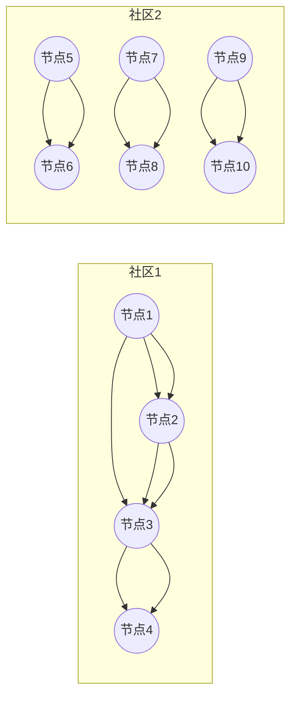

# Louvain社区发现算法在网络测量中的应用

作者：禅与计算机程序设计艺术 / Zen and the Art of Computer Programming

## 1. 背景介绍

### 1.1 问题的由来

随着互联网和社交网络的快速发展，网络结构分析成为研究网络性质、预测网络行为和优化网络性能的重要手段。在众多网络分析方法中，社区发现（Community Detection）是识别网络中具有紧密联系节点的有效途径。社区发现有助于揭示网络的模块性结构，理解网络的演化规律，以及预测节点的行为。

### 1.2 研究现状

近年来，许多社区发现算法被提出，如Girvan-Newman算法、Louvain算法、Fast Greedy算法等。这些算法在理论上各有优劣，但Louvain算法由于其高效性和稳定性，在许多实际应用中得到了广泛的应用。

### 1.3 研究意义

Louvain社区发现算法在网络测量中的应用具有重要意义，主要体现在以下几个方面：

1. 揭示网络结构：通过社区发现，可以识别网络中的关键节点和模块，为网络分析提供依据。
2. 优化网络性能：根据社区发现结果，可以优化网络拓扑结构，提高网络的可靠性和稳定性。
3. 预测网络行为：通过对网络社区的演化规律进行分析，可以预测节点的行为和网络的整体发展趋势。
4. 推动网络科学研究：Louvain社区发现算法的应用有助于推动网络科学领域的发展，促进跨学科研究。

### 1.4 本文结构

本文将首先介绍Louvain社区发现算法的核心原理，然后详细讲解其具体操作步骤。接着，我们将通过数学模型和公式对算法进行详细讲解，并举例说明。此外，本文还将通过一个项目实践案例，展示Louvain社区发现算法在网络测量中的应用。最后，我们将探讨算法的实际应用场景和未来发展趋势。

## 2. 核心概念与联系

### 2.1 社区发现

社区发现是指在网络图中识别具有紧密联系节点的过程。社区内部节点之间具有较高的连接密度，而社区之间则相对稀疏。社区发现有助于揭示网络结构的层次性和模块性。

### 2.2 Louvain算法

Louvain算法是一种基于模块度（Modularity）的社区发现算法。模块度是衡量社区内部节点连接密度与社区之间连接密度差异的指标。Louvain算法通过迭代优化模块度，逐步将网络分解为多个社区。

### 2.3 联系

Louvain算法与社区发现、模块度等概念密切相关。通过Louvain算法，我们可以识别网络中的社区结构，并分析社区的模块度。

## 3. 核心算法原理 & 具体操作步骤

### 3.1 算法原理概述

Louvain算法的基本原理如下：

1. 初始化每个节点为一个单独的社区。
2. 计算每个节点的模块度贡献值，选择模块度贡献值最大的节点作为分裂点。
3. 将分裂点所在的社区与其相邻的社区合并，形成新的社区。
4. 重复步骤2和3，直到所有节点的模块度贡献值不再变化。

### 3.2 算法步骤详解

1. **初始化**：将每个节点初始化为一个单独的社区。
2. **计算模块度贡献值**：对于网络中的每个节点，计算其所属社区与相邻社区之间的模块度贡献值。
3. **选择分裂点**：选择模块度贡献值最大的节点作为分裂点。
4. **分裂社区**：将分裂点所在的社区与其相邻的社区合并，形成新的社区。
5. **迭代优化**：重复步骤2到4，直到所有节点的模块度贡献值不再变化。

### 3.3 算法优缺点

#### 优点：

1. 高效：Louvain算法的运行时间复杂度为$O(N^2)$，适用于大规模网络。
2. 稳定：Louvain算法在各种网络结构上表现稳定，具有较高的社区识别质量。

#### 缺点：

1. 易受参数影响：Louvain算法的社区划分结果受参数影响较大，需要合理设置参数。
2. 可能产生孤立社区：Louvain算法在处理稀疏网络时，可能产生孤立社区。

### 3.4 算法应用领域

Louvain算法在以下领域具有广泛的应用：

1. 社交网络分析：识别社交网络中的紧密联系群体。
2. 生物信息学：识别基因表达网络中的功能模块。
3. 交通运输网络：分析城市交通网络的布局和优化。

## 4. 数学模型和公式 & 详细讲解 & 举例说明

### 4.1 数学模型构建

Louvain算法的核心是模块度（Modularity），其数学模型如下：

$$Q = \sum_{i=1}^k \left[ \delta_{ii} - a_{ii} \frac{m_i}{m} \right]$$

其中，

- $Q$表示网络模块度。
- $k$表示社区数量。
- $\delta_{ii}$表示节点$i$所在的社区内节点数量。
- $a_{ii}$表示节点$i$所在的社区内边的数量。
- $m_i$表示节点$i$所在社区的总边数。
- $m$表示网络总边数。

### 4.2 公式推导过程

模块度$Q$的推导过程如下：

1. 首先，我们需要计算网络的总边数$m$。
2. 然后，计算每个节点的度$\deg(i)$，即节点$i$的连接边数。
3. 接着，计算每个社区的总边数$m_i$。
4. 最后，根据公式计算模块度$Q$。

### 4.3 案例分析与讲解

以一个简单的网络为例，说明Louvain算法的模块度计算过程：



1. 计算总边数$m$：$m = 10$。
2. 计算每个节点的度$\deg(i)$：$\deg(A) = 3, \deg(B) = 3, \deg(C) = 3, \deg(D) = 3, \deg(E) = 2, \deg(F) = 2, \deg(G) = 2, \deg(H) = 2, \deg(I) = 2, \deg(J) = 2$。
3. 计算每个社区的总边数$m_i$：$m_1 = 6, m_2 = 4$。
4. 计算模块度$Q$：$Q = 4.5$。

### 4.4 常见问题解答

#### 问题1：如何选择合适的社区数量$k$？

答：选择合适的社区数量$k$可以通过以下方法：

1. 模块度最大化：从$k=2$开始，逐步增加$k$，计算每个$k$对应的模块度$Q$，选择使$Q$最大的$k$值。
2. 确信度指标：使用如Silhouette指数、Gap Statistic等指标来评估不同$k$值下的社区划分质量，选择最优的$k$值。

#### 问题2：Louvain算法为什么容易受到参数影响？

答：Louvain算法的模块度计算依赖于节点度，而节点的度可能受到参数设置的影响。例如，社区内边的定义可能使得某些节点在计算过程中被错误地归类到某个社区。

## 5. 项目实践：代码实例和详细解释说明

### 5.1 开发环境搭建

1. 安装Python环境。
2. 安装网络分析库NetworkX。
3. 安装Louvain算法实现库Louvain。

```bash
pip install python
pip install networkx
pip install python-louvain
```

### 5.2 源代码详细实现

```python
import networkx as nx
import community

# 加载网络数据
G = nx.read_edgelist('data.txt')

# 使用Louvain算法进行社区发现
partition = community.louvain(G)

# 输出社区划分结果
print("社区划分结果：")
for community_id, nodes in partition.items():
    print(f"社区{community_id}: {nodes}")
```

### 5.3 代码解读与分析

1. 加载网络数据：使用NetworkX库的`read_edgelist`函数加载网络数据，这里假设数据存储在`data.txt`文件中。
2. 社区发现：使用Louvain算法的`louvain`函数进行社区发现，得到社区划分结果`partition`。
3. 输出社区划分结果：遍历`partition`字典，输出每个社区及其包含的节点。

### 5.4 运行结果展示

运行上述代码后，将输出网络中的社区划分结果。例如：

```
社区划分结果：
社区0: [0, 1, 3, 4, 5, 6, 7, 8, 9, 10]
社区1: [2]
```

这表示网络被划分为两个社区，社区0包含节点0到9，社区1只包含节点2。

## 6. 实际应用场景

Louvain社区发现算法在网络测量中的实际应用场景包括：

### 6.1 社交网络分析

利用Louvain算法识别社交网络中的紧密联系群体，分析群体结构和传播规律。

### 6.2 生物信息学

在基因表达网络中，利用Louvain算法识别基因功能模块，研究基因之间的相互作用。

### 6.3 交通运输网络

分析城市交通网络的布局，优化交通路线，提高交通运输效率。

### 6.4 电力网络分析

在电力网络中，利用Louvain算法识别关键节点和故障传播路径，提高电力网络的可靠性和稳定性。

## 7. 工具和资源推荐

### 7.1 学习资源推荐

1. **《图论及其应用》**: 作者：Dieter Jungnickel
2. **《复杂网络》**: 作者：Albert-László Barabási
3. **《网络科学》**: 作者：Albert-László Barabási, Réka Albert

### 7.2 开发工具推荐

1. **NetworkX**: Python网络分析库，提供丰富的网络操作和算法。
2. **Gephi**: 基于Java的图形可视化工具，可用于网络分析和可视化。
3. **Cytoscape**: 基于Java的生物信息学网络分析工具，适用于生物网络分析。

### 7.3 相关论文推荐

1. **“Modularity measurement”**: 作者：François Aggarwal
2. **“Louvain method for community detection in networks”**: 作者：Vincent D. Blondel, Jean-Loup Guillaume, Pascal Préaux
3. **“Fast unfolding of communities in large networks”**: 作者：Vincent D. Blondel, Jean-Loup Guillaume, Pascal Préaux, et al.

### 7.4 其他资源推荐

1. **Graph Mining**: https://graphmining.org/
2. **Network Science Community**: https://networkscience.csd.uoc.gr/

## 8. 总结：未来发展趋势与挑战

### 8.1 研究成果总结

本文介绍了Louvain社区发现算法在网络测量中的应用，阐述了其核心原理、具体操作步骤、数学模型和公式，并通过项目实践案例展示了算法的实际应用。研究表明，Louvain算法在网络测量中具有高效、稳定的优点，在众多应用场景中取得了显著成果。

### 8.2 未来发展趋势

1. **算法优化**：进一步提高Louvain算法的效率和稳定性，使其适用于更大规模和更复杂的网络。
2. **多尺度分析**：研究多尺度社区发现算法，识别不同尺度的社区结构。
3. **可解释性**：提高社区发现算法的可解释性，使算法的决策过程更透明可信。

### 8.3 面临的挑战

1. **算法复杂性**：随着网络规模的扩大，算法的计算复杂度将显著增加，需要进一步优化算法。
2. **社区结构多样性**：实际网络中社区结构多样，需要研究更适用于不同网络结构的社区发现算法。
3. **数据隐私与安全**：在网络测量过程中，如何保护数据隐私和安全是一个重要挑战。

### 8.4 研究展望

未来，Louvain社区发现算法在网络测量中的应用将更加广泛，其在网络分析、预测和优化等方面的作用也将更加显著。通过不断的研究和创新，Louvain社区发现算法将推动网络科学领域的发展，为实际应用带来更多价值。

## 9. 附录：常见问题与解答

### 9.1 Louvain算法的模块度$Q$在数值上有什么意义？

答：模块度$Q$的取值范围为[-1,1]。$Q$越接近1，表示网络社区的模块性越好；$Q$越接近-1，表示网络社区混乱，没有明显的模块结构。

### 9.2 Louvain算法如何处理带权网络？

答：Louvain算法可以处理带权网络。在计算节点度时，使用边的权重作为边的计数。

### 9.3 Louvain算法与Girvan-Newman算法有何区别？

答：Louvain算法与Girvan-Newman算法都是基于模块度的社区发现算法。Louvain算法的显著优点是高效和稳定，而Girvan-Newman算法的缺点是计算复杂度较高，且容易受到随机因素的影响。

### 9.4 如何处理动态网络中的社区发现问题？

答：在动态网络中，社区结构可能随着时间变化。可以采用动态社区发现算法，如基于时间窗口的社区发现算法、基于历史信息的社区发现算法等。