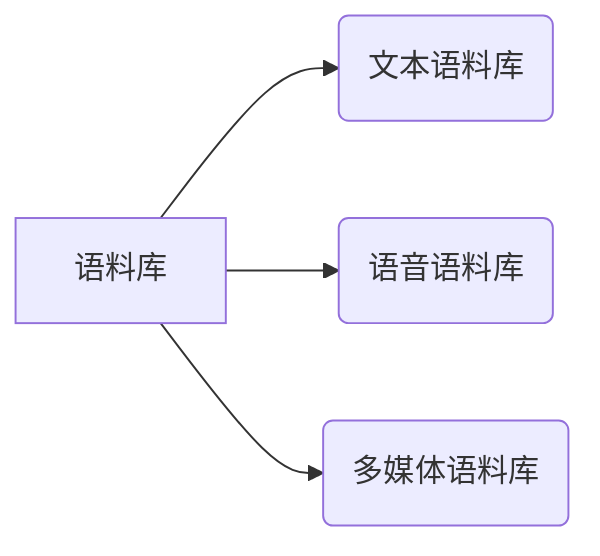
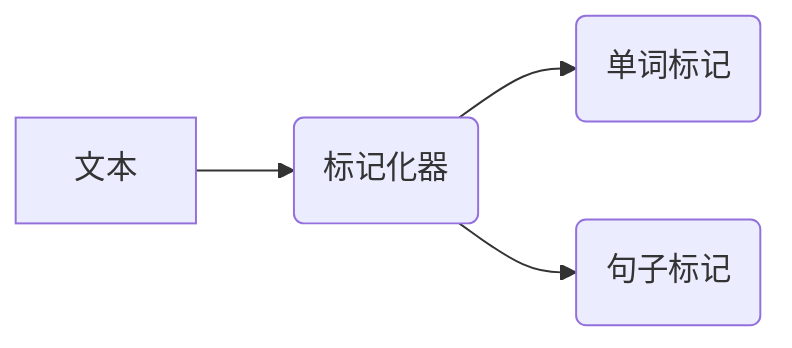
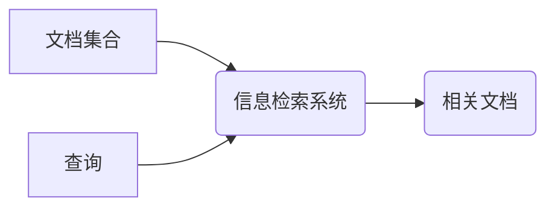

# NLTK 原理与代码实战案例讲解

## 1. 背景介绍

### 1.1 问题的由来

在当今信息时代,自然语言处理(Natural Language Processing, NLP)已经成为人工智能领域中最重要和最具挑战性的研究方向之一。随着大数据和深度学习技术的飞速发展,NLP的应用范围也在不断扩大,包括机器翻译、语音识别、信息检索、问答系统、情感分析等诸多领域。然而,要真正掌握NLP技术并将其应用于实践中,需要具备扎实的理论基础和编程能力。

### 1.2 研究现状

目前,NLP领域存在着许多优秀的开源工具和框架,其中以Python的NLTK(Natural Language Toolkit)库最为著名。NLTK是一个用于构建Python程序以处理人类语言数据的领先平台,它提供了易于使用的接口,涵盖了NLP所需的大部分数据结构、算法、语言资源等。NLTK已经成为NLP入门和教学的标准工具,被广泛应用于学术界和工业界。

### 1.3 研究意义

尽管NLTK提供了丰富的功能和资源,但要真正掌握其原理和实战应用仍然是一个巨大的挑战。本文旨在深入探讨NLTK的核心概念、算法原理和数学模型,并通过大量实战案例和代码示例,帮助读者全面理解和掌握NLTK的使用方法。无论是NLP初学者还是资深从业者,本文都将为您提供有价值的见解和实践指导。

### 1.4 本文结构

本文将从以下几个方面全面介绍NLTK:

1. 核心概念与联系
2. 核心算法原理与具体操作步骤
3. 数学模型和公式详细讲解与案例分析
4. 项目实践:代码实例和详细解释说明
5. 实际应用场景
6. 工具和资源推荐
7. 总结:未来发展趋势与挑战
8. 附录:常见问题与解答

## 2. 核心概念与联系

在深入探讨NLTK的算法原理和实现细节之前,我们需要先了解一些NLP领域的核心概念,以及它们之间的联系。这些概念构成了NLTK的理论基础,对于理解和使用NLTK至关重要。

### 2.1 语料库

语料库(Corpus)是指一组已标注或未标注的自然语言数据集合,通常包含大量的文本、语音或其他形式的语言数据。语料库是NLP研究和应用的基础,NLTK提供了多种不同语言和领域的语料库资源。



### 2.2 标记化

标记化(Tokenization)是NLP的基本任务之一,它将连续的字符序列(如句子或段落)分割成更小的标记(Token),如单词、数字或标点符号。标记化是大多数NLP任务的前置步骤,NLTK提供了多种标记化器用于处理不同类型的语言数据。



### 2.3 词性标注

词性标注(Part-of-Speech Tagging)是指为每个单词标注其在句子中的词性,如名词、动词、形容词等。这是一项基础但非常重要的NLP任务,因为词性信息对于许多高级NLP应用(如句法分析、命名实体识别等)都是必需的。NLTK提供了多种不同的词性标注器,包括基于规则的和基于统计的模型。


### 2.4 句法分析

句法分析(Parsing)是指根据语言的语法规则,将一个句子分析成其句法结构的过程。句法结构通常表示为一棵树,其中每个节点代表句子的一个短语或子句。句法分析是许多高级NLP任务(如机器翻译、信息抽取等)的基础。NLTK提供了多种不同的句法分析器,包括基于规则的和基于统计的模型。


### 2.5 语义分析

语义分析(Semantic Analysis)是指理解语言的含义和语义关系的过程。它包括多个子任务,如词义消歧(Word Sense Disambiguation)、命名实体识别(Named Entity Recognition)、关系抽取(Relation Extraction)等。语义分析是实现自然语言理解的关键,NLTK提供了一些基本的语义分析工具和模型。


### 2.6 文本分类

文本分类(Text Classification)是指根据文本内容,将其归类到预定义的类别或主题中。这是一项广泛应用于情感分析、垃圾邮件检测、新闻分类等领域的NLP任务。NLTK提供了多种文本分类算法和模型,包括朴素贝叶斯、决策树、支持向量机等。


### 2.7 信息检索

信息检索(Information Retrieval)是指从大量非结构化数据(如文本、网页等)中查找与用户查询相关的信息。这是一项涉及NLP、数据挖掘和机器学习等多个领域的复杂任务。NLTK提供了一些基本的信息检索工具和模型,如向量空间模型、TF-IDF等。



### 2.8 机器翻译

机器翻译(Machine Translation)是指使用计算机系统将一种自然语言(源语言)转换为另一种自然语言(目标语言)的过程。这是NLP领域最具挑战性的任务之一,需要综合运用多种NLP技术,如语言建模、句法分析、语义分析等。NLTK提供了一些基本的机器翻译工具和模型,如统计机器翻译模型。


上述这些概念相互关联、相互依赖,构成了NLTK的核心框架。掌握了这些概念,我们就能更好地理解和应用NLTK提供的各种算法和工具。

## 3. 核心算法原理与具体操作步骤

NLTK提供了大量用于执行各种NLP任务的算法和模型,这些算法和模型是NLTK的核心部分。本节将重点介绍其中几种最常用和最具代表性的算法,包括它们的原理、具体操作步骤、优缺点以及应用领域。

### 3.1 算法原理概述

#### 3.1.1 N-gram语言模型

N-gram语言模型是一种基于统计的语言模型,它根据前面的N-1个单词来预测下一个单词的概率。N-gram模型广泛应用于自动语音识别、机器翻译、拼写检查等NLP任务中。

$$P(w_1, w_2, \ldots, w_n) = \prod_{i=1}^n P(w_i|w_1, \ldots, w_{i-1})$$

其中,$ P(w_i|w_1, \ldots, w_{i-1}) $是在给定前面单词序列$ w_1, \ldots, w_{i-1} $的条件下,单词$ w_i $出现的条件概率。由于直接计算这个概率是非常困难的,因此N-gram模型做了马尔可夫假设,即一个单词的出现只与前面N-1个单词相关,而与更早的单词无关。

$$P(w_i|w_1, \ldots, w_{i-1}) \approx P(w_i|w_{i-N+1}, \ldots, w_{i-1})$$

这样,我们只需要估计有限个N-gram概率,就可以近似计算整个句子的概率。常用的N-gram模型包括一元模型(Unigram)、二元模型(Bigram)和三元模型(Trigram)。

#### 3.1.2 朴素贝叶斯分类器

朴素贝叶斯分类器是一种基于贝叶斯定理与特征条件独立假设的简单分类算法。它被广泛应用于文本分类、垃圾邮件检测、情感分析等NLP任务中。

根据贝叶斯定理,给定一个文档$ d $和一个类别$ c $,我们有:

$$P(c|d) = \frac{P(d|c)P(c)}{P(d)}$$

其中,$ P(c|d) $是文档$ d $属于类别$ c $的后验概率,$ P(d|c) $是在已知类别$ c $的条件下文档$ d $出现的似然概率,$ P(c) $是类别$ c $的先验概率,$ P(d) $是文档$ d $的边缘概率。

由于$ P(d) $对于所有类别是相同的,因此我们只需要最大化$ P(d|c)P(c) $即可。进一步,根据特征条件独立假设,我们有:

$$P(d|c) = \prod_{i=1}^n P(w_i|c)$$

其中,$ w_i $是文档$ d $中的第$ i $个单词。这样,我们只需要估计每个单词在每个类别下出现的概率,就可以计算整个文档属于某个类别的概率。

#### 3.1.3 隐马尔可夫模型

隐马尔可夫模型(Hidden Markov Model, HMM)是一种统计模型,它用于对隐藏的马尔可夫链进行建模,广泛应用于自然语言处理、语音识别、生物信息学等领域。

HMM由一个隐藏的马尔可夫链和一个观测序列组成。隐藏的马尔可夫链是一个随机过程,它在每个时间步骤都处于一个不可观测的状态,而观测序列则是由这些隐藏状态产生的可观测输出。

HMM通常由以下三个参数来描述:

1. 初始状态概率: $\pi_i = P(q_1 = i)$,表示初始时刻处于状态$i$的概率。
2. 转移概率: $a_{ij} = P(q_{t+1} = j|q_t = i)$,表示从状态$i$转移到状态$j$的概率。
3.发射概率: $b_j(o_t) = P(o_t|q_t = j)$,表示在状态$j$时观测到$o_t$的概率。

给定一个观测序列,HMM可以用于解决三个基本问题:

1. 评估问题: 计算观测序列在给定模型下的概率。
2. 解码问题: 找到最可能产生观测序列的隐藏状态序列。
3. 学习问题: 根据观测序列估计HMM的参数。

HMM在NLP中的应用包括词性标注、命名实体识别、机器翻译等任务。

#### 3.1.4 其他算法

除了上述三种算法之外,NLTK还提供了许多其他算法和模型,包括:

- 最大熵模型(Maximum Entropy Model)
- 决策树(Decision Tree)
- 支持向量机(Support Vector Machine)
- 神经网络(Neural Network)
- 词向量(Word Embedding)
- transformer模型(Transformer Model)

这些算法在不同的NLP任务中发挥着重要作用,本文无法一一详细介绍。读者可以参考NLTK的官方文档和其他资源进一步学习。

### 3.2 算法步骤详解

接下来,我们将详细介绍如何使用NLTK实现上述三种核心算法。

#### 3.2.1 N-gram语言模型

NLTK提供了`nltk.lm`模块,用于构建和评估N-gram语言模型。下面是一个使用Bigram模型的示例:

1. 导入必要的模块和数据:

```python
import nltk
from nltk.lm import MLE
from nltk.corpus import brown

# 加载brown语料库
brown_sents = brown.sents()
```

2. 创建Bigram语言模型:

```python
# 创建Bigram模型
bigram = MLE(2)  # 2表示Bigram模型

# 使用语料库训练模型
train_data = [sent for sent in brown_sents if len(sent) > 1]
bigram.