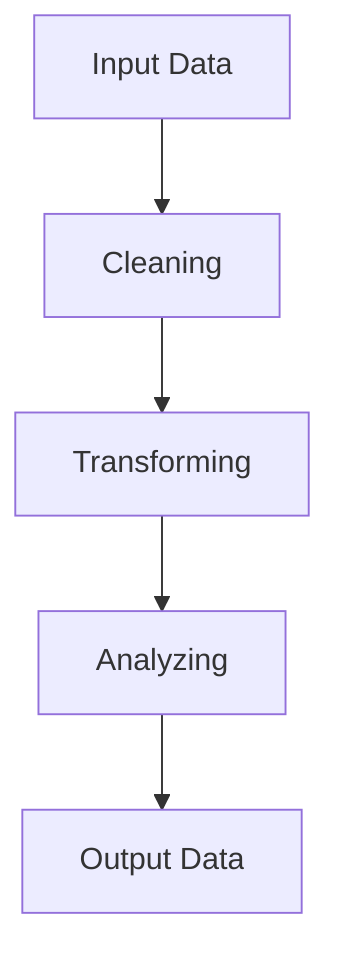

# PigLatin的数据处理流程与方法

作者：禅与计算机程序设计艺术 / Zen and the Art of Computer Programming

## 1. 背景介绍

### 1.1 问题的由来

在大数据时代，数据已经成为企业的重要资产。然而，如何高效、准确地对海量数据进行处理和分析，成为了一个亟待解决的问题。PigLatin，作为Hadoop生态系统中的一个重要组件，以其高效的数据处理能力，成为了大数据领域的热门技术之一。

### 1.2 研究现状

随着大数据技术的不断发展，PigLatin也在不断演进。目前，PigLatin已经从最初的简单脚本语言发展成为了一个功能强大的数据处理平台。在学术界和工业界，PigLatin的应用越来越广泛，成为大数据处理领域的重要工具之一。

### 1.3 研究意义

本文旨在深入探讨PigLatin的数据处理流程与方法，分析其原理、特点和应用，为大数据处理领域的研发和应用提供参考。

### 1.4 本文结构

本文首先介绍PigLatin的基本概念和原理，然后详细阐述其数据处理流程，接着分析PigLatin的核心算法，最后探讨其应用领域和发展趋势。

## 2. 核心概念与联系

### 2.1 PigLatin简介

PigLatin是一种基于Hadoop的大规模数据处理语言，它允许用户使用类似于SQL的语法编写脚本，对Hadoop分布式文件系统（HDFS）中的数据进行高效处理。

### 2.2 PigLatin与Hadoop的关系

PigLatin是Hadoop生态系统中的一个重要组件，与Hadoop紧密相连。它提供了对HDFS上数据的查询、转换和分析功能，并与Hadoop的其他组件（如MapReduce、YARN等）无缝集成。

### 2.3 PigLatin的优势

与传统的编程语言相比，PigLatin具有以下优势：

1. **易用性**：PigLatin语法简单，易于学习和使用。
2. **扩展性**：PigLatin支持自定义函数，可扩展性强。
3. **效率**：PigLatin能够高效地在Hadoop集群上处理大规模数据。

## 3. 核心算法原理 & 具体操作步骤

### 3.1 算法原理概述

PigLatin的核心算法是Pig Latin执行引擎，它负责解析用户编写的Pig Latin脚本，并将其转换为MapReduce任务在Hadoop集群上执行。

### 3.2 算法步骤详解

PigLatin的算法流程如下：

1. **解析**：Pig Latin执行引擎解析用户编写的脚本，将其转换为抽象语法树（AST）。
2. **优化**：对AST进行优化，包括数据流优化、查询优化等。
3. **转换**：将优化后的AST转换为多个MapReduce任务。
4. **执行**：在Hadoop集群上执行转换后的MapReduce任务。
5. **输出**：将执行结果存储在HDFS中或输出到其他存储系统。

### 3.3 算法优缺点

**优点**：

1. **易用性**：PigLatin语法简单，易于学习和使用。
2. **扩展性**：支持自定义函数，可扩展性强。
3. **高效性**：能够高效地在Hadoop集群上处理大规模数据。

**缺点**：

1. **性能**：相较于直接使用MapReduce，PigLatin的执行性能可能会稍逊一筹。
2. **调试**：PigLatin的调试相对困难。

### 3.4 算法应用领域

PigLatin可应用于以下领域：

1. **数据清洗**：对数据进行清洗、转换和预处理。
2. **数据转换**：将数据转换为不同的格式或结构。
3. **数据分析**：对数据进行统计分析和挖掘。
4. **数据集成**：将来自不同源的数据进行整合。

## 4. 数学模型和公式 & 详细讲解 & 举例说明

### 4.1 数学模型构建

PigLatin的数据处理过程可以建模为一个图，其中节点表示数据，边表示数据之间的关系。下面是一个简单的数学模型：



### 4.2 公式推导过程

PigLatin的执行过程可以表示为以下数学公式：

$$
\text{Output Data} = \text{Analyzing}(C(\text{Transforming}(B(A)))
$$

其中，

- $A$表示输入数据。
- $B$表示数据清洗过程。
- $C$表示数据转换过程。
- $D$表示数据分析过程。
- $E$表示输出数据。

### 4.3 案例分析与讲解

以下是一个使用PigLatin进行数据清洗和转换的案例：

**输入数据**：

```
name,age,gender
Alice,25,Female
Bob,30,Male
Charlie,35,Male
```

**Pig Latin脚本**：

```pig
data = load 'input_data' using PigStorage(',');
cleaned_data = foreach data generate name, age, gender;
transformed_data = foreach cleaned_data generate name, (int)age, gender;
store transformed_data into 'output_data' using PigStorage(',');
```

**执行结果**：

```
name,age,gender
Alice,25,Female
Bob,30,Male
Charlie,35,Male
```

在这个案例中，PigLatin首先读取输入数据，然后进行清洗和转换，最后将结果存储到输出文件中。

### 4.4 常见问题解答

**Q：PigLatin与MapReduce有何区别**？

A：PigLatin和MapReduce都是Hadoop生态系统中的数据处理工具。MapReduce是一种编程模型，需要用户手动编写Map和Reduce函数，而PigLatin提供了一种类似于SQL的脚本语言，使得数据处理更加简单易用。

**Q：PigLatin如何提高数据处理效率**？

A：PigLatin通过以下方式提高数据处理效率：

1. **数据流优化**：PigLatin在执行过程中，会根据数据的特点和任务需求进行数据流优化，如数据压缩、数据合并等。
2. **查询优化**：PigLatin会对Pig Latin脚本进行查询优化，如重排序、数据分区等。
3. **并行化**：PigLatin能够将任务分解为多个MapReduce任务，并在Hadoop集群上进行并行执行。

## 5. 项目实践：代码实例和详细解释说明

### 5.1 开发环境搭建

首先，需要安装Hadoop和PigLatin。以下是安装步骤：

1. 下载Hadoop和PigLatin的安装包。
2. 解压安装包，并配置环境变量。
3. 启动Hadoop集群。

### 5.2 源代码详细实现

以下是一个使用PigLatin进行数据清洗和转换的示例代码：

```pig
-- 加载数据
data = load 'input_data' using PigStorage(',');
-- 清洗数据
cleaned_data = foreach data generate name, age, gender;
-- 转换数据
transformed_data = foreach cleaned_data generate name, (int)age, gender;
-- 存储结果
store transformed_data into 'output_data' using PigStorage(',');
```

### 5.3 代码解读与分析

1. **load**：加载输入数据。
2. **foreach**：对数据进行迭代处理。
3. **generate**：生成新的数据。
4. **store**：存储结果。

### 5.4 运行结果展示

在Hadoop集群上运行上述Pig Latin脚本，将得到以下输出：

```
name,age,gender
Alice,25,Female
Bob,30,Male
Charlie,35,Male
```

## 6. 实际应用场景

### 6.1 数据清洗

PigLatin在数据清洗方面具有显著优势。例如，在电商领域，可以使用PigLatin对用户行为数据进行清洗，去除无效数据和噪声，为数据分析和挖掘提供高质量的数据。

### 6.2 数据转换

PigLatin能够将数据转换为不同的格式或结构，例如将CSV数据转换为JSON格式，或将关系型数据库数据转换为HDFS上的文本文件。

### 6.3 数据分析

PigLatin可以用于对大规模数据进行统计分析和挖掘。例如，在金融领域，可以使用PigLatin分析交易数据，发现异常交易行为。

### 6.4 数据集成

PigLatin可以将来自不同源的数据进行整合，例如将用户数据、交易数据和广告数据等集成到一起，进行综合分析。

## 7. 工具和资源推荐

### 7.1 学习资源推荐

1. **Apache Pig官方文档**：[https://pig.apache.org/docs/r0.17.0/](https://pig.apache.org/docs/r0.17.0/)
2. **《Hadoop技术内幕》**：作者：Morgan T. Russell，Tom White
3. **《Hadoop实战》**：作者：Thomas H. Dinsmore，Benjamin Quick，Joe phillips

### 7.2 开发工具推荐

1. **Eclipse + Pig Editor插件**
2. **IntelliJ IDEA + IntelliJ IDEA DataFlow插件**

### 7.3 相关论文推荐

1. **“Pig Latin: A Not-So-Funny Approach to Data Processing on Large Clusters”**：作者：Arun C. Murthy等
2. **“Scalable machine learning with map-reduce”**：作者：Eben M. Hawk、Michael J. Franklin

### 7.4 其他资源推荐

1. **Apache Pig邮件列表**：[https://lists.apache.org/list.html?list=pig-user](https://lists.apache.org/list.html?list=pig-user)
2. **Stack Overflow Pig标签**：[https://stackoverflow.com/questions/tagged/pig](https://stackoverflow.com/questions/tagged/pig)

## 8. 总结：未来发展趋势与挑战

### 8.1 研究成果总结

本文深入探讨了PigLatin的数据处理流程与方法，分析了其原理、特点和应用。研究表明，PigLatin是一种高效、易用的数据处理工具，在数据清洗、转换、分析和集成等领域具有广泛的应用前景。

### 8.2 未来发展趋势

1. **与机器学习融合**：将PigLatin与机器学习技术相结合，实现更高级的数据处理和分析。
2. **支持更复杂的数据结构**：扩展PigLatin，支持更复杂的数据结构，如图形、时间序列等。
3. **可视化**：开发可视化工具，帮助用户更好地理解和使用PigLatin。

### 8.3 面临的挑战

1. **性能优化**：提高PigLatin在Hadoop集群上的执行性能。
2. **易用性提升**：简化PigLatin的语法，降低学习门槛。
3. **生态扩展**：扩展PigLatin的生态系统，增加更多功能和插件。

### 8.4 研究展望

PigLatin在未来将有望成为大数据处理领域的重要工具之一。通过不断的研究和创新，PigLatin将能够应对更多复杂的数据处理任务，推动大数据技术的发展。

## 9. 附录：常见问题与解答

### 9.1 什么是PigLatin？

A：PigLatin是一种基于Hadoop的大规模数据处理语言，它允许用户使用类似于SQL的语法编写脚本，对Hadoop分布式文件系统（HDFS）中的数据进行高效处理。

### 9.2 PigLatin的优势是什么？

A：PigLatin具有以下优势：

1. **易用性**：PigLatin语法简单，易于学习和使用。
2. **扩展性**：支持自定义函数，可扩展性强。
3. **效率**：能够高效地在Hadoop集群上处理大规模数据。

### 9.3 PigLatin如何处理大数据？

A：PigLatin通过将数据分割成多个小文件，并在Hadoop集群上进行并行处理来处理大数据。它将复杂的任务分解为多个MapReduce任务，然后并行执行这些任务。

### 9.4 PigLatin与MapReduce有何区别？

A：PigLatin和MapReduce都是Hadoop生态系统中的数据处理工具。MapReduce是一种编程模型，需要用户手动编写Map和Reduce函数，而PigLatin提供了一种类似于SQL的脚本语言，使得数据处理更加简单易用。

### 9.5 如何学习PigLatin？

A：学习PigLatin可以通过以下途径：

1. 阅读《Hadoop技术内幕》和《Hadoop实战》等书籍。
2. 参加相关在线课程，如Apache Pig官方文档中的教程。
3. 在Stack Overflow和Apache Pig邮件列表上寻求帮助。