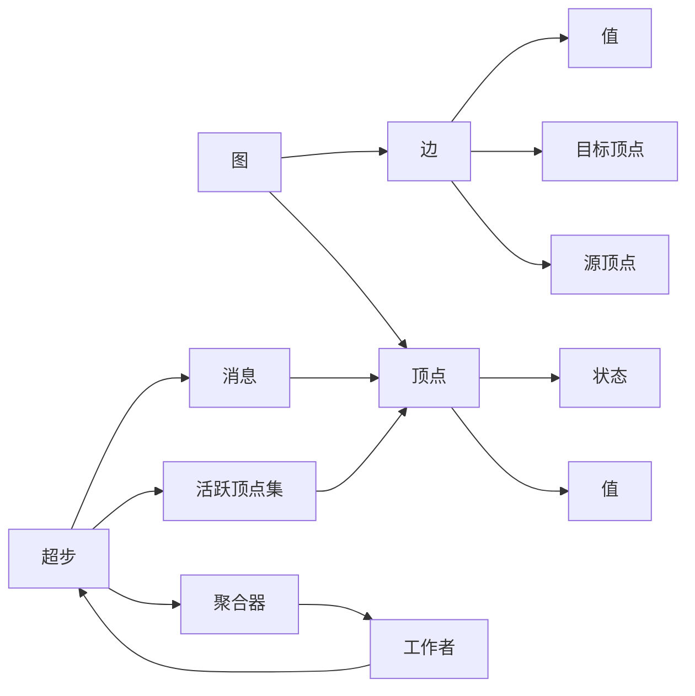

# Pregel原理与代码实例讲解

## 1. 背景介绍

### 1.1 问题的由来

在当今大数据时代，海量的数据被持续产生和积累。这些数据通常以图的形式表示,例如社交网络、Web链接、交通网络等。由于数据量的爆炸式增长,传统的单机系统已经无法高效处理这些大规模图数据。因此,如何在分布式环境下高效处理大规模图数据成为了一个亟待解决的问题。

### 1.2 研究现状

为了解决大规模图数据处理的挑战,Google于2010年提出了Pregel系统,这是一个基于大规模并行处理模型的分布式图计算框架。Pregel的出现为大规模图数据处理提供了一种新的解决方案,引起了学术界和工业界的广泛关注。

### 1.3 研究意义

Pregel系统的核心思想是将图计算任务分解为一系列超步(Superstep),每个超步由并行执行的顶点计算组成。通过这种并行计算模型,Pregel可以高效地处理大规模图数据,并具有良好的容错性和可扩展性。因此,深入理解Pregel的原理和实现对于解决大规模图数据处理问题具有重要意义。

### 1.4 本文结构

本文将从以下几个方面详细介绍Pregel:

1. 核心概念与联系
2. 核心算法原理与具体操作步骤
3. 数学模型和公式详细讲解与举例说明
4. 项目实践:代码实例和详细解释说明
5. 实际应用场景
6. 工具和资源推荐
7. 总结:未来发展趋势与挑战
8. 附录:常见问题与解答

## 2. 核心概念与联系

在深入探讨Pregel的原理和实现之前,我们需要先了解一些核心概念和它们之间的联系。

- **图(Graph)**: 由一组顶点(Vertex)和一组边(Edge)组成的数据结构。
- **顶点(Vertex)**: 图中的节点,具有值(Value)和状态(State)。
- **边(Edge)**: 连接两个顶点的链接,包含源顶点(Source Vertex)、目标顶点(Destination Vertex)和值(Value)。
- **超步(Superstep)**: Pregel计算的基本单位,由多个并行执行的顶点计算组成。每个超步包括以下几个阶段:
  1. 消息传递(Message Passing): 顶点之间传递消息。
  2. 顶点计算(Vertex Computation): 每个顶点根据收到的消息和当前状态进行计算,更新自身状态。
  3. 聚合(Aggregation): 通过聚合器(Aggregator)对全局信息进行聚合,供下一个超步使用。
  4. 活跃顶点集(Active Vertex Set): 确定哪些顶点在下一个超步中需要参与计算。
- **工作者(Worker)**: Pregel中的计算单元,负责执行顶点计算和消息传递。

这些核心概念之间紧密相连,共同构成了Pregel的计算模型。在后续章节中,我们将详细探讨Pregel的算法原理、数学模型以及实现细节。

## 3. 核心算法原理与具体操作步骤

### 3.1 算法原理概述

Pregel采用了"思考-计算-聚合"的迭代模式,将图计算任务分解为一系列超步(Superstep)。每个超步包括以下几个阶段:

1. **消息传递(Message Passing)**: 顶点之间传递消息,准备进行计算。
2. **顶点计算(Vertex Computation)**: 每个顶点根据收到的消息和当前状态进行计算,更新自身状态。
3. **聚合(Aggregation)**: 通过聚合器(Aggregator)对全局信息进行聚合,供下一个超步使用。
4. **活跃顶点集(Active Vertex Set)**: 确定哪些顶点在下一个超步中需要参与计算。

这个过程会一直重复,直到满足算法的终止条件。Pregel的核心思想是将计算任务分散到各个顶点,通过并行计算和消息传递来协同完成图计算任务。

### 3.2 算法步骤详解

下面我们详细介绍Pregel算法的具体步骤:

1. **初始化**
   - 将输入图数据划分并分发到不同的工作者(Worker)上。
   - 为每个顶点分配初始值和状态。
   - 设置算法的终止条件,例如最大超步数或全局终止标记。

2. **超步迭代**
   - **消息传递阶段**
     - 每个工作者将本地顶点的消息传递给其他工作者。
     - 消息被缓存,等待下一个超步的顶点计算。
   - **顶点计算阶段**
     - 每个工作者并行执行本地顶点的计算。
     - 顶点根据收到的消息和当前状态进行计算,更新自身状态。
     - 顶点可以向其他顶点发送消息,这些消息将在下一个超步中被处理。
   - **聚合阶段**
     - 聚合器(Aggregator)收集并汇总全局信息,例如计数、求和等。
     - 聚合结果将在下一个超步中供顶点使用。
   - **活跃顶点集确定阶段**
     - 根据算法的终止条件和顶点状态,确定哪些顶点在下一个超步中需要参与计算。
     - 非活跃顶点将被剪枝,不再参与后续计算。

3. **终止条件检查**
   - 检查是否满足算法的终止条件,例如最大超步数或全局终止标记。
   - 如果满足终止条件,算法结束;否则,进入下一个超步迭代。

4. **结果输出**
   - 将最终计算结果输出或持久化存储。

通过这种并行计算模型,Pregel可以高效地处理大规模图数据,并具有良好的容错性和可扩展性。

### 3.3 算法优缺点

**优点**:

- **并行计算**: Pregel通过将计算任务分散到各个顶点,实现了高度的并行计算能力,可以有效处理大规模图数据。
- **容错性**: Pregel具有良好的容错性,可以自动检测和恢复失败的工作者,确保计算的可靠性。
- **可扩展性**: Pregel可以通过添加更多的工作者来扩展计算能力,满足不断增长的数据量和计算需求。
- **编程模型简单**: Pregel提供了一种简单的编程模型,开发人员只需要关注顶点计算逻辑,而不需要关心底层的分布式细节。

**缺点**:

- **迭代计算开销**: Pregel采用迭代计算模式,每个超步都需要进行消息传递和同步,这可能会导致一定的开销。
- **内存限制**: Pregel要求将整个图数据加载到内存中,对于超大规模的图数据,可能会面临内存限制的问题。
- **计算模型局限性**: Pregel的计算模型主要适用于图计算任务,对于其他类型的数据处理任务,可能需要进行一定的改造和扩展。

### 3.4 算法应用领域

Pregel算法可以应用于各种涉及图数据处理的领域,包括但不限于:

- **社交网络分析**: 分析社交网络中的用户关系、影响力传播等。
- **Web链接分析**: 计算网页的PageRank值,优化搜索引擎排名。
- **推荐系统**: 基于用户之间的关系和行为数据进行个性化推荐。
- **交通网络优化**: 分析交通网络中的路径规划、流量预测等。
- **生物信息学**: 分析蛋白质互作网络、基因调控网络等。
- **金融风险分析**: 评估金融网络中的风险传播和影响。

总的来说,Pregel算法为处理大规模图数据提供了一种高效、可扩展的解决方案,在各个领域都有广泛的应用前景。

## 4. 数学模型和公式详细讲解与举例说明

### 4.1 数学模型构建

在介绍Pregel的数学模型之前,我们先定义一些基本概念:

- 设 $G = (V, E)$ 表示一个有向图,其中 $V$ 是顶点集合,$ E \subseteq V \times V$ 是边集合。
- 对于每个顶点 $v \in V$,它具有一个值 $val_v$ 和一个状态 $state_v$。
- 对于每条边 $e = (u, v) \in E$,它具有一个值 $val_e$。

Pregel算法的目标是计算一个函数 $f: V \rightarrow Y$,将每个顶点 $v$ 映射到一个输出值 $y_v \in Y$。为了实现这个目标,Pregel采用了一种迭代计算模型,将计算过程分解为一系列超步(Superstep)。

在每个超步 $t$ 中,每个顶点 $v$ 会执行以下操作:

1. 接收来自其他顶点的消息 $M_v^{(t)}$。
2. 根据当前状态 $state_v^{(t)}$、收到的消息 $M_v^{(t)}$ 和图结构信息,计算新的状态 $state_v^{(t+1)}$。
3. 向其他顶点发送消息 $M_v^{(t+1)}$。
4. 计算输出值 $y_v^{(t+1)}$。

这个过程可以用以下公式表示:

$$
state_v^{(t+1)} = \Phi(state_v^{(t)}, M_v^{(t)}, G)
$$

$$
M_v^{(t+1)} = \Psi(state_v^{(t+1)}, M_v^{(t)}, G)
$$

$$
y_v^{(t+1)} = \Omega(state_v^{(t+1)}, M_v^{(t)}, G)
$$

其中:

- $\Phi$ 是状态转移函数,用于计算新的状态。
- $\Psi$ 是消息生成函数,用于生成发送给其他顶点的消息。
- $\Omega$ 是输出函数,用于计算最终的输出值。

这些函数的具体实现取决于特定的图计算任务。Pregel提供了一种通用的框架,允许开发人员自定义这些函数来实现各种图算法。

### 4.2 公式推导过程

接下来,我们将通过一个具体的例子,推导Pregel中的数学公式。假设我们要在一个无向图 $G = (V, E)$ 中计算每个顶点的PageRank值。

PageRank算法的基本思想是,一个网页的重要性不仅取决于指向它的链接数量,还取决于指向它的网页的重要性。我们可以将这个问题建模为一个迭代过程,在每个超步中更新每个顶点的PageRank值。

设 $PR_v^{(t)}$ 表示超步 $t$ 时顶点 $v$ 的PageRank值,则我们有以下公式:

$$
PR_v^{(t+1)} = \frac{1 - d}{N} + d \sum_{u \in In(v)} \frac{PR_u^{(t)}}{Out(u)}
$$

其中:

- $d$ 是一个阻尼系数,通常取值 $0.85$。
- $N$ 是图中顶点的总数。
- $In(v)$ 表示指向顶点 $v$ 的所有顶点集合。
- $Out(u)$ 表示顶点 $u$ 的出度,即从 $u$ 出发的边的数量。

这个公式可以分解为以下几个步骤:

1. 初始化:
   $$
   PR_v^{(0)} = \frac{1}{N}, \forall v \in V
   $$

2. 迭代计算:
   $$
   PR_v^{(t+1)} = \frac{1 - d}{N} + d \sum_{u \in In(v)} \frac{PR_u^{(t)}}{Out(u)}
   $$

3. 终止条件:
   当 $\max_{v \in V}