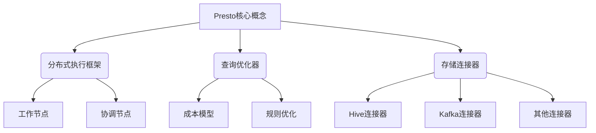
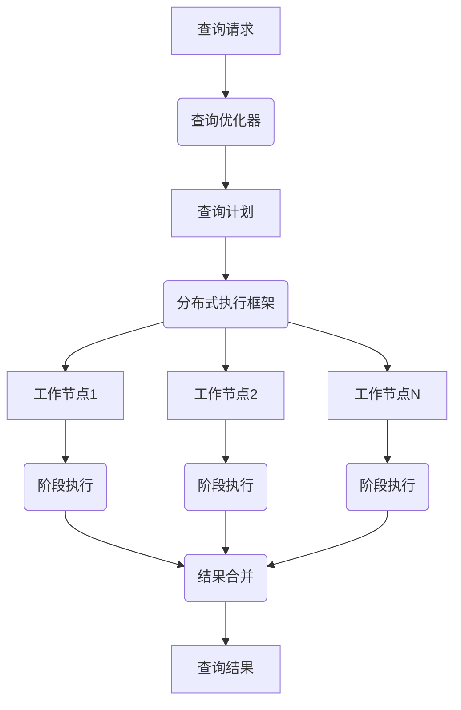

# Presto原理与代码实例讲解

## 1. 背景介绍

### 1.1 问题的由来

在当今的大数据时代，数据量的快速增长对传统的数据处理系统带来了巨大的挑战。随着数据规模的不断扩大,单机系统已经无法满足实时分析处理的需求。因此,分布式数据处理系统应运而生,以提高数据处理的效率和可扩展性。Apache Presto 作为一款开源的分布式SQL查询引擎,旨在为交互式分析查询提供高性能和可扩展的解决方案。

### 1.2 研究现状

目前,已有多种分布式数据处理系统,如 Apache Hive、Apache Spark 等。然而,这些系统在处理大规模数据集时往往存在性能瓶颈,无法满足实时分析的需求。相比之下,Presto 采用全新的架构设计,专注于交互式分析查询,能够在保持较低延迟的同时提供高吞吐量。

### 1.3 研究意义

深入理解 Presto 的原理和实现细节,对于构建高效的分布式数据处理系统具有重要意义。本文将全面剖析 Presto 的核心概念、算法原理、数学模型,并通过代码实例进行详细讲解,旨在帮助读者掌握 Presto 的设计思想和实现技术,为构建高性能的分布式查询引擎提供参考。

### 1.4 本文结构

本文将从以下几个方面对 Presto 进行全面介绍:

1. 核心概念与联系
2. 核心算法原理与具体操作步骤
3. 数学模型和公式详细讲解与案例分析
4. 项目实践:代码实例和详细解释说明
5. 实际应用场景
6. 工具和资源推荐
7. 总结:未来发展趋势与挑战
8. 附录:常见问题与解答

## 2. 核心概念与联系

Presto 是一个分布式 SQL 查询引擎,其核心概念包括:

1. **分布式执行框架**: 负责将查询分解为多个阶段,并在集群中的工作节点上并行执行这些阶段。它由协调节点和工作节点组成。
   - 协调节点: 接收查询请求,负责查询计划的生成和优化,并将任务分发给工作节点。
   - 工作节点: 执行实际的数据处理任务,如扫描数据、过滤、聚合等。

2. **查询优化器**: 负责将 SQL 查询转换为高效的执行计划。它包括成本模型和规则优化两个主要组件。
   - 成本模型: 估计不同执行计划的代价,以选择最优的执行路径。
   - 规则优化: 应用一系列优化规则来改进查询计划,如谓词下推、连接重排序等。

3. **存储连接器**: 允许 Presto 连接到各种数据源,如 HDFS、Hive、Kafka 等。每个数据源都有对应的连接器实现,负责读取和解析数据。

这些核心概念紧密相连,共同构建了 Presto 的分布式查询处理能力。查询优化器生成高效的执行计划,分布式执行框架负责在集群中并行执行这些计划,而存储连接器则提供了对各种数据源的无缝访问。

## 3. 核心算法原理与具体操作步骤

### 3.1 算法原理概述

Presto 的核心算法原理包括:

1. **分布式查询执行**
2. **成本模型和优化规则**
3. **数据局部性优化**
4. **流水线执行模型**

这些算法原理共同构建了 Presto 的高性能和可扩展性。

### 3.2 算法步骤详解

#### 3.2.1 分布式查询执行

1. 查询请求被发送到协调节点。
2. 查询优化器将 SQL 查询转换为高效的查询计划。
3. 查询计划被分解为多个阶段,并由分布式执行框架分发给工作节点。
4. 每个工作节点并行执行分配的阶段任务,如扫描数据、过滤、聚合等。
5. 工作节点将中间结果发送回协调节点进行合并。
6. 最终查询结果被返回给客户端。

#### 3.2.2 成本模型和优化规则

Presto 的查询优化器采用基于成本的优化策略和一系列优化规则,以生成高效的查询计划。

1. **成本模型**估计不同执行计划的代价,考虑因素包括:
   - 数据量
   - 数据分布
   - 计算资源
   - 网络传输开销

2. **优化规则**应用于查询计划,包括:
   - 谓词下推:将过滤条件尽可能下推到数据源
   - 投影剪裁:只读取所需的列
   - 连接重排序:优化连接顺序
   - 常量折叠:预计算常量表达式

通过成本模型和优化规则的协同作用,Presto 能够生成高效的执行计划,从而提高查询性能。

#### 3.2.3 数据局部性优化

为了减少数据传输开销,Presto 采用数据局部性优化策略。

1. 尽可能在数据所在的节点上执行计算任务。
2. 将中间结果写入临时文件,供下游任务读取。
3. 动态调整任务调度策略,优先选择数据局部的节点。

通过数据局部性优化,Presto 能够最小化网络传输开销,提高查询效率。

#### 3.2.4 流水线执行模型

Presto 采用流水线执行模型,允许操作符之间的管道化数据传输。

1. 操作符通过生产者-消费者模式进行数据交换。
2. 上游操作符生成数据,下游操作符立即消费。
3. 避免了中间结果的完全materialization,减少内存开销。
4. 提高了端到端的数据处理吞吐量。

流水线执行模型使 Presto 能够高效利用内存资源,并提升查询性能。

### 3.3 算法优缺点

#### 优点

1. **高性能**:通过分布式执行、查询优化和流水线执行,Presto 能够提供高吞吐量和低延迟。
2. **可扩展性**:可以通过添加更多节点来线性扩展计算能力。
3. **数据源无关性**:支持连接多种数据源,如 HDFS、Hive、Kafka 等。
4. **交互式查询**:专注于交互式分析查询,响应迅速。

#### 缺点

1. **不支持更新操作**:Presto 仅支持读取操作,无法执行插入、更新或删除。
2. **容错能力有限**:如果某个节点发生故障,查询可能会失败。
3. **资源隔离性较差**:多个查询之间可能会相互影响,导致性能抖动。
4. **缺乏事务支持**:不支持跨多个数据源的事务操作。

### 3.4 算法应用领域

Presto 主要应用于以下领域:

1. **交互式数据分析**:提供实时的数据探索和分析能力。
2. **数据湖分析**:高效查询存储在数据湖中的海量数据。
3. **ETL 工作负载**:用于数据提取、转换和加载等批处理任务。
4. **机器学习特征工程**:快速生成用于机器学习模型训练的特征数据。
5. **报表和仪表板**:支持构建实时报表和数据可视化仪表板。

## 4. 数学模型和公式详细讲解与举例说明

### 4.1 数学模型构建

在 Presto 的查询优化器中,成本模型扮演着关键角色。它通过估计不同执行计划的代价,帮助选择最优的执行路径。成本模型的构建基于以下数学模型:

$$
Cost = C_{cpu} + C_{memory} + C_{network} + C_{io}
$$

其中:

- $C_{cpu}$ 表示 CPU 开销
- $C_{memory}$ 表示内存开销
- $C_{network}$ 表示网络传输开销
- $C_{io}$ 表示磁盘 I/O 开销

每个开销项都由相应的代价函数计算得出,这些函数考虑了诸如数据量、数据分布、计算资源等多个因素。

#### CPU 开销模型

$$
C_{cpu} = \sum_{i=1}^{n} w_i \times f(x_i)
$$

其中:

- $n$ 是操作符数量
- $w_i$ 是操作符 $i$ 的权重系数
- $f(x_i)$ 是操作符 $i$ 的 CPU 代价函数,取决于输入数据量 $x_i$

#### 内存开销模型

$$
C_{memory} = \sum_{i=1}^{n} m_i
$$

其中 $m_i$ 是操作符 $i$ 所需的内存量估计值。

#### 网络传输开销模型

$$
C_{network} = \sum_{(i, j) \in E} b_{ij} \times d_{ij}
$$

其中:

- $E$ 是操作符之间的数据传输边集合
- $b_{ij}$ 是从操作符 $i$ 到操作符 $j$ 的数据量
- $d_{ij}$ 是两个操作符之间的网络距离

#### 磁盘 I/O 开销模型

$$
C_{io} = \sum_{i=1}^{n} r_i \times s_i
$$

其中:

- $n$ 是需要读取的文件数量
- $r_i$ 是文件 $i$ 的读取速率
- $s_i$ 是文件 $i$ 的大小

通过将上述模型组合起来,Presto 的成本模型能够对查询执行计划进行全面的代价估计,从而指导查询优化器选择最优执行路径。

### 4.2 公式推导过程

接下来,我们将推导 Presto 中一个关键公式:**分布式散列聚合的代价估计公式**。

假设有 $n$ 个工作节点参与聚合操作,输入数据量为 $D$,聚合键的基数为 $k$,则:

1. 每个工作节点需要处理 $\frac{D}{n}$ 数据量
2. 每个工作节点产生 $k$ 个局部聚合结果
3. 所有局部结果需要通过网络传输到一个节点进行最终聚合

我们将代价分解为三个部分:

- $C_{local}$: 每个工作节点进行局部聚合的代价
- $C_{shuffle}$: 网络传输局部结果的代价
- $C_{final}$: 最终聚合的代价

#### 局部聚合代价 $C_{local}$

假设局部聚合操作的 CPU 代价函数为 $f(x)$,则:

$$
C_{local} = n \times f\left(\frac{D}{n}\right)
$$

#### 网络传输代价 $C_{shuffle}$

假设每个局部结果的大小为 $s$,网络带宽为 $b$,则:

$$
C_{shuffle} = \frac{n \times k \times s}{b}
$$

#### 最终聚合代价 $C_{final}$

假设最终聚合操作的 CPU 代价函数为 $g(x)$,则:

$$
C_{final} = g(k)
$$

综合以上三个部分,分布式散列聚合的总代价为:

$$
C_{total} = C_{local} + C_{shuffle} + C_{final} = n \times f\left(\frac{D}{n}\right) + \frac{n \times k \times s}{b} + g(k)
$$

这个公式考虑了数据量、工作节点数量、聚