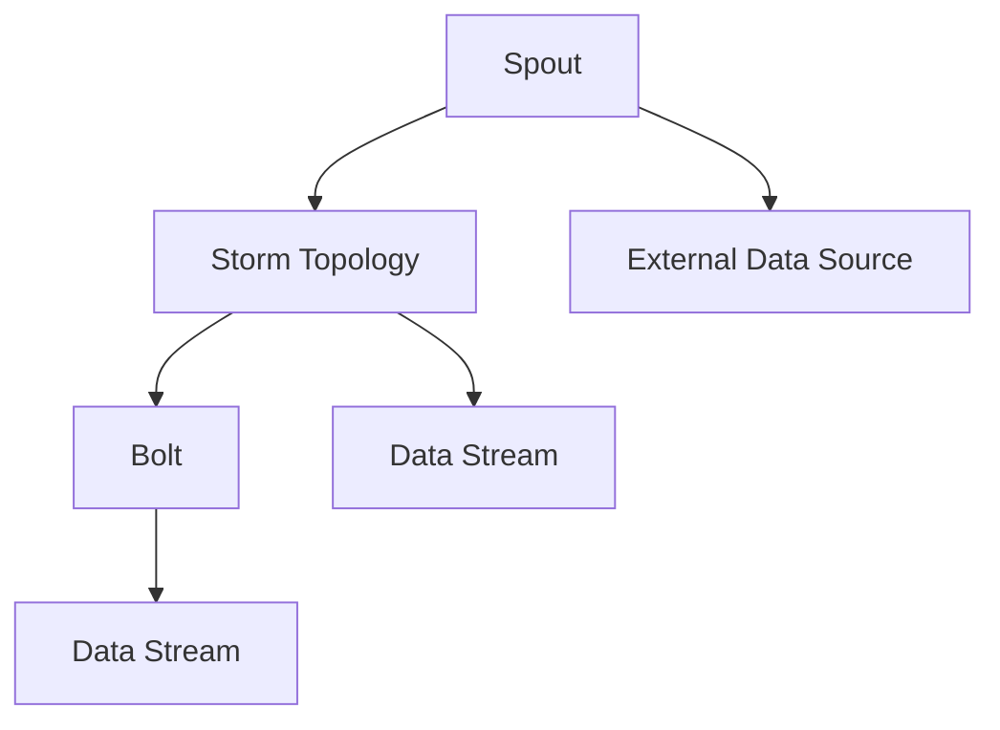

# Storm Spout原理与代码实例讲解

作者：禅与计算机程序设计艺术 / Zen and the Art of Computer Programming

关键词：Storm, Spout, 实时计算，分布式系统，流处理

## 1. 背景介绍

### 1.1 问题的由来

随着互联网和物联网的快速发展，数据量呈爆炸式增长。如何高效地处理和分析海量数据，成为了一个亟待解决的问题。Apache Storm是一个开源的分布式实时计算系统，它能够对大数据流进行快速、可靠的处理。在Storm中，Spout是一个关键的抽象，用于从外部数据源持续读取数据。

### 1.2 研究现状

目前，实时计算和流处理领域的研究已经取得了显著进展。Apache Storm、Apache Flink、Apache Kafka等都是该领域的代表性技术。Spout作为Storm的核心组件之一，其原理和实现受到了广泛关注。

### 1.3 研究意义

Spout在实时计算系统中扮演着重要角色，它决定了数据流的输入方式和可靠性。深入研究Spout的原理和实现，有助于更好地理解和应用Storm，提高实时计算系统的性能和可靠性。

### 1.4 本文结构

本文将首先介绍Spout的核心概念和原理，然后通过代码实例讲解Spout的具体实现方法，最后探讨Spout在实际应用场景中的优势和发展趋势。

## 2. 核心概念与联系

### 2.1 Spout概述

Spout是Storm中用于数据输入的组件，它负责从外部数据源（如数据库、消息队列等）读取数据，并将数据推送到Storm的拓扑结构中。Spout可以按照数据到达的顺序保证数据的可靠性，并且在数据丢失或失败的情况下能够进行恢复。

### 2.2 Spout的类型

根据数据输入的方式，Spout可以分为以下几种类型：

- **随机Spout**：随机地从数据源中读取数据。
- **随机批次Spout**：以批次的方式从数据源中读取数据。
- **可靠Spout**：保证数据可靠性，即使在数据源故障的情况下也能恢复。
- **直接Spout**：直接读取数据源中的数据，不进行任何转换。

### 2.3 Spout与其他组件的联系

Spout与Storm的其他组件紧密相连，如图所示：



Spout读取外部数据源的数据，并将其推送到Storm拓扑结构中的数据流。Bolt则负责处理这些数据流。

## 3. 核心算法原理与具体操作步骤

### 3.1 算法原理概述

Spout的核心算法原理可以概括为以下几个步骤：

1. 从外部数据源读取数据。
2. 将数据封装成tuple并发布到数据流中。
3. 确保数据的可靠性。
4. 在数据源故障的情况下进行恢复。

### 3.2 算法步骤详解

#### 3.2.1 数据读取

Spout从外部数据源读取数据的方式取决于数据源的类型。例如，对于数据库，可以使用数据库连接和查询语句读取数据；对于消息队列，可以使用消息队列客户端进行读取。

#### 3.2.2 数据封装

读取到的数据需要封装成tuple并发布到数据流中。tuple是Storm中的基本数据结构，包含一系列的字段和元信息。

#### 3.2.3 数据可靠性

为了保证数据的可靠性，Spout需要在数据发布后进行确认。如果数据在传输过程中丢失或失败，Spout需要重新读取并发布该数据。

#### 3.2.4 数据恢复

在数据源故障的情况下，Spout需要从最后确认的数据点恢复，确保数据的完整性。

### 3.3 算法优缺点

Spout的优点在于能够可靠地从外部数据源读取数据，并在数据源故障的情况下进行恢复。然而，Spout也存在一些缺点，例如：

- **性能开销**：Spout需要处理数据的读取、封装、发布和确认等操作，这可能导致一定的性能开销。
- **复杂性**：Spout的实现较为复杂，需要考虑数据可靠性、恢复机制等问题。

### 3.4 算法应用领域

Spout在以下应用领域中得到了广泛应用：

- **实时数据分析**：从实时数据源中读取数据，进行实时分析和处理。
- **数据导入**：将数据从外部数据源导入到Storm拓扑结构中。
- **数据同步**：将数据从不同的数据源同步到同一个数据流中。

## 4. 数学模型和公式详细讲解与举例说明

Spout的数学模型主要涉及数据的读取、封装、发布和确认等环节。以下是一些相关的数学模型和公式：

### 4.1 数据读取模型

假设Spout以固定的时间间隔从数据源中读取数据，那么数据读取模型可以表示为：

$$ R(t) = f(t) $$

其中，$R(t)$表示在时间$t$读取到的数据量，$f(t)$表示读取函数。

### 4.2 数据封装模型

Spout将读取到的数据封装成tuple并发布到数据流中，数据封装模型可以表示为：

$$ T(t) = g(t, R(t)) $$

其中，$T(t)$表示在时间$t$封装并发布的tuple，$g(t, R(t))$表示封装函数。

### 4.3 数据发布模型

Spout将封装后的tuple发布到数据流中，数据发布模型可以表示为：

$$ S(t) = h(T(t)) $$

其中，$S(t)$表示在时间$t$发布的tuple，$h(T(t))$表示发布函数。

### 4.4 数据确认模型

为了保证数据的可靠性，Spout需要在数据发布后进行确认。数据确认模型可以表示为：

$$ C(t) = k(S(t)) $$

其中，$C(t)$表示在时间$t$确认的tuple，$k(S(t))$表示确认函数。

### 4.5 案例分析与讲解

假设Spout从数据库中读取数据，每5秒读取一次，每次读取10条数据。在时间$t_0$，Spout读取到了数据量$R(t_0) = 10$。Spout将这10条数据封装成tuple并发布到数据流中，封装函数为$g(t, R(t))$。在时间$t_1$，Spout将封装后的tuple发布到数据流中，发布函数为$h(T(t))$。在时间$t_2$，Spout确认了发布到数据流中的tuple，确认函数为$k(S(t))$。

### 4.6 常见问题解答

**问题1：如何保证Spout的可靠性？**

**解答**：Spout通过确认机制保证数据的可靠性。在数据发布后，Spout需要等待一定时间，确认数据是否到达目标组件。如果确认失败，Spout将重新读取并发布该数据。

**问题2：Spout的性能如何优化？**

**解答**：优化Spout性能的关键在于减少数据读取、封装和发布等环节的开销。例如，可以使用缓冲区、批处理等技术来减少I/O操作。

## 5. 项目实践：代码实例与详细解释说明

### 5.1 开发环境搭建

在开始编写代码之前，需要搭建以下开发环境：

- Java开发环境
- Apache Storm
- Maven

### 5.2 源代码详细实现

以下是一个简单的Spout实现示例：

```java
import org.apache.storm.spout.SpoutOutputCollector;
import org.apache.storm.task.TopologyContext;
import org.apache.storm.topology.IRichSpout;

import java.util.Map;
import java.util.Random;

public class RandomSpout implements IRichSpout {
    private SpoutOutputCollector collector;
    private Random random;

    @Override
    public void open(Map conf, TopologyContext context, SpoutOutputCollector collector) {
        this.collector = collector;
        this.random = new Random();
    }

    @Override
    public void nextTuple() {
        int number = random.nextInt(100);
        collector.emit(new Values(number));
        try {
            Thread.sleep(1000);
        } catch (InterruptedException e) {
            e.printStackTrace();
        }
    }

    @Override
    public void ack(Object msgId) {
        // 逻辑处理
    }

    @Override
    public void fail(Object msgId) {
        // 逻辑处理
    }

    @Override
    public void close() {
        // 逻辑处理
    }

    @Override
    public Map<String, Object> getComponentConfiguration() {
        return null;
    }
}
```

### 5.3 代码解读与分析

1. **RandomSpout类**：继承自IRichSpout接口，实现Spout的功能。
2. **open方法**：初始化SpoutOutputCollector和Random对象。
3. **nextTuple方法**：生成随机数并发布到数据流中。
4. **ack方法和fail方法**：处理tuple确认和失败情况。
5. **close方法**：关闭Spout。

### 5.4 运行结果展示

运行上述代码，可以看到Spout不断生成随机数并发布到数据流中。这些数据可以用于后续的Bolt处理。

## 6. 实际应用场景

### 6.1 实时数据分析

Spout可以用于从实时数据源中读取数据，进行实时分析和处理。例如，从社交网络中实时监控热门话题，或者从传感器数据中提取异常值。

### 6.2 数据导入

Spout可以用于将数据从外部数据源导入到Storm拓扑结构中。例如，从数据库中读取数据，并将其导入到实时分析系统中。

### 6.3 数据同步

Spout可以用于将数据从不同的数据源同步到同一个数据流中。例如，将多个数据源的数据进行汇总和整合。

## 7. 工具和资源推荐

### 7.1 学习资源推荐

- Apache Storm官方文档：[https://storm.apache.org/docs/1.2.3/Spout.html](https://storm.apache.org/docs/1.2.3/Spout.html)
- Storm教程：[https://storm.apache.org/tutorials.html](https://storm.apache.org/tutorials.html)

### 7.2 开发工具推荐

- IntelliJ IDEA：[https://www.jetbrains.com/idea/](https://www.jetbrains.com/idea/)
- Maven：[https://maven.apache.org/](https://maven.apache.org/)

### 7.3 相关论文推荐

- **Real-time Data Processing with Apache Storm**: 作者：Chris Fregly
- **Scalable and Fault-Tolerant Stream Processing with Apache Storm**: 作者：Nathan Marz

### 7.4 其他资源推荐

- Apache Storm社区：[https://cwiki.apache.org/confluence/display/STORM](https://cwiki.apache.org/confluence/display/STORM)
- Storm用户邮件列表：[https://mail-archives.apache.org/mod_mbox/storm-user/](https://mail-archives.apache.org/mod_mbox/storm-user/)

## 8. 总结：未来发展趋势与挑战

Apache Storm的Spout作为实时计算系统中的重要组件，在数据输入和处理方面发挥着关键作用。随着大数据和实时计算技术的不断发展，Spout将面临以下发展趋势和挑战：

### 8.1 发展趋势

- **多源数据集成**：Spout将支持更多类型的数据源，如物联网设备、社交媒体等。
- **高并发处理**：Spout将具备更高的并发处理能力，满足大规模数据处理的需求。
- **弹性扩展**：Spout将实现弹性扩展，以应对数据流量的波动。

### 8.2 挑战

- **数据一致性**：保证数据的一致性是Spout面临的重要挑战，尤其是在分布式环境中。
- **性能优化**：随着数据量的增长，Spout的性能优化成为一个关键问题。
- **安全性**：Spout需要保证数据传输和存储的安全性。

总之，Spout在实时计算系统中具有重要地位，未来将继续发展以满足不断增长的数据处理需求。

## 9. 附录：常见问题与解答

### 9.1 什么是Spout？

Spout是Apache Storm中用于数据输入的组件，它负责从外部数据源读取数据，并将数据推送到Storm的拓扑结构中。

### 9.2 Spout与Bolt有何区别？

Spout负责数据输入，Bolt负责数据处理。Spout将数据封装成tuple并发布到数据流中，Bolt从数据流中读取tuple并执行相应的处理操作。

### 9.3 如何实现一个自定义的Spout？

实现自定义Spout需要实现IRichSpout接口，并实现open、nextTuple、ack、fail和close等方法。

### 9.4 如何保证Spout的可靠性？

Spout通过确认机制保证数据的可靠性。在数据发布后，Spout需要等待一定时间，确认数据是否到达目标组件。如果确认失败，Spout将重新读取并发布该数据。

### 9.5 Spout在实时计算系统中有哪些应用场景？

Spout在实时计算系统中有着广泛的应用场景，如实时数据分析、数据导入和数据同步等。

### 9.6 如何优化Spout的性能？

优化Spout性能的关键在于减少数据读取、封装和发布等环节的开销。例如，可以使用缓冲区、批处理等技术来减少I/O操作。

### 9.7 未来Spout的发展趋势有哪些？

未来Spout将支持更多类型的数据源，具备更高的并发处理能力，并实现弹性扩展。同时，Spout还需要保证数据的一致性、性能和安全性。