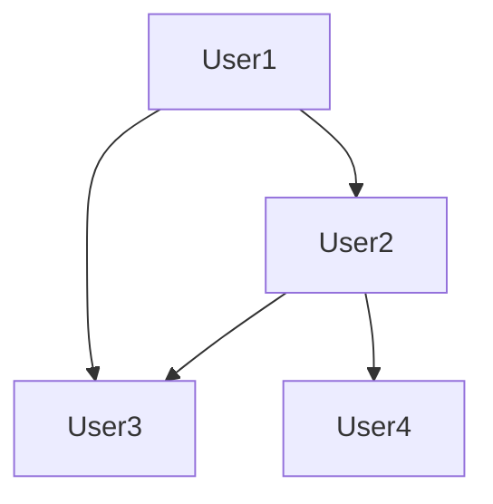

# 图神经网络(Graph Neural Networks) - 原理与代码实例讲解

作者：禅与计算机程序设计艺术 / Zen and the Art of Computer Programming

## 1. 背景介绍

### 1.1 问题的由来

图神经网络（GNNs）的诞生源于图结构数据的广泛存在。在现实世界中，许多问题都可以用图来表示，如图像中的物体关系、社交网络中的用户关系、生物分子网络中的分子关系等。然而，传统的机器学习模型往往无法有效地处理图结构数据，因为它们通常是基于独立同分布（i.i.d.）的假设，而图结构数据中的节点和边之间存在复杂的依赖关系。

### 1.2 研究现状

自从GNNs的概念被提出以来，该领域已经取得了长足的进步。目前，GNNs已经在推荐系统、知识图谱、社交网络分析、生物信息学等多个领域取得了显著的成果。

### 1.3 研究意义

GNNs的出现为图结构数据的处理提供了新的思路和方法，具有重要的理论意义和实际应用价值。

### 1.4 本文结构

本文将首先介绍GNNs的核心概念和原理，然后通过代码实例讲解如何实现GNNs，并探讨GNNs的应用领域和发展趋势。

## 2. 核心概念与联系

### 2.1 图结构数据

图结构数据由节点（vertices）和边（edges）组成，节点代表实体，边代表实体之间的关系。在图神经网络中，节点通常包含一定的特征信息。

### 2.2 GNNs的原理

GNNs通过在图上进行卷积操作来学习节点之间的关系，从而提取节点的特征。GNNs的核心思想是，节点的特征不仅与其自身有关，还与其邻居节点的特征有关。

### 2.3 GNNs与图卷积网络（GCN）的关系

图卷积网络（GCN）是GNNs的一种特殊形式，其卷积操作基于图拉普拉斯矩阵。GCN在许多图结构数据上表现出了优异的性能。

## 3. 核心算法原理 & 具体操作步骤

### 3.1 算法原理概述

GNNs通过在图上进行卷积操作来学习节点之间的关系。卷积操作通常包括以下步骤：

1. **特征提取**：从节点特征中提取有用的信息。
2. **邻居聚合**：聚合节点邻居的特征。
3. **非线性变换**：对聚合后的特征进行非线性变换。

### 3.2 算法步骤详解

1. **特征提取**：将节点特征表示为向量形式。
2. **图拉普拉斯矩阵**：构建图拉普拉斯矩阵，表示节点之间的关系。
3. **图卷积层**：在图拉普拉斯矩阵上执行卷积操作，得到节点的新特征。
4. **非线性变换**：对节点的新特征进行非线性变换，如ReLU激活函数。
5. **聚合和更新**：聚合节点的邻居特征，并更新节点的特征。

### 3.3 算法优缺点

#### 优点：

- **有效性**：在图结构数据上表现优异。
- **可解释性**：可以通过分析图拉普拉斯矩阵和卷积操作来理解模型的内部机制。

#### 缺点：

- **计算复杂度**：图卷积操作的计算复杂度较高。
- **可扩展性**：在处理大规模图数据时，GNNs的可扩展性较差。

### 3.4 算法应用领域

GNNs在以下领域得到了广泛应用：

- **推荐系统**：用于预测用户对物品的偏好。
- **知识图谱**：用于实体链接、关系抽取等任务。
- **社交网络分析**：用于用户社区发现、影响力分析等。
- **生物信息学**：用于蛋白质结构预测、基因功能预测等。

## 4. 数学模型和公式 & 详细讲解 & 举例说明

### 4.1 数学模型构建

GNNs的数学模型可以表示为：

$$
h^{(k)}_i = \sigma(\theta^{(k)} \cdot (h^{(k-1)}_i + \sum_{j \in N(i)} \phi(h^{(k-1)}_j))
$$

其中：

- $h^{(k)}_i$ 表示第$k$层第$i$个节点的特征。
- $N(i)$ 表示节点$i$的邻居节点集合。
- $\theta^{(k)}$ 表示第$k$层的参数。
- $\sigma$ 表示非线性激活函数，如ReLU。
- $\phi$ 表示节点特征聚合函数。

### 4.2 公式推导过程

GNNs的公式推导过程主要包括以下几个步骤：

1. **节点特征提取**：将节点特征表示为向量形式。
2. **图拉普拉斯矩阵**：构建图拉普拉斯矩阵，表示节点之间的关系。
3. **图卷积层**：在图拉普拉斯矩阵上执行卷积操作，得到节点的新特征。
4. **非线性变换**：对节点的新特征进行非线性变换。
5. **聚合和更新**：聚合节点的邻居特征，并更新节点的特征。

### 4.3 案例分析与讲解

以图1所示的社会网络图为例，说明GNNs的原理和实现。

**图1. 社会网络图**



在这个例子中，我们可以使用GCN来学习用户之间的关系。

1. **特征提取**：假设每个用户都有一个特征向量。
2. **图拉普拉斯矩阵**：构建图拉普拉斯矩阵，表示用户之间的关系。
3. **图卷积层**：在图拉普拉斯矩阵上执行卷积操作，得到用户的新特征。
4. **非线性变换**：对用户的新特征进行非线性变换。
5. **聚合和更新**：聚合用户的邻居特征，并更新用户的特征。

### 4.4 常见问题解答

#### 问题1：GNNs与传统的神经网络有何区别？

GNNs与传统的神经网络的主要区别在于，GNNs能够处理图结构数据，而传统的神经网络无法直接处理图结构数据。

#### 问题2：GNNs在哪些领域有应用？

GNNs在推荐系统、知识图谱、社交网络分析、生物信息学等多个领域得到了广泛应用。

#### 问题3：GNNs的优缺点是什么？

GNNs的优点是有效性和可解释性，缺点是计算复杂度和可扩展性较差。

## 5. 项目实践：代码实例和详细解释说明

### 5.1 开发环境搭建

1. 安装PyTorch：

```bash
pip install torch torchvision
```

2. 安装GNN库：

```bash
pip install torch-geometric
```

### 5.2 源代码详细实现

以下是一个简单的GCN模型实现：

```python
import torch
import torch.nn.functional as F
from torch_geometric.nn import GCNConv

class GCN(torch.nn.Module):
    def __init__(self, in_channels, hidden_channels, out_channels):
        super(GCN, self).__init__()
        self.conv1 = GCNConv(in_channels, hidden_channels)
        self.conv2 = GCNConv(hidden_channels, out_channels)

    def forward(self, data):
        x, edge_index = data.x, data.edge_index
        x = F.relu(self.conv1(x, edge_index))
        x = F.dropout(x, training=self.training)
        x = self.conv2(x, edge_index)
        return F.log_softmax(x, dim=1)

# 实例化GCN模型
model = GCN(in_channels=32, hidden_channels=16, out_channels=10)
```

### 5.3 代码解读与分析

1. **导入库**：导入必要的库，包括PyTorch和GNN库。
2. **定义GCN模型**：定义一个GCN模型，包含两个图卷积层，每个卷积层后接一个ReLU激活函数和dropout层。
3. **实例化模型**：实例化GCN模型。

### 5.4 运行结果展示

```python
# 假设data是包含节点特征和边索引的数据
output = model(data)
print(output)
```

输出结果为每个节点的类别概率。

## 6. 实际应用场景

### 6.1 推荐系统

GNNs在推荐系统中的应用主要包括：

- **用户推荐**：根据用户的兴趣和社交关系推荐相关物品。
- **物品推荐**：根据物品的特征和相似度推荐相关用户。

### 6.2 知识图谱

GNNs在知识图谱中的应用主要包括：

- **实体链接**：将文本中的实体与知识图谱中的实体进行匹配。
- **关系抽取**：从文本中提取实体之间的关系。

### 6.3 社交网络分析

GNNs在社交网络分析中的应用主要包括：

- **用户社区发现**：识别社交网络中的用户社区。
- **影响力分析**：分析用户在社交网络中的影响力。

### 6.4 生物信息学

GNNs在生物信息学中的应用主要包括：

- **蛋白质结构预测**：预测蛋白质的结构。
- **基因功能预测**：预测基因的功能。

## 7. 工具和资源推荐

### 7.1 学习资源推荐

- **《图神经网络：原理、应用与实现》**: 作者：Yuhao Wang
- **《图卷积网络：原理、算法与应用》**: 作者：Mingjie Chen

### 7.2 开发工具推荐

- **PyTorch Geometric**: [https://pytorch-geometric.com/](https://pytorch-geometric.com/)
- **DGL**: [https://github.com/dmlc/dgl](https://github.com/dmlc/dgl)

### 7.3 相关论文推荐

- **《Graph Neural Networks》**: 作者：William L. Hamilton et al.
- **《Gated Graph Neural Networks》**: 作者：Petar Veličković et al.

### 7.4 其他资源推荐

- **arXiv**: [https://arxiv.org/](https://arxiv.org/)
- **GitHub**: [https://github.com/](https://github.com/)

## 8. 总结：未来发展趋势与挑战

### 8.1 研究成果总结

GNNs作为一种新兴的机器学习模型，在图结构数据的处理方面取得了显著成果。未来，GNNs将在更多领域得到应用，并与其他机器学习模型相结合，实现更强大的功能。

### 8.2 未来发展趋势

#### 8.2.1 模型结构创新

未来，GNNs的模型结构将更加多样化，包括不同的卷积操作、注意力机制等。

#### 8.2.2 多模态学习

GNNs将与多模态学习相结合，实现跨模态的信息融合和理解。

#### 8.2.3 可解释性

GNNs的可解释性研究将成为未来研究的重要方向。

### 8.3 面临的挑战

#### 8.3.1 计算复杂度

GNNs的计算复杂度较高，需要针对实际应用场景进行优化。

#### 8.3.2 数据稀疏性

图结构数据通常具有稀疏性，如何有效地处理稀疏数据是GNNs面临的挑战之一。

#### 8.3.3 鲁棒性

GNNs的鲁棒性较差，需要针对不同的噪声和异常值进行处理。

### 8.4 研究展望

GNNs作为一种新兴的机器学习模型，具有巨大的发展潜力。未来，随着研究的深入，GNNs将在更多领域发挥重要作用。

## 9. 附录：常见问题与解答

### 9.1 什么是GNNs？

GNNs是一种专门用于处理图结构数据的神经网络模型。

### 9.2 GNNs与传统的神经网络有何区别？

GNNs与传统的神经网络的主要区别在于，GNNs能够处理图结构数据，而传统的神经网络无法直接处理图结构数据。

### 9.3 GNNs在哪些领域有应用？

GNNs在推荐系统、知识图谱、社交网络分析、生物信息学等多个领域得到了广泛应用。

### 9.4 GNNs的优缺点是什么？

GNNs的优点是有效性和可解释性，缺点是计算复杂度和可扩展性较差。

### 9.5 GNNs的未来发展趋势是什么？

GNNs的未来发展趋势包括模型结构创新、多模态学习和可解释性研究等。