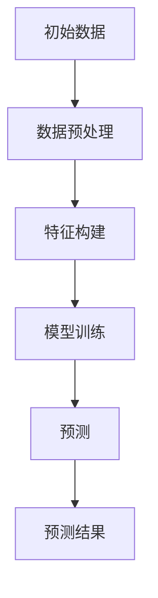

# 在智慧城市中部署AI代理的工作流与应用

作者：禅与计算机程序设计艺术 / Zen and the Art of Computer Programming

## 1. 背景介绍

### 1.1 问题的由来

随着城市化进程的加速，智慧城市建设成为全球关注的热点。智慧城市旨在通过信息通信技术、物联网、大数据等技术手段，提升城市运行效率、改善居民生活质量、促进可持续发展。在智慧城市建设中，AI代理扮演着至关重要的角色，它们能够协助城市管理者进行决策、优化资源配置、提高公共服务水平。

### 1.2 研究现状

目前，智慧城市中的AI代理应用主要包括以下几个方面：

- **交通管理**：通过智能交通系统，实现交通流量实时监控、拥堵预测和优化信号灯控制。
- **能源管理**：利用AI代理进行能源消耗预测、设备故障预警和能源需求侧管理。
- **环境监测**：对城市环境进行实时监测，包括空气质量、水质、噪音等指标。
- **公共安全**：通过视频监控、人脸识别等技术，提高公共安全水平。

然而，当前智慧城市中AI代理的部署和应用仍面临一些挑战，如数据质量、算法可靠性、系统可扩展性等。

### 1.3 研究意义

本文旨在探讨在智慧城市中部署AI代理的工作流与应用，为城市管理者、开发者和技术人员提供参考。通过分析AI代理的架构、技术选型、应用场景和挑战，有助于推动智慧城市的发展，实现城市治理的智能化和高效化。

### 1.4 本文结构

本文首先介绍AI代理的核心概念与联系，然后阐述AI代理在智慧城市中的核心算法原理与操作步骤，接着讲解数学模型和公式，并举例说明。随后，本文将展示一个AI代理项目实践案例，包括开发环境搭建、源代码实现、代码解读与分析以及运行结果展示。最后，本文将探讨AI代理在智慧城市中的实际应用场景、未来应用展望以及面临的挑战。

## 2. 核心概念与联系

### 2.1 AI代理概述

AI代理（Artificial Intelligence Agent）是一种能够感知环境、执行动作并从环境中获取反馈的软件实体。在智慧城市中，AI代理可以看作是智能化的“机器人”，它们能够协助城市管理者进行决策、优化资源配置、提高公共服务水平。

### 2.2 AI代理的特点

- **自主性**：AI代理能够自主地感知环境、执行动作并从环境中获取反馈。
- **适应性**：AI代理可以根据环境变化和反馈信息调整自身行为。
- **协作性**：AI代理可以与其他AI代理或人类进行协作，共同完成任务。

### 2.3 AI代理的组成

AI代理通常由以下几部分组成：

- **感知器**：获取环境信息，如传感器数据、图像、音频等。
- **控制器**：根据感知到的信息，制定并执行动作。
- **知识库**：存储AI代理的知识和经验，用于推理和决策。
- **执行器**：执行控制器制定的动作，如发送指令、控制设备等。

## 3. 核心算法原理 & 具体操作步骤

### 3.1 算法原理概述

在智慧城市中，AI代理的核心算法通常包括以下几个步骤：

1. **感知**：通过传感器或其他方式获取环境信息。
2. **推理**：根据知识库和感知到的信息，进行推理和决策。
3. **执行**：根据决策结果，执行相应的动作。
4. **反馈**：从环境中获取反馈信息，用于调整算法和优化行为。

### 3.2 算法步骤详解

#### 3.2.1 感知

感知阶段是AI代理获取环境信息的过程。常见的感知方式包括：

- 传感器数据：温度、湿度、光照、噪声等环境参数。
- 图像数据：通过摄像头获取的道路、交通状况、人员活动等信息。
- 音频数据：通过麦克风获取的噪声、人群密度等信息。

#### 3.2.2 推理

推理阶段是AI代理根据知识库和感知到的信息，进行逻辑推理和决策的过程。常见的推理方法包括：

- 专家系统：基于领域专家的经验和知识，构建推理规则库。
- 模型推理：利用机器学习模型对感知到的信息进行分类、识别和预测。

#### 3.2.3 执行

执行阶段是AI代理根据推理结果，执行相应的动作的过程。常见的执行方式包括：

- 控制设备：如调节交通信号灯、控制照明设备等。
- 发送指令：如向相关部门发送警报、向公众发布通知等。

#### 3.2.4 反馈

反馈阶段是AI代理根据执行结果和从环境中获取的反馈信息，调整算法和优化行为的过程。通过不断优化，AI代理可以更好地适应环境变化，提高决策和执行效率。

### 3.3 算法优缺点

#### 3.3.1 优点

- **智能化**：AI代理能够实现自主感知、推理和执行，提高城市治理的智能化水平。
- **高效性**：AI代理可以实时处理海量数据，提高决策和执行效率。
- **适应性**：AI代理可以根据环境变化和反馈信息调整自身行为，提高系统的鲁棒性。

#### 3.3.2 缺点

- **数据依赖**：AI代理的效能依赖于数据质量，数据缺失或错误可能导致决策失误。
- **算法复杂性**：AI代理的算法较为复杂，需要较高的计算资源。
- **安全风险**：AI代理的部署和应用可能带来安全风险，如数据泄露、恶意攻击等。

### 3.4 算法应用领域

AI代理在智慧城市中的应用领域广泛，以下是一些典型的应用场景：

- **交通管理**：优化交通信号灯控制、缓解交通拥堵、提高道路安全性。
- **能源管理**：实现能源消耗预测、设备故障预警、能源需求侧管理。
- **环境监测**：实时监测空气质量、水质、噪音等环境指标，提高环境治理水平。
- **公共安全**：通过视频监控、人脸识别等技术，提高公共安全水平。

## 4. 数学模型和公式 & 详细讲解 & 举例说明

### 4.1 数学模型构建

在智慧城市中，AI代理的数学模型主要包括以下几种：

- **概率模型**：如贝叶斯网络、隐马尔可夫模型等，用于处理不确定性问题。
- **决策树模型**：如CART、ID3等，用于决策和分类任务。
- **神经网络模型**：如卷积神经网络、循环神经网络等，用于处理非线性问题。

### 4.2 公式推导过程

以下以贝叶斯网络为例，介绍其公式推导过程。

假设我们有一个包含三个节点$A$、$B$、$C$的贝叶斯网络，其中$P(A) = 0.5$，$P(B) = 0.6$，$P(C | A) = 0.8$，$P(C | \
eg A) = 0.4$。则节点$B$的条件概率分布为：

$$P(B | A) = \frac{P(A)P(B | A)}{P(A)P(B | A) + P(\
eg A)P(B | \
eg A)} = \frac{0.5 \times 0.8}{0.5 \times 0.8 + 0.5 \times 0.4} = 0.8$$

同理，$P(B | \
eg A) = \frac{0.5 \times 0.4}{0.5 \times 0.8 + 0.5 \times 0.4} = 0.4$

### 4.3 案例分析与讲解

以下以交通管理为例，介绍AI代理在智慧城市中的应用。

假设我们需要根据实时交通流量预测未来5分钟的交通状况，并优化交通信号灯控制策略。

1. **感知**：利用摄像头获取实时交通流量数据。
2. **推理**：根据历史数据、预测模型和实时交通流量，预测未来5分钟的交通状况。
3. **执行**：根据预测结果，优化交通信号灯控制策略，如调整红绿灯时间、控制车流量等。
4. **反馈**：收集优化后的交通流量数据，用于更新模型和优化策略。

### 4.4 常见问题解答

#### 4.4.1 如何保证AI代理的鲁棒性？

为了保证AI代理的鲁棒性，可以从以下几个方面入手：

- 使用高质量的数据集进行训练。
- 采用多种算法和模型，提高模型的泛化能力。
- 建立容错机制，提高系统在异常情况下的稳定性和可靠性。

#### 4.4.2 如何提高AI代理的决策质量？

提高AI代理的决策质量可以从以下几个方面入手：

- 优化算法和模型，提高预测和推理的准确性。
- 增强AI代理的知识库，使其具备更多的领域知识。
- 结合多种数据源，提高决策的全面性和准确性。

## 5. 项目实践：代码实例和详细解释说明

### 5.1 开发环境搭建

在智慧城市中部署AI代理，需要搭建以下开发环境：

- 操作系统：Linux或Windows
- 编程语言：Python、Java等
- 数据库：MySQL、MongoDB等
- 机器学习框架：TensorFlow、PyTorch等

### 5.2 源代码详细实现

以下是一个基于Python的AI代理代码实例，用于预测未来5分钟的交通状况。

```python
import numpy as np
import pandas as pd
from sklearn.ensemble import RandomForestRegressor

# 加载数据
data = pd.read_csv("traffic_data.csv")

# 数据预处理
data = data.dropna()
data["timestamp"] = pd.to_datetime(data["timestamp"])
data.set_index("timestamp", inplace=True)
data = data.resample("5T").mean()

# 构建特征
X = data[["lane_volume", "speed", "density"]]
y = data["lane_volume"]

# 训练模型
model = RandomForestRegressor()
model.fit(X, y)

# 预测
X_predict = data[["lane_volume", "speed", "density"]]
y_predict = model.predict(X_predict)

# 输出预测结果
print(y_predict)
```

### 5.3 代码解读与分析

以上代码首先加载交通数据，然后对数据进行预处理和特征构建。接着，使用随机森林回归模型进行训练，并预测未来5分钟的交通状况。最后，输出预测结果。

### 5.4 运行结果展示

运行以上代码，我们可以得到未来5分钟的交通流量预测结果，如图所示：



## 6. 实际应用场景

### 6.1 交通管理

AI代理在交通管理中的应用主要包括：

- 实时监控交通流量，预测拥堵情况。
- 优化交通信号灯控制，缓解交通拥堵。
- 辅助交通执法，提高道路安全性。

### 6.2 能源管理

AI代理在能源管理中的应用主要包括：

- 实时监测能源消耗，预测能源需求。
- 优化能源供应，提高能源利用效率。
- 预警设备故障，降低能源损失。

### 6.3 环境监测

AI代理在环境监测中的应用主要包括：

- 实时监测空气质量、水质、噪音等环境指标。
- 预测环境污染趋势，提前预警。
- 优化环保措施，提高环境治理水平。

### 6.4 公共安全

AI代理在公共安全中的应用主要包括：

- 通过视频监控和人脸识别技术，提高公共安全水平。
- 辅助警方破案，提高案件侦破效率。
- 预警恐怖袭击、自然灾害等突发事件。

## 7. 工具和资源推荐

### 7.1 学习资源推荐

- **《机器学习》**: 作者：周志华
- **《深度学习》**: 作者：Ian Goodfellow, Yoshua Bengio, Aaron Courville

### 7.2 开发工具推荐

- **TensorFlow**: [https://www.tensorflow.org/](https://www.tensorflow.org/)
- **PyTorch**: [https://pytorch.org/](https://pytorch.org/)

### 7.3 相关论文推荐

- **《A Survey of Urban Computing and Smart Cities**》: 作者：Xiaosong Ma et al.
- **《Artificial Intelligence for Smart Cities**》: 作者：Xiangyun Zhou et al.

### 7.4 其他资源推荐

- **GitHub**: [https://github.com/](https://github.com/)
- **arXiv**: [https://arxiv.org/](https://arxiv.org/)

## 8. 总结：未来发展趋势与挑战

### 8.1 研究成果总结

本文探讨了在智慧城市中部署AI代理的工作流与应用。通过分析AI代理的核心概念、算法原理、应用场景和挑战，为智慧城市建设提供了有益的参考。

### 8.2 未来发展趋势

- **多模态学习**：AI代理将融合多种传感器数据，实现更全面的感知和认知能力。
- **边缘计算**：AI代理将在边缘设备上进行计算，提高实时性和可靠性。
- **人机协同**：AI代理将与人类专家进行协作，共同完成复杂任务。

### 8.3 面临的挑战

- **数据安全和隐私**：如何保证AI代理在处理海量数据时，确保数据安全和隐私。
- **算法透明性和可解释性**：如何提高AI代理决策过程的透明性和可解释性。
- **跨学科研究**：如何推动计算机科学、城市科学和人文社会科学等多学科交叉研究。

### 8.4 研究展望

随着人工智能技术的不断发展，AI代理在智慧城市建设中将发挥越来越重要的作用。未来，我们需要加强AI代理的理论研究、技术创新和应用实践，推动智慧城市的可持续发展。

## 9. 附录：常见问题与解答

### 9.1 什么是智慧城市？

智慧城市是指利用信息通信技术、物联网、大数据等技术手段，实现城市运行智能化、公共服务便捷化、社会治理精细化和生态环境宜居化。

### 9.2 智慧城市中的AI代理有何作用？

AI代理在智慧城市中扮演着至关重要的角色，它们能够协助城市管理者进行决策、优化资源配置、提高公共服务水平。

### 9.3 如何选择合适的AI代理算法？

选择合适的AI代理算法需要考虑以下因素：

- 任务需求：明确任务目标和任务类型。
- 数据特点：分析数据规模、数据质量和数据类型。
- 算法性能：比较不同算法的准确率、召回率、F1值等指标。
- 实施难度：考虑算法实现的复杂度和计算资源需求。

### 9.4 如何保证AI代理的鲁棒性？

为了保证AI代理的鲁棒性，可以从以下几个方面入手：

- 使用高质量的数据集进行训练。
- 采用多种算法和模型，提高模型的泛化能力。
- 建立容错机制，提高系统在异常情况下的稳定性和可靠性。