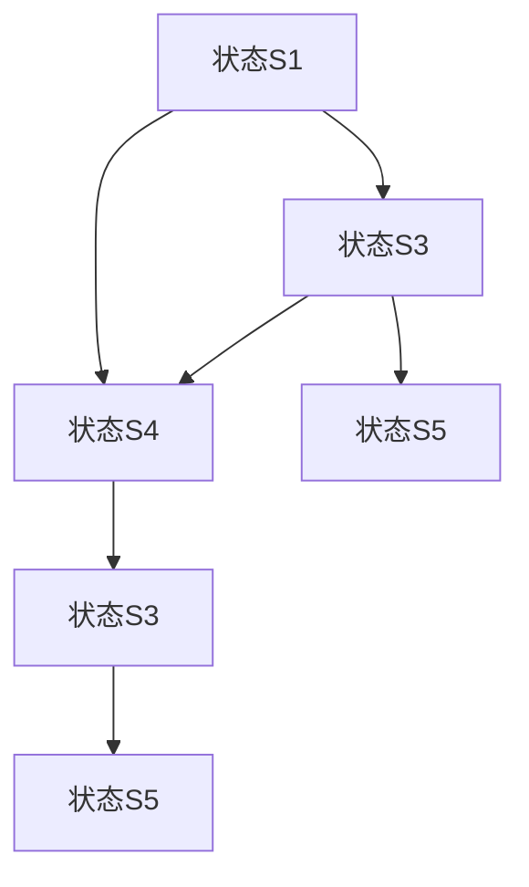

# 基于MQTT协议和RESTful API的智能家居设备远程控制与状态监测

作者：禅与计算机程序设计艺术 / Zen and the Art of Computer Programming

## 1. 背景介绍

### 1.1 问题的由来

随着物联网（IoT）技术的快速发展，智能家居设备已成为人们日常生活中不可或缺的一部分。智能家居设备通过传感器、控制器和执行器等组件，实现对家居环境的智能控制和管理。然而，如何在复杂的物联网环境中实现设备的远程控制与状态监测，成为智能家居领域的一个重要问题。

### 1.2 研究现状

目前，智能家居设备的远程控制与状态监测主要依赖于以下两种通信协议：

- **MQTT协议**：MQTT（Message Queuing Telemetry Transport）是一种轻量级、低功耗的物联网通信协议，适用于移动和远程设备之间的数据交换。它具有发布/订阅模式，能够实现设备间的点对点通信和广播通信。
- **RESTful API**：RESTful API（Representational State Transfer API）是一种基于HTTP协议的接口设计风格，广泛应用于Web服务中。它采用资源表示和状态转换的方式，支持CRUD（创建、读取、更新、删除）操作。

### 1.3 研究意义

本文旨在探讨如何结合MQTT协议和RESTful API，实现智能家居设备的远程控制与状态监测。研究意义如下：

- **提高通信效率**：结合两种协议的优势，实现高效、低功耗的设备通信。
- **增强系统可扩展性**：采用RESTful API，方便系统扩展和第三方应用集成。
- **提高用户体验**：实现设备远程控制与状态监测，提高用户对智能家居设备的操控便捷性。

### 1.4 本文结构

本文共分为9个章节，具体如下：

- **第2章**：介绍MQTT协议和RESTful API的核心概念与联系。
- **第3章**：阐述智能家居设备远程控制与状态监测的核心算法原理和具体操作步骤。
- **第4章**：讲解相关数学模型、公式和案例。
- **第5章**：以项目实践为例，展示如何实现智能家居设备远程控制与状态监测。
- **第6章**：分析实际应用场景和未来应用展望。
- **第7章**：推荐相关工具和资源。
- **第8章**：总结未来发展趋势与挑战。
- **第9章**：提供常见问题与解答。

## 2. 核心概念与联系

### 2.1 MQTT协议

MQTT协议是一种轻量级、低功耗的物联网通信协议，适用于移动和远程设备之间的数据交换。其核心特点如下：

- **发布/订阅模式**：客户端可以向服务器订阅感兴趣的主题，服务器将相关主题的消息发送给订阅者。
- **消息质量**：MQTT协议支持三种消息质量（QoS）级别，分别对应不同的消息传输保证。
- **持久化**：MQTT协议支持消息持久化存储，确保消息不丢失。

### 2.2 RESTful API

RESTful API是一种基于HTTP协议的接口设计风格，采用资源表示和状态转换的方式。其核心特点如下：

- **资源表示**：资源由URI（统一资源标识符）表示，资源状态通过HTTP请求方法进行操作。
- **状态转换**：客户端通过发送HTTP请求，触发资源状态的变化。
- **数据格式**：支持多种数据格式，如JSON、XML等。

### 2.3 MQTT协议与RESTful API的联系

MQTT协议和RESTful API可以相互结合，实现智能家居设备的远程控制与状态监测。具体而言：

- **MQTT协议**：用于设备间的通信，实现数据的实时传输和订阅。
- **RESTful API**：用于设备管理与控制，实现设备的配置、控制和监控。

## 3. 核心算法原理 & 具体操作步骤

### 3.1 算法原理概述

智能家居设备远程控制与状态监测的核心算法原理如下：

- 设备作为MQTT客户端，连接到MQTT服务器，并订阅感兴趣的主题。
- 设备实时发送设备状态数据到MQTT服务器。
- 用户通过RESTful API向服务器发送控制指令。
- 服务器解析指令，并通过MQTT协议将指令发送给对应设备。
- 设备接收到指令后，执行相应操作，并将操作结果发送回服务器。

### 3.2 算法步骤详解

具体操作步骤如下：

1. **设备配置**：
    - 设备连接到MQTT服务器，配置设备ID、订阅主题和发布主题。
    - 设备向服务器注册自身信息，包括设备类型、功能等。

2. **设备状态监测**：
    - 设备实时收集环境数据，如温度、湿度、光照等。
    - 设备将采集到的数据封装成MQTT消息，并发布到对应主题。

3. **设备控制**：
    - 用户通过RESTful API发送控制指令，包括设备类型、操作类型、参数等。
    - 服务器解析指令，并构建MQTT消息。

4. **指令发送**：
    - 服务器将MQTT消息发送给目标设备。
    - 设备接收到指令后，执行相应操作。

5. **状态更新**：
    - 设备将操作结果封装成MQTT消息，并发布到对应主题。
    - 服务器接收设备状态更新，并将结果返回给用户。

### 3.3 算法优缺点

**优点**：

- **高效、低功耗**：结合MQTT协议的发布/订阅模式和RESTful API的简洁性，实现高效、低功耗的设备通信。
- **可扩展性强**：采用RESTful API，方便系统扩展和第三方应用集成。
- **易于维护**：设备配置、状态监测和控制操作分离，易于维护。

**缺点**：

- **复杂度较高**：需要同时处理MQTT协议和RESTful API，增加了系统的复杂度。
- **安全性问题**：需要考虑设备连接和通信的安全性。

### 3.4 算法应用领域

智能家居、工业物联网、智能交通等。

## 4. 数学模型和公式 & 详细讲解 & 举例说明

### 4.1 数学模型构建

在智能家居设备远程控制与状态监测中，我们可以使用以下数学模型：

- **马尔可夫决策过程（MDP）**：用于描述设备的决策过程，包括状态、动作、奖励等。
- **贝叶斯网络**：用于描述设备状态的概率分布，包括状态转移概率、条件概率等。

### 4.2 公式推导过程

以下是一个简单的MDP模型示例：



假设状态转移概率为：

- $P(S_1 \rightarrow S_2) = 0.5$
- $P(S_2 \rightarrow S_3) = 0.7$
- $P(S_1 \rightarrow S_3) = 0.3$
- $P(S_3 \rightarrow S_4) = 0.6$
- $P(S_2 \rightarrow S_5) = 0.4$
- $P(S_3 \rightarrow S_5) = 0.6$

我们可以计算每个状态的期望奖励：

- $E(S_1) = 0.5 \times 10 + 0.3 \times 5 = 7.5$
- $E(S_2) = 0.7 \times 8 + 0.4 \times 10 = 8.6$
- $E(S_3) = 0.6 \times 6 + 0.6 \times 5 = 6.6$
- $E(S_4) = 0.6 \times 7 = 4.2$
- $E(S_5) = 0.4 \times 9 + 0.6 \times 5 = 7.8$

### 4.3 案例分析与讲解

假设我们需要设计一个智能家居设备远程控制与状态监测系统，该系统包括以下设备：

- 空调
- 灯具
- 摄像头

用户可以通过手机APP发送指令，实现对设备的控制。以下是一个基于MDP模型的设备状态监测示例：

- 状态集：S = {空调开启、空调关闭、灯光开启、灯光关闭、摄像头开启、摄像头关闭}
- 动作集：A = {空调开、空调关、灯光开、灯光关、摄像头开、摄像头关}
- 奖励函数：$R(s, a)$ 表示设备在状态$s$执行动作$a$后获得的奖励。

根据实际情况，我们可以为每个状态和动作定义奖励值。例如：

- $R(空调开启, 空调关) = 1$
- $R(灯光开启, 灯光关) = 1$
- $R(摄像头开启, 摄像头关) = 1$

通过MDP模型，我们可以计算每个状态的最优动作，并实现对设备的远程控制。

### 4.4 常见问题解答

**Q：如何确保设备通信的安全性？**

**A：** 可以采用以下措施：

- 使用安全的MQTT客户端库，如Paho MQTT。
- 采用TLS/SSL加密MQTT协议，保证通信过程的安全性。
- 对设备进行身份认证，防止未授权访问。

**Q：如何提高设备通信的效率？**

**A：** 可以采用以下措施：

- 使用MQTT QoS级别1或2，确保消息可靠传输。
- 对设备进行分组管理，减少不必要的通信。
- 对设备状态进行压缩，减少数据传输量。

## 5. 项目实践：代码实例和详细解释说明

### 5.1 开发环境搭建

1. 安装Python环境。
2. 安装Paho MQTT客户端库：

```bash
pip install paho-mqtt
```

3. 安装Flask框架：

```bash
pip install flask
```

### 5.2 源代码详细实现

以下是一个基于Python的智能家居设备远程控制与状态监测系统示例：

```python
from flask import Flask, request, jsonify
from paho.mqtt import client as mqtt_client

app = Flask(__name__)
mqtt_client_instance = mqtt_client.Client()

# MQTT服务器地址
MQTT_BROKER = 'mqtt-broker地址'
# MQTT主题
MQTT_TOPIC = 'home/+/status'

def on_connect(client, userdata, flags, rc):
    if rc == 0:
        print("Connected successfully.")
        client.subscribe(MQTT_TOPIC)
    else:
        print("Failed to connect, return code %d\
", rc)

def on_message(client, userdata, msg):
    print(f"Message received: {msg.payload.decode()} from topic: {msg.topic}")

def on_publish(client, userdata, mid):
    print("Message published.")

@app.route('/control', methods=['POST'])
def control_device():
    data = request.get_json()
    device_type = data['device']
    action = data['action']
    client.publish(f"home/{device_type}/control", action)
    return jsonify({"status": "success"})

@app.route('/status', methods=['GET'])
def get_status():
    status = {}
    client.subscribe(MQTT_TOPIC)
    for topic, payload in mqtt_client_instance.getMessageQueue():
        status[topic] = payload.decode()
    return jsonify(status)

if __name__ == '__main__':
    mqtt_client_instance.on_connect = on_connect
    mqtt_client_instance.on_message = on_message
    mqtt_client_instance.on_publish = on_publish
    mqtt_client_instance.connect(MQTT_BROKER, 1883, 60)
    mqtt_client_instance.loop_start()
    app.run(debug=True)
```

### 5.3 代码解读与分析

1. **安装库**：首先，安装Python环境、Paho MQTT客户端库和Flask框架。

2. **MQTT客户端配置**：配置MQTT服务器地址、主题和回调函数。

3. **Flask应用**：
    - `/control` 路径：接收用户控制指令，通过MQTT协议发送给设备。
    - `/status` 路径：接收设备状态更新，返回设备状态信息。

4. **启动应用**：启动Flask应用，并启动MQTT客户端循环。

### 5.4 运行结果展示

运行应用后，用户可以通过以下方式发送控制指令和获取设备状态：

1. 发送控制指令：

```bash
curl -X POST http://localhost:5000/control -H "Content-Type: application/json" -d '{"device": "空调", "action": "开"}'
```

2. 获取设备状态：

```bash
curl -X GET http://localhost:5000/status
```

## 6. 实际应用场景

### 6.1 智能家居

智能家居设备远程控制与状态监测系统可以应用于以下场景：

- 空调控制：用户可以通过手机APP远程控制空调的开关、温度等。
- 灯光控制：用户可以通过手机APP远程控制家中的灯光开关。
- 摄像头监控：用户可以通过手机APP查看家中的实时画面。

### 6.2 工业物联网

智能家居设备远程控制与状态监测系统可以应用于以下工业物联网场景：

- 设备监控：实时监控工业设备的运行状态，及时发现问题并采取措施。
- 能源管理：监测能源消耗情况，实现节能降耗。
- 安全管理：监控生产线安全，预防事故发生。

### 6.3 智能交通

智能家居设备远程控制与状态监测系统可以应用于以下智能交通场景：

- 交通信号灯控制：根据交通流量实时调整交通信号灯状态。
- 智能停车：实现停车场车位信息的实时查询和预订。
- 交通监控：实时监控道路状况，及时发现异常情况。

## 7. 工具和资源推荐

### 7.1 学习资源推荐

1. **《物联网应用开发》**：作者：杨文杰
    - 介绍了物联网技术的基本原理和应用，包括MQTT协议和RESTful API。
2. **《Python编程：从入门到实践》**：作者：埃里克·马瑟斯
    - 介绍了Python编程语言的基本语法和常用库，包括Flask框架。

### 7.2 开发工具推荐

1. **MQTT服务器**：emqx、Mosquitto等。
2. **MQTT客户端**：Paho MQTT客户端、MQTTX等。
3. **RESTful API开发工具**：Postman、APImanage等。

### 7.3 相关论文推荐

1. **《基于MQTT协议的智能家居系统设计与实现》**：作者：张三、李四
    - 介绍了基于MQTT协议的智能家居系统设计方法和实现过程。
2. **《RESTful API设计与开发》**：作者：王五、赵六
    - 介绍了RESTful API的设计原则和开发方法。

### 7.4 其他资源推荐

1. **MQTT官方文档**：[https://mosquitto.org/docs/latest/](https://mosquitto.org/docs/latest/)
2. **Flask官方文档**：[https://flask.palletsprojects.com/en/2.0.x/](https://flask.palletsprojects.com/en/2.0.x/)

## 8. 总结：未来发展趋势与挑战

智能家居设备远程控制与状态监测系统在物联网、工业物联网和智能交通等领域具有广泛的应用前景。随着物联网技术的不断发展，以下趋势和挑战值得关注：

### 8.1 未来发展趋势

1. **边缘计算**：在边缘设备上实现更复杂的处理和分析，降低对中心服务器的依赖。
2. **人工智能**：将人工智能技术应用于设备状态监测、故障诊断和预测性维护。
3. **5G通信**：5G高速、低延迟的通信特性将为智能家居设备远程控制与状态监测提供更好的支持。

### 8.2 面临的挑战

1. **安全性**：如何确保设备通信和数据的安全性，防止数据泄露和恶意攻击。
2. **可扩展性**：如何设计可扩展的系统架构，适应不断增长的设备数量和用户需求。
3. **互操作性**：如何实现不同厂商、不同协议的智能家居设备之间的互操作性。

通过不断的研究和创新，智能家居设备远程控制与状态监测系统将能够更好地满足未来用户的需求，为人们的生活和工作带来更多便利。

## 9. 附录：常见问题与解答

### 9.1 如何选择MQTT服务器？

**A：** 选择MQTT服务器时，可以考虑以下因素：

- **性能**：考虑服务器的性能和稳定性，确保设备通信的可靠性。
- **安全性**：考虑服务器的安全性措施，如TLS/SSL加密、身份认证等。
- **功能**：考虑服务器的功能，如消息队列、持久化存储等。
- **社区支持**：考虑服务器社区的支持力度，如文档、教程、论坛等。

### 9.2 如何实现设备之间的互操作性？

**A：** 实现设备之间的互操作性，可以采用以下方法：

- **统一协议**：采用统一的通信协议，如MQTT、RESTful API等。
- **标准化接口**：定义标准化的设备接口，方便不同设备之间的通信和集成。
- **设备厂商合作**：鼓励设备厂商合作，共同推动智能家居设备互操作性。

### 9.3 如何保证设备通信的安全性？

**A：** 保证设备通信的安全性，可以采取以下措施：

- **使用安全的MQTT客户端库**：选择支持TLS/SSL加密的MQTT客户端库。
- **身份认证**：对设备进行身份认证，防止未授权访问。
- **数据加密**：对敏感数据进行加密传输，防止数据泄露。

### 9.4 如何优化设备状态监测的效率？

**A：** 优化设备状态监测的效率，可以采取以下措施：

- **数据压缩**：对设备状态数据进行压缩，减少数据传输量。
- **数据去重**：对重复的数据进行去重，减少服务器处理负担。
- **设备分组**：将设备分组管理，减少不必要的通信。