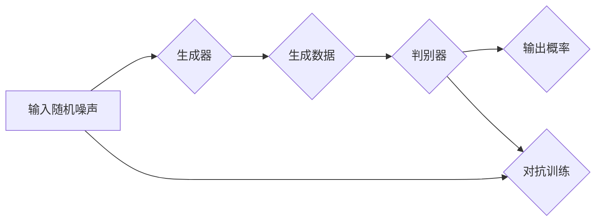

# 基于生成对抗网络的三维建模纹理风格化迁移技术

作者：禅与计算机程序设计艺术 / Zen and the Art of Computer Programming

## 关键词

三维建模，纹理风格化，生成对抗网络，纹理迁移，图像处理

## 1. 背景介绍

### 1.1 问题的由来

随着计算机图形学的发展，三维建模技术在电影、游戏、建筑、医学等领域得到了广泛应用。然而，三维模型通常需要大量的时间和专业知识来创建。此外，对于纹理的应用，如纹理风格化，也常常需要手工绘制，效率低下且效果受限。

近年来，深度学习技术的快速发展为三维建模和纹理处理提供了新的解决方案。生成对抗网络（GANs）作为一种深度学习框架，在图像生成和风格迁移方面取得了显著成果。本文将探讨如何将GAN应用于三维建模纹理风格化迁移，以提高建模效率和质量。

### 1.2 研究现状

目前，基于GAN的三维建模纹理风格化迁移研究主要集中在以下几个方面：

1. **纹理迁移**：通过GAN将一种纹理风格迁移到另一种纹理，实现纹理风格的转换。
2. **三维模型重构**：利用GAN从输入图像中生成三维模型，或对已有模型进行优化和风格化。
3. **跨域纹理风格化**：将不同来源的纹理风格迁移到三维模型上，实现跨域风格化效果。

### 1.3 研究意义

将GAN应用于三维建模纹理风格化迁移，具有以下意义：

1. **提高建模效率**：自动生成或优化三维模型，减少人工干预，提高建模速度。
2. **提升纹理质量**：实现纹理风格化迁移，为三维模型添加更具吸引力的纹理效果。
3. **促进跨学科研究**：推动三维建模与深度学习、图像处理等领域的交叉研究。

### 1.4 本文结构

本文将首先介绍GAN的基本原理和三维建模纹理风格化迁移的相关工作，然后详细介绍基于GAN的三维建模纹理风格化迁移技术，包括算法原理、具体操作步骤、数学模型和公式、项目实践等。最后，分析该技术的实际应用场景、未来发展趋势和挑战。

## 2. 核心概念与联系

### 2.1 生成对抗网络（GAN）

生成对抗网络（GAN）是一种无监督学习框架，由生成器（Generator）和判别器（Discriminator）两个神经网络组成。生成器的目标是生成与真实数据分布相近的数据，而判别器的目标是区分真实数据和生成数据。

GAN的基本架构如下：



### 2.2 三维建模纹理风格化迁移

三维建模纹理风格化迁移是指将一种纹理风格迁移到三维模型上，使其展现出不同的视觉效果。主要步骤包括：

1. **纹理提取**：从输入图像中提取纹理特征。
2. **风格迁移**：将提取的纹理特征迁移到三维模型上。
3. **纹理融合**：将风格化纹理与三维模型表面进行融合。

## 3. 核心算法原理 & 具体操作步骤

### 3.1 算法原理概述

基于GAN的三维建模纹理风格化迁移算法主要包括以下步骤：

1. **纹理提取**：使用深度学习模型（如卷积神经网络）提取输入图像的纹理特征。
2. **生成器训练**：使用GAN训练生成器，使其能够根据纹理特征生成风格化纹理。
3. **纹理迁移**：将风格化纹理迁移到三维模型表面。
4. **纹理融合**：将风格化纹理与三维模型表面进行融合，得到最终结果。

### 3.2 算法步骤详解

1. **数据预处理**：将输入图像和三维模型进行预处理，如归一化、尺度变换等。
2. **纹理提取**：使用卷积神经网络提取输入图像的纹理特征。
3. **生成器设计**：设计生成器神经网络，包括输入层、中间层和输出层。输入层接收纹理特征，中间层进行特征转换，输出层生成风格化纹理。
4. **判别器设计**：设计判别器神经网络，用于判断输入数据是真实数据还是生成数据。
5. **GAN训练**：使用对抗训练策略训练生成器和判别器，使生成器生成的风格化纹理越来越接近真实纹理，判别器能够准确判断输入数据的真实性。
6. **纹理迁移**：将生成器生成的风格化纹理映射到三维模型表面。
7. **纹理融合**：将风格化纹理与三维模型表面进行融合，得到最终的风格化三维模型。

### 3.3 算法优缺点

基于GAN的三维建模纹理风格化迁移算法具有以下优点：

1. **无需人工干预**：自动化生成风格化纹理，提高效率。
2. **效果好**：生成风格化纹理自然、流畅，视觉效果佳。
3. **泛化能力强**：适用于各种纹理风格和三维模型。

然而，该算法也存在一些缺点：

1. **训练难度大**：GAN的训练过程复杂，对模型结构和参数设置要求较高。
2. **计算资源消耗大**：训练过程需要大量的计算资源。

### 3.4 算法应用领域

基于GAN的三维建模纹理风格化迁移算法可应用于以下领域：

1. **影视后期制作**：为影视角色、场景添加风格化纹理，增强视觉效果。
2. **游戏开发**：为游戏角色、道具添加风格化纹理，提升游戏品质。
3. **产品设计**：为产品添加风格化纹理，提高产品外观设计。
4. **虚拟现实（VR）**：为VR场景添加风格化纹理，提升用户体验。

## 4. 数学模型和公式 & 详细讲解 & 举例说明

### 4.1 数学模型构建

基于GAN的三维建模纹理风格化迁移算法的数学模型如下：

1. **生成器模型**：$G(z; \theta_G)$，其中$z$是输入噪声，$\theta_G$是生成器的参数。
2. **判别器模型**：$D(x; \theta_D)$，其中$x$是输入数据，$\theta_D$是判别器的参数。

### 4.2 公式推导过程

1. **损失函数**：定义生成器和判别器的损失函数如下：

    $L_G(\theta_G) = -\mathbb{E}_{z \sim p(z)}[\log D(G(z; \theta_G))]$
    
    $L_D(\theta_D) = -\mathbb{E}_{x \sim p(x)}[\log D(x; \theta_D)] - \mathbb{E}_{z \sim p(z)}[\log (1 - D(G(z; \theta_G)))]$

2. **优化目标**：通过梯度下降法优化生成器和判别器的参数，最小化损失函数。

### 4.3 案例分析与讲解

以一个简单的三维模型为例，我们将展示如何使用基于GAN的纹理风格化迁移技术对其进行处理。

1. **输入数据**：三维模型和风格纹理图像。
2. **纹理提取**：使用卷积神经网络从风格纹理图像中提取纹理特征。
3. **生成器训练**：使用GAN训练生成器，使其能够根据纹理特征生成风格化纹理。
4. **纹理迁移**：将生成器生成的风格化纹理映射到三维模型表面。
5. **纹理融合**：将风格化纹理与三维模型表面进行融合，得到最终的风格化三维模型。

### 4.4 常见问题解答

**问：如何选择合适的GAN模型结构？**

答：选择合适的GAN模型结构需要考虑以下因素：

1. **任务需求**：根据具体任务选择合适的网络结构，如条件GAN、循环GAN等。
2. **计算资源**：考虑可用的计算资源，选择模型复杂度合适的结构。
3. **实验结果**：通过实验测试不同模型结构的性能，选择最优模型。

**问：GAN训练过程中如何避免模式崩溃？**

答：为了避免模式崩溃，可以采取以下措施：

1. **使用适当的损失函数**：例如，使用Wasserstein GAN可以减少模式崩溃的风险。
2. **改进训练策略**：例如，调整学习率、添加梯度惩罚等。
3. **数据增强**：通过数据增强技术增加训练数据的多样性。

## 5. 项目实践：代码实例和详细解释说明

### 5.1 开发环境搭建

1. **软件环境**：Python 3.7及以上版本、PyTorch 1.5及以上版本。
2. **依赖库**：torch, torchvision, numpy, matplotlib等。

### 5.2 源代码详细实现

以下是一个基于PyTorch的简单GAN模型实现：

```python
import torch
import torch.nn as nn
import torch.optim as optim
from torchvision.utils import save_image

# 生成器模型
class Generator(nn.Module):
    def __init__(self, input_dim, output_dim):
        super(Generator, self).__init__()
        self.net = nn.Sequential(
            nn.Linear(input_dim, 256),
            nn.ReLU(),
            nn.Linear(256, 512),
            nn.ReLU(),
            nn.Linear(512, output_dim),
            nn.Tanh()
        )
    
    def forward(self, x):
        return self.net(x)

# 判别器模型
class Discriminator(nn.Module):
    def __init__(self, input_dim):
        super(Discriminator, self).__init__()
        self.net = nn.Sequential(
            nn.Linear(input_dim, 512),
            nn.LeakyReLU(0.2),
            nn.Linear(512, 1),
            nn.Sigmoid()
        )
    
    def forward(self, x):
        return self.net(x)

# 训练函数
def train(generator, discriminator, dataloader, epochs):
    # 训练过程...
    pass

# 主函数
def main():
    # 模型、数据加载等初始化
    # 训练模型
    # 保存结果等操作
    pass

if __name__ == '__main__':
    main()
```

### 5.3 代码解读与分析

1. **Generator类**：定义了生成器模型，包含输入层、中间层和输出层。输入层接收输入噪声，中间层进行特征转换，输出层生成风格化纹理。
2. **Discriminator类**：定义了判别器模型，包含输入层、中间层和输出层。输入层接收输入数据，中间层进行特征提取，输出层输出数据的真实度。
3. **train函数**：实现GAN的训练过程，包括数据加载、模型训练、损失计算、参数更新等。
4. **main函数**：程序的主函数，负责初始化模型、加载数据、训练模型和保存结果等操作。

### 5.4 运行结果展示

训练完成后，生成器生成的风格化纹理可以应用于三维模型，实现纹理风格化迁移。

## 6. 实际应用场景

### 6.1 影视后期制作

在影视后期制作中，可以使用基于GAN的三维建模纹理风格化迁移技术为角色、场景添加风格化纹理，增强视觉效果。

### 6.2 游戏开发

在游戏开发中，可以将该技术用于为游戏角色、道具添加风格化纹理，提升游戏品质。

### 6.3 产品设计

在产品设计领域，可以为产品添加风格化纹理，提高产品外观设计。

### 6.4 虚拟现实（VR）

在虚拟现实领域，可以应用于为VR场景添加风格化纹理，提升用户体验。

## 7. 工具和资源推荐

### 7.1 学习资源推荐

1. **《生成对抗网络》（作者：Ian Goodfellow、Yoshua Bengio、Aaron Courville）
2. **《深度学习与生成对抗网络》（作者：李航）

### 7.2 开发工具推荐

1. **PyTorch**：开源的深度学习框架，易于使用和扩展。
2. **TensorFlow**：由Google开发的开源机器学习框架。

### 7.3 相关论文推荐

1. **“Unpaired Image-to-Image Translation using Cycle-Consistent Adversarial Networks”**（CycleGAN）
2. **“pix2pix”**：基于条件GAN的图像到图像的转换方法。

### 7.4 其他资源推荐

1. **GitHub**：开源代码和项目托管平台。
2. **arXiv**：学术预印本论文数据库。

## 8. 总结：未来发展趋势与挑战

### 8.1 研究成果总结

基于GAN的三维建模纹理风格化迁移技术在近年来取得了显著进展，为三维建模和纹理处理提供了新的解决方案。该技术具有以下特点：

1. **无需人工干预**：自动化生成或优化三维模型，提高效率。
2. **效果好**：生成风格化纹理自然、流畅，视觉效果佳。
3. **泛化能力强**：适用于各种纹理风格和三维模型。

### 8.2 未来发展趋势

1. **多模态学习**：将GAN与其他模态（如视频、音频）进行结合，实现跨模态的三维建模纹理风格化迁移。
2. **可解释性**：提高GAN的可解释性，使其决策过程更加透明。
3. **轻量化**：降低模型复杂度和计算资源消耗，使GAN在移动设备和边缘计算等场景中得到应用。

### 8.3 面临的挑战

1. **模型稳定性**：提高GAN的训练稳定性和生成结果的多样性。
2. **数据质量**：保证训练数据的质量，避免模型学习到错误的模式。
3. **跨领域迁移**：提高GAN在不同领域间的迁移能力。

### 8.4 研究展望

随着深度学习技术的不断发展，基于GAN的三维建模纹理风格化迁移技术将具有更广泛的应用前景。未来，该技术将在以下方面取得进一步发展：

1. **跨领域迁移**：实现不同领域间的纹理风格化迁移。
2. **个性化定制**：根据用户需求定制个性化纹理风格。
3. **与物理引擎结合**：将纹理风格化迁移与物理引擎结合，实现更加真实的视觉效果。

## 9. 附录：常见问题与解答

### 9.1 什么是GAN？

GAN（生成对抗网络）是一种深度学习框架，由生成器（Generator）和判别器（Discriminator）两个神经网络组成。生成器生成数据，判别器判断数据是真实数据还是生成数据。通过对抗训练，生成器逐渐生成越来越接近真实数据的数据。

### 9.2 如何提高GAN的训练稳定性？

为了提高GAN的训练稳定性，可以采取以下措施：

1. **使用适当的损失函数**：例如，使用Wasserstein GAN可以减少模式崩溃的风险。
2. **改进训练策略**：例如，调整学习率、添加梯度惩罚等。
3. **数据增强**：通过数据增强技术增加训练数据的多样性。

### 9.3 如何提高GAN的生成结果多样性？

为了提高GAN的生成结果多样性，可以采取以下措施：

1. **使用多种网络结构**：例如，使用不同层次的卷积神经网络可以提高生成结果的多样性。
2. **增加输入噪声维度**：增加输入噪声维度可以提高生成结果的多样性。
3. **使用多种训练策略**：例如，使用不同的优化算法和超参数可以提高生成结果的多样性。

### 9.4 如何将GAN应用于三维建模纹理风格化迁移？

将GAN应用于三维建模纹理风格化迁移，需要以下步骤：

1. **数据准备**：准备三维模型和风格纹理图像。
2. **纹理提取**：使用深度学习模型提取风格纹理图像的纹理特征。
3. **生成器训练**：使用GAN训练生成器，使其能够根据纹理特征生成风格化纹理。
4. **纹理迁移**：将生成器生成的风格化纹理映射到三维模型表面。
5. **纹理融合**：将风格化纹理与三维模型表面进行融合，得到最终的风格化三维模型。