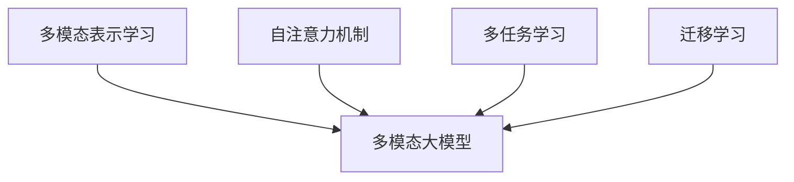

# 多模态大模型：技术原理与实战 多模态大模型的核心技术

## 1. 背景介绍

### 1.1 问题的由来

在当今信息时代,人类与机器之间的交互方式日益多样化。传统的单一模态交互(如文本或语音)已无法满足人们对更自然、更智能的人机交互体验的需求。因此,多模态人机交互技术应运而生,旨在通过综合利用视觉、语音、文本等多种信息,实现更智能、更人性化的交互体验。

随着深度学习技术的不断发展,多模态大模型(Multimodal Large Model)成为了实现智能多模态交互的关键技术之一。多模态大模型能够同时处理和融合多种模态数据,展现出了强大的多任务学习能力,在计算机视觉、自然语言处理、语音识别等多个领域取得了卓越的性能表现。

### 1.2 研究现状

近年来,多模态大模型受到了广泛的关注和研究。代表性工作包括:

- **BERT**(Bidirectional Encoder Representations from Transformers):能够同时处理文本和图像数据,在自然语言处理和计算机视觉任务上表现出色。
- **ViLBERT**(Vision-and-Language BERT):将视觉和语言表示融合到统一的空间中,实现视觉和语言的双向对齐。
- **DALL-E**:一种新型的人工智能系统,可以根据自然语言描述生成高质量的图像。
- **GPT-3**:一种大规模的自然语言生成模型,具有强大的多任务学习能力,可以完成各种自然语言处理任务。

然而,现有的多模态大模型仍然存在一些局限性,例如:

1. **模态融合能力有限**:虽然能够同时处理多种模态数据,但在有效融合和利用这些信息方面仍有提升空间。
2. **可解释性较差**:大多数模型是黑盒模型,内部工作机制缺乏透明度,难以解释模型的决策过程。
3. **数据需求量大**:训练高质量的多模态大模型需要大量的标注数据,数据获取和标注成本高昂。
4. **计算资源需求高**:训练和推理过程需要消耗大量的计算资源,对硬件要求较高。

### 1.3 研究意义

多模态大模型技术的发展对于实现真正智能的人机交互具有重要意义:

1. **提升交互体验**:融合多种模态信息,可以实现更自然、更智能的人机交互方式,提升用户体验。
2. **拓展应用场景**:多模态技术可广泛应用于教育、医疗、零售等多个领域,为人类生活带来便利。
3. **推动人工智能发展**:多模态大模型是人工智能发展的重要方向,对于构建通用人工智能系统具有重要意义。
4. **促进跨学科融合**:多模态技术的发展需要计算机视觉、自然语言处理、机器学习等多个领域的知识融合,推动了不同领域的交叉与协作。

### 1.4 本文结构

本文将全面介绍多模态大模型的核心技术,内容安排如下:

1. 背景介绍
2. 核心概念与联系
3. 核心算法原理与具体操作步骤
4. 数学模型和公式详细讲解与案例分析
5. 项目实践:代码实例和详细解释
6. 实际应用场景
7. 工具和资源推荐
8. 总结:未来发展趋势与挑战
9. 附录:常见问题与解答

## 2. 核心概念与联系

多模态大模型技术涉及多个核心概念,这些概念之间存在着密切联系。下面将对这些核心概念进行阐述,并分析它们之间的关系。

### 2.1 多模态表示学习(Multimodal Representation Learning)

多模态表示学习旨在从多种模态数据(如文本、图像、视频等)中学习出统一的表示形式,使得不同模态的信息可以在同一个空间中进行处理和融合。这是实现多模态大模型的基础。

常见的多模态表示学习方法包括:

- **早融合**(Early Fusion):在底层特征级别对不同模态的数据进行拼接,然后送入深度神经网络进行端到端的训练。
- **晚融合**(Late Fusion):分别对不同模态的数据进行编码,得到各自的表示,然后在高层将这些表示进行融合。
- **层次融合**(Hierarchical Fusion):在不同层次上对多模态数据进行融合,形成层次化的表示。

### 2.2 自注意力机制(Self-Attention Mechanism)

自注意力机制是实现多模态大模型的关键技术之一。它允许模型在处理序列数据时,能够自动学习到不同位置元素之间的关系,从而捕获长距离依赖关系。

在多模态大模型中,自注意力机制被广泛应用于不同模态之间的交互关注,实现跨模态的信息融合。常见的自注意力模型包括Transformer、BERT等。

### 2.3 多任务学习(Multi-Task Learning)

多任务学习是指在同一个模型中同时学习多个不同但相关的任务,使得模型能够从这些任务中捕获共享的表示,提高泛化能力。

多模态大模型通常需要同时处理多个模态相关的任务,如图像分类、文本生成、视频描述等。因此,多任务学习是实现多模态大模型的重要手段。

### 2.4 迁移学习(Transfer Learning)

迁移学习指的是将在一个领域学习到的知识迁移到另一个领域,以提高模型在新领域的性能表现。

由于多模态大模型需要处理多种模态数据,因此可以利用迁移学习的思想,将在某个模态上预训练的模型知识迁移到其他模态,从而提高模型的泛化能力和数据利用效率。

### 2.5 概念关联图

上述核心概念之间的关系可以用下面的概念关联图来表示:

## 3. 核心算法原理与具体操作步骤

### 3.1 算法原理概述

多模态大模型的核心算法原理可以概括为以下几个方面:

1. **模态特征提取**:对于每种输入模态(如文本、图像、视频等),使用相应的编码器网络(如CNN、RNN等)提取其特征表示。

2. **模态融合**:将不同模态的特征表示进行融合,生成统一的多模态表示。常见的融合方法包括拼接(Concatenation)、加权求和(Weighted Sum)、注意力融合(Attention Fusion)等。

3. **自注意力建模**:在统一的多模态表示空间中,使用自注意力机制对不同模态之间的交互关系进行建模,捕获跨模态的长距离依赖关系。

4. **多任务学习**:在同一个模型中同时学习多个与不同模态相关的任务,使模型能够从这些任务中捕获共享的表示,提高泛化能力。

5. **迁移学习**:利用在某个模态上预训练的模型知识,迁移到其他模态,提高模型的数据利用效率和泛化能力。

### 3.2 算法步骤详解

下面将详细介绍多模态大模型算法的具体操作步骤:

1. **输入数据预处理**:对于每种输入模态,进行相应的预处理操作,如文本分词、图像归一化等,将其转换为模型可以接受的格式。

2. **模态特征提取**:
   - 文本模态:使用预训练的语言模型(如BERT)对文本进行编码,得到文本特征表示。
   - 图像模态:使用卷积神经网络(CNN)对图像进行编码,得到图像特征表示。
   - 视频模态:使用3D卷积神经网络或者双流网络对视频进行编码,得到视频特征表示。

3. **模态融合**:
   - 拼接融合(Concatenation Fusion):将不同模态的特征表示在特征维度上进行拼接。
   - 加权求和融合(Weighted Sum Fusion):对不同模态的特征表示进行加权求和,得到融合表示。
   - 注意力融合(Attention Fusion):使用自注意力机制对不同模态的特征表示进行关注度分配,得到融合表示。

4. **自注意力建模**:在统一的多模态表示空间中,使用Transformer等自注意力模型对不同模态之间的交互关系进行建模,捕获跨模态的长距离依赖关系。

5. **多任务学习**:根据不同的应用场景,设计与各个模态相关的多个任务,如文本生成、图像分类、视频描述等。在同一个模型中同时学习这些任务,使模型能够从中捕获共享的表示,提高泛化能力。

6. **迁移学习**:如果已有在某个模态上预训练的模型,可以将其知识迁移到多模态大模型中,作为模态特征提取器或初始化参数,提高模型的数据利用效率和泛化能力。

7. **模型训练**:使用标注的多模态数据集,对多模态大模型进行端到端的训练,优化模型参数。

8. **模型评估**:在测试集上评估模型的性能表现,包括各个任务的指标,如准确率、F1分数、BLEU分数等。

9. **模型部署**:将训练好的多模态大模型部署到实际的应用系统中,用于处理真实的多模态数据。

### 3.3 算法优缺点

多模态大模型算法的优点包括:

1. **融合多源信息,提高表现力**:能够同时利用多种模态的信息,提高了模型的表现力和泛化能力。
2. **多任务学习,知识迁移**:通过多任务学习和迁移学习,可以提高模型的数据利用效率,降低训练成本。
3. **自注意力机制,捕获长距离依赖**:自注意力机制能够有效捕获不同模态之间的长距离依赖关系,提高模型的建模能力。

不足之处包括:

1. **训练数据需求量大**:训练高质量的多模态大模型需要大量的标注数据,数据获取和标注成本高昂。
2. **计算资源需求高**:模型训练和推理过程需要消耗大量的计算资源,对硬件要求较高。
3. **可解释性较差**:大多数多模态大模型是黑盒模型,内部工作机制缺乏透明度,难以解释模型的决策过程。

### 3.4 算法应用领域

多模态大模型算法可以广泛应用于以下领域:

1. **自然语言处理**:如视觉问答、图文生成、多模态机器翻译等。
2. **计算机视觉**:如图像描述、视频描述、视觉推理等。
3. **人机交互**:如智能助手、多模态对话系统、增强现实/虚拟现实等。
4. **医疗健康**:如医学图像分析、智能辅助诊断、患者监护等。
5. **教育**:如智能教学系统、在线课程、交互式学习等。
6. **零售**:如智能推荐系统、产品识别、客户服务等。
7. **安防**:如智能监控、行为分析、异常检测等。

## 4. 数学模型和公式详细讲解与案例分析

### 4.1 数学模型构建

多模态大模型的数学模型通常基于深度神经网络,包括以下几个主要组成部分:

1. **模态编码器(Modal Encoder)**:对于每种输入模态,使用相应的编码器网络(如CNN、RNN等)对其进行编码,得到模态特征表示。

   设输入模态为$x_i$,其对应的编码器为$f_i$,则模态特征表示为:

   $$h_i = f_i(x_i)$$

2. **模态融合模块(Modal Fusion Module)**:将不同模态的特征表示进行融合,生成统一的多模态表示。

   设有$N$种输入模态,融合函数为$g$,则多模态表示为:

   $$h_m = g(h_1, h_2, \dots, h_N)$$