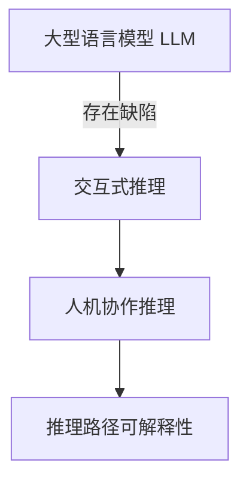

# 大语言模型原理与工程实践：推理引导

## 1. 背景介绍

### 1.1 问题的由来

在过去的几年中,自然语言处理(NLP)领域取得了长足的进步,很大程度上归功于大型语言模型(Large Language Model, LLM)的兴起。传统的NLP系统通常依赖于手工设计的特征和规则,需要大量的人工努力。而LLM则通过在大规模语料库上进行自监督预训练,自动学习语言的统计规律和语义知识,从而能够在下游任务上取得良好的表现。

随着模型规模和训练数据的不断扩大,LLM展现出了惊人的语言理解和生成能力,可以在多种NLP任务上达到人类水平的表现。然而,这些模型也存在一些明显的缺陷,例如缺乏因果推理能力、容易受到语境偏差的影响、缺乏一致性等。因此,如何赋予LLM更强的推理能力,使其能够更好地理解和推理语义信息,成为了当前研究的重点课题之一。

### 1.2 研究现状

为了提高LLM的推理能力,研究人员提出了多种不同的方法,主要可分为以下几个方向:

1. **知识增强**:通过注入外部知识库或结构化数据,丰富LLM的知识面。
2. **推理增强**:设计特殊的架构或训练策略,显式建模推理过程。
3. **交互式推理**:通过人机交互的方式,引导LLM进行逐步推理。
4. **注意力可解释性**:提高LLM注意力机制的可解释性,理解其推理路径。

其中,交互式推理是一种新兴的范式,通过人机对话的方式,人类可以主动引导LLM进行逐步推理,从而获得更加准确和可解释的结果。这种方法不仅可以提高LLM的推理能力,还能增强其可解释性和可控性。

### 1.3 研究意义

提高LLM的推理能力具有重要的理论和应用价值:

- **理论意义**:推理是智能系统的核心能力之一,研究LLM的推理机制有助于我们更好地理解人类语言和思维,为发展通用人工智能奠定基础。
- **应用意义**:强大的推理能力可以显著提升LLM在各种NLP任务中的表现,如问答系统、智能助手、自动写作等,为人类带来更好的语言智能服务。

### 1.4 本文结构

本文将重点介绍基于交互式推理的方法,探讨如何通过人机对话的方式引导LLM进行逐步推理。文章的主要结构如下:

1. 背景介绍
2. 核心概念与联系
3. 核心算法原理与具体操作步骤
4. 数学模型和公式详细讲解与举例说明
5. 项目实践:代码实例和详细解释说明
6. 实际应用场景
7. 工具和资源推荐
8. 总结:未来发展趋势与挑战
9. 附录:常见问题与解答

## 2. 核心概念与联系

在介绍核心算法之前,我们先来了解一些基本概念和它们之间的联系。

### 2.1 大型语言模型(LLM)

大型语言模型(LLM)是一种基于自然语言的深度学习模型,通过在大规模语料库上进行自监督预训练,学习语言的统计规律和语义知识。常见的LLM包括GPT、BERT、T5等,它们展现出了惊人的语言理解和生成能力,可以应用于多种NLP任务。

然而,LLM也存在一些缺陷,例如缺乏因果推理能力、容易受到语境偏差的影响、缺乏一致性等。因此,如何赋予LLM更强的推理能力成为了当前研究的重点课题之一。

### 2.2 交互式推理

交互式推理(Interactive Reasoning)是一种新兴的范式,通过人机对话的方式,人类可以主动引导LLM进行逐步推理,从而获得更加准确和可解释的结果。这种方法不仅可以提高LLM的推理能力,还能增强其可解释性和可控性。

在交互式推理过程中,人类和LLM通过自然语言对话进行交互,人类可以提出问题、给出反馈或提示,而LLM则根据对话历史和当前上下文进行推理,并生成回复。通过多轮对话,LLM可以逐步完成复杂的推理任务。

### 2.3 人机协作推理

人机协作推理(Human-AI Collaborative Reasoning)是交互式推理的一种具体形式,强调人类和LLM在推理过程中的协作关系。人类利用自身的领域知识和推理能力,为LLM提供有价值的指导和反馈,而LLM则利用其强大的语言理解和生成能力,辅助人类完成推理任务。

这种协作方式可以充分发挥人机双方的优势,人类负责提供高层次的指导和控制,而LLM则负责执行具体的推理操作。通过有效的协作,可以获得更加准确、可解释和可控的推理结果。

### 2.4 推理路径可解释性

推理路径可解释性(Reasoning Path Interpretability)是指能够解释LLM在推理过程中的思路和决策依据。传统的LLM通常被视为一个黑箱模型,难以解释其内部的推理过程,这在一定程度上限制了其在关键领域的应用。

提高推理路径的可解释性,可以让人类更好地理解LLM的推理逻辑,从而评估其结果的可靠性,并及时发现和纠正潜在的错误或偏差。这对于构建可信赖的人工智能系统至关重要。

### 2.5 概念联系

上述概念之间存在紧密的联系,如下图所示:

- 大型语言模型(LLM)虽然展现出了惊人的语言能力,但仍存在一些缺陷,如缺乏推理能力等。
- 为了解决这些问题,提出了交互式推理的范式,通过人机对话的方式引导LLM进行推理。
- 人机协作推理是交互式推理的一种具体形式,强调人机在推理过程中的协作关系。
- 提高推理路径的可解释性,可以让人类更好地理解LLM的推理逻辑,从而评估结果的可靠性,这对于构建可信赖的人工智能系统至关重要。

## 3. 核心算法原理与具体操作步骤

### 3.1 算法原理概述

交互式推理的核心算法原理可以概括为以下几个关键点:

1. **对话建模**: 将人机对话过程建模为一个序列到序列(Seq2Seq)的生成任务,其中输入序列是对话历史,输出序列是LLM的回复。

2. **上下文编码**: 使用transformer等神经网络模型对对话历史进行编码,捕获上下文语义信息。

3. **推理策略**: 设计特殊的推理策略,根据对话历史和当前上下文,生成合理的回复。常见策略包括基于规则的策略、基于强化学习的策略等。

4. **人类反馈**: 在对话过程中,人类可以提供反馈或提示,用于引导和纠正LLM的推理过程。

5. **迭代更新**: 根据人类的反馈,不断更新对话历史和上下文表示,进行多轮推理。

下面我们将详细介绍算法的具体操作步骤。

### 3.2 算法步骤详解

交互式推理算法的主要步骤如下:

1. **输入处理**:将人类的输入(如问题、反馈等)和对话历史进行预处理,构建输入序列。

2. **上下文编码**:使用transformer等模型对输入序列进行编码,得到上下文表示$\boldsymbol{h}$。

3. **推理策略执行**:根据选定的推理策略,结合上下文表示$\boldsymbol{h}$,生成LLM的回复序列$\boldsymbol{y}$。常见的推理策略包括:

   - **基于规则的策略**:根据预定义的规则和模板,生成回复。
   - **基于强化学习的策略**:将推理过程建模为马尔可夫决策过程,通过强化学习算法(如策略梯度)优化回复序列。
   - **基于生成式模型的策略**:使用seq2seq模型直接生成回复,可以融合各种注意力机制和控制策略。

4. **输出回复**:将生成的回复序列$\boldsymbol{y}$返回给人类。

5. **人类反馈**:人类可以根据LLM的回复,提供反馈或提示,用于引导和纠正推理过程。

6. **上下文更新**:将人类的反馈和LLM的回复添加到对话历史中,更新上下文表示$\boldsymbol{h}$。

7. **迭代推理**:重复执行步骤3-6,进行多轮推理,直到达到预期目标或上限轮数。

该算法的核心思想是通过人机交互的方式,逐步引导LLM进行推理,并根据人类的反馈不断纠正和完善推理过程。下面我们用一个示例来说明算法的工作流程。

**示例**:

假设人类想要查询"美国独立战争的起因是什么?"。算法的工作流程如下:

1. 输入处理:将问题"美国独立战争的起因是什么?"作为输入序列。

2. 上下文编码:对输入序列进行编码,得到上下文表示$\boldsymbol{h}$。

3. 推理策略执行:根据选定的推理策略(如基于生成式模型的策略),结合上下文表示$\boldsymbol{h}$,生成回复序列$\boldsymbol{y}$,例如"美国独立战争的主要起因是英国对美国殖民地征收过高税赋,并剥夺了殖民地人民的权利,导致了殖民地人民的不满和反抗。"

4. 输出回复:将回复序列$\boldsymbol{y}$返回给人类。

5. 人类反馈:人类可以提供反馈,例如"你的回答还不够全面,请补充一下其他原因。"

6. 上下文更新:将人类的反馈添加到对话历史中,更新上下文表示$\boldsymbol{h}$。

7. 迭代推理:根据新的上下文表示,再次执行推理策略,生成补充回复,例如"除了过高税赋外,英国还限制了殖民地的贸易和工业发展,剥夺了殖民地人民的自治权利,这也是导致独立战争的重要原因。"

8. 重复步骤4-7,直到人类满意为止。

通过多轮交互式推理,LLM可以逐步完善和纠正自身的回答,提高推理的准确性和全面性。

### 3.3 算法优缺点

交互式推理算法具有以下优缺点:

**优点**:

- 提高了LLM的推理能力,可以处理复杂的推理任务。
- 增强了LLM的可解释性和可控性,人类可以引导和纠正推理过程。
- 发挥了人机协作的优势,人类提供高层次指导,LLM执行具体操作。
- 算法框架通用,可以集成各种推理策略和模型。

**缺点**:

- 需要人机交互,增加了系统的复杂性和延迟。
- 推理质量在一定程度上依赖于人类的反馈质量。
- 缺乏通用的评估标准,难以量化推理能力的提升。
- 目前的推理策略仍然较为简单,需要进一步改进。

### 3.4 算法应用领域

交互式推理算法可以应用于多种NLP任务,包括但不限于:

- **问答系统**:通过人机对话的方式,引导LLM进行多步推理,回答复杂的问题。
- **智能助手**:作为智能助手的核心模块,提供可解释和可控的对话服务。
- **自动写作**:根据人类的反馈,逐步完善和优化文本生成的内容和逻辑。
- **决