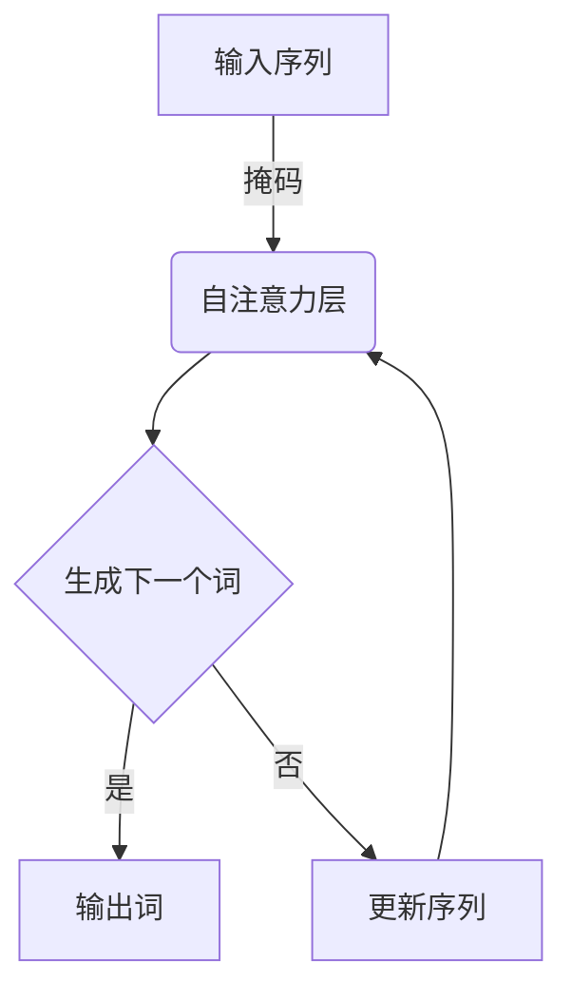
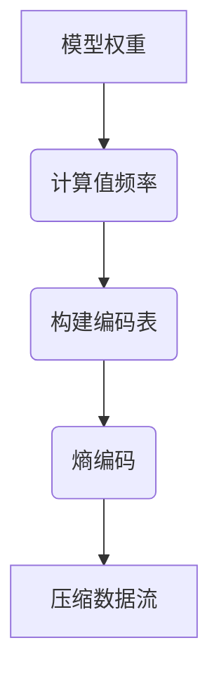

# 大语言模型应用指南：自回归与无损压缩

## 1. 背景介绍

### 1.1 问题的由来

在自然语言处理(NLP)领域,大型语言模型已经成为一种主导范式。这些模型通过在大规模文本语料库上进行预训练,学习丰富的语言表示,从而在下游任务中表现出色。然而,这些模型通常包含数十亿甚至数万亿参数,导致了巨大的计算和存储开销。

为了解决这一问题,研究人员提出了自回归(Autoregressive)和无损压缩(Lossless Compression)等技术。自回归模型利用已生成的文本来预测下一个词,从而减少了参数需求。无损压缩则通过压缩模型权重,降低了模型的存储需求。这两种技术的结合为高效部署大型语言模型提供了新的解决方案。

### 1.2 研究现状

目前,自回归语言模型已经取得了一些进展。例如,OpenAI的GPT(Generative Pre-trained Transformer)模型和谷歌的BERT(Bidirectional Encoder Representations from Transformers)模型都采用了自回归架构。这些模型在自然语言生成、机器翻译、问答系统等任务中表现出色。

无损压缩技术也已经被应用于大型语言模型的压缩和加速。例如,谷歌的DistilBERT通过知识蒸馏和矩阵分解实现了模型压缩。微软的Q8BERT则采用了量化和哈夫曼编码,将BERT模型大小压缩到原始大小的3.7%。

然而,这两种技术的结合及其在实际应用中的细节仍有待进一步探索。本文将深入探讨自回归和无损压缩在大型语言模型中的应用,并提供实践指南。

### 1.3 研究意义

高效部署大型语言模型对于实现自然语言处理的实用化至关重要。通过自回归和无损压缩技术,我们可以显著减少模型的计算和存储需求,从而使这些模型在资源受限的环境中(如移动设备、边缘计算等)得以应用。

此外,本文还将探讨这些技术在各种下游任务(如机器翻译、对话系统等)中的应用,为读者提供实践指南。通过深入理解这些技术的原理和应用,我们可以推动大型语言模型在工业界的广泛应用。

### 1.4 本文结构

本文将从以下几个方面全面介绍自回归和无损压缩在大型语言模型中的应用:

1. 核心概念与联系
2. 核心算法原理与具体操作步骤
3. 数学模型和公式详细讲解与案例分析
4. 项目实践:代码实例和详细解释
5. 实际应用场景
6. 工具和资源推荐
7. 总结:未来发展趋势与挑战
8. 附录:常见问题与解答

## 2. 核心概念与联系

在深入探讨自回归和无损压缩技术之前,我们需要先了解一些核心概念。

### 2.1 自回归语言模型(Autoregressive Language Model)

自回归语言模型是一种基于序列的生成模型,它通过学习文本序列的条件概率分布来生成新的文本。具体来说,给定一个文本序列$X=(x_1, x_2, \dots, x_n)$,自回归模型旨在学习条件概率$P(x_t|x_1, x_2, \dots, x_{t-1})$,即给定前面的词,预测下一个词的概率。

在自回归模型中,序列的每个元素都被视为一个条件输入,用于预测下一个元素。这种架构允许模型捕捉序列中的长程依赖关系,从而生成更加连贯和自然的文本。

自回归模型通常采用基于Transformer的架构,如GPT、XLNet等。这些模型利用自注意力(Self-Attention)机制来捕捉序列中的长程依赖关系,并通过掩码(Masking)机制实现自回归生成。

### 2.2 无损压缩(Lossless Compression)

无损压缩是一种数据压缩技术,它可以在不丢失任何信息的情况下减小数据的存储空间。在大型语言模型中,无损压缩技术通常应用于模型权重的压缩,从而减小模型的存储需求。

常见的无损压缩算法包括熵编码(如哈夫曼编码、算术编码)、字典编码(如LZW编码)和变换编码(如Burrows-Wheeler变换)等。这些算法通过消除数据中的冗余信息,实现有效的压缩。

在大型语言模型中,无损压缩技术可以与其他压缩技术(如量化、矩阵分解等)结合使用,进一步提高压缩率。同时,无损压缩还可以与自回归模型相结合,实现更高效的模型部署。

### 2.3 自回归与无损压缩的联系

自回归和无损压缩技术在大型语言模型中具有密切的联系。首先,自回归模型通过预测下一个词,可以减少模型参数的需求,从而降低计算和存储开销。同时,无损压缩技术可以进一步压缩自回归模型的权重,进一步降低存储需求。

此外,这两种技术还可以相互促进。例如,无损压缩可以压缩自回归模型的输入和输出,从而减小计算开销。另一方面,自回归模型可以利用压缩后的权重,提高推理效率。

综合运用自回归和无损压缩技术,我们可以实现高效、紧凑的大型语言模型部署,从而推动自然语言处理技术在资源受限环境中的应用。

## 3. 核心算法原理与具体操作步骤

### 3.1 算法原理概述

#### 3.1.1 自回归语言模型

自回归语言模型的核心思想是利用已生成的文本来预测下一个词,从而逐步生成整个序列。这种方法可以捕捉序列中的长程依赖关系,生成更加自然和连贯的文本。

自回归模型通常采用基于Transformer的架构,利用自注意力机制来捕捉序列中的依赖关系。在生成过程中,模型会根据已生成的文本计算出下一个词的概率分布,然后从中采样或选择概率最大的词作为输出。

具体来说,给定一个文本序列$X=(x_1, x_2, \dots, x_n)$,自回归模型旨在学习条件概率$P(x_t|x_1, x_2, \dots, x_{t-1})$。这可以通过最大化序列的对数似然函数来实现:

$$\mathcal{L}(\theta) = \sum_{i=1}^N \log P(X^{(i)}|\theta)$$

其中$\theta$表示模型参数,N是训练样本的数量。

在推理阶段,自回归模型通过递归地采样或选择概率最大的词来生成新的序列。这种方法虽然计算效率较低,但可以生成高质量的文本。

#### 3.1.2 无损压缩

无损压缩旨在通过消除数据中的冗余信息,从而减小数据的存储空间,同时保证数据可以被完全恢复。常见的无损压缩算法包括熵编码、字典编码和变换编码等。

在大型语言模型中,无损压缩技术通常应用于模型权重的压缩。由于模型权重通常包含大量的冗余信息(如大量的零值、相似的值等),因此可以使用无损压缩算法对其进行压缩。

无损压缩算法的核心思想是为出现频率较高的数据分配较短的编码,而为出现频率较低的数据分配较长的编码。这样可以减小整体编码长度,从而实现压缩。

常见的无损压缩算法包括:

- 熵编码:如哈夫曼编码、算术编码等,利用数据的概率分布为每个符号分配不等长的编码。
- 字典编码:如LZW编码,通过建立字典来替换重复出现的数据模式。
- 变换编码:如Burrows-Wheeler变换,通过重排数据序列来增加数据的局部性,从而提高压缩效率。

无损压缩算法可以单独应用于模型权重的压缩,也可以与其他压缩技术(如量化、矩阵分解等)结合使用,进一步提高压缩率。

### 3.2 算法步骤详解

#### 3.2.1 自回归语言模型

1. **数据预处理**:首先需要对训练数据进行预处理,包括分词、构建词表、填充等操作。
2. **模型架构选择**:选择合适的自回归模型架构,如GPT、XLNet等基于Transformer的模型。
3. **掩码机制**:在训练阶段,需要对输入序列进行掩码,以实现自回归生成。通常采用因果掩码(Causal Mask)或序列到序列掩码(Sequence-to-Sequence Mask)。
4. **自注意力计算**:利用自注意力机制捕捉序列中的长程依赖关系。
5. **输出层计算**:根据自注意力的输出,计算下一个词的概率分布。
6. **损失函数计算**:计算序列的对数似然损失函数,并通过梯度下降优化模型参数。
7. **生成过程**:在推理阶段,根据已生成的文本,递归地采样或选择概率最大的词,逐步生成整个序列。

以GPT模型为例,其自回归生成过程可以用以下Mermaid流程图表示:

#### 3.2.2 无损压缩

1. **数据分析**:分析模型权重的数据分布,包括值的范围、频率等,为压缩算法的选择提供依据。
2. **压缩算法选择**:根据数据分布特征,选择合适的无损压缩算法,如熵编码、字典编码或变换编码。
3. **编码过程**:对模型权重进行编码,生成压缩后的数据流。
4. **存储压缩数据**:将压缩后的数据流存储到磁盘或内存中。
5. **解码过程**:在推理阶段,从压缩数据流中解码出原始的模型权重。

以熵编码为例,其压缩过程可以用以下Mermaid流程图表示:

### 3.3 算法优缺点

#### 3.3.1 自回归语言模型

**优点**:

- 可以捕捉序列中的长程依赖关系,生成高质量的文本。
- 具有较强的泛化能力,可以应用于多种自然语言处理任务。
- 通过预测下一个词,可以减少模型参数的需求。

**缺点**:

- 推理速度较慢,因为需要逐步生成序列。
- 训练过程计算开销较大,需要大量的计算资源。
- 生成的文本可能存在不连贯或矛盾的情况。

#### 3.3.2 无损压缩

**优点**:

- 可以显著减小模型的存储需求,降低部署成本。
- 压缩和解压过程可逆,不会导致任何信息损失。
- 可以与其他压缩技术(如量化、矩阵分解等)结合使用,进一步提高压缩率。

**缺点**:

- 压缩和解压过程会带来一定的计算开销。
- 压缩率受限于数据的熵,存在理论上限。
- 需要根据数据分布特征选择合适的压缩算法,存在一定的工程开销。

### 3.4 算法应用领域

自回归语言模型和无损压缩技术在自然语言处理领域有广泛的应用,包括但不限于:

- **机器翻译**:自回归模型可以用于生成目标语言的翻译文本。
- **文本生成**:自回归模型可以生成连贯、自然的文本,如新闻报道、小说等。
- **对话系统**:自回归模型可以根据对话历史生成自然的回复。
- **问答系统**:自回