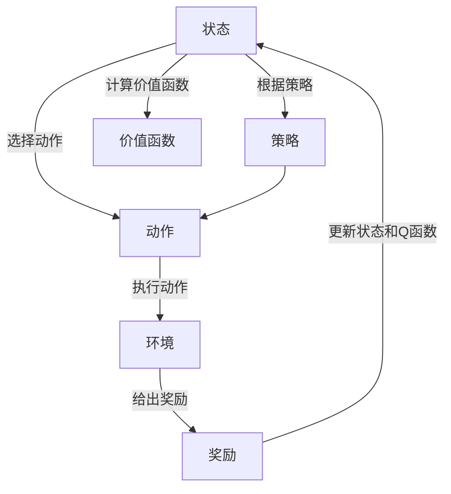

## 1. 背景介绍

### 1.1 问题的由来

强化学习(Reinforcement Learning)是人工智能中的一个重要领域，它的目标是让机器通过自我学习和尝试，找到在特定环境中获取最大回报的方法。这种学习方式的灵感来源于生物学中的行为心理学，特别是动物如何在环境中学习行为的过程。

### 1.2 研究现状

强化学习在过去的几十年里取得了显著的进步。从最初的Q-learning和SARSA，到近年来的深度强化学习，如Deep Q Network (DQN)、Policy Gradient和Actor-Critic算法，都在各种任务中展现了强大的能力。

### 1.3 研究意义

强化学习的研究对于人工智能的发展具有重要意义。它不仅能让机器自我学习和优化，而且能解决一些传统的监督学习和无监督学习难以处理的问题。例如，强化学习已经被成功应用于游戏、机器人、自动驾驶、推荐系统等领域。

### 1.4 本文结构

本文将首先介绍强化学习的核心概念和联系，然后详细解释其核心算法原理和具体操作步骤。接着，我们将深入探讨强化学习的数学模型和公式，并通过实例进行详细讲解。然后，我们将通过一个项目实践，展示如何在代码中实现强化学习。最后，我们将探讨强化学习的实际应用场景，推荐一些有用的工具和资源，并总结未来的发展趋势和挑战。

## 2. 核心概念与联系

强化学习的核心概念包括状态(State)、动作(Action)、奖励(Reward)、策略(Policy)、价值函数(Value Function)和Q函数(Q Function)。

- 状态(State)：描述环境的信息，是决策的依据。
- 动作(Action)：是在某个状态下可以采取的行动。
- 奖励(Reward)：是执行某个动作后环境给出的反馈，用来评价这个动作的好坏。
- 策略(Policy)：是在某个状态下选择动作的规则。
- 价值函数(Value Function)：是评价在某个状态下未来能获取的总奖励的函数。
- Q函数(Q Function)：是评价在某个状态下执行某个动作后未来能获取的总奖励的函数。

这些概念之间的联系可以通过以下Mermaid流程图进行展示：



## 3. 核心算法原理 & 具体操作步骤

### 3.1 算法原理概述

强化学习的算法原理主要是通过不断的试错和学习，找到在每个状态下应该选择哪个动作能获取最大的总奖励。这个过程可以通过以下四个步骤进行：

1. 初始化：初始化状态和Q函数。
2. 选择动作：根据当前状态和策略选择一个动作。
3. 执行动作：执行选择的动作，并获取环境的反馈奖励和新的状态。
4. 更新Q函数：根据奖励和新的状态，更新Q函数。

### 3.2 算法步骤详解

接下来，我们将详细解释这四个步骤。

1. 初始化：在开始学习之前，我们需要初始化状态和Q函数。状态通常由环境给出，Q函数可以初始化为0或者随机值。

2. 选择动作：在每个状态下，我们需要选择一个动作。这个选择可以根据策略进行。常用的策略有ε-greedy策略和softmax策略。ε-greedy策略是以1-ε的概率选择当前Q函数值最大的动作，以ε的概率随机选择一个动作。softmax策略是以动作的Q函数值的softmax值为概率选择动作。

3. 执行动作：执行选择的动作后，环境会给出反馈的奖励和新的状态。

4. 更新Q函数：根据奖励和新的状态，我们可以更新Q函数。常用的更新方法是Q-learning和SARSA。Q-learning的更新公式为：$Q(s,a) = Q(s,a) + α [r + γ max_{a'} Q(s',a') - Q(s,a)]$，其中，s和a是当前的状态和动作，r是奖励，s'是新的状态，a'是在s'状态下Q函数值最大的动作，α是学习率，γ是折扣因子。SARSA的更新公式为：$Q(s,a) = Q(s,a) + α [r + γ Q(s',a') - Q(s,a)]$，其中，a'是在s'状态下根据策略选择的动作。

### 3.3 算法优缺点

强化学习的优点包括：

- 可以处理序列决策问题：强化学习可以处理一系列的决策问题，而不仅仅是单一的决策问题。
- 可以在环境中自我学习：强化学习可以通过与环境的交互进行自我学习，而无需大量的标注数据。
- 可以进行在线学习：强化学习可以在执行动作的同时进行学习，实现在线学习。

强化学习的缺点包括：

- 探索和利用的平衡问题：强化学习需要在探索未知的动作和利用已知的最优动作之间找到一个平衡。
- 延迟奖励问题：在强化学习中，当前的动作可能会影响未来的奖励，这使得学习过程变得复杂。
- 状态和动作空间大的问题：当状态和动作空间很大时，强化学习的学习过程可能会变得非常慢。

### 3.4 算法应用领域

强化学习已经被广泛应用于各种领域，包括：

- 游戏：强化学习已经在各种游戏中展现了超越人类的能力，如围棋、象棋、扑克、电子游戏等。
- 机器人：强化学习被用于训练机器人进行各种任务，如走路、跑步、跳跃、搬运物品等。
- 自动驾驶：强化学习被用于训练自动驾驶系统，使其能在复杂的交通环境中安全驾驶。
- 推荐系统：强化学习被用于推荐系统，使其能根据用户的反馈进行自我学习和优化。

## 4. 数学模型和公式 & 详细讲解 & 举例说明

### 4.1 数学模型构建

强化学习的数学模型通常是马尔可夫决策过程(Markov Decision Process, MDP)。MDP是一个五元组$(S, A, P, R, γ)$，其中：

- $S$是状态空间，包含所有可能的状态。
- $A$是动作空间，包含所有可能的动作。
- $P$是状态转移概率，$P(s'|s,a)$表示在状态$s$下执行动作$a$后转移到状态$s'$的概率。
- $R$是奖励函数，$R(s,a,s')$表示在状态$s$下执行动作$a$后转移到状态$s'$所获得的奖励。
- $γ$是折扣因子，用来调整未来奖励的重要性。

### 4.2 公式推导过程

强化学习的目标是找到一个策略π，使得从任何状态$s$开始，按照策略π执行动作后获得的总奖励期望最大。这个总奖励期望被称为价值函数，记为$V^π(s)$，定义为：

$$
V^π(s) = E[∑_{t=0}^∞ γ^t R(s_t,a_t,s_{t+1}) | s_0=s, a_t=π(s_t), s_{t+1}~P(·|s_t,a_t)]
$$

其中，$E$是期望，$s_t$和$a_t$是在时间$t$的状态和动作，$s_{t+1}$是在状态$s_t$下执行动作$a_t$后的新状态。

我们的目标是找到一个最优策略π*，使得对于所有的状态$s$，$V^{π*}(s)$都是最大的。这个最大的价值函数被称为最优价值函数，记为$V^*(s)$，定义为：

$$
V^*(s) = max_{π} V^π(s)
$$

对于每个状态$s$和动作$a$，我们还定义一个Q函数$Q^π(s,a)$，表示在状态$s$下执行动作$a$，然后按照策略π执行动作后获得的总奖励期望，定义为：

$$
Q^π(s,a) = E[∑_{t=0}^∞ γ^t R(s_t,a_t,s_{t+1}) | s_0=s, a_0=a, a_t=π(s_t), s_{t+1}~P(·|s_t,a_t)]
$$

我们的目标是找到一个最优策略π*，使得对于所有的状态$s$和动作$a$，$Q^{π*}(s,a)$都是最大的。这个最大的Q函数被称为最优Q函数，记为$Q^*(s,a)$，定义为：

$$
Q^*(s,a) = max_{π} Q^π(s,a)
$$

### 4.3 案例分析与讲解

为了更好地理解强化学习的数学模型和公式，我们来看一个简单的案例。

假设我们有一个迷宫，迷宫中有一个起点、一个终点和一些障碍物。我们的目标是找到一个策略，使得从起点出发，经过最少的步数到达终点。

在这个案例中，状态就是迷宫中的每一个位置，动作就是上、下、左、右四个方向的移动，奖励是每走一步的奖励，如果到达终点，奖励为正，如果碰到障碍物，奖励为负。

我们可以使用Q-learning算法来找到最优策略。在每个状态下，我们选择Q函数值最大的动作，执行动作后，根据环境的反馈奖励和新的状态，更新Q函数。通过不断的学习和优化，最终我们可以找到一个最优策略，使得从起点出发，经过最少的步数到达终点。

### 4.4 常见问题解答

Q: 为什么要使用折扣因子γ？

A: 折扣因子γ是用来调整未来奖励的重要性的。如果γ接近于1，那么我们更关心长期的奖励；如果γ接近于0，那么我们更关心短期的奖励。通过调整γ，我们可以控制强化学习的长期和短期目标。

Q: 如何选择策略？

A: 策略的选择通常根据Q函数来进行。常用的策略有ε-greedy策略和softmax策略。ε-greedy策略是以1-ε的概率选择当前Q函数值最大的动作，以ε的概率随机选择一个动作。softmax策略是以动作的Q函数值的softmax值为概率选择动作。

Q: Q-learning和SARSA有什么区别？

A: Q-learning和SARSA都是强化学习的算法，但是他们的更新公式有所不同。Q-learning的更新公式是$Q(s,a) = Q(s,a) + α [r + γ max_{a'} Q(s',a') - Q(s,a)]$，其中，a'是在新的状态s'下Q函数值最大的动作。SARSA的更新公式是$Q(s,a) = Q(s,a) + α [r + γ Q(s',a') - Q(s,a)]$，其中，a'是在新的状态s'下根据策略选择的动作。这个区别使得Q-learning更倾向于探索，而SARSA更倾向于利用。

## 5. 项目实践：代码实例和详细解释说明

### 5.1 开发环境搭建

在进行项目实践之前，我们需要搭建开发环境。我们使用Python作为开发语言，使用Gym作为强化学习的环境库，使用Numpy作为数值计算库。你可以通过以下命令安装这些库：

```bash
pip install gym numpy
```

### 5.2 源代码详细实现

接下来，我们将实现一个简单的Q-learning算法。

首先，我们需要导入需要的库，并初始化环境和Q函数。

```python
import gym
import numpy as np

# 创建环境
env = gym.make('FrozenLake-v0')

# 初始化Q函数
Q = np.zeros([env.observation_space.n, env.action_space.n])
```

然后，我们定义Q-learning的参数，并进行学习。

```python
# 定义参数
alpha = 0.5
gamma = 0.95
epsilon = 0.1
num_episodes = 5000

# 学习
for i_episode in range(num_episodes):
    # 初始化状态
    s = env.reset()
    
    for t in range(100):
        # 选择动作
        if np.random.uniform(0, 1) < epsilon:
            a = env.action_space.sample()
        else:
            a = np.argmax(Q[s, :])

        # 执行动作
        s_, r, done, _ = env.step(a)

        # 更新Q函数
        Q[s, a] = Q[s, a] + alpha * (r + gamma * np.max(Q[s_, :]) - Q[s, a])

        # 更新状态
        s = s_

        if done:
            break
```

最后，我们输出学习后的Q函数，并测试学习的结果。

```python
# 输出Q函数
print(Q)

#