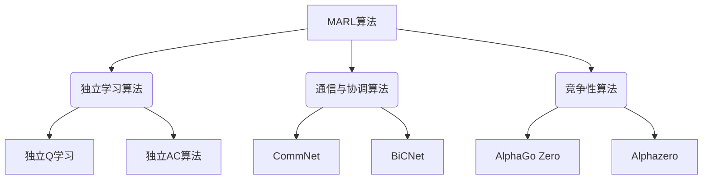

# 强化学习的多智能体场景

## 1. 背景介绍

### 1.1 问题的由来

在现实世界中,很多复杂的问题都涉及到多个智能体之间的互动和决策。传统的单智能体强化学习算法在处理这些问题时往往会遇到困难,因为它们无法很好地捕捉智能体之间的相互影响和竞争关系。因此,多智能体强化学习(Multi-Agent Reinforcement Learning,MARL)应运而生,旨在解决这一挑战。

多智能体系统中,每个智能体都有自己的目标和策略,它们需要相互协作或竞争来实现各自的目标。这种复杂的交互关系使得传统的单智能体强化学习算法难以直接应用。MARL试图通过建模智能体之间的互动,来学习最优的行为策略。

### 1.2 研究现状

近年来,MARL在多个领域取得了令人瞩目的进展,例如机器人协作、自动驾驶、网络通信等。但同时,MARL也面临着一些挑战,如非平稳环境、部分可观测性、多目标优化等。研究人员一直在努力探索新的算法和技术来应对这些挑战。

目前,MARL的主要研究方向包括:

1. **算法设计**: 开发新的MARL算法,以更好地处理多智能体环境的复杂性和不确定性。
2. **理论分析**: 研究MARL算法的收敛性、稳定性和最优性等理论性质。
3. **应用探索**: 将MARL应用于各种实际问题,如机器人协作、交通控制、网络安全等。
4. **环境建模**: 构建更加真实和复杂的多智能体环境,为算法提供更好的评估和测试平台。

### 1.3 研究意义

MARL的研究对于解决现实世界中的复杂问题具有重要意义。通过建模和学习多个智能体之间的互动,MARL可以为以下领域带来新的解决方案:

1. **机器人协作**: 多个机器人可以通过协作完成复杂的任务,如搬运物品、探索未知环境等。
2. **自动驾驶**: 自动驾驶汽车需要与其他车辆和行人协调,以确保安全和高效的行驶。
3. **网络通信**: MARL可以优化网络节点之间的资源分配和路由决策,提高网络的整体性能。
4. **游戏AI**: 在多人游戏中,每个玩家都是一个智能体,MARL可以用于训练更加智能的游戏AI。
5. **社交网络分析**: MARL可以模拟社交网络中用户之间的互动,从而更好地理解网络动态和信息传播。

### 1.4 本文结构

本文将全面介绍MARL的核心概念、算法原理、数学模型、实践应用和未来发展趋势。文章结构如下:

1. 背景介绍
2. 核心概念与联系
3. 核心算法原理与具体操作步骤
4. 数学模型和公式详细讲解与举例说明
5. 项目实践:代码实例和详细解释说明
6. 实际应用场景
7. 工具和资源推荐
8. 总结:未来发展趋势与挑战
9. 附录:常见问题与解答

## 2. 核心概念与联系

在深入探讨MARL的算法和模型之前,我们先来了解一些核心概念和它们之间的联系。

### 2.1 马尔可夫决策过程(MDP)

马尔可夫决策过程(Markov Decision Process,MDP)是强化学习的基础模型。在MDP中,智能体与环境进行交互,根据当前状态选择行动,并从环境获得相应的奖励。MDP由以下几个要素组成:

- **状态空间(State Space) S**: 描述环境的所有可能状态。
- **行动空间(Action Space) A**: 智能体可以执行的所有可能行动。
- **转移概率(Transition Probability) P(s'|s,a)**: 在状态s下执行行动a后,转移到状态s'的概率。
- **奖励函数(Reward Function) R(s,a,s')**: 在状态s下执行行动a并转移到状态s'时获得的即时奖励。

MDP的目标是找到一个最优策略π*,使得在遵循该策略时,可以最大化期望的累积奖励。

### 2.2 马尔可夫博弈(Markov Game)

马尔可夫博弈(Markov Game)是MARL的基础模型,它扩展了MDP,用于描述多个智能体之间的互动。在马尔可夫博弈中,每个智能体都有自己的行动空间和奖励函数,它们共享同一个状态空间和转移概率。

马尔可夫博弈由以下要素组成:

- **状态空间(State Space) S**: 描述环境的所有可能状态。
- **智能体集合(Agent Set) N**: 包含所有参与博弈的智能体。
- **行动空间(Action Space) A_i**: 每个智能体i可以执行的所有可能行动。
- **联合行动空间(Joint Action Space) A**: 所有智能体的行动空间的笛卡尔积,A = A_1 x A_2 x ... x A_n。
- **转移概率(Transition Probability) P(s'|s,a_1,a_2,...,a_n)**: 在状态s下,所有智能体执行联合行动(a_1,a_2,...,a_n)后,转移到状态s'的概率。
- **奖励函数(Reward Function) R_i(s,a_1,a_2,...,a_n,s')**: 对于智能体i,在状态s下,所有智能体执行联合行动(a_1,a_2,...,a_n)并转移到状态s'时,智能体i获得的即时奖励。

马尔可夫博弈的目标是为每个智能体找到一个最优策略π_i*,使得在所有智能体遵循这些策略时,每个智能体的期望累积奖励都被最大化。

### 2.3 协作与竞争

在MARL中,智能体之间的关系可以分为两种:协作(Cooperative)和竞争(Competitive)。

- **协作**: 所有智能体共享相同的奖励函数,它们的目标是最大化整个系统的累积奖励。协作问题的典型例子是机器人协作、交通控制等。
- **竞争**: 每个智能体都有自己的奖励函数,它们的目标是最大化各自的累积奖励。竞争问题的典型例子是对抗性游戏、网络安全等。

协作和竞争问题在建模和算法设计上存在一些差异,但它们都可以用马尔可夫博弈来描述。

### 2.4 部分可观测马尔可夫决策过程(POMDP)

在现实世界中,智能体往往无法完全观测到环境的状态,只能获取部分观测信息。这种情况被称为部分可观测马尔可夫决策过程(Partially Observable Markov Decision Process,POMDP)。

在POMDP中,智能体无法直接获取当前状态s,而是通过观测函数O(o|s)获取观测值o。智能体需要基于历史观测序列来估计当前状态,并选择相应的行动。

POMDP进一步增加了MARL问题的复杂性,因为每个智能体不仅需要处理其他智能体的行动,还需要处理部分可观测性带来的不确定性。

### 2.5 去中心化与中心化控制

在MARL中,控制策略可以分为去中心化(Decentralized)和中心化(Centralized)两种。

- **去中心化控制**: 每个智能体都有自己的策略,根据自身的观测和历史信息来选择行动。这种方式更加分散和健壮,但是智能体之间的协调较为困难。
- **中心化控制**: 存在一个中心控制器,它可以观测到所有智能体的信息,并为每个智能体选择相应的行动。这种方式协调性更好,但是存在单点故障的风险,且计算复杂度较高。

在实际应用中,常常采用混合的方式,例如在训练阶段使用中心化控制来提高性能,在执行阶段使用去中心化控制来提高鲁棒性。

## 3. 核心算法原理与具体操作步骤

在了解了MARL的核心概念之后,我们来探讨一些经典的MARL算法,了解它们的原理和具体操作步骤。

### 3.1 算法原理概述

#### 3.1.1 独立学习算法

独立学习算法(Independent Learners)是最简单的MARL算法。在这种算法中,每个智能体都独立地学习自己的策略,就像在单智能体环境中一样。这种方法的优点是简单和高效,但缺点是无法捕捉智能体之间的相互影响,因此在复杂环境中表现往往不佳。

常见的独立学习算法包括:

- **独立Q学习(Independent Q-Learning)**: 每个智能体都使用标准的Q学习算法来学习自己的Q函数,忽略其他智能体的存在。
- **独立Actor-Critic(Independent AC)**: 每个智能体都使用Actor-Critic算法来学习自己的策略和价值函数,同样忽略其他智能体。

#### 3.1.2 通信与协调算法

通信与协调算法(Communication and Coordination Algorithms)旨在通过智能体之间的信息交换来实现更好的协调。这些算法通常采用中心化训练、去中心化执行的范式,在训练阶段使用中心控制器来协调智能体,在执行阶段每个智能体根据自身观测和接收到的信息来选择行动。

一些典型的通信与协调算法包括:

- **CommNet**: 智能体通过发送向量化的通信信号来协调行为。
- **BiCNet**: 在CommNet的基础上,引入了双向传递信息的机制,提高了通信效率。

#### 3.1.3 竞争性算法

竞争性算法(Competitive Algorithms)专门用于解决智能体之间存在竞争关系的问题,如对抗性游戏、网络安全等。这些算法通常采用自我对抗的训练方式,让智能体互相对抗以提高策略的鲁棒性。

一些著名的竞争性算法包括:

- **AlphaGo Zero**: 通过蒙特卡罗树搜索和深度神经网络,实现了超人类水平的围棋AI。
- **AlphaZero**: 在AlphaGo Zero的基础上,进一步发展出一种通用的算法框架,可以应用于国际象棋、围棋等多种对抗性游戏。

### 3.2 算法步骤详解

接下来,我们将详细介绍独立Q学习算法和CommNet算法的具体操作步骤。

#### 3.2.1 独立Q学习算法

独立Q学习算法是基于标准Q学习算法的扩展,其核心思想是让每个智能体独立地学习自己的Q函数,忽略其他智能体的存在。算法步骤如下:

1. **初始化**: 对于每个智能体i,初始化Q函数Q_i(s,a_i)。
2. **观测环境**: 获取当前状态s。
3. **选择行动**: 对于每个智能体i,根据ε-贪婪策略选择行动a_i,即以概率ε选择随机行动,以概率1-ε选择Q_i(s,a_i)最大的行动。
4. **执行行动**: 所有智能体执行选择的行动(a_1,a_2,...,a_n),环境转移到新状态s'。
5. **获取奖励**: 每个智能体i获得即时奖励r_i。
6. **更新Q函数**: 对于每个智能体i,使用下式更新Q_i(s,a_i):

$$Q_i(s,a_i) \leftarrow Q_i(s,a_i) + \alpha \left[ r_i + \gamma \max_{a_i'} Q_i(s',a_i') - Q_i(s,a_i) \right]$$

其中α是学习率,γ是折扣因子。
7. **更新状态**: 将s'设为当前状态s,回到步骤2。

独