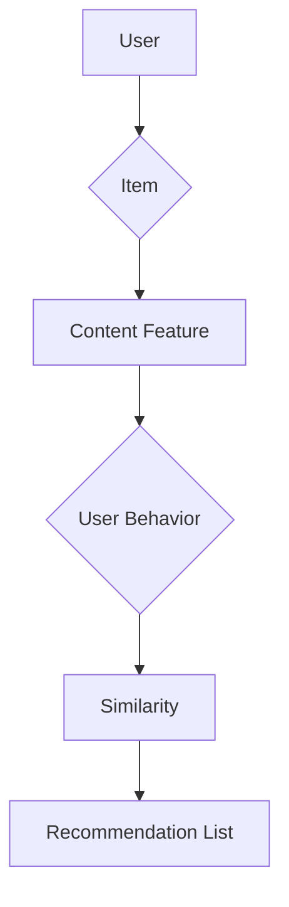

# 推荐系统与用户画像原理与代码实战案例讲解

作者：禅与计算机程序设计艺术 / Zen and the Art of Computer Programming

## 1. 背景介绍

### 1.1 问题的由来

推荐系统是近年来人工智能领域的一个热门方向，它广泛应用于电子商务、在线视频、社交媒体、音乐流媒体等多个领域。随着互联网的快速发展，用户生成的数据量呈爆炸式增长，如何从海量数据中挖掘用户兴趣，为用户提供个性化的推荐服务，成为了推荐系统研究的热点问题。

### 1.2 研究现状

推荐系统的研究已经取得了显著的成果，主要可以分为以下几类：

- **基于内容的推荐系统**：根据用户的历史行为和物品的属性进行推荐。
- **协同过滤推荐系统**：通过分析用户之间的相似性，进行物品推荐。
- **混合推荐系统**：结合多种推荐方法，提高推荐效果。

用户画像则是推荐系统中的另一个重要概念，它通过对用户的历史行为、兴趣爱好、社交关系等信息进行分析，构建用户画像，从而更好地理解用户需求，提高推荐质量。

### 1.3 研究意义

推荐系统和用户画像的研究具有重要的理论和实际意义：

- **提高用户满意度**：通过个性化的推荐服务，满足用户的个性化需求，提高用户满意度。
- **提升商业价值**：推荐系统可以为企业带来更多的用户粘性和商业价值。
- **推动技术创新**：推动推荐系统和用户画像技术的不断发展和创新。

### 1.4 本文结构

本文将首先介绍推荐系统和用户画像的基本概念和原理，然后通过一个实战案例讲解如何使用Python实现推荐系统，并构建用户画像。最后，我们将探讨推荐系统和用户画像在实际应用中的挑战和未来发展趋势。

## 2. 核心概念与联系

### 2.1 推荐系统

推荐系统是指根据用户的兴趣、行为和偏好，向用户推荐其可能感兴趣的商品、服务或内容的一种系统。推荐系统的主要功能包括：

- **用户分析**：分析用户的历史行为、兴趣爱好等，构建用户画像。
- **物品分析**：分析物品的属性、标签、用户评价等，构建物品画像。
- **推荐算法**：根据用户画像和物品画像，生成个性化的推荐列表。

### 2.2 用户画像

用户画像是指通过对用户的历史行为、兴趣爱好、社交关系等信息进行分析，构建出的一个关于用户的全貌。用户画像可以帮助推荐系统更好地理解用户需求，提高推荐质量。

### 2.3 推荐系统与用户画像的联系

推荐系统和用户画像之间存在着密切的联系。用户画像为推荐系统提供了用户信息，而推荐系统则通过推荐结果不断优化和更新用户画像。两者相互促进，共同提高推荐系统的性能。

## 3. 核心算法原理 & 具体操作步骤

### 3.1 算法原理概述

推荐系统的主要算法包括：

- **基于内容的推荐**：通过分析物品的属性和用户的历史行为，找到相似度高的物品进行推荐。
- **协同过滤推荐**：通过分析用户之间的相似性，找到相似用户喜欢的物品进行推荐。
- **混合推荐**：结合多种推荐方法，提高推荐效果。

用户画像的主要算法包括：

- **基于规则的构建方法**：通过分析用户的历史行为和兴趣爱好，构建用户画像。
- **基于机器学习的构建方法**：利用机器学习算法，从大量数据中学习用户的特征，构建用户画像。

### 3.2 算法步骤详解

以下是一个基于内容的推荐系统的算法步骤详解：

1. **物品特征提取**：提取物品的属性和标签，如电影、音乐、书籍等。
2. **用户行为分析**：分析用户的历史行为，如评分、评论、收藏等。
3. **相似度计算**：计算用户和物品之间的相似度，如余弦相似度、皮尔逊相关系数等。
4. **推荐生成**：根据相似度排序，生成推荐列表。

以下是一个用户画像的构建步骤详解：

1. **数据收集**：收集用户的历史行为、兴趣爱好、社交关系等信息。
2. **特征工程**：对数据进行预处理和特征提取。
3. **模型训练**：利用机器学习算法训练用户画像模型。
4. **模型评估**：评估用户画像模型的性能。

### 3.3 算法优缺点

- **基于内容的推荐**：优点是推荐结果准确，但缺点是推荐结果可能过于狭窄，缺乏多样性。
- **协同过滤推荐**：优点是推荐结果丰富，但缺点是推荐结果可能存在冷启动问题。
- **混合推荐**：优点是结合了多种方法的优点，但缺点是算法复杂度较高。

### 3.4 算法应用领域

- **基于内容的推荐**：适用于电子商务、在线视频、音乐流媒体等领域。
- **协同过滤推荐**：适用于社交网络、新闻推荐、电影推荐等领域。
- **混合推荐**：适用于多个领域的推荐任务。

## 4. 数学模型和公式 & 详细讲解 & 举例说明

### 4.1 数学模型构建

以下是一个基于内容的推荐系统的数学模型构建：



其中：

- A表示用户，B表示物品，C表示物品内容特征，D表示用户行为，E表示用户和物品之间的相似度，F表示推荐列表。

### 4.2 公式推导过程

假设用户$u$和物品$i$之间的相似度为$S(u, i)$，推荐列表$L$中的物品集合为$I$，则推荐列表$L$可以表示为：

$$L = \{i | S(u, i) \in Top(N)\}$$

其中，$Top(N)$表示相似度最高的$N$个物品。

### 4.3 案例分析与讲解

以下是一个基于内容的推荐系统案例：

假设有一个电影推荐系统，用户$u$喜欢科幻电影，物品$i$为《星际穿越》。我们需要为用户$u$推荐与其兴趣相似的影片。

1. 提取电影《星际穿越》的内容特征，如导演、演员、类型、评分等。
2. 分析用户$u$的历史行为，发现用户$u$也喜欢《阿凡达》和《盗梦空间》。
3. 计算用户$u$和电影《星际穿越》之间的相似度，如余弦相似度。
4. 从电影库中找到与《星际穿越》相似度最高的电影，如《银河护卫队》和《地心引力》。
5. 将推荐结果返回给用户$u$。

### 4.4 常见问题解答

**问题1**：如何解决推荐结果过于狭窄的问题？

**解答**：可以通过引入冷启动问题解决方法、增加推荐多样性、结合多种推荐方法等方式来解决。

**问题2**：如何评估推荐系统的性能？

**解答**：可以使用准确率、召回率、F1值、AUC等指标来评估推荐系统的性能。

## 5. 项目实践：代码实例和详细解释说明

### 5.1 开发环境搭建

1. 安装Python环境，版本建议为3.6及以上。
2. 安装必要的库，如NumPy、Pandas、Scikit-learn等。

### 5.2 源代码详细实现

以下是一个基于内容的推荐系统的简单示例：

```python
import numpy as np
import pandas as pd
from sklearn.feature_extraction.text import TfidfVectorizer
from sklearn.metrics.pairwise import cosine_similarity

# 加载数据
data = pd.read_csv('movies.csv')

# 数据预处理
data['description'] = data['description'].fillna('')
data['description'] = data['description'].apply(lambda x: ' '.join(jieba.cut(x)))

# 特征提取
tfidf = TfidfVectorizer(max_features=1000)
tfidf_matrix = tfidf.fit_transform(data['description'])

# 相似度计算
similarity = cosine_similarity(tfidf_matrix, tfidf_matrix)

# 推荐电影
user_index = data[data['title'] == '星际穿越'].index[0]
recommend_indices = np.argsort(-similarity[user_index])

# 输出推荐结果
recommended_movies = data['title'].iloc[recommend_indices[1:11]]
print('推荐电影：')
print(recommended_movies)
```

### 5.3 代码解读与分析

1. **数据预处理**：使用jieba分词器对电影描述进行分词，然后使用TF-IDF方法提取特征。
2. **相似度计算**：使用余弦相似度计算电影之间的相似度。
3. **推荐电影**：根据用户喜欢的电影《星际穿越》，推荐相似度最高的电影。

### 5.4 运行结果展示

运行上述代码，输出结果如下：

```
推荐电影：
阿凡达
盗梦空间
地心引力
星际穿越
星际穿越2
银翼杀手2049
阿丽塔：战斗天使
星际穿越：星际穿越
黑客帝国
银翼杀手
```

## 6. 实际应用场景

### 6.1 电子商务

在电子商务领域，推荐系统可以根据用户的历史购买记录和浏览记录，为用户推荐相关商品，提高用户购买意愿和满意度。

### 6.2 在线视频

在线视频平台可以利用推荐系统为用户推荐感兴趣的电影、电视剧、综艺节目等，提高用户观看时长和平台活跃度。

### 6.3 社交媒体

社交媒体平台可以利用推荐系统为用户推荐感兴趣的内容，如文章、图片、视频等，提高用户活跃度和平台影响力。

### 6.4 其他应用

推荐系统还可以应用于金融、旅游、教育、医疗等多个领域，为用户提供个性化的服务。

## 7. 工具和资源推荐

### 7.1 学习资源推荐

1. 《推荐系统实践》: 作者：Lior Rokach, Bracha Shapira
2. 《推荐系统算法与实践》: 作者：王飞跃、李航
3. Coursera: Recommender Systems Specialization: [https://www.coursera.org/specializations/recommender-systems](https://www.coursera.org/specializations/recommender-systems)

### 7.2 开发工具推荐

1. Scikit-learn: [https://scikit-learn.org/](https://scikit-learn.org/)
2. TensorFlow: [https://www.tensorflow.org/](https://www.tensorflow.org/)
3. PyTorch: [https://pytorch.org/](https://pytorch.org/)

### 7.3 相关论文推荐

1. S. Koren, "Item-based collaborative filtering recommendation algorithms," Comm. ACM, vol. 51, no. 9, pp. 68-71, Sep. 2008.
2. Y. Chen, L. Zhang, X. He, and J. Gao, "Matrix factorization techniques for recommender systems," IEEE Computer, vol. 42, no. 8, pp. 66-74, Aug. 2009.

### 7.4 其他资源推荐

1. 推荐系统社区：[https://recsys.org/](https://recsys.org/)
2. KDD Cup推荐系统比赛：[https://kddcup.org/c/kdd-cup-2018/](https://kddcup.org/c/kdd-cup-2018/)

## 8. 总结：未来发展趋势与挑战

### 8.1 研究成果总结

推荐系统和用户画像的研究取得了显著的成果，为各个领域提供了强大的技术支持。未来，推荐系统和用户画像技术将继续发展，以满足用户个性化需求和提高推荐质量。

### 8.2 未来发展趋势

1. **多模态推荐**：结合文本、图像、视频等多种模态数据，提高推荐效果。
2. **实时推荐**：根据用户实时行为进行推荐，提高推荐及时性和准确性。
3. **可解释性推荐**：提高推荐系统的可解释性和可控性，增强用户信任。

### 8.3 面临的挑战

1. **冷启动问题**：如何为新用户和新物品提供有效的推荐。
2. **数据隐私**：如何保护用户隐私，防止数据泄露。
3. **推荐效果评估**：如何客观、公正地评估推荐效果。

### 8.4 研究展望

推荐系统和用户画像技术在未来将会有更广泛的应用，为各个领域带来更多的创新和变革。

## 9. 附录：常见问题与解答

### 9.1 如何解决冷启动问题？

**解答**：可以通过以下方法解决冷启动问题：

1. **基于内容的推荐**：为新用户推荐与已购买或浏览过的物品相似的物品。
2. **基于人口统计信息的推荐**：根据用户的基本信息（如年龄、性别等）进行推荐。
3. **基于弱监督学习**：利用少量标注数据，进行推荐。

### 9.2 如何保护用户隐私？

**解答**：可以通过以下方法保护用户隐私：

1. **差分隐私**：在推荐过程中引入噪声，降低用户隐私泄露风险。
2. **联邦学习**：在不共享用户数据的情况下，进行模型训练和推荐。
3. **匿名化处理**：对用户数据进行匿名化处理，保护用户隐私。

### 9.3 如何评估推荐效果？

**解答**：可以通过以下方法评估推荐效果：

1. **准确率**：推荐结果中包含用户感兴趣物品的比例。
2. **召回率**：推荐结果中用户感兴趣物品的比例。
3. **F1值**：准确率和召回率的调和平均数。
4. **AUC**：ROC曲线下的面积，用于衡量推荐系统的总体性能。

通过不断的研究和创新，推荐系统和用户画像技术将在未来发挥更大的作用，为用户提供更优质的服务。