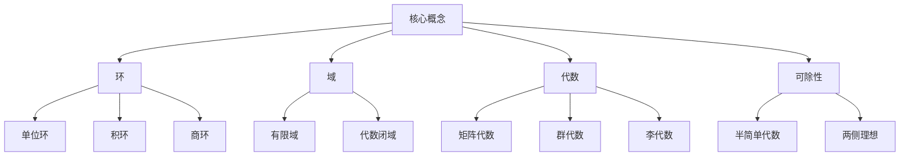
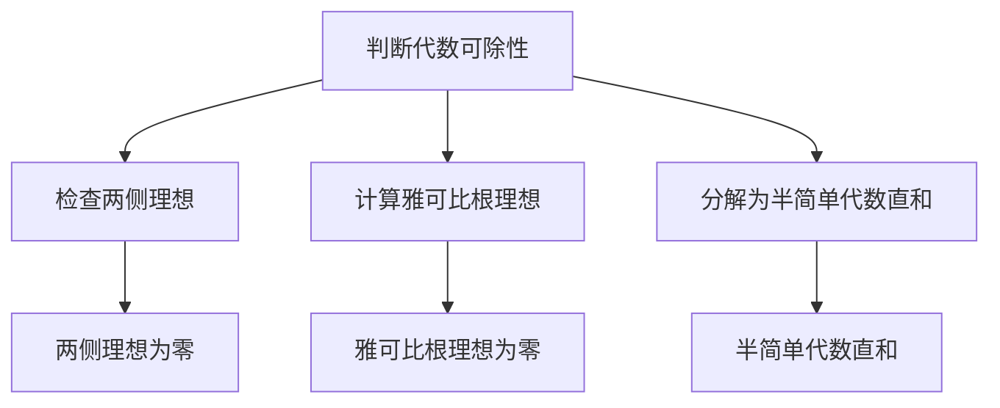

# 环与代数：一些特殊域上的中心可除代数

## 1. 背景介绍

### 1.1 问题的由来

代数是数学的一个重要分支,它研究代数系统的结构和性质。在代数研究中,环(ring)和代数(algebra)是两个基本的代数结构。环是一种代数系统,它具有两种代数运算:加法和乘法,并满足一些代数运算律。而代数则是一种更一般的代数结构,它是一个向量空间上的一种代数运算系统。

在代数研究中,一个重要的问题是研究代数的可除性(semisimplicity)。一个代数被称为可除代数(semisimple algebra),如果它不包含任何非平凡的两侧理想(two-sided ideal)。可除代数在表示论、李代数和量子群等数学领域有着广泛的应用。

然而,并非所有的代数都是可除的。因此,研究代数的可除性及其条件就成为了一个重要的课题。特别地,在一些特殊的域(field)上研究代数的可除性具有重要的理论意义和应用价值。

### 1.2 研究现状

对于一般域上的代数的可除性问题,已有一些重要的理论结果。例如,在复数域 $\mathbb{C}$ 上,一个代数 $A$ 是可除的,当且仅当它是半简单的(semisimple),即它是简单代数(simple algebra)的直和。在实数域 $\mathbb{R}$ 上,一个代数 $A$ 是可除的,当且仅当它是实可除代数(real semisimple algebra)的直和。

然而,对于一些特殊的域,如有限域(finite field)、代数闭域(algebraically closed field)等,代数的可除性问题还有待进一步研究。这些特殊域在代数几何、编码理论、密码学等领域有着重要的应用,因此研究它们上的代数的可除性具有理论和应用价值。

### 1.3 研究意义

研究一些特殊域上的代数的可除性问题,有以下重要意义:

1. **理论意义**:可以深化对代数结构和性质的理解,丰富代数理论的内容。
2. **应用意义**:有助于解决代数几何、编码理论、密码学等领域中的一些实际问题。
3. **数学基础**:为研究表示论、李代数和量子群等数学分支奠定基础。

### 1.4 本文结构

本文将围绕一些特殊域上的代数的可除性问题展开讨论。首先介绍相关的核心概念和理论基础,然后深入探讨核心算法原理和数学模型,并给出具体的项目实践和代码实例。最后,讨论实际应用场景、未来发展趋势和面临的挑战。

文章的主要结构如下:

```
1. 背景介绍
2. 核心概念与联系
3. 核心算法原理与具体操作步骤
4. 数学模型和公式详细讲解与举例说明
5. 项目实践:代码实例和详细解释说明
6. 实际应用场景
7. 工具和资源推荐
8. 总结:未来发展趋势与挑战
9. 附录:常见问题与解答
```

## 2. 核心概念与联系

在讨论一些特殊域上的代数的可除性问题之前,我们需要先介绍一些核心概念和理论基础。



### 2.1 环(Ring)

环是一种代数系统,它由一个非空集合 $R$ 和两种二元运算(加法和乘法)组成,满足以下运算律:

- 加法运算对 $R$ 构成一个交换群
- 乘法运算对 $R$ 构成一个半群
- 乘法运算对加法运算满足分配律

环是代数的基本结构之一,它包含了整数环、多项式环、矩阵环等重要的具体实例。

### 2.2 域(Field)

域是一种特殊的环,它除了满足环的运算律外,还要求乘法运算对非零元素构成一个阿贝尔群。换言之,域中每个非零元素都有乘法逆元素。

常见的域包括有理数域 $\mathbb{Q}$、实数域 $\mathbb{R}$、复数域 $\mathbb{C}$ 等。此外,还有一些特殊的域,如有限域和代数闭域,它们在代数几何、编码理论和密码学等领域有重要应用。

### 2.3 代数(Algebra)

代数是一种向量空间上的代数运算系统。更精确地说,如果 $V$ 是一个向量空间,而 $A$ 是一个环,那么 $V$ 对 $A$ 的一个代数结构就是一个代数。

代数包括了矩阵代数、群代数、李代数等重要的具体实例,在表示论、量子群等数学分支中有着广泛的应用。

### 2.4 可除性(Semisimplicity)

可除性是代数的一个重要性质。一个代数 $A$ 被称为可除代数(semisimple algebra),如果它不包含任何非平凡的两侧理想(two-sided ideal)。

可除代数在表示论、李代数和量子群等数学领域有着重要的应用。研究代数的可除性及其条件是代数理论的一个重要课题。

## 3. 核心算法原理与具体操作步骤

### 3.1 算法原理概述

判断一个代数 $A$ 是否为可除代数的核心算法原理,是基于代数的理论性质和结构。具体来说,需要检查代数 $A$ 是否满足以下等价条件之一:

1. $A$ 不包含任何非平凡的两侧理想。
2. $A$ 的雅可比根理想(Jacobson radical)为零。
3. $A$ 是半简单代数(semisimple algebra)的直和。

这些等价条件为判断代数的可除性提供了理论基础和具体的操作步骤。



### 3.2 算法步骤详解

判断一个代数 $A$ 是否为可除代数的具体算法步骤如下:

1. **构造代数 $A$ 的两侧理想链**
    - 计算代数 $A$ 的所有两侧理想
    - 构造两侧理想的链:$\{0\} \subset I_1 \subset I_2 \subset \cdots \subset I_n \subset A$
2. **检查是否存在非平凡的两侧理想**
    - 如果链中只有平凡理想 $\{0\}$ 和 $A$ 本身,则 $A$ 为可除代数
    - 否则,存在非平凡的两侧理想,则 $A$ 不是可除代数
3. **计算代数 $A$ 的雅可比根理想 $J(A)$**
    - 利用理论:$A$ 为可除代数 $\Leftrightarrow J(A) = \{0\}$
    - 计算 $J(A)$,如果为零,则 $A$ 为可除代数
4. **分解代数 $A$ 为半简单代数的直和**
    - 利用理论:$A$ 为可除代数 $\Leftrightarrow A \cong A_1 \oplus A_2 \oplus \cdots \oplus A_n$,其中每个 $A_i$ 为半简单代数
    - 尝试将 $A$ 分解为半简单代数的直和,如果可行,则 $A$ 为可除代数

上述算法步骤利用了代数理论中的一些重要结果,可以有效地判断一个代数是否为可除代数。

### 3.3 算法优缺点

上述算法的优点是:

- 理论基础扎实,利用了代数理论中的一些基本定理和等价条件。
- 步骤清晰,易于实现和编程。
- 具有一定的普适性,可以应用于不同的代数结构。

但是,该算法也存在一些缺点:

- 计算代数的所有两侧理想和雅可比根理想可能是一个复杂的过程,尤其是对于大型代数。
- 分解代数为半简单代数的直和也可能是一个困难的问题,需要进一步的理论和算法支持。
- 对于一些特殊的域上的代数,可能需要特殊的理论和算法来判断可除性。

因此,在实际应用中,可能需要结合具体的代数结构和域的特殊性,对算法进行优化和改进。

### 3.4 算法应用领域

判断代数的可除性算法在以下领域有着重要的应用:

1. **表示论**:在研究有限群的表示时,需要判断群代数的可除性。
2. **李代数**:判断李代数的可除性是研究其结构和表示的关键步骤。
3. **量子群**:量子群的研究也需要判断相关代数的可除性。
4. **代数几何**:在研究代数曲线和代数曲面时,需要判断相关代数的可除性。
5. **编码理论**:在构造和分析一些代数编码时,需要判断相关代数的可除性。
6. **密码学**:一些基于代数的密码系统的安全性分析也需要判断相关代数的可除性。

总的来说,判断代数的可除性算法在代数、表示论、代数几何、编码理论和密码学等多个数学和应用领域都有着重要的作用。

## 4. 数学模型和公式详细讲解与举例说明

### 4.1 数学模型构建

为了研究一些特殊域上的代数的可除性问题,我们需要构建相应的数学模型。

设 $K$ 是一个域,而 $A$ 是一个 $K$ 上的代数。我们的目标是判断 $A$ 是否为可除代数。

根据代数理论,我们可以构建以下数学模型:

$$
A \text{ 是可除代数} \Leftrightarrow J(A) = \{0\}
$$

其中 $J(A)$ 表示代数 $A$ 的雅可比根理想(Jacobson radical)。

雅可比根理想 $J(A)$ 是代数 $A$ 中的一个理想,它是由所有代数元素的有限乘积生成的理想。更精确地定义为:

$$
J(A) = \left\langle x \in A \mid 1 - xy \text{ 是可逆的,对任意 } y \in A\right\rangle
$$

因此,判断代数 $A$ 的可除性问题转化为计算 $J(A)$ 并检查它是否为零理想。

### 4.2 公式推导过程

接下来,我们将推导计算雅可比根理想 $J(A)$ 的公式。

首先,定义代数 $A$ 上的一个映射 $\varphi: A \rightarrow A$,对任意 $x \in A$,有:

$$
\varphi(x) = 1 - xy
$$

其中 $y$ 是 $A$ 中的任意元素。

我们的目标是找到所有使得 $\varphi(x)$ 可逆的 $x$,从而构造出 $J(A)$。

由于 $\varphi$ 是 $A$ 上的映射,因此我们可以计算它的核:

$$
\operatorname{Ker}(\varphi) = \{x \in A \mid \varphi(x) = 0\}
$$

注意到 $\varphi(x) = 0 \Leftrightarrow 1 - xy = 0 \Leftrightarrow x = y^{-1}$,其中 $y^{-1}$ 是 $y$ 在 $A$ 中的逆元素(如果存在的话)。

因此,我们得到:

$$
\operatorname{Ker}(\varphi) = \{y^{-1} \mid y \in A \text{ 是可逆的}\}
$$

根据映射的基本理论,我们知道 $\operatorname{Im}(\varphi) \cong A / \operatorname{Ker}(\varphi)$。也就是