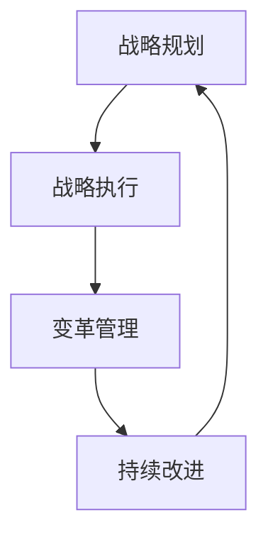
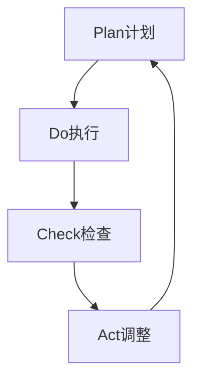

# 督促、跟踪和指导公司科技战略的执行，确保按照战略规划的方向前进，各项计划得到有效的落实

## 1. 背景介绍

### 1.1 问题的由来

在当今瞬息万变的商业环境中，拥有明确的科技战略规划对于企业的长期发展至关重要。然而，制定出行之有效的战略计划只是成功的一半,真正的挑战在于如何确保这些计划能够得到有效执行和落实。许多公司在制定科技战略时投入了大量的资源和精力,但往往在实施过程中遇到了重重障碍,导致计划无法顺利推进,最终目标难以实现。

### 1.2 研究现状

据统计,约有60%到80%的战略计划在执行过程中失败或者偏离了预期轨道。造成这一现象的原因有多方面,包括缺乏有效的监督机制、沟通不畅、资源分配不当、员工抵触变革等。一些研究表明,企业在战略执行过程中面临的主要挑战包括:

- 缺乏高层领导的支持和参与
- 组织结构和文化与战略目标不符
- 绩效考核体系与战略目标脱节
- 员工缺乏必要的技能和动力
- 沟通渠道不畅,信息传递不到位

### 1.3 研究意义

有效地督促、跟踪和指导公司科技战略的执行,确保战略规划能够真正落地,对于企业的长远发展至关重要。成功的战略执行不仅能够提高企业的竞争力和盈利能力,还能促进组织的持续学习和创新,为企业注入持久的活力。相反,如果战略执行失败,不仅会浪费大量的资源,还可能会导致企业陷入被动挨打的境地,错失发展机遇。

因此,研究如何有效地推动科技战略的执行,建立切实可行的监督、跟踪和指导机制,对于企业的可持续发展具有重大意义。本文将围绕这一主题,探讨相关的理论模型、实践经验和管理工具,为企业提供指导性建议。

### 1.4 本文结构

本文共分为八个部分:

1. 背景介绍
2. 核心概念与联系
3. 核心算法原理与具体操作步骤
4. 数学模型和公式详细讲解与举例说明
5. 项目实践:代码实例和详细解释说明
6. 实际应用场景
7. 工具和资源推荐
8. 总结:未来发展趋势与挑战

## 2. 核心概念与联系

在探讨如何有效执行科技战略之前,我们需要明确几个核心概念及其内在联系:

1. **战略规划(Strategic Planning)**:战略规划是指制定长期目标和行动方案的过程,以指导组织实现其愿景和使命。科技战略规划关注于利用技术来实现组织的战略目标,包括技术路线图、产品规划、研发投资等。

2. **战略执行(Strategy Execution)**:战略执行是指将战略规划转化为具体行动的过程,包括资源分配、组织结构调整、流程优化、绩效管理等各个环节。有效的战略执行需要整个组织的参与和协作。

3. **变革管理(Change Management)**:由于战略执行往往需要组织进行重大变革,因此变革管理是其中不可或缺的一个环节。变革管理旨在帮助组织顺利过渡到新的运作模式,包括文化建设、沟通策略、培训计划等。

4. **持续改进(Continuous Improvement)**:战略执行是一个持续的过程,需要不断评估和调整,以适应内外部环境的变化。持续改进有助于及时发现并解决执行过程中的问题,确保战略目标的实现。

这四个核心概念相互关联、环环相扣。战略规划为战略执行提供方向和目标,而战略执行则是实现规划的关键;变革管理为战略执行创造有利条件,持续改进则确保执行过程的动态优化。只有将这四个环节有机结合,才能真正做到督促、跟踪和指导科技战略的有效执行。

## 3. 核心算法原理与具体操作步骤

为了确保科技战略的有效执行,我们需要一套系统的算法和操作步骤。本节将介绍其核心原理和具体步骤。

### 3.1 算法原理概述

科技战略执行算法的核心原理可以概括为"PDCA循环"(Plan-Do-Check-Act),即:

1. **Plan(计划)**:制定战略规划,明确目标和行动方案。
2. **Do(执行)**:按照计划分配资源,组织实施。
3. **Check(检查)**:持续监测执行过程,评估绩效表现。
4. **Act(调整)**:根据检查结果,对计划和执行方式进行调整。

该算法强调战略执行是一个不断循环的过程,需要持续的计划、执行、检查和调整,以确保战略目标的实现。

### 3.2 算法步骤详解

基于上述原理,我们可以将科技战略执行算法具体分为以下八个步骤:

#### 步骤1:明确战略目标

首先需要明确科技战略的总体目标,这些目标应该与公司的愿景和使命相一致,并且要具体、可衡量、可实现、相关和有时限。

#### 步骤2:制定行动计划

根据战略目标,制定详细的行动计划,包括具体的任务、里程碑、资源需求、责任人等。行动计划应该涵盖战略执行的各个方面,如产品开发、技术路线图、基础设施建设等。

#### 步骤3:组建执行团队

组建一个跨部门的执行团队,确保各相关部门都参与其中。团队成员应该具备必要的技能和经验,并明确分工和职责。

#### 步骤4:分配资源

根据行动计划,合理分配人力、财力和其他必要资源,确保各项工作能够顺利开展。资源分配应该与战略目标相匹配,避免资源浪费或短缺。

#### 步骤5:实施和监控

执行团队开始按照计划实施各项行动,同时建立监控机制,持续跟踪执行进度和绩效表现。监控数据将为后续的调整决策提供依据。

#### 步骤6:沟通和培训

建立有效的沟通渠道,确保信息在整个组织内部流动顺畅。同时,根据需要开展相关培训,提升员工的技能和对变革的接受度。

#### 步骤7:绩效评估和反馈

定期评估执行过程中的绩效表现,包括关键绩效指标(KPI)的完成情况、遇到的挑战和问题等。并及时收集来自各方的反馈意见。

#### 步骤8:调整和持续改进

根据绩效评估和反馈结果,对战略目标、行动计划、资源分配等进行必要的调整和优化,形成持续改进的闭环。同时,总结经验教训,为下一轮战略执行做好准备。

### 3.3 算法优缺点

#### 优点:

1. **系统性**:该算法将战略执行过程系统化,确保各个环节有条不紊地推进。
2. **灵活性**:通过持续的监控、评估和调整,算法具有一定的灵活性,能够适应内外部环境的变化。
3. **全员参与**:算法强调了整个组织的参与和协作,有助于提高执行效率和员工的认同感。
4. **持续改进**:算法注重总结经验教训,为下一轮战略执行做好准备,实现组织的持续学习和进步。

#### 缺点:

1. **复杂性**:算法涉及多个步骤和环节,对管理者的协调能力有较高要求。
2. **资源需求**:实施该算法需要投入大量的人力、物力和财力资源,对于一些中小企业可能会造成一定压力。
3. **文化障碍**:一些组织由于固有的文化和惯性,可能会抵制变革,导致算法执行受阻。
4. **时间成本**:从制定计划到见效果需要一定的时间周期,短期内可能难以体现算法的优势。

### 3.4 算法应用领域

科技战略执行算法可以应用于各种规模和类型的企业,尤其适用于那些依赖技术创新的公司,如:

- 科技公司(软件、硬件、互联网等)
- 制造业(智能制造、工业4.0等)
- 金融业(金融科技等)
- 医疗健康(数字医疗等)
- 教育行业(在线教育等)
- 政府机构(智慧城市等)

无论是传统企业还是新兴公司,只要重视技术在战略发展中的作用,都可以考虑采用该算法来指导和推动科技战略的有效执行。

## 4. 数学模型和公式详细讲解与举例说明

为了更好地量化和优化科技战略执行过程,我们可以构建数学模型并推导相关公式。本节将详细介绍模型构建的过程、公式推导以及案例分析。

### 4.1 数学模型构建

我们将科技战略执行过程抽象为一个多阶段决策过程,目标是最大化战略目标的实现程度,同时最小化执行成本。

设战略执行过程共有 $n$ 个阶段,每个阶段 $i$ 有 $m_i$ 个可选的行动方案 $a_{i1}, a_{i2}, \ldots, a_{im_i}$。我们定义:

- $x_{ij}$ 为在第 $i$ 阶段选择行动方案 $a_{ij}$ 的决策变量,取值为0或1。
- $c_{ij}$ 为选择行动方案 $a_{ij}$ 所需的成本。
- $r_{ij}$ 为选择行动方案 $a_{ij}$ 对战略目标的贡献程度,取值在 $[0,1]$ 之间。

则数学模型可以表示为:

$$
\max \sum_{i=1}^{n}\sum_{j=1}^{m_i}r_{ij}x_{ij}
$$
$$
\text{s.t.} \quad \sum_{j=1}^{m_i}x_{ij}=1, \quad i=1,2,\ldots,n
$$
$$
\sum_{i=1}^{n}\sum_{j=1}^{m_i}c_{ij}x_{ij}\leq B
$$
$$
x_{ij}\in\{0,1\}, \quad i=1,2,\ldots,n, \quad j=1,2,\ldots,m_i
$$

其中第一个目标函数表示最大化战略目标的实现程度,第二个约束条件保证每个阶段只选择一个行动方案,第三个约束条件限制了总成本不超过预算 $B$,最后一个约束条件确保决策变量为0或1。

### 4.2 公式推导过程

为了求解上述数学模型,我们可以使用整数规划或者其他优化算法。这里我们给出一种基于动态规划的求解方法。

定义 $f(i,b)$ 为在前 $i$ 个阶段,且总成本不超过 $b$ 的情况下,能够实现的最大战略目标贡献程度。则我们有如下递推公式:

$$
f(i,b)=\max\limits_{1\leq j\leq m_i}\{f(i-1,b-c_{ij})+r_{ij}\}
$$

其中 $f(0,b)=0$,表示在没有任何行动的情况下,战略目标的实现程度为0。

通过上述递推公式,我们可以计算出 $f(n,B)$,即在总预算为 $B$ 的情况下,能够实现的最大战略目标贡献程度。同时,我们也可以回溯求解出最优的行动方案序列。

### 4.3 案例分析与讲解

为了更好地理解上述数学模型和公式,我们给出一个简单的案例进行分析。

假设一家科技公司希望执行一项新的产品战略,整个执行过程分为3个阶段:

1. 阶