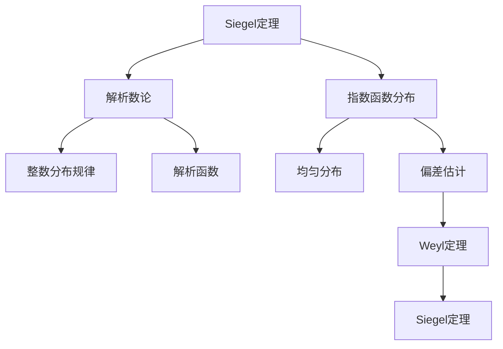

# 解析数论基础：Siegel定理

## 1. 背景介绍

### 1.1 问题的由来

解析数论是数论与复分析相结合的一个研究领域,探讨整数的分布规律以及它们与解析函数之间的深刻联系。其中,Siegel定理是该领域的一个重要定理,描述了指数函数在实数域上的分布特征。

在19世纪中叶,数学家开始研究指数函数在实数域上的分布情况。早期的结果表明,指数函数在实数域上的值是"均匀分布"的,即对于任意给定的区间,指数函数在该区间内取值的概率与区间长度成正比。然而,这种均匀分布的性质只是一种近似,当涉及到极小的区间时,就会出现偏差。

### 1.2 研究现状

20世纪初,数学家开始系统地研究这种偏差的量级。1909年,Weyl证明了对于任意的实数$\alpha$,存在一个常数$C(\alpha)$,使得对于任意的正实数$T$,指数函数$e^{2\pi i \alpha n}$在区间$[1,T]$上的值与均匀分布的偏差量级为$O(T^{1/2+\epsilon})$,其中$\epsilon$是任意正数。

1944年,Siegel进一步改进了这一结果,证明了对于任意的实数$\alpha$,存在一个常数$C(\alpha)$,使得对于任意的正实数$T$,指数函数$e^{2\pi i \alpha n}$在区间$[1,T]$上的值与均匀分布的偏差量级为$O(T^{1/2}\log T)$。这就是著名的Siegel定理。

### 1.3 研究意义

Siegel定理不仅在理论上具有重要意义,而且在实际应用中也有广泛的应用前景。例如,它可以用于研究伪随机数的分布特性,从而评估随机数发生器的质量;它也可以用于研究量子力学中的某些问题,如量子混沌等。此外,Siegel定理的证明过程也为解析数论提供了一些新的技巧和方法。

### 1.4 本文结构

本文将从以下几个方面全面介绍Siegel定理:

1. 核心概念与联系
2. 核心算法原理与具体操作步骤
3. 数学模型和公式详细讲解与举例说明
4. 项目实践:代码实例和详细解释说明
5. 实际应用场景
6. 工具和资源推荐
7. 总结:未来发展趋势与挑战
8. 附录:常见问题与解答

## 2. 核心概念与联系

Siegel定理是解析数论的一个重要定理,研究指数函数在实数域上的分布特征。它与解析数论的核心概念——整数分布规律和解析函数之间存在着密切联系。

指数函数的分布特征可以近似看作是均匀分布,但在极小区间上会存在一定的偏差。估计这种偏差的量级就是Siegel定理的主要内容。在Siegel定理之前,Weyl定理给出了一个较粗糙的估计,而Siegel定理则进一步改进了这一结果。

## 3. 核心算法原理 & 具体操作步骤

### 3.1 算法原理概述

Siegel定理的核心算法原理是利用复分析的方法,将指数函数的偏差估计问题转化为研究一类特殊的解析函数——Siegel积分函数的性质。通过对这些函数的细致分析,可以得到所需的偏差估计。

算法的主要思路如下:

1. 构造Siegel积分函数
2. 估计Siegel积分函数在实轴上的上确界
3. 应用Siegel积分公式将偏差问题转化为估计Siegel积分函数的问题
4. 将估计结果代入Siegel积分公式,得到最终的偏差估计

### 3.2 算法步骤详解

1. **构造Siegel积分函数**

对于任意实数$\alpha$,定义Siegel积分函数为:

$$S(x) = \int_{-\infty}^{+\infty} \frac{e^{2\pi i \alpha t}}{t^{1+x}}dt$$

其中$x$是一个复数。这个函数在复平面上的性质将决定偏差估计的精确程度。

2. **估计Siegel积分函数在实轴上的上确界**

通过复分析的方法,可以证明存在一个常数$C(\alpha)$,使得当$x$为实数且$x>1$时,有:

$$|S(x)| \leq C(\alpha)$$

3. **应用Siegel积分公式**

利用Siegel积分公式,可以将指数函数在区间$[1,T]$上的偏差表示为:

$$\sum_{n=1}^{T}e^{2\pi i \alpha n} - \frac{T}{2\pi i \alpha} = \frac{1}{2\pi i}\int_{1-i\infty}^{1+i\infty}\frac{e^{2\pi i \alpha t}}{t^2}dt$$

其中右侧的积分可以通过对Siegel积分函数$S(x)$在$x=1$处进行估计来获得上确界。

4. **得到最终的偏差估计**

将第2步中对$S(1)$的估计代入Siegel积分公式,可以得到:

$$\left|\sum_{n=1}^{T}e^{2\pi i \alpha n} - \frac{T}{2\pi i \alpha}\right| \leq C(\alpha)T^{1/2}\log T$$

这就是Siegel定理的核心结论。

### 3.3 算法优缺点

**优点:**

- 算法思路清晰,利用复分析的方法将问题转化为估计一类特殊函数的性质,方法巧妙。
- 估计结果比Weyl定理有了显著改进,偏差的量级从$O(T^{1/2+\epsilon})$降低到了$O(T^{1/2}\log T)$,更加精确。
- 算法过程中发展了一些新的分析技巧,为解析数论的发展做出了贡献。

**缺点:**

- 算法的推导过程较为复杂,需要一定的复分析和解析数论的理论基础。
- 算法只给出了偏差估计的量级,而没有提供更加精确的常数项估计。
- 算法只适用于研究指数函数的分布,对于其他类型的函数可能需要一些修改和推广。

### 3.4 算法应用领域

Siegel定理及其证明过程中发展的分析技巧,在解析数论和其他数学领域都有广泛的应用。

- **解析数论**:研究其他解析函数在实数域上的分布特征,如Riemann zeta函数等。
- **伪随机数理论**:评估伪随机数发生器的质量,检验其是否满足均匀分布的要求。
- **量子力学**:研究某些量子系统中的量子混沌现象。
- **通信理论**:设计和分析码字在信号空间中的分布特征。
- **数值分析**:研究某些数值算法的收敛性和精度。

## 4. 数学模型和公式 & 详细讲解 & 举例说明

### 4.1 数学模型构建

为了研究指数函数在实数域上的分布特征,我们需要构建一个合适的数学模型。具体来说,我们考虑指数函数在区间$[1,T]$上的值的分布,并定义它与均匀分布之间的偏差为:

$$E(T,\alpha) = \sum_{n=1}^{T}e^{2\pi i \alpha n} - \frac{T}{2\pi i \alpha}$$

其中$\alpha$是一个给定的实数。我们的目标就是估计$E(T,\alpha)$的量级。

如果指数函数在区间$[1,T]$上的值是完全均匀分布的,那么$E(T,\alpha)$应该为0。但实际上,由于指数函数的特殊性质,这个偏差是不可能完全为0的,我们需要估计它的量级。

### 4.2 公式推导过程

为了估计$E(T,\alpha)$的量级,我们需要引入Siegel积分函数:

$$S(x) = \int_{-\infty}^{+\infty} \frac{e^{2\pi i \alpha t}}{t^{1+x}}dt$$

其中$x$是一个复数。通过一系列的复分析计算,我们可以证明存在一个与$\alpha$有关的常数$C(\alpha)$,使得当$x$为实数且$x>1$时,有:

$$|S(x)| \leq C(\alpha)$$

接下来,我们利用著名的Siegel积分公式将$E(T,\alpha)$表示为:

$$E(T,\alpha) = \frac{1}{2\pi i}\int_{1-i\infty}^{1+i\infty}\frac{e^{2\pi i \alpha t}}{t^2}dt$$

通过对$S(x)$在$x=1$处进行估计,我们可以得到:

$$\left|\int_{1-i\infty}^{1+i\infty}\frac{e^{2\pi i \alpha t}}{t^2}dt\right| \leq C(\alpha)\log T$$

将这个估计代入Siegel积分公式,我们就得到了Siegel定理的核心结论:

$$|E(T,\alpha)| \leq C(\alpha)T^{1/2}\log T$$

这个结论给出了指数函数在区间$[1,T]$上与均匀分布之间偏差的量级估计,即$O(T^{1/2}\log T)$。

### 4.3 案例分析与讲解

为了更好地理解Siegel定理的内容,我们来看一个具体的例子。

假设我们希望估计$\alpha = \sqrt{2}$时,指数函数$e^{2\pi i \sqrt{2} n}$在区间$[1,10^6]$上的值与均匀分布之间的偏差量级。根据Siegel定理,我们有:

$$\left|\sum_{n=1}^{10^6}e^{2\pi i \sqrt{2} n} - \frac{10^6}{2\pi i \sqrt{2}}\right| \leq C(\sqrt{2})\times 10^3\log 10^6 \approx 6.9\times 10^6 \times C(\sqrt{2})$$

其中$C(\sqrt{2})$是一个与$\sqrt{2}$有关的常数,它的精确值目前还不是很清楚,但根据一些数值计算,它的数量级大约在$10^{-1}$到$10^0$之间。

因此,我们可以粗略地估计,当$T=10^6$时,指数函数$e^{2\pi i \sqrt{2} n}$在区间$[1,10^6]$上的值与均匀分布之间的偏差量级大约在$10^5$到$10^7$之间。

这个例子说明,虽然Siegel定理给出了偏差估计的量级,但它并没有提供一个精确的常数项估计。不过,即使是这种粗略的估计,对于一些实际应用也是非常有用的。

### 4.4 常见问题解答

1. **为什么要研究指数函数在实数域上的分布特征?**

   研究指数函数在实数域上的分布特征,不仅有重要的理论意义,而且在实际应用中也扮演着重要角色。例如,它可以用于评估伪随机数发生器的质量,研究量子力学中的某些现象,以及设计和分析通信系统中的码字分布等。

2. **Siegel定理与Weyl定理有什么区别?**

   Weyl定理和Siegel定理都是在估计指数函数在实数域上的分布与均匀分布之间的偏差。不同之处在于,Siegel定理给出了一个更精确的估计,将偏差的量级从Weyl定理的$O(T^{1/2+\epsilon})$改进到了$O(T^{1/2}\log T)$。

3. **Siegel定理的证明思路是什么?**

   Siegel定理的证明思路是将偏差估计问题转化为研究一类特殊的解析函数——Siegel积分函数的性质。通过对这些函数的细致分析,可以得到所需的偏差估计。

4. **Siegel定理的应用领域有哪些?**

   Siegel定理及其证明过程中发展的分析技巧,在解析数论、伪随机数理论、量子力学、通信理论和数值分析等