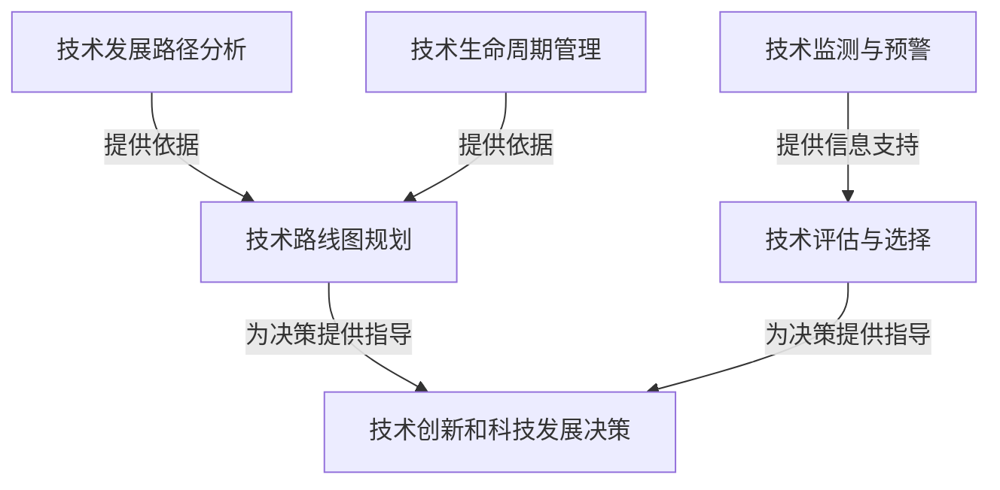

# 跟踪研究和分析科技行业的发展趋势，为公司在技术创新和科技发展方面的决策提供支持

## 1. 背景介绍

### 1.1 问题的由来

在当今快节奏的商业环境中，科技创新是推动企业发展的关键驱动力。科技行业的发展日新月异，新兴技术层出不穷，给企业带来了前所未有的机遇与挑战。企业需要时刻关注科技行业的最新动态,洞察未来发展趋势,从而做出明智的技术创新决策,保持竞争优势。

然而,科技行业的发展复杂多变,涉及诸多领域,需要企业具备专业的技术视野和前瞻性思维。单凭企业内部有限的技术资源,很难全面把握行业发展脉络。因此,企业迫切需要一个系统化的方法,持续跟踪研究和分析科技行业的发展趋势,为技术创新和科技发展决策提供支持。

### 1.2 研究现状

目前,已有一些研究机构和咨询公司针对科技行业进行了一些研究和分析,但大多数研究存在以下不足:

1. 研究范围狭窄,侧重于特定领域,缺乏全面性。
2. 分析视角单一,缺乏多维度的综合考虑。
3. 研究成果更多停留在宏观层面,缺乏对具体技术的深入解读。
4. 研究周期较长,难以及时捕捉行业最新动态。

因此,亟需一种系统化、全面化、多维度且高效的方法,持续跟踪和深入分析科技行业的发展趋势,为企业提供及时、准确的决策支持。

### 1.3 研究意义

建立一个有效的科技行业发展趋势研究与分析体系,对于企业的技术创新和科技发展决策具有重要意义:

1. 帮助企业提前识别新兴技术,抢占先机,获取先发优势。
2. 支持企业评估技术发展前景,优化技术投资决策。
3. 指导企业制定技术路线图,明确技术发展方向。
4. 促进企业与行业前沿技术接轨,保持竞争力。
5. 为企业的战略规划提供科技发展视角的参考。

### 1.4 本文结构

本文将提出一种系统化的方法,用于跟踪研究和分析科技行业的发展趋势。文章首先阐述核心概念及其关联,然后详细介绍核心算法原理和具体操作步骤。接下来,构建数学模型并推导公式,辅以案例分析加深理解。之后,通过项目实践展示代码实现,并对实际应用场景进行探讨。最后,提供学习资源和工具推荐,总结研究成果并展望未来发展趋势和挑战。

## 2. 核心概念与联系

要全面跟踪和分析科技行业的发展趋势,需要涉及以下几个核心概念:

1. **技术发展路径分析(Technology Development Path Analysis)**:通过对技术发展历程的系统分析,识别技术发展的关键节点和演进规律,预测未来可能的发展方向。

2. **技术生命周期管理(Technology Lifecycle Management)**:将技术的发展阶段划分为引入期、成长期、成熟期和衰退期,评估技术所处的生命周期阶段,制定相应的技术战略。

3. **技术路线图规划(Technology Roadmapping)**:基于对技术发展趋势的预判,为企业制定中长期的技术发展路线图,明确技术发展的重点领域和时间节点。

4. **技术监测与预警(Technology Monitoring and Early Warning)**:持续关注科技前沿领域的最新进展,及时发现新兴技术和颠覆性创新,为企业提供预警,防止被动落后。

5. **技术评估与选择(Technology Assessment and Selection)**:根据企业的战略目标和资源条件,对备选技术进行全面评估,选择最佳的技术方案。

这些核心概念相互关联、环环相扣,共同构成了一个完整的科技行业发展趋势研究与分析体系。其中,技术发展路径分析和技术生命周期管理为技术路线图规划提供依据;技术监测与预警为技术评估与选择提供信息支持;而技术路线图规划和技术评估与选择则为企业的技术创新和科技发展决策提供直接指导。

## 3. 核心算法原理 & 具体操作步骤

### 3.1 算法原理概述

为了有效跟踪和分析科技行业的发展趋势,我们提出了一种基于数据驱动的算法框架,它包括以下几个主要模块:

1. **数据采集模块**:从多个渠道(如专利数据库、学术期刊、技术博客等)采集与科技发展相关的结构化和非结构化数据。

2. **数据预处理模块**:对采集的原始数据进行清洗、整合和标准化,为后续分析做好准备。

3. **特征提取模块**:利用自然语言处理(NLP)和机器学习(ML)技术,从预处理后的数据中提取关键特征,如技术主题、发展阶段、重要实体等。

4. **趋势分析模块**:基于提取的特征,应用时间序列分析、聚类分析等方法,发现技术发展的趋势和模式。

5. **可视化模块**:将分析结果以直观的形式呈现,如技术路线图、发展趋势图、热点领域等。

6. **决策支持模块**:根据分析结果,结合企业的战略目标和资源条件,为技术创新和科技发展决策提供建议。

该算法框架的核心思想是利用大数据和人工智能技术,从海量的异构数据中自动挖掘科技发展的关键信息,实现对科技行业发展趋势的智能化分析和决策支持。

### 3.2 算法步骤详解

1. **数据采集**

   从多个渠道采集与科技发展相关的结构化和非结构化数据,包括:
   - 专利数据库(如Google专利、美国专利商标局等)
   - 学术期刊(如IEEE Xplore、ACM Digital Library等)
   - 技术博客和新闻媒体
   - 政府和行业报告
   - 企业技术白皮书
   - 社交媒体等

2. **数据预处理**

   对采集的原始数据进行以下预处理操作:
   - 数据清洗:去除重复、错误和缺失数据
   - 数据整合:将来自不同渠道的数据整合到同一格式
   - 数据标准化:对数据进行归一化和标准化处理

3. **特征提取**

   利用NLP和ML技术从预处理后的数据中提取关键特征:
   - 主题提取:使用主题建模算法(如LDA)提取技术主题
   - 实体识别:识别出技术名称、公司、人名等重要实体
   - 发展阶段识别:根据上下文信息判断技术所处的发展阶段
   - 情感分析:分析数据中对技术的正面或负面情绪

4. **趋势分析**

   基于提取的特征,应用以下分析方法发现技术发展的趋势和模式:
   - 时间序列分析:分析技术主题、实体等随时间的变化趋势
   - 聚类分析:根据相似性将技术进行聚类,发现技术群落
   - 关联规则挖掘:发现不同技术主题、实体之间的关联模式
   - 异常检测:发现技术发展的突变点和异常情况

5. **可视化呈现**

   将分析结果以直观的形式呈现,如:
   - 技术路线图:展示技术的发展路径和重要节点
   - 发展趋势图:呈现技术主题、实体等的发展趋势
   - 技术热点地图:显示当前和未来的技术热点领域
   - 技术生命周期曲线:描绘技术所处的生命周期阶段

6. **决策支持**

   根据分析结果,结合企业的战略目标和资源条件,为技术创新和科技发展决策提供以下支持:
   - 技术选择建议:评估备选技术,推荐最佳方案
   - 技术投资策略:对技术的投资时机和强度提出建议
   - 技术路线图规划:制定企业中长期的技术发展路线图
   - 风险预警:提醒潜在的技术风险和替代威胁

### 3.3 算法优缺点

**优点**:

1. 数据驱动:利用大数据和人工智能技术,实现对科技发展趋势的自动化分析。
2. 全面性:融合多源异构数据,提供全景视角。
3. 前瞻性:能够及时发现新兴技术和颠覆性创新。
4. 高效性:自动化流程,大幅提高分析效率。
5. 可解释性:分析结果直观,易于理解和决策。

**缺点**:

1. 数据质量依赖:分析结果的准确性取决于输入数据的质量和覆盖面。
2. 算法偏差:机器学习算法可能存在一定的偏差和局限性。
3. 领域知识缺失:纯粹基于数据的分析可能难以捕捉领域专家的洞见。
4. 隐私和安全风险:处理大量数据可能存在隐私和安全风险。

### 3.4 算法应用领域

该算法框架可广泛应用于以下领域,为技术创新和科技发展决策提供支持:

- 企业技术战略规划
- 政府科技政策制定
- 风险投资和技术投资
- 产品研发和技术路线图规划
- 学术研究和技术预测
- 专利布局和技术竞争情报分析
- ...

## 4. 数学模型和公式 & 详细讲解 & 举例说明

### 4.1 数学模型构建

在趋势分析模块中,我们将构建数学模型来量化描述技术发展的趋势和规律。具体来说,我们将采用**LogisticGrowth曲线模型**来拟合技术的生命周期,并使用**Bass扩散模型**来描述技术的采用扩散过程。

#### 4.1.1 LogisticGrowth曲线模型

LogisticGrowth曲线模型常用于描述一个系统或过程的增长趋势,它的数学表达式如下:

$$
N(t) = \frac{K}{1 + e^{-r(t-t_m)}}
$$

其中:
- $N(t)$表示时间$t$时的数量或规模
- $K$表示上限或饱和值
- $r$表示增长率
- $t_m$表示曲线的中点时间

该模型可以很好地描述技术的生命周期,包括引入期、成长期、成熟期和衰退期。我们将利用历史数据对模型进行参数拟合,从而预测技术未来的发展趋势。

#### 4.1.2 Bass扩散模型

Bass扩散模型常用于描述新产品或新技术在市场中的采用扩散过程,它的数学表达式如下:

$$
N(t) = m \left[ \frac{1 - e^{-(p+q)t}}{1 + \frac{q}{p}e^{-(p+q)t}} \right]
$$

其中:
- $N(t)$表示时间$t$时的采用者数量
- $m$表示潜在采用者的总数
- $p$表示创新系数,反映了采用者对新事物的内在趋势
- $q$表示模仿系数,反映了采用者受他人影响的程度

通过对历史数据进行参数拟合,我们可以预测技术在未来的采用扩散情况,为企业提供技术推广和市场策略的建议。

### 4.2 公式推导过程

#### 4.2.1 LogisticGrowth曲线模型推导

LogisticGrowth曲线模型源自生物学领域,最初用于描述种群增长。我们假设种群的增长速率与当前种群数量成正比,同时也与