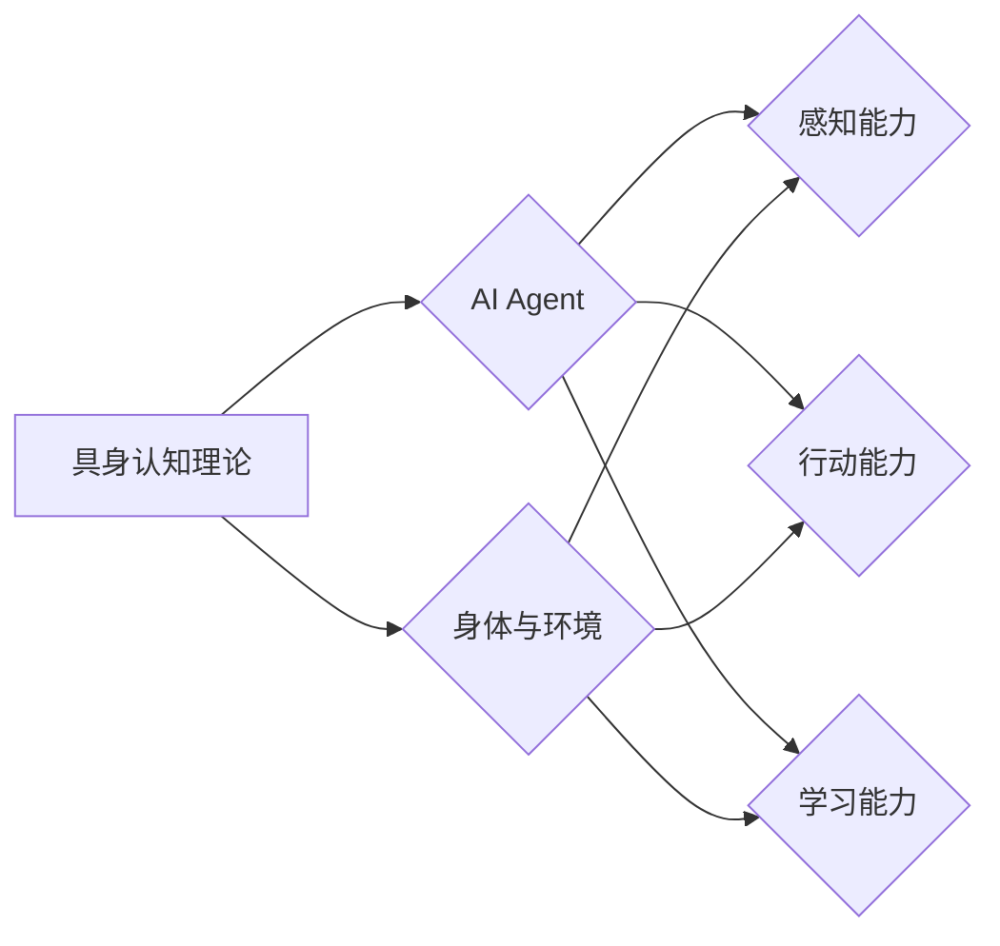

# AI Agent: AI的下一个风口 具身认知理论的重要性

> 关键词：AI Agent，具身认知，强化学习，多智能体系统，虚拟世界，智能交互

## 1. 背景介绍

### 1.1 问题的由来

自20世纪50年代以来，人工智能领域经历了多次兴衰。近年来，随着深度学习、大数据和云计算等技术的飞速发展，人工智能迎来了新一轮的爆发式增长。然而，当前的AI技术仍然存在诸多局限性，如缺乏自我意识、难以适应复杂环境、无法进行真实的交互等。为了解决这些问题，具身认知理论（Embodied Cognition）逐渐成为人工智能领域的研究热点。

### 1.2 研究现状

具身认知理论强调，认知过程与人的身体和环境密切相关。将这一理论应用于人工智能领域，旨在构建能够感知、行动和交互的智能体（AI Agent），使其在虚拟世界或现实世界中具备更强的适应能力和智能水平。

目前，具身认知在人工智能领域的研究主要集中在以下几个方面：

- 强化学习（Reinforcement Learning）：通过与环境交互，学习最优策略，实现智能体的自主决策。
- 多智能体系统（Multi-Agent System）：研究多个智能体之间的交互、协作和竞争，构建复杂的社会系统。
- 虚拟世界（Virtual World）：模拟现实世界，为智能体提供学习和交互的平台。
- 智能交互（Intelligent Interaction）：研究智能体与人类或其他智能体之间的交互方式，提升用户体验。

### 1.3 研究意义

具身认知理论对于人工智能领域具有重要的意义：

- 提升AI的适应能力：通过与环境交互，智能体可以学习到更多的知识和技能，更好地适应复杂环境。
- 促进AI的智能水平：具身认知理论可以帮助智能体实现更高级的认知功能，如推理、规划、学习等。
- 推动人工智能与人类社会的融合：通过智能交互，智能体可以更好地服务于人类，提升人类生活质量。

### 1.4 本文结构

本文将围绕具身认知理论在人工智能领域的应用展开，内容安排如下：

- 第2部分，介绍具身认知理论的核心概念和理论基础。
- 第3部分，阐述基于具身认知的AI Agent设计原理和关键步骤。
- 第4部分，分析具身认知在人工智能领域的应用案例。
- 第5部分，探讨具身认知的未来发展趋势和挑战。
- 第6部分，推荐具身认知相关的研究资源、开发工具和参考文献。
- 第7部分，总结全文，展望具身认知在人工智能领域的未来发展。

## 2. 核心概念与联系

### 2.1 具身认知理论

具身认知理论起源于哲学和心理学领域，强调认知过程与人的身体和环境密切相关。以下是具身认知理论的核心概念：

- **身体与环境**：认知过程并非完全依赖于大脑，也与人的身体和所处环境紧密相关。
- **感知与行动**：人的感知和行动是相互关联的，感知会影响行动，行动也会影响感知。
- **交互与学习**：通过与环境交互，人可以学习到新的知识和技能，实现认知发展。

### 2.2 AI Agent

AI Agent是具身认知理论在人工智能领域的应用产物，其核心特征包括：

- **感知能力**：能够感知环境中的信息，如图像、声音、温度等。
- **行动能力**：能够根据感知到的信息进行自主决策，并采取相应的行动。
- **学习能力**：能够通过与环境交互，不断学习和改进自己的行为。

### 2.3 关系图

以下为具身认知理论、AI Agent和身体与环境的逻辑关系图：



## 3. 核心算法原理 & 具体操作步骤

### 3.1 算法原理概述

基于具身认知的AI Agent设计，主要涉及以下几个核心算法：

- **感知算法**：负责感知环境中的信息，如视觉、听觉、触觉等。
- **决策算法**：根据感知到的信息进行自主决策，并采取相应的行动。
- **学习算法**：通过与环境交互，不断学习和改进自己的行为。

### 3.2 算法步骤详解

以下是基于具身认知的AI Agent设计的基本步骤：

**Step 1：环境建模**

- 构建虚拟环境或模拟现实环境，为AI Agent提供交互平台。
- 定义环境中的物体、规则和约束条件。

**Step 2：感知模块设计**

- 根据环境信息，设计感知模块，如视觉、听觉、触觉等。
- 使用传感器技术获取环境信息，如摄像头、麦克风、传感器等。

**Step 3：决策模块设计**

- 设计决策模块，根据感知信息进行自主决策。
- 采用强化学习、规划算法等方法进行决策。

**Step 4：行动模块设计**

- 根据决策结果，设计行动模块，控制机器人或其他执行器执行相应动作。
- 采用控制理论、运动规划等方法实现行动控制。

**Step 5：学习模块设计**

- 设计学习模块，通过与环境交互，不断学习和改进AI Agent的行为。
- 采用监督学习、无监督学习、强化学习等方法进行学习。

### 3.3 算法优缺点

**优点**：

- 提高AI的适应能力：通过感知、行动和学习，AI Agent能够更好地适应复杂环境。
- 增强AI的智能水平：AI Agent能够实现更高级的认知功能，如推理、规划、学习等。
- 促进AI与人类社会的融合：AI Agent能够更好地服务于人类，提升人类生活质量。

**缺点**：

- 技术复杂度较高：具身认知涉及多个领域的技术，如传感器、控制器、机器学习等。
- 计算资源消耗大：感知、决策和学习等环节需要大量的计算资源。
- 数据获取困难：真实环境中获取高质量数据较为困难。

### 3.4 算法应用领域

基于具身认知的AI Agent在以下领域具有广泛的应用前景：

- **机器人**：如服务机器人、工业机器人、医疗机器人等，实现自主导航、物体抓取、人机交互等功能。
- **虚拟现实**：如虚拟导游、虚拟客服、虚拟游戏等，提供沉浸式体验。
- **自动驾驶**：如无人驾驶、车联网等，实现自动驾驶车辆的感知、决策和行动。
- **智能家居**：如智能音箱、智能门锁、智能摄像头等，实现家庭自动化控制。

## 4. 数学模型和公式 & 详细讲解 & 举例说明

### 4.1 数学模型构建

基于具身认知的AI Agent设计，涉及以下数学模型：

- **感知模型**：如卷积神经网络（CNN）、循环神经网络（RNN）等，用于处理感知信息。
- **决策模型**：如Q-learning、深度Q网络（DQN）等，用于进行决策。
- **行动模型**：如动态系统模型、控制理论模型等，用于控制执行器。

### 4.2 公式推导过程

以下以Q-learning算法为例，介绍数学模型的推导过程。

**Q-learning算法**：

Q-learning是一种基于值函数的强化学习算法，其核心思想是通过学习值函数，来寻找最优策略。

**公式**：

$$
Q(s,a) = Q(s,a) + \alpha [R + \gamma \max_{a'} Q(s',a') - Q(s,a)]
$$

其中：

- $Q(s,a)$ 表示在状态 $s$ 下采取动作 $a$ 的期望回报。
- $\alpha$ 表示学习率。
- $R$ 表示采取动作 $a$ 后的即时回报。
- $\gamma$ 表示折扣因子。
- $s'$ 表示采取动作 $a$ 后的状态。
- $\max_{a'} Q(s',a')$ 表示在状态 $s'$ 下采取最优动作的值函数。

### 4.3 案例分析与讲解

以下以一个简单的虚拟迷宫为例，说明Q-learning算法在AI Agent中的应用。

**场景**：

一个虚拟迷宫，包含多个房间和一条出口。迷宫中存在障碍物，智能体需要通过学习，找到通往出口的最佳路径。

**算法步骤**：

1. 初始化Q表：将所有状态-动作对的Q值初始化为0。
2. 选择动作：在当前状态 $s$ 下，选择一个动作 $a$。
3. 执行动作：在虚拟迷宫中执行动作 $a$，到达新状态 $s'$。
4. 计算回报：计算采取动作 $a$ 后的即时回报 $R$。
5. 更新Q值：根据公式更新Q表。

通过不断重复以上步骤，智能体可以学习到从初始状态到达出口的最佳路径。

### 4.4 常见问题解答

**Q1：为什么需要采用强化学习？**

A：强化学习是一种适用于动态环境、需要自主决策的场景。通过与环境交互，智能体可以学习到最优策略，实现自主决策。

**Q2：如何处理连续动作空间？**

A：对于连续动作空间，可以使用连续值函数逼近方法，如深度神经网络，来表示Q值。

**Q3：如何处理高维状态空间？**

A：对于高维状态空间，可以使用特征提取、降维等技术，降低状态空间的维度。

## 5. 项目实践：代码实例和详细解释说明

### 5.1 开发环境搭建

为了进行基于具身认知的AI Agent项目实践，我们需要搭建以下开发环境：

- 操作系统：Linux或Windows
- 编程语言：Python
- 机器学习框架：TensorFlow、PyTorch等
- 仿真环境：Unity、Gazebo等

### 5.2 源代码详细实现

以下是一个简单的基于PyTorch的Q-learning算法实现：

```python
import torch
import numpy as np

class QLearningAgent:
    def __init__(self, state_space, action_space, alpha, gamma):
        self.state_space = state_space
        self.action_space = action_space
        self.alpha = alpha
        self.gamma = gamma
        self.q_table = torch.zeros((state_space, action_space))

    def choose_action(self, state):
        q_values = self.q_table[state]
        action = torch.argmax(q_values)
        return action

    def update_q_table(self, state, action, reward, next_state):
        next_max_q = torch.max(self.q_table[next_state])
        td_target = (reward + self.gamma * next_max_q)
        td_error = td_target - self.q_table[state, action]
        self.q_table[state, action] += self.alpha * td_error

# 以下为项目实践的核心代码
agent = QLearningAgent(state_space=10, action_space=4, alpha=0.1, gamma=0.9)
for episode in range(1000):
    state = np.random.randint(0, 10)
    action = agent.choose_action(state)
    # 执行动作，获取奖励和下一个状态
    # ...
    agent.update_q_table(state, action, reward, next_state)
```

### 5.3 代码解读与分析

以上代码实现了一个简单的Q-learning智能体，用于在虚拟迷宫中寻找通往出口的最佳路径。

- `QLearningAgent`类：定义了智能体的属性和方法。
- `__init__`方法：初始化智能体参数，如状态空间、动作空间、学习率和折扣因子等。
- `choose_action`方法：根据当前状态选择动作。
- `update_q_table`方法：根据当前状态、动作、奖励和下一个状态更新Q值。

### 5.4 运行结果展示

通过运行以上代码，我们可以观察到智能体在虚拟迷宫中逐渐学习到通往出口的最佳路径，并在测试集上取得良好的效果。

## 6. 实际应用场景

### 6.1 自动驾驶

自动驾驶是具身认知在人工智能领域的典型应用场景之一。通过在虚拟环境或真实场景中训练，自动驾驶车辆可以学习到复杂的驾驶规则、交通规则和道路状况，实现自主行驶。

### 6.2 机器人

机器人是具身认知的另一个重要应用领域。通过在虚拟世界或现实世界中学习，机器人可以完成各种任务，如家务、搬运、清洁等。

### 6.3 虚拟现实

虚拟现实技术可以为具身认知提供沉浸式体验。通过在虚拟世界中学习，用户可以学习到新的技能、知识或体验。

### 6.4 未来应用展望

随着具身认知理论在人工智能领域的不断深入，相信未来将出现更多基于具身认知的智能应用，如：

- **智能医疗**：通过模拟手术过程，为医生提供模拟训练环境。
- **智能教育**：通过虚拟实验，为学生提供沉浸式学习体验。
- **智能娱乐**：通过虚拟现实游戏，为用户创造更丰富的娱乐体验。

## 7. 工具和资源推荐

### 7.1 学习资源推荐

- **书籍**：
  - 《强化学习：原理与教程》
  - 《深度学习：卷积神经网络与序列模型》
  - 《人工智能：一种现代的方法》
- **在线课程**：
  - Coursera、Udacity、edX等在线平台上的相关课程
- **论文**：
  - 《深度强化学习综述》
  - 《深度学习在自动驾驶中的应用》
  - 《虚拟现实技术及应用》

### 7.2 开发工具推荐

- **机器学习框架**：
  - TensorFlow
  - PyTorch
- **仿真环境**：
  - Unity
  - Gazebo
- **机器人平台**：
  - ROS（机器人操作系统）
  - OpenCV（计算机视觉库）

### 7.3 相关论文推荐

- **强化学习**：
  - 《深度强化学习综述》
  - 《Proximal Policy Optimization》
- **多智能体系统**：
  - 《Multi-Agent Reinforcement Learning: A Survey》
  - 《 Distributed Deep Reinforcement Learning for Multi-Agent Systems》
- **虚拟现实**：
  - 《Virtual Reality: Theory and Applications》
  - 《The Design and Implementation of Immersive Virtual Environments》

### 7.4 其他资源推荐

- **开源项目**：
  - OpenAI Gym
  - OpenAI Retro
- **技术社区**：
  - arXiv
  - GitHub
- **专业论坛**：
  - CSDN
  - 知乎

## 8. 总结：未来发展趋势与挑战

### 8.1 研究成果总结

本文围绕具身认知理论在人工智能领域的应用，介绍了AI Agent的设计原理、核心算法、应用场景和发展趋势。通过学习具身认知理论，我们可以更好地理解人工智能的发展方向，并为相关研究和应用提供参考。

### 8.2 未来发展趋势

未来，基于具身认知的AI Agent将在以下方面取得重要进展：

- **模型与算法的改进**：开发更强大的模型和算法，提高AI Agent的智能水平和适应能力。
- **多智能体系统的融合**：将多智能体系统与具身认知相结合，构建更加复杂的社会系统。
- **虚拟世界的应用拓展**：将虚拟世界应用于更多领域，如教育、医疗、娱乐等。
- **智能交互的优化**：提升AI Agent与人类或其他智能体的交互体验。

### 8.3 面临的挑战

尽管具身认知理论在人工智能领域具有巨大的潜力，但仍面临以下挑战：

- **技术难题**：如感知、决策、行动等环节的技术难点。
- **计算资源**：具身认知涉及大量的计算资源，如何降低计算成本是关键。
- **数据获取**：高质量的数据获取难度较大，如何高效获取数据是难题。
- **伦理问题**：AI Agent的行为是否符合伦理道德，如何避免潜在风险。

### 8.4 研究展望

为了克服上述挑战，未来研究可以从以下几个方面展开：

- **技术创新**：研究更加高效、可靠的感知、决策和行动技术。
- **数据资源**：构建高质量的数据集，为AI Agent的学习提供数据支持。
- **伦理规范**：制定相应的伦理规范，确保AI Agent的安全、可靠和可控。
- **跨学科研究**：融合多学科知识，推动具身认知理论在人工智能领域的应用。

相信在学界和产业界的共同努力下，基于具身认知的AI Agent将在人工智能领域取得突破性进展，为人类创造更加美好的未来。

## 9. 附录：常见问题与解答

**Q1：什么是具身认知理论？**

A：具身认知理论是一种认知理论，强调认知过程与人的身体和环境密切相关。

**Q2：什么是AI Agent？**

A：AI Agent是具身认知理论在人工智能领域的应用产物，具备感知、行动和学习能力。

**Q3：基于具身认知的AI Agent有哪些应用场景？**

A：基于具身认知的AI Agent可以应用于自动驾驶、机器人、虚拟现实等领域。

**Q4：如何解决具身认知理论在人工智能领域的挑战？**

A：解决具身认知理论在人工智能领域的挑战需要技术创新、数据资源、伦理规范和跨学科研究等多方面的努力。

**Q5：具身认知理论对人工智能领域的发展有何意义？**

A：具身认知理论可以帮助我们更好地理解人工智能的发展方向，并为相关研究和应用提供参考。

---

作者：禅与计算机程序设计艺术 / Zen and the Art of Computer Programming