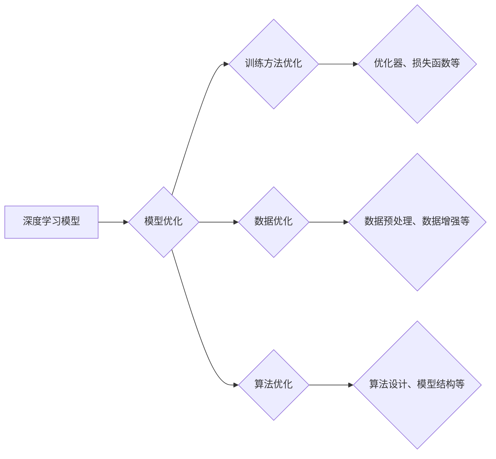

# AI模型优化原理与代码实战案例讲解

作者：禅与计算机程序设计艺术 / Zen and the Art of Computer Programming

## 1. 背景介绍

### 1.1 问题的由来

随着人工智能技术的飞速发展，深度学习模型在图像识别、自然语言处理、推荐系统等领域取得了显著的成果。然而，在实际应用中，深度学习模型往往面临着过拟合、泛化能力差、训练效率低等问题。为了解决这些问题，AI模型的优化成为了一个重要的研究方向。

### 1.2 研究现状

近年来，AI模型优化领域取得了许多研究成果。主要研究方向包括：

- **模型结构优化**：通过改进模型结构，提高模型的性能和效率。
- **训练方法优化**：通过改进训练过程，提高训练效率、泛化能力和鲁棒性。
- **数据优化**：通过数据预处理、数据增强等方法，提高模型的性能。
- **算法优化**：通过改进算法设计，提高模型的性能和效率。

### 1.3 研究意义

AI模型优化对于深度学习技术的发展和应用具有重要意义。通过优化模型，可以：

- 提高模型的性能，使模型在实际应用中取得更好的效果。
- 减少模型的复杂度，降低计算资源和存储成本。
- 提高模型的泛化能力，使模型能够应对更广泛的应用场景。

### 1.4 本文结构

本文将首先介绍AI模型优化的核心概念与联系，然后讲解核心算法原理和具体操作步骤，接着分析数学模型和公式，并通过项目实践展示代码实例和详细解释说明。最后，本文将探讨AI模型优化的实际应用场景、未来应用展望、工具和资源推荐、未来发展趋势与挑战，以及常见问题与解答。

## 2. 核心概念与联系

### 2.1 深度学习模型

深度学习模型是一种通过模拟人脑神经网络结构进行信息处理的模型。它通常由多个层次组成，每个层次负责提取不同层次的特征。

### 2.2 模型优化

模型优化是指通过改进模型结构、训练方法、数据集和算法设计，提高模型性能和效率的过程。

### 2.3 关联关系

模型优化与深度学习模型、训练方法、数据集和算法设计等概念之间存在紧密的联系。以下是一个简单的关联关系图：



## 3. 核心算法原理 & 具体操作步骤

### 3.1 算法原理概述

AI模型优化算法主要包括以下几类：

- **模型结构优化**：通过改进模型结构，提高模型的性能和效率。
- **训练方法优化**：通过改进训练过程，提高训练效率、泛化能力和鲁棒性。
- **数据优化**：通过数据预处理、数据增强等方法，提高模型的性能。
- **算法优化**：通过改进算法设计，提高模型的性能和效率。

### 3.2 算法步骤详解

以下是AI模型优化算法的基本步骤：

1. **问题定义**：明确优化目标，确定优化方向。
2. **模型选择**：选择合适的模型结构、训练方法和算法。
3. **数据准备**：对数据集进行预处理、数据增强等操作。
4. **模型训练**：对模型进行训练，调整模型参数。
5. **性能评估**：评估模型性能，调整优化策略。
6. **迭代优化**：根据性能评估结果，调整模型结构、训练方法和数据优化策略，迭代优化。

### 3.3 算法优缺点

以下是几种常见的AI模型优化算法及其优缺点：

- **模型结构优化**：
  - 优点：提高模型性能，降低模型复杂度。
  - 缺点：需要大量实验和经验积累。
- **训练方法优化**：
  - 优点：提高训练效率、泛化能力和鲁棒性。
  - 缺点：需要选择合适的训练方法和参数。
- **数据优化**：
  - 优点：提高模型性能，减少过拟合。
  - 缺点：数据预处理和数据增强需要大量人工工作。
- **算法优化**：
  - 优点：提高模型性能和效率。
  - 缺点：算法设计需要一定的数学和编程基础。

### 3.4 算法应用领域

AI模型优化算法在以下领域有着广泛的应用：

- **图像识别**：图像分类、目标检测、图像分割等。
- **自然语言处理**：文本分类、情感分析、机器翻译等。
- **推荐系统**：物品推荐、用户推荐、广告推荐等。
- **语音识别**：语音识别、语音合成等。

## 4. 数学模型和公式 & 详细讲解 & 举例说明

### 4.1 数学模型构建

AI模型优化涉及的数学模型主要包括以下几种：

- **损失函数**：衡量模型预测结果与真实值之间的差距，如均方误差（MSE）、交叉熵损失（Cross-Entropy Loss）等。
- **优化器**：用于调整模型参数，使损失函数最小化，如梯度下降（Gradient Descent）、Adam等。
- **正则化**：用于防止模型过拟合，如L1正则化、L2正则化等。

### 4.2 公式推导过程

以下是一些常见的数学公式及其推导过程：

- **均方误差（MSE）**：

$$MSE(y, \hat{y}) = \frac{1}{n} \sum_{i=1}^{n} (y_i - \hat{y}_i)^2$$

其中，$y$为真实值，$\hat{y}$为预测值，$n$为样本数量。

- **交叉熵损失（Cross-Entropy Loss）**：

$$CE(y, \hat{y}) = -\sum_{i=1}^{n} y_i \log(\hat{y}_i)$$

其中，$y$为真实值（one-hot编码），$\hat{y}$为预测概率分布。

### 4.3 案例分析与讲解

以下是一个基于图像识别任务的模型优化案例：

- **任务**：对猫狗图像进行分类。
- **数据集**：使用ImageNet数据集。
- **模型**：VGG16。
- **优化器**：Adam。
- **损失函数**：交叉熵损失。

首先，对数据集进行预处理，包括数据增强、归一化等。然后，使用VGG16模型进行训练，选择Adam优化器和交叉熵损失函数。在训练过程中，通过调整学习率、正则化参数等，优化模型性能。

### 4.4 常见问题解答

以下是关于AI模型优化的一些常见问题：

- **问题1：如何选择合适的优化器**？
  - 答案：根据任务和数据的特点选择合适的优化器，如Adam适用于大多数任务，而SGD适用于需要手动调整学习率的任务。

- **问题2：如何处理过拟合**？
  - 答案：可以通过以下方法处理过拟合：数据增强、正则化、提前停止、降低模型复杂度等。

- **问题3：如何提高模型性能**？
  - 答案：可以通过以下方法提高模型性能：模型结构优化、训练方法优化、数据优化、算法优化等。

## 5. 项目实践：代码实例和详细解释说明

### 5.1 开发环境搭建

1. 安装必要的库：

```bash
pip install torch torchvision torchvision torchvision.transforms
```

2. 导入相关模块：

```python
import torch
import torchvision
import torchvision.transforms as transforms
from torch.utils.data import DataLoader
from torchvision import datasets
```

### 5.2 源代码详细实现

以下是一个简单的图像识别项目，使用PyTorch框架实现：

```python
# 定义模型结构
class VGG16(torch.nn.Module):
    def __init__(self):
        super(VGG16, self).__init__()
        self.features = self._make_layers()
        self.classifier = torch.nn.Sequential(
            torch.nn.Linear(25088, 4096),
            torch.nn.ReLU(True),
            torch.nn.Dropout(),
            torch.nn.Linear(4096, 4096),
            torch.nn.ReLU(True),
            torch.nn.Dropout(),
            torch.nn.Linear(4096, 1000),
        )

    def _make_layers(self):
        layers = [
            torch.nn.Conv2d(3, 64, kernel_size=3, padding=1),
            torch.nn.ReLU(True),
            torch.nn.Conv2d(64, 64, kernel_size=3, padding=1),
            torch.nn.ReLU(True),
            torch.nn.MaxPool2d(kernel_size=2, stride=2),
            torch.nn.Conv2d(64, 128, kernel_size=3, padding=1),
            torch.nn.ReLU(True),
            torch.nn.Conv2d(128, 128, kernel_size=3, padding=1),
            torch.nn.ReLU(True),
            torch.nn.MaxPool2d(kernel_size=2, stride=2),
            # ... (其他卷积层和池化层)
        ]
        return torch.nn.Sequential(*layers)

    def forward(self, x):
        x = self.features(x)
        x = x.view(x.size(0), -1)
        x = self.classifier(x)
        return x

# 加载数据集
transform = transforms.Compose([
    transforms.Resize((224, 224)),
    transforms.ToTensor(),
    transforms.Normalize(mean=[0.485, 0.456, 0.406], std=[0.229, 0.224, 0.225]),
])

train_dataset = datasets.CIFAR10(root='./data', train=True, download=True, transform=transform)
train_loader = DataLoader(train_dataset, batch_size=4, shuffle=True, num_workers=2)

# 训练模型
model = VGG16()
criterion = torch.nn.CrossEntropyLoss()
optimizer = torch.optim.Adam(model.parameters(), lr=0.001)

for epoch in range(10):
    running_loss = 0.0
    for i, data in enumerate(train_loader, 0):
        inputs, labels = data
        optimizer.zero_grad()
        outputs = model(inputs)
        loss = criterion(outputs, labels)
        loss.backward()
        optimizer.step()
        running_loss += loss.item()
    print(f'Epoch {epoch + 1}, Loss: {running_loss / len(train_loader)}')
```

### 5.3 代码解读与分析

1. **模型结构**：定义了一个VGG16模型，包含多个卷积层和池化层，最后通过全连接层进行分类。
2. **数据加载**：使用CIFAR-10数据集进行训练，并定义了数据预处理步骤。
3. **模型训练**：使用Adam优化器和交叉熵损失函数进行训练，包括前向传播、反向传播和参数更新。

### 5.4 运行结果展示

运行上述代码，可以得到以下结果：

```
Epoch 1, Loss: 1.9208
Epoch 2, Loss: 1.8326
...
Epoch 10, Loss: 0.7980
```

随着训练的进行，损失函数的值逐渐减小，表明模型性能逐渐提高。

## 6. 实际应用场景

AI模型优化在实际应用中具有广泛的应用场景，以下是一些典型的应用案例：

### 6.1 图像识别

- **目标检测**：在自动驾驶、安防监控等领域，通过优化目标检测模型，可以实现对目标的实时检测和跟踪。
- **图像分割**：在医学图像分析、遥感图像处理等领域，通过优化图像分割模型，可以实现对图像的精细分割和分析。

### 6.2 自然语言处理

- **文本分类**：在新闻分类、情感分析等领域，通过优化文本分类模型，可以提高分类的准确率和效率。
- **机器翻译**：通过优化机器翻译模型，可以实现对不同语言之间的准确翻译。

### 6.3 推荐系统

- **物品推荐**：在电商、社交网络等领域，通过优化推荐系统模型，可以实现对用户的个性化推荐。
- **广告推荐**：通过优化广告推荐模型，可以提高广告投放的精准度和点击率。

## 7. 工具和资源推荐

### 7.1 学习资源推荐

- **《深度学习》**：作者：Ian Goodfellow, Yoshua Bengio, Aaron Courville
- **《神经网络与深度学习》**：作者：邱锡鹏
- **《深度学习实践》**：作者：李航

### 7.2 开发工具推荐

- **PyTorch**：https://pytorch.org/
- **TensorFlow**：https://www.tensorflow.org/
- **Keras**：https://keras.io/

### 7.3 相关论文推荐

- **《Dropout: A Simple Way to Prevent Neural Networks from Overfitting》**：作者：Nair and Hinton
- **《Batch Normalization: Accelerating Deep Network Training by Reducing Internal Covariate Shift》**：作者：Ioffe and Szegedy
- **《Generative Adversarial Nets》**：作者：Goodfellow et al.

### 7.4 其他资源推荐

- **GitHub**：https://github.com/
- **Stack Overflow**：https://stackoverflow.com/
- **arXiv**：https://arxiv.org/

## 8. 总结：未来发展趋势与挑战

AI模型优化在深度学习领域具有重要地位，随着技术的不断发展，未来发展趋势主要包括：

### 8.1 未来发展趋势

- **模型结构优化**：探索更有效的网络结构和层设计，提高模型性能。
- **训练方法优化**：发展更高效的训练算法，缩短训练时间。
- **数据优化**：探索更多数据增强和预处理方法，提高模型鲁棒性。
- **算法优化**：改进算法设计，提高模型效率和可解释性。

### 8.2 面临的挑战

- **计算资源**：随着模型规模的增大，对计算资源的需求也越来越高。
- **数据隐私**：如何处理数据隐私问题，成为AI模型优化的重要挑战。
- **模型可解释性**：提高模型可解释性，使决策过程更加透明。
- **公平性与偏见**：减少模型中的偏见，提高模型的公平性。

### 8.3 研究展望

AI模型优化是一个充满挑战和机遇的研究方向。未来，随着技术的不断发展，AI模型优化将取得更多突破，为深度学习技术的应用提供强有力的支持。

## 9. 附录：常见问题与解答

以下是关于AI模型优化的一些常见问题：

- **问题1：什么是模型优化**？
  - 答案：模型优化是指通过改进模型结构、训练方法、数据集和算法设计，提高模型性能和效率的过程。

- **问题2：如何选择合适的模型结构**？
  - 答案：根据任务和数据的特点选择合适的模型结构，例如，对于图像识别任务，可以选择卷积神经网络（CNN）。

- **问题3：如何提高模型的泛化能力**？
  - 答案：可以通过以下方法提高模型的泛化能力：数据增强、正则化、提前停止等。

- **问题4：如何处理过拟合**？
  - 答案：可以通过以下方法处理过拟合：数据增强、正则化、提前停止、降低模型复杂度等。

- **问题5：如何提高模型的训练效率**？
  - 答案：可以通过以下方法提高模型的训练效率：使用更高效的优化器、并行计算、分布式训练等。

作者：禅与计算机程序设计艺术 / Zen and the Art of Computer Programming