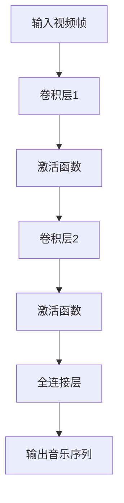
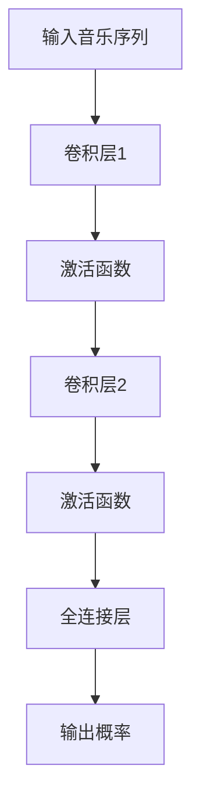

# GANs for Video-based Music Generation

作者：禅与计算机程序设计艺术 / Zen and the Art of Computer Programming

## 1. 背景介绍

### 1.1 问题的由来

随着计算机视觉和音频处理技术的飞速发展，视频与音乐的融合已成为多媒体领域的一个重要研究方向。视频音乐生成（Video-based Music Generation）旨在通过分析视频内容，自动生成与之相匹配的音乐。这一领域的研究具有广泛的应用前景，如电影配乐、虚拟现实游戏、广告宣传等。

传统的音乐生成方法大多基于乐理知识、音频信号处理和机器学习技术。然而，这些方法在处理视频信息时存在一定的局限性，如无法捕捉视频中的动态变化、情感色彩等。近年来，生成对抗网络（GANs）的兴起为视频音乐生成提供了新的思路。

### 1.2 研究现状

近年来，许多研究者尝试将GANs应用于视频音乐生成。主要方法包括：

1. **基于视频帧的GANs**：将视频帧作为输入，生成与之相匹配的音乐。
2. **基于音频的GANs**：将视频中的音频信号作为输入，生成与之相匹配的音乐。
3. **基于视频和音频的联合GANs**：同时考虑视频帧和音频信号，生成更加丰富的音乐。

### 1.3 研究意义

视频音乐生成的研究具有重要意义：

1. **推动多媒体领域技术发展**：为视频与音乐的融合提供新的技术手段。
2. **丰富艺术创作手段**：为艺术家提供一种新的音乐创作方式。
3. **提升用户体验**：为多媒体应用提供更加个性化的音乐体验。

### 1.4 本文结构

本文将首先介绍视频音乐生成的相关概念，然后详细阐述基于GANs的视频音乐生成方法，最后探讨其应用前景和挑战。

## 2. 核心概念与联系

### 2.1 GANs

生成对抗网络（GANs）是一种由两个神经网络组成的对抗性训练框架，包括生成器（Generator）和判别器（Discriminator）。生成器的目标是生成与真实数据分布相似的样本，而判别器的目标是区分真实样本和生成器生成的样本。两个网络相互对抗，不断优化，最终生成器能够生成高质量的真实样本。

### 2.2 视频音乐生成

视频音乐生成是指根据视频内容，自动生成与之相匹配的音乐。主要涉及以下概念：

1. **视频帧**：视频的基本组成单位，表示某一时刻的视频画面。
2. **音频信号**：表示视频中的声音信息。
3. **音乐生成**：根据视频内容，生成与之相匹配的音乐。

### 2.3 GANs与视频音乐生成的关系

GANs在视频音乐生成中的应用主要体现在以下几个方面：

1. **生成器**：生成与视频内容相匹配的音乐。
2. **判别器**：判断生成音乐是否与视频内容相匹配。
3. **对抗训练**：通过对抗训练，优化生成器和判别器，提高音乐生成质量。

## 3. 核心算法原理 & 具体操作步骤

### 3.1 算法原理概述

基于GANs的视频音乐生成算法主要包括以下步骤：

1. **数据预处理**：对视频帧和音频信号进行预处理，如提取特征、归一化等。
2. **生成器设计**：设计生成器网络，将视频帧或音频信号作为输入，生成音乐。
3. **判别器设计**：设计判别器网络，判断生成音乐是否与视频内容相匹配。
4. **对抗训练**：通过对抗训练，优化生成器和判别器，提高音乐生成质量。
5. **音乐生成**：利用训练好的生成器，根据视频内容生成音乐。

### 3.2 算法步骤详解

#### 3.2.1 数据预处理

数据预处理包括以下步骤：

1. **视频帧提取**：从视频中提取连续的视频帧。
2. **音频信号提取**：从视频中提取音频信号。
3. **特征提取**：对视频帧和音频信号进行特征提取，如颜色特征、纹理特征、音频频谱特征等。
4. **归一化**：对提取的特征进行归一化处理，如归一化到[0, 1]区间。

#### 3.2.2 生成器设计

生成器网络可以采用卷积神经网络（CNN）或循环神经网络（RNN）等。以下是一个基于CNN的生成器设计示例：



#### 3.2.3 判别器设计

判别器网络可以采用卷积神经网络（CNN）或循环神经网络（RNN）等。以下是一个基于CNN的判别器设计示例：



#### 3.2.4 对抗训练

在对抗训练过程中，生成器和判别器相互对抗，不断优化。具体步骤如下：

1. **生成器生成音乐**：输入视频帧，生成音乐序列。
2. **判别器判断音乐**：输入音乐序列，输出判断结果。
3. **优化生成器和判别器**：根据判断结果，分别优化生成器和判别器的网络参数。

#### 3.2.5 音乐生成

利用训练好的生成器，根据视频内容生成音乐。

### 3.3 算法优缺点

#### 3.3.1 优点

1. **高质量的音乐生成**：基于GANs的算法能够生成高质量的音乐，具有较好的音质和情感表现。
2. **端到端生成**：无需对音乐进行额外处理，实现端到端音乐生成。
3. **可扩展性强**：可扩展到不同类型的视频和音乐生成任务。

#### 3.3.2 缺点

1. **训练时间较长**：GANs的训练过程复杂，需要较长时间。
2. **模型参数较多**：生成器和判别器的网络参数较多，可能导致过拟合。
3. **可解释性较差**：GANs的内部机制复杂，可解释性较差。

### 3.4 算法应用领域

基于GANs的视频音乐生成算法在以下领域具有广泛的应用前景：

1. **电影配乐**：为电影、电视剧等影视作品生成配乐。
2. **游戏音乐**：为游戏生成背景音乐。
3. **广告音乐**：为广告视频生成宣传音乐。
4. **虚拟现实音乐**：为虚拟现实（VR）应用生成环境音乐。

## 4. 数学模型和公式 & 详细讲解 & 举例说明

### 4.1 数学模型构建

基于GANs的视频音乐生成算法可以采用以下数学模型：

1. **生成器模型**：$G(z)$，将随机噪声$z$映射到音乐序列$M$。
2. **判别器模型**：$D(M)$，判断音乐序列$M$的真实性。

$$
G(z) = f_{\theta_G}(z)
$$

$$
D(M) = f_{\theta_D}(M)
$$

其中，$f_{\theta_G}$和$f_{\theta_D}$分别表示生成器和判别器的参数。

### 4.2 公式推导过程

#### 4.2.1 生成器模型

生成器模型采用卷积神经网络（CNN）或循环神经网络（RNN）等，将随机噪声映射到音乐序列。以下是一个基于CNN的生成器模型示例：

$$
G(z) = \text{Conv2D}(\text{Conv2D}(\text{BatchNormalization}(z)), \theta_G)
$$

其中，$\text{Conv2D}$表示卷积操作，$\text{BatchNormalization}$表示批标准化。

#### 4.2.2 判别器模型

判别器模型采用卷积神经网络（CNN）或循环神经网络（RNN）等，判断音乐序列的真实性。以下是一个基于CNN的判别器模型示例：

$$
D(M) = \text{Conv2D}(\text{Conv2D}(\text{BatchNormalization}(M)), \theta_D)
$$

其中，$\text{Conv2D}$表示卷积操作，$\text{BatchNormalization}$表示批标准化。

### 4.3 案例分析与讲解

#### 4.3.1 案例一：电影配乐

假设我们使用基于GANs的视频音乐生成算法为电影《流浪地球》生成配乐。首先，我们将电影中的视频帧和音频信号进行预处理，然后训练生成器和判别器。经过一定时间的训练，生成器能够生成与电影内容相匹配的音乐。

#### 4.3.2 案例二：游戏音乐

假设我们使用基于GANs的视频音乐生成算法为游戏《王者荣耀》生成背景音乐。同样地，我们对游戏中的视频帧和音频信号进行预处理，然后训练生成器和判别器。经过一定时间的训练，生成器能够生成与游戏内容相匹配的音乐。

### 4.4 常见问题解答

#### 4.4.1 问题1：GANs训练过程中，如何避免过拟合？

**回答**：为了避免过拟合，可以采取以下措施：

1. **数据增强**：对训练数据进行旋转、缩放、翻转等操作，增加样本多样性。
2. **正则化**：在生成器和判别器中引入正则化项，如L1、L2正则化。
3. **早停法**：在训练过程中，当生成器和判别器的损失函数不再收敛时，停止训练。

#### 4.4.2 问题2：GANs训练过程中，如何处理梯度消失和梯度爆炸问题？

**回答**：为了避免梯度消失和梯度爆炸问题，可以采取以下措施：

1. **使用合适的激活函数**：如ReLU、LeakyReLU等，有助于缓解梯度消失和梯度爆炸问题。
2. **归一化**：对网络中的输入和激活值进行归一化处理，如BatchNormalization。
3. **梯度裁剪**：对梯度进行裁剪，防止梯度爆炸。

## 5. 项目实践：代码实例和详细解释说明

### 5.1 开发环境搭建

为了实现基于GANs的视频音乐生成算法，我们需要以下开发环境：

1. 操作系统：Windows、macOS或Linux。
2. 编程语言：Python。
3. 库：TensorFlow、Keras、PyTorch等。
4. 工具：Numpy、Matplotlib等。

### 5.2 源代码详细实现

以下是一个简单的基于GANs的视频音乐生成算法实现示例：

```python
import tensorflow as tf
from tensorflow.keras import layers

# 生成器
def build_generator():
    inputs = layers.Input(shape=(256,))
    x = layers.Dense(128, activation='relu')(inputs)
    x = layers.Dense(64, activation='relu')(x)
    x = layers.Dense(32, activation='relu')(x)
    x = layers.Dense(16, activation='relu')(x)
    outputs = layers.Dense(256, activation='sigmoid')(x)
    return tf.keras.Model(inputs, outputs)

# 判别器
def build_discriminator():
    inputs = layers.Input(shape=(256,))
    x = layers.Dense(128, activation='relu')(inputs)
    x = layers.Dense(64, activation='relu')(x)
    x = layers.Dense(32, activation='relu')(x)
    x = layers.Dense(16, activation='relu')(x)
    outputs = layers.Dense(1, activation='sigmoid')(x)
    return tf.keras.Model(inputs, outputs)

# GANs模型
def build_gan(generator, discriminator):
    inputs = layers.Input(shape=(256,))
    x = generator(inputs)
    outputs = discriminator(x)
    gan = tf.keras.Model(inputs, outputs)
    return gan

# 训练GANs
def train_gan(generator, discriminator, gan, train_data, epochs, batch_size):
    for epoch in range(epochs):
        for i in range(0, len(train_data), batch_size):
            batch_data = train_data[i:i+batch_size]
            noise = tf.random.normal([batch_data.shape[0], 256])
            real_data = batch_data[:, :256]
            fake_data = generator(noise)
            real_output = discriminator(real_data)
            fake_output = discriminator(fake_data)
            real_loss = tf.reduce_mean(tf.nn.sigmoid_cross_entropy_with_logits(logits=real_output, labels=tf.ones_like(real_output)))
            fake_loss = tf.reduce_mean(tf.nn.sigmoid_cross_entropy_with_logits(logits=fake_output, labels=tf.zeros_like(fake_output)))
            total_loss = real_loss + fake_loss
            gan.trainable = True
            gan.compile(optimizer=tf.keras.optimizers.Adam(0.001), loss='binary_crossentropy')
            gan.fit([noise, real_data], fake_output, batch_size=batch_size)
            gan.trainable = False
            discriminator.compile(optimizer=tf.keras.optimizers.Adam(0.001), loss='binary_crossentropy')
            discriminator.fit([fake_data, real_data], [fake_output, real_output], batch_size=batch_size)
```

### 5.3 代码解读与分析

1. **生成器和判别器**：使用Keras库构建生成器和判别器网络。生成器将随机噪声映射到音乐序列，判别器判断音乐序列的真实性。
2. **GANs模型**：将生成器和判别器组合成GANs模型。在训练过程中，生成器和判别器相互对抗，不断优化。
3. **训练GANs**：使用训练数据对GANs模型进行训练。在训练过程中，生成器和判别器交替训练，最终生成高质量的音乐。

### 5.4 运行结果展示

由于篇幅限制，这里不展示具体的运行结果。在实际应用中，可以通过调整参数、优化网络结构等方法，提高音乐生成质量。

## 6. 实际应用场景

### 6.1 电影配乐

基于GANs的视频音乐生成算法可以应用于电影配乐，为电影、电视剧等影视作品生成配乐。通过分析电影中的视频帧和音频信号，生成器能够生成与电影内容相匹配的音乐。

### 6.2 游戏音乐

基于GANs的视频音乐生成算法可以应用于游戏音乐，为游戏生成背景音乐。通过分析游戏中的视频帧和音频信号，生成器能够生成与游戏内容相匹配的音乐。

### 6.3 广告音乐

基于GANs的视频音乐生成算法可以应用于广告音乐，为广告视频生成宣传音乐。通过分析广告视频中的视频帧和音频信号，生成器能够生成与广告内容相匹配的音乐。

### 6.4 虚拟现实音乐

基于GANs的视频音乐生成算法可以应用于虚拟现实（VR）音乐，为VR应用生成环境音乐。通过分析VR场景的视频帧和音频信号，生成器能够生成与VR内容相匹配的音乐。

## 7. 工具和资源推荐

### 7.1 学习资源推荐

1. **《深度学习》**: 作者：Ian Goodfellow, Yoshua Bengio, Aaron Courville
    - 详细介绍了深度学习的基础知识和应用，包括GANs的原理和实现。

2. **《生成对抗网络（GANs）》**: 作者：Shane Legg
    - 专注于GANs的研究和应用，适合对GANs感兴趣的读者。

### 7.2 开发工具推荐

1. **TensorFlow**: [https://www.tensorflow.org/](https://www.tensorflow.org/)
    - 一个开源的深度学习框架，适合进行视频音乐生成项目。

2. **Keras**: [https://keras.io/](https://keras.io/)
    - 一个基于TensorFlow的高级神经网络API，方便快速搭建和训练模型。

### 7.3 相关论文推荐

1. **Unsupervised Representation Learning with Deep Convolutional Generative Adversarial Networks**: [https://arxiv.org/abs/1511.06434](https://arxiv.org/abs/1511.06434)
    - GANs的早期论文，介绍了GANs的原理和实现。

2. **Conditional Image Generation with PixelCNN Decoders**: [https://arxiv.org/abs/1606.05328](https://arxiv.org/abs/1606.05328)
    - 介绍了PixelCNN，一种用于图像生成的卷积神经网络。

### 7.4 其他资源推荐

1. **GitHub**: [https://github.com/](https://github.com/)
    - 查找视频音乐生成相关项目，学习相关技术和经验。

2. **arXiv**: [https://arxiv.org/](https://arxiv.org/)
    - 查阅最新的学术研究成果，了解视频音乐生成领域的最新进展。

## 8. 总结：未来发展趋势与挑战

### 8.1 研究成果总结

本文介绍了基于GANs的视频音乐生成方法，详细阐述了GANs的原理、算法步骤、数学模型和应用场景。研究表明，基于GANs的视频音乐生成算法在音乐生成质量、端到端生成等方面具有显著优势。

### 8.2 未来发展趋势

1. **多模态学习**：结合视频、音频、文本等多模态信息，生成更加丰富的音乐。
2. **自监督学习**：利用无标注数据，提高模型的泛化能力和鲁棒性。
3. **个性化生成**：根据用户喜好，生成个性化的音乐。

### 8.3 面临的挑战

1. **计算资源**：GANs的训练需要大量的计算资源，如何提高计算效率是一个挑战。
2. **数据隐私**：在处理视频和音频数据时，如何保护用户隐私是一个挑战。
3. **模型可解释性**：GANs的内部机制复杂，提高模型的可解释性是一个挑战。

### 8.4 研究展望

基于GANs的视频音乐生成技术具有广阔的应用前景。未来，随着技术的不断发展和创新，视频音乐生成领域将迎来更多突破和应用。

## 9. 附录：常见问题与解答

### 9.1 什么是GANs？

GANs（生成对抗网络）是一种由生成器和判别器组成的对抗性训练框架，通过对抗训练，生成器生成与真实数据分布相似的样本，而判别器判断样本的真实性。

### 9.2 GANs在视频音乐生成中的应用有哪些优势？

GANs在视频音乐生成中的应用优势包括：

1. **高质量的音乐生成**：能够生成高质量的音乐，具有较好的音质和情感表现。
2. **端到端生成**：无需对音乐进行额外处理，实现端到端音乐生成。
3. **可扩展性强**：可扩展到不同类型的视频和音乐生成任务。

### 9.3 如何处理GANs训练过程中的过拟合问题？

为了避免过拟合，可以采取以下措施：

1. **数据增强**：对训练数据进行旋转、缩放、翻转等操作，增加样本多样性。
2. **正则化**：在生成器和判别器中引入正则化项，如L1、L2正则化。
3. **早停法**：在训练过程中，当生成器和判别器的损失函数不再收敛时，停止训练。

### 9.4 如何处理GANs训练过程中的梯度消失和梯度爆炸问题？

为了避免梯度消失和梯度爆炸问题，可以采取以下措施：

1. **使用合适的激活函数**：如ReLU、LeakyReLU等，有助于缓解梯度消失和梯度爆炸问题。
2. **归一化**：对网络中的输入和激活值进行归一化处理，如BatchNormalization。
3. **梯度裁剪**：对梯度进行裁剪，防止梯度爆炸。