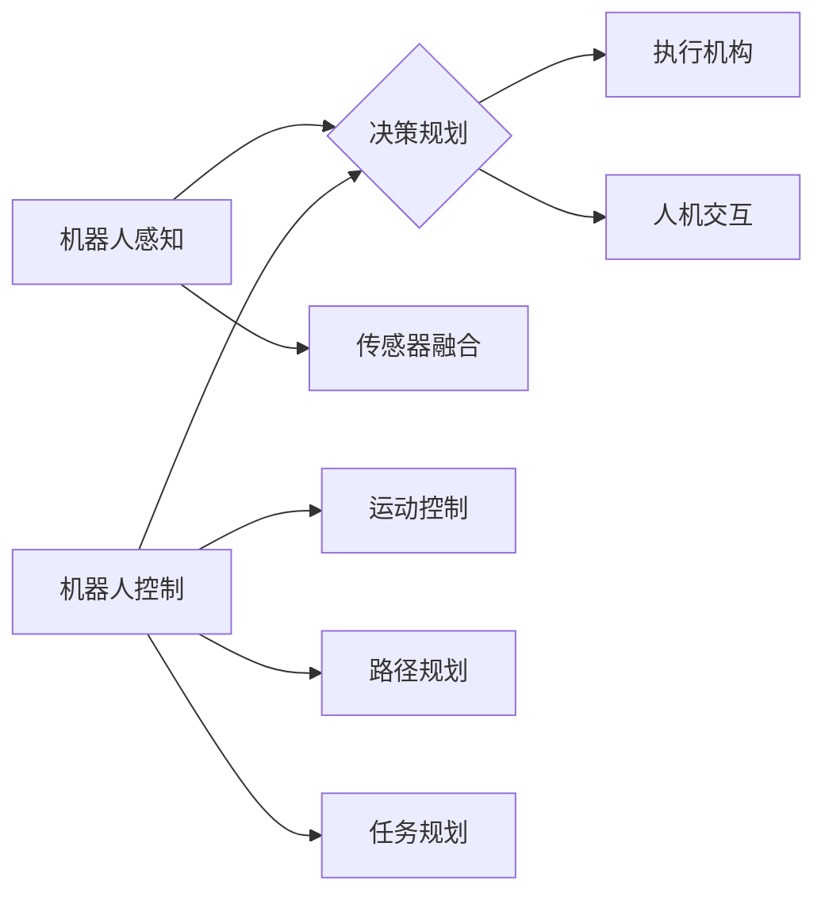

# Robotics 原理与代码实战案例讲解

作者：禅与计算机程序设计艺术 / Zen and the Art of Computer Programming

## 1. 背景介绍
### 1.1 问题的由来

机器人技术作为人工智能领域的核心分支之一，近年来取得了长足的进步。从工业自动化、服务机器人到智能家居、无人驾驶等各个领域，机器人技术的应用日益广泛。然而，随着机器人应用场景的日益复杂，对机器人算法和系统的要求也越来越高。本文旨在从原理到实战，深入讲解机器人技术，并分享一些代码实战案例，帮助读者更好地理解和应用机器人技术。

### 1.2 研究现状

当前，机器人技术的研究主要集中在以下几个方面：

- 传感器融合与感知：通过整合多种传感器信息，实现对环境的感知和理解。
- 机器人控制与规划：研究机器人如何根据感知信息进行决策和控制，实现任务目标。
- 机器学习与人工智能：利用机器学习算法，让机器人具备自主学习和适应环境的能力。
- 人机交互与协作：研究人机交互界面和机器人协作机制，提高机器人的人性化程度。

### 1.3 研究意义

机器人技术的发展对于推动社会进步具有重要意义：

- 提高生产效率：机器人可以在危险、重复性工作环境中替代人工，提高生产效率。
- 改善生活质量：服务机器人可以辅助人们完成日常生活中的各种任务，提高生活质量。
- 促进科技创新：机器人技术的发展将推动人工智能、传感器、材料等领域的技术创新。
- 应对老龄化社会：机器人可以缓解人口老龄化带来的社会压力，提供养老、护理等服务。

### 1.4 本文结构

本文将从以下方面对机器人技术进行讲解：

- 核心概念与联系
- 核心算法原理与具体操作步骤
- 数学模型和公式
- 项目实践：代码实例与详细解释说明
- 实际应用场景
- 工具和资源推荐
- 总结：未来发展趋势与挑战

## 2. 核心概念与联系

以下是机器人技术中的核心概念及其相互关系：



- 机器人感知：通过多种传感器获取环境信息，如激光雷达、摄像头、超声波等，实现对环境的感知。
- 决策规划：根据感知信息，制定执行路径和策略，包括运动控制、路径规划、任务规划等。
- 执行机构：根据决策规划，执行具体动作，如舵机、电机、伺服系统等。
- 人机交互：研究人机交互界面和协作机制，提高机器人的人性化程度。

## 3. 核心算法原理与具体操作步骤
### 3.1 算法原理概述

机器人技术涉及多个算法领域，主要包括：

- 传感器数据处理算法：如滤波、特征提取、图像识别等。
- 运动控制算法：如PID控制、自适应控制、滑模控制等。
- 路径规划算法：如A*搜索、Dijkstra算法、RRT等。
- 任务规划算法：如PDDL、RPG等。

### 3.2 算法步骤详解

以下以路径规划算法为例，介绍算法步骤：

1. **定义地图**：将环境抽象为二维或三维网格，每个网格表示一个空间位置。
2. **设置起点和终点**：确定机器人需要从起点移动到终点的任务目标。
3. **搜索路径**：根据算法原理，在地图上搜索一条从起点到终点的有效路径。
4. **路径优化**：对搜索到的路径进行优化，如缩短路径长度、减少转弯次数等。
5. **路径执行**：将优化后的路径输入到执行机构，指导机器人移动。

### 3.3 算法优缺点

以A*搜索算法为例，介绍其优缺点：

- **优点**：
  - 精确度高，可以找到最短路径。
  - 节点数少，搜索效率高。
- **缺点**：
  - 需要设置启发式函数，对环境了解程度要求较高。
  - 在复杂环境下，搜索效率可能较低。

### 3.4 算法应用领域

路径规划算法在以下领域有广泛应用：

- 自动驾驶
- 无人机
- 工业机器人
- 服务机器人

## 4. 数学模型和公式 & 详细讲解 & 举例说明
### 4.1 数学模型构建

机器人运动控制通常采用PID控制算法，其数学模型如下：

$$
u(t) = k_p \cdot (e(t) + \int e(t) dt + \frac{1}{T_i} \cdot \frac{d}{dt} \int e(t) dt)
$$

其中：
- $u(t)$ 为控制量，通常为电机或舵机的输入信号。
- $k_p$ 为比例系数，控制输出量对误差的敏感程度。
- $k_i$ 为积分系数，控制输出量对误差累积的敏感程度。
- $k_d$ 为微分系数，控制输出量对误差变化的敏感程度。
- $e(t)$ 为误差，通常为目标值与实际值之差。
- $T_i$ 为积分时间常数。

### 4.2 公式推导过程

PID控制算法的推导过程如下：

1. **比例控制**：控制量与误差成正比，控制目标是使误差逐渐减小。
2. **积分控制**：控制量与误差积分成正比，控制目标是消除误差累积。
3. **微分控制**：控制量与误差变化率成正比，控制目标是抑制误差波动。

### 4.3 案例分析与讲解

以下以无人机避障为例，介绍PID控制算法的应用：

1. **设置目标位置**：假设无人机需要飞到坐标为(10,10)的位置。
2. **设定PID参数**：根据实际情况设置比例系数、积分系数和微分系数。
3. **实时计算控制量**：根据当前无人机位置和目标位置，计算误差，并结合PID公式计算控制量。
4. **控制无人机飞行**：将控制量输入到无人机的飞行控制器，指导无人机飞行。

### 4.4 常见问题解答

**Q1：PID控制算法的参数如何设置？**

A：PID参数的设置需要根据具体应用进行调试，一般采用以下方法：
1. **经验法**：根据经验设定初始参数，逐步调整至最佳效果。
2. **试错法**：通过试错，调整参数，观察系统响应，找到最佳参数组合。
3. **自动调参**：使用自动调参工具，如MATLAB的Auto-Tune、OptiTrack等，自动寻找最佳参数。

**Q2：PID控制算法是否适用于所有系统？**

A：PID控制算法适用于大多数线性系统，但在非线性、时变等复杂系统中，可能需要采用其他控制算法，如自适应控制、鲁棒控制等。

## 5. 项目实践：代码实例和详细解释说明
### 5.1 开发环境搭建

以下以Python为例，介绍机器人项目开发环境搭建：

1. **安装Python**：下载Python安装包，并安装到本地计算机。
2. **安装PyTorch**：使用pip安装PyTorch，根据系统架构选择CPU或CUDA版本。
3. **安装ROS**：下载并安装ROS（Robot Operating System）。

### 5.2 源代码详细实现

以下以基于ROS的机器人路径规划为例，介绍代码实现：

```python
#!/usr/bin/env python

import rospy
import tf
import geometry_msgs.msg
import nav_msgs.msg
import actionlib
from move_base_msgs.msg import MoveBaseAction, MoveBaseGoal

class MoveBaseClient:
    def __init__(self):
        self.client = actionlib.SimpleActionClient('move_base', MoveBaseAction)
        self.client.wait_for_server()
        rospy.loginfo("Waiting for the move_base action server to come up")

    def go_to(self, target_position):
        goal = MoveBaseGoal()
        goal.target_pose.pose.position.x = target_position[0]
        goal.target_pose.pose.position.y = target_position[1]
        goal.target_pose.pose.orientation = tf.transformations.quaternion_from_euler(0, 0, 0)
        self.client.send_goal(goal)
        success = self.client.wait_for_result()
        if success:
            result = self.client.get_result()
            rospy.loginfo("Goal reached!")
        else:
            rospy.loginfo("The goal failed")

if __name__ == '__main__':
    rospy.init_node('move_base_client', anonymous=True)
    move_base_client = MoveBaseClient()
    move_base_client.go_to([10, 10])
    rospy.spin()
```

### 5.3 代码解读与分析

- **导入必要的库**：导入ROS、tf、消息类型等库。
- **定义MoveBaseClient类**：实现MoveBaseActionClient的操作，发送目标位置信息，并等待结果。
- **初始化节点和客户端**：创建ROS节点和MoveBaseActionClient。
- **go_to方法**：发送目标位置信息，调用客户端的send_goal方法发送目标位置，并等待结果。
- **主函数**：创建节点和客户端对象，调用go_to方法，将目标位置设置为(10, 10)。

### 5.4 运行结果展示

运行上述代码后，机器人将向坐标(10, 10)移动，到达目标位置后，会输出"Goal reached!"信息。

## 6. 实际应用场景
### 6.1 工业机器人

工业机器人广泛应用于制造业，如焊接、喷涂、装配等。通过路径规划和运动控制算法，机器人可以完成复杂的生产任务。

### 6.2 服务机器人

服务机器人广泛应用于家庭、医院、酒店等领域，如扫地机器人、护理机器人、酒店机器人等。通过感知和决策算法，机器人可以完成各种服务任务。

### 6.3 自动驾驶

自动驾驶技术是机器人技术的重要应用方向。通过感知、决策和规划算法，自动驾驶车辆可以安全、高效地行驶在道路上。

### 6.4 未来应用展望

未来，机器人技术将在以下方面取得更大的突破：

- **多模态感知**：融合多种传感器信息，实现对环境的更全面感知。
- **自主决策与规划**：让机器人具备更强的自主决策和规划能力，适应更复杂的环境。
- **人机协作**：实现人机协作，提高机器人的人性化程度。
- **跨领域应用**：将机器人技术应用于更多领域，如农业、医疗、教育等。

## 7. 工具和资源推荐
### 7.1 学习资源推荐

- 《机器人学导论》
- 《机器人操作系统（ROS）教程》
- 《机器人控制：现代控制理论、数学与算法》
- 《Python机器人编程》

### 7.2 开发工具推荐

- ROS
- Gazebo
- Python
- MATLAB

### 7.3 相关论文推荐

- 《Probabilistic Robotics》
- 《Robotics: Modelling, Planning and Control》
- 《Probabilistic Robotics Algorithms》

### 7.4 其他资源推荐

- ROS官网：https://www.ros.org/
- Gazebo官网：https://www.gazebosim.org/
- OpenCV官网：https://opencv.org/

## 8. 总结：未来发展趋势与挑战
### 8.1 研究成果总结

本文从背景介绍、核心概念、算法原理、项目实践等方面，全面讲解了机器人技术。通过对实际应用场景的分析，展示了机器人技术在各个领域的应用价值。同时，介绍了相关的学习资源、开发工具和论文，为读者提供了进一步学习的途径。

### 8.2 未来发展趋势

未来，机器人技术将朝着以下方向发展：

- **多模态感知**：融合多种传感器信息，实现对环境的更全面感知。
- **自主决策与规划**：让机器人具备更强的自主决策和规划能力，适应更复杂的环境。
- **人机协作**：实现人机协作，提高机器人的人性化程度。
- **跨领域应用**：将机器人技术应用于更多领域，如农业、医疗、教育等。

### 8.3 面临的挑战

机器人技术发展也面临着一些挑战：

- **感知与理解**：如何让机器人更好地理解复杂环境，实现更精准的感知。
- **决策与规划**：如何让机器人具备更强的自主决策和规划能力，适应更复杂的环境。
- **人机交互**：如何设计更自然、高效的人机交互界面，提高人机协作的便捷性。
- **伦理与安全**：如何确保机器人的行为符合伦理道德标准，保障人类安全。

### 8.4 研究展望

面对挑战，机器人技术的研究将朝着以下方向发展：

- **深度学习与强化学习**：利用深度学习算法，提高机器人的感知、决策和规划能力。
- **人机协作与交互**：研究人机交互界面和协作机制，提高人机协作的便捷性。
- **伦理与安全**：制定相应的伦理规范，确保机器人的安全性和可靠性。

机器人技术作为人工智能领域的重要分支，具有广阔的应用前景。相信随着技术的不断发展，机器人将为人类社会创造更多价值。