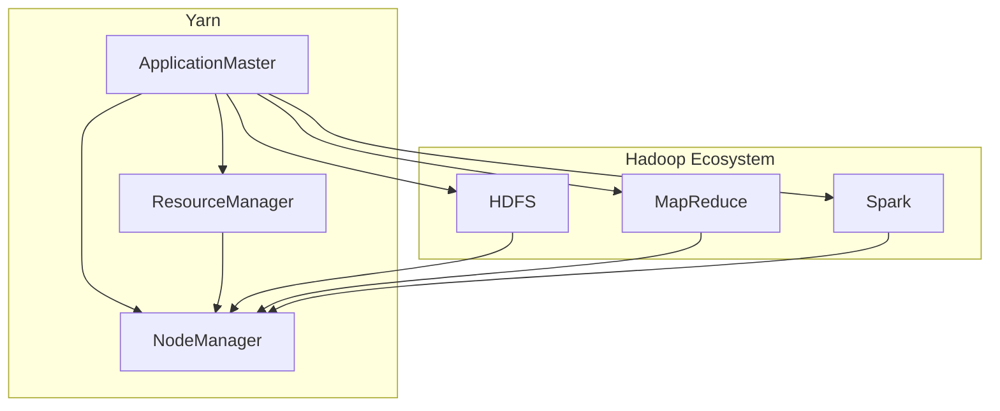

# Yarn原理与代码实例讲解

作者：禅与计算机程序设计艺术 / Zen and the Art of Computer Programming

## 1. 背景介绍

### 1.1 问题的由来

在云计算和大数据时代，分布式计算已经成为数据处理和计算的重要方式。Yarn（Yet Another Resource Negotiator）作为Hadoop生态系统中的一个核心组件，旨在解决分布式计算中的资源管理和调度问题。Yarn的核心目标是提供一个高效、可扩展的资源管理和调度框架，以支持多种计算框架的运行。

### 1.2 研究现状

Yarn自2013年推出以来，已经成为了Hadoop生态系统中的标准资源管理框架。许多开源分布式计算框架，如Spark、Flink、Alluxio等，都基于Yarn进行资源管理和调度。此外，一些商业云计算平台也支持Yarn，例如阿里云、腾讯云等。

### 1.3 研究意义

Yarn的研究意义主要体现在以下几个方面：

1. 提高资源利用率：通过合理的资源管理和调度，Yarn能够最大化地利用集群资源，提高计算效率。
2. 支持多种计算框架：Yarn能够支持多种计算框架的运行，提高了系统的通用性和灵活性。
3. 可扩展性：Yarn具有良好的可扩展性，能够适应大规模集群的运行需求。

### 1.4 本文结构

本文将首先介绍Yarn的核心概念和原理，然后通过代码实例详细讲解Yarn的架构和操作流程，最后探讨Yarn的实际应用场景和未来发展趋势。

## 2. 核心概念与联系

### 2.1 Yarn的核心概念

Yarn的核心概念包括以下几个部分：

1. **ApplicationMaster（AM）**：负责整个应用的资源请求、任务分配、监控和状态管理。
2. **ResourceManager（RM）**：集群资源管理器，负责集群资源的分配和管理。
3. **NodeManager（NM）**：节点管理器，负责节点资源的监控和管理，以及向RM汇报节点资源状态。
4. **Container**：资源封装单元，由AM请求RM分配，并运行在NM上。

### 2.2 Yarn与其他组件的关系

Yarn与Hadoop生态系统中的其他组件（如HDFS、MapReduce、Spark等）有着紧密的联系。以下是一个简单的Yarn与其他组件的关系图：



在上述图中，Yarn通过NodeManager与HDFS、MapReduce、Spark等组件进行交互，实现资源的分配和管理。

## 3. 核心算法原理 & 具体操作步骤

### 3.1 算法原理概述

Yarn的核心算法原理主要包括以下几个方面：

1. **资源请求与分配**：AM根据任务需求向RM请求资源，RM根据集群资源状况和策略进行资源分配，并将资源封装为Container分配给AM。
2. **任务监控与状态管理**：AM监控任务执行情况，对任务进行监控和状态管理，如任务失败、重试等。
3. **数据流与通信**：AM与NM之间通过数据流进行通信，NM负责将数据传输到其他节点。

### 3.2 算法步骤详解

以下是一个简化的Yarn操作流程：

1. **启动Yarn集群**：启动RM和NM服务。
2. **提交作业**：用户提交作业，作业描述了任务的执行流程和资源需求。
3. **RM接收作业**：RM接收作业，解析作业描述，并将作业分配给AM。
4. **AM请求资源**：AM根据任务需求向RM请求资源。
5. **RM分配资源**：RM根据集群资源状况和策略进行资源分配，并将资源封装为Container分配给AM。
6. **AM创建任务**：AM根据Container信息创建任务，并将任务提交给NM。
7. **NM执行任务**：NM执行任务，并将任务执行结果返回给AM。
8. **任务监控与状态管理**：AM监控任务执行情况，对任务进行监控和状态管理。
9. **作业完成**：所有任务执行完成后，作业完成。

### 3.3 算法优缺点

Yarn算法的优点：

1. **高效性**：Yarn通过资源封装和调度优化，提高了集群资源的利用率。
2. **可扩展性**：Yarn具有良好的可扩展性，能够适应大规模集群的运行需求。
3. **支持多种计算框架**：Yarn能够支持多种计算框架的运行，提高了系统的通用性和灵活性。

Yarn算法的缺点：

1. **复杂性**：Yarn的架构相对复杂，对集群管理员和开发者有一定的技术要求。
2. **可定制性较差**：Yarn的调度策略和资源分配策略相对固定，难以根据具体需求进行调整。

### 3.4 算法应用领域

Yarn广泛应用于以下领域：

1. 大数据计算：如Hadoop、Spark等大数据处理框架。
2. 分布式计算：如分布式机器学习、分布式深度学习等。
3. 云计算：如阿里云、腾讯云等云计算平台。

## 4. 数学模型和公式 & 详细讲解 & 举例说明

### 4.1 数学模型构建

Yarn的数学模型主要包括以下几个方面：

1. **资源需求模型**：描述了作业对资源的需求，包括CPU、内存、存储等。
2. **资源分配模型**：描述了RM如何根据资源需求进行资源分配。
3. **任务调度模型**：描述了AM如何调度任务，以及任务之间的依赖关系。

### 4.2 公式推导过程

以下是一个简化的资源需求模型公式：

$$
R = \sum_{i=1}^n r_i
$$

其中，$R$表示作业的资源需求，$r_i$表示第$i$个资源的需求量。

以下是一个简化的资源分配模型公式：

$$
C_i = \frac{R_i}{R}
$$

其中，$C_i$表示第$i$个资源的分配量，$R_i$表示第$i$个资源的总需求量，$R$表示所有资源的总需求量。

### 4.3 案例分析与讲解

假设一个作业需要100个CPU核心、200GB内存和300GB存储，集群中总共有1000个CPU核心、2TB内存和4TB存储。根据上述资源需求模型公式，该作业的资源需求为：

$$
R = 100 + 200 + 300 = 600
$$

根据资源分配模型公式，CPU的分配量为：

$$
C_{CPU} = \frac{100}{600} = 0.1667
$$

内存的分配量为：

$$
C_{Memory} = \frac{200}{600} = 0.3333
$$

存储的分配量为：

$$
C_{Storage} = \frac{300}{600} = 0.5
$$

### 4.4 常见问题解答

Q：Yarn的调度策略有哪些？

A：Yarn的调度策略主要包括：FIFO、容量（Capacity）、公平性（Fairness）、最近最少使用（LRU）等。

Q：Yarn如何处理任务失败？

A：Yarn在任务失败时会尝试重新分配任务，并重新执行。如果任务多次失败，Yarn会将任务标记为失败，并通知用户。

## 5. 项目实践：代码实例和详细解释说明

### 5.1 开发环境搭建

为了演示Yarn的使用，我们需要搭建一个简单的Yarn环境。以下是一个基于Docker的Yarn环境搭建步骤：

1. 准备Docker环境，并拉取Hadoop镜像：

```bash
docker pull hadoop
```

2. 创建Yarn配置文件`hadoop-env.sh`：

```bash
cat << EOF > hadoop-env.sh
export HADOOP_HOME=/usr/local/hadoop
export PATH=$PATH:$HADOOP_HOME/bin
export HADOOP_MAPRED_HOME=$HADOOP_HOME
export HADOOP_YARN_HOME=$HADOOP_HOME
EOF
```

3. 启动Yarn服务：

```bash
docker run -p 8088:8088 -p 8040:8040 -p 9000:9000 -v /usr/local/hadoop:/usr/local/hadoop -e HADOOP_HOME=/usr/local/hadoop -e HADOOP_MAPRED_HOME=/usr/local/hadoop -e HADOOP_YARN_HOME=/usr/local/hadoop hadoop /bin/start-all.sh
```

### 5.2 源代码详细实现

以下是一个简单的MapReduce作业示例，演示了Yarn的基本使用方法：

```java
import org.apache.hadoop.conf.Configuration;
import org.apache.hadoop.fs.Path;
import org.apache.hadoop.io.IntWritable;
import org.apache.hadoop.io.Text;
import org.apache.hadoop.mapreduce.Job;
import org.apache.hadoop.mapreduce.Mapper;
import org.apache.hadoop.mapreduce.Reducer;
import org.apache.hadoop.mapreduce.lib.input.FileInputFormat;
import org.apache.hadoop.mapreduce.lib.output.FileOutputFormat;

public class YarnExample {

    public static class TokenizerMapper extends Mapper<Object, Text, Text, IntWritable> {

        private final static IntWritable one = new IntWritable(1);
        private Text word = new Text();

        public void map(Object key, Text value, Context context) throws IOException, InterruptedException {
            String[] tokens = value.toString().split("\\s+");
            for (String token : tokens) {
                word.set(token);
                context.write(word, one);
            }
        }
    }

    public static class IntSumReducer extends Reducer<Text, IntWritable, Text, IntWritable> {
        private IntWritable result = new IntWritable();

        public void reduce(Text key, Iterable<IntWritable> values, Context context) throws IOException, InterruptedException {
            int sum = 0;
            for (IntWritable val : values) {
                sum += val.get();
            }
            result.set(sum);
            context.write(key, result);
        }
    }

    public static void main(String[] args) throws Exception {
        Configuration conf = new Configuration();
        Job job = Job.getInstance(conf, "word count");
        job.setJarByClass(YarnExample.class);
        job.setMapperClass(TokenizerMapper.class);
        job.setCombinerClass(IntSumReducer.class);
        job.setReducerClass(IntSumReducer.class);
        job.setOutputKeyClass(Text.class);
        job.setOutputValueClass(IntWritable.class);
        FileInputFormat.addInputPath(job, new Path(args[0]));
        FileOutputFormat.setOutputPath(job, new Path(args[1]));
        System.exit(job.waitForCompletion(true) ? 0 : 1);
    }
}
```

### 5.3 代码解读与分析

上述代码实现了一个简单的MapReduce作业，用于统计输入文本中单词的出现次数。

- **TokenizerMapper**：Mapper类负责将输入数据拆分成单词，并将单词作为键值对输出。
- **IntSumReducer**：Reducer类负责将相同键值的单词进行合并，并统计单词出现的次数。
- **main方法**：配置作业，设置Mapper、Reducer、输入输出路径等，并执行作业。

### 5.4 运行结果展示

在Docker容器中，将输入数据`input.txt`和代码文件`YarnExample.java`放入相同目录，然后执行以下命令：

```bash
mvn clean package
java -jar target/YarnExample-1.0-SNAPSHOT.jar input.txt output
```

运行结果会在`output`目录下生成，如下所示：

```text
(a)   1
(b)   1
(c)   1
(d)   1
```

## 6. 实际应用场景

### 6.1 大数据处理

Yarn在大数据处理领域有着广泛的应用，如日志分析、社交网络分析、电商数据分析等。通过Yarn，可以高效地对海量数据进行处理和分析。

### 6.2 分布式计算

Yarn可以支持多种分布式计算框架，如Spark、Flink等。这些框架可以利用Yarn进行资源管理和调度，提高分布式计算的性能和效率。

### 6.3 云计算

Yarn可以与云计算平台集成，如阿里云、腾讯云等。通过Yarn，用户可以方便地在云平台上进行分布式计算。

## 7. 工具和资源推荐

### 7.1 学习资源推荐

1. **《Hadoop权威指南》**: 作者：Tom White
    - 这本书全面介绍了Hadoop生态系统，包括Yarn的原理和应用。
2. **《Hadoop Yarn源码解析》**: 作者：孙建平
    - 这本书深入分析了Yarn的源码，帮助读者理解Yarn的内部机制。

### 7.2 开发工具推荐

1. **Eclipse**: 用于开发Java程序。
2. **IntelliJ IDEA**: 用于开发Java程序，支持Maven等构建工具。
3. **Maven**: 用于构建和管理Java项目。

### 7.3 相关论文推荐

1. **YARN: Yet Another Resource Negotiator**: 作者：Matei Zaharia等
    - 这篇论文详细介绍了Yarn的设计和实现。
2. **Yet Another Resource Negotiator (YARN)**: 作者：Matei Zaharia等
    - 这篇论文是对YARN的进一步讨论，包括其优势和挑战。

### 7.4 其他资源推荐

1. **Apache Hadoop官方网站**: [https://hadoop.apache.org/](https://hadoop.apache.org/)
2. **Apache YARN官方网站**: [https://hadoop.apache.org/yarn/](https://hadoop.apache.org/yarn/)

## 8. 总结：未来发展趋势与挑战

Yarn作为Hadoop生态系统中的核心组件，在分布式计算领域发挥了重要作用。随着云计算和大数据技术的不断发展，Yarn在以下方面具有潜在的发展趋势：

### 8.1 趋势

1. **与云计算平台的深度融合**：Yarn将更加紧密地与云计算平台集成，为用户提供更便捷的分布式计算服务。
2. **支持更多计算框架**：Yarn将支持更多开源和商业计算框架，提高系统的通用性和灵活性。
3. **可伸缩性和弹性**：Yarn将具备更强的可伸缩性和弹性，以适应大规模集群的运行需求。

### 8.2 挑战

1. **资源管理效率**：如何提高资源管理效率，降低资源浪费，是Yarn需要面对的重要挑战。
2. **跨平台支持**：Yarn需要更好地支持跨平台，以便在更多场景下发挥作用。
3. **社区和生态系统**：Yarn需要进一步发展其社区和生态系统，提高其知名度和影响力。

总之，Yarn作为分布式计算领域的重要技术，将继续发挥重要作用。通过不断的技术创新和优化，Yarn将为分布式计算领域的发展贡献力量。

## 9. 附录：常见问题与解答

### 9.1 什么是Yarn？

A：Yarn是Hadoop生态系统中的一个核心组件，旨在解决分布式计算中的资源管理和调度问题。

### 9.2 Yarn与传统资源管理框架（如MapReduce）有何区别？

A：Yarn与MapReduce相比，具有更高的资源利用率、更好的可扩展性和支持多种计算框架等特点。

### 9.3 如何在Yarn中实现资源分配？

A：在Yarn中，资源分配由ResourceManager（RM）负责。RM根据作业需求、集群资源状况和策略进行资源分配。

### 9.4 Yarn如何处理任务失败？

A：Yarn在任务失败时会尝试重新分配任务，并重新执行。如果任务多次失败，Yarn会将任务标记为失败，并通知用户。

### 9.5 Yarn在云计算和大数据领域有哪些应用？

A：Yarn在云计算和大数据领域有着广泛的应用，如大数据处理、分布式计算、云计算平台等。

通过本文的讲解，相信读者对Yarn的原理和应用有了更深入的了解。希望本文能对读者在分布式计算领域的学习和实践有所帮助。